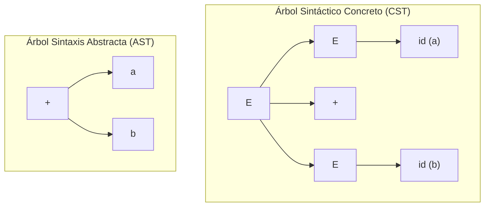
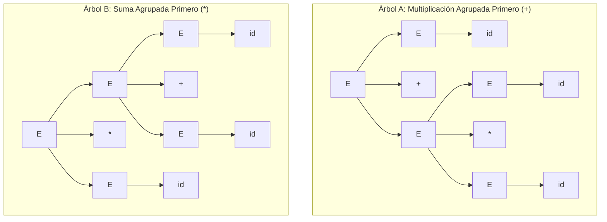
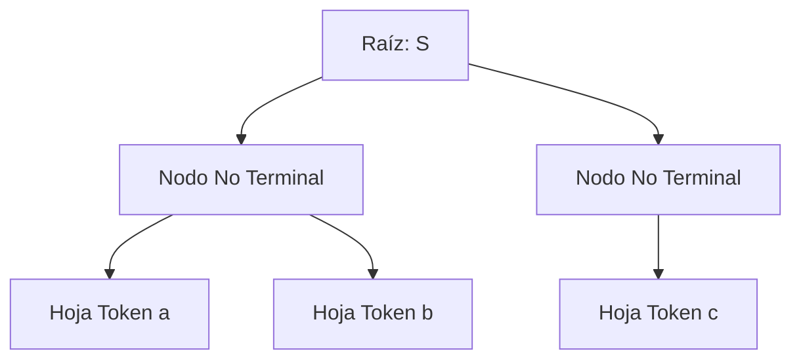
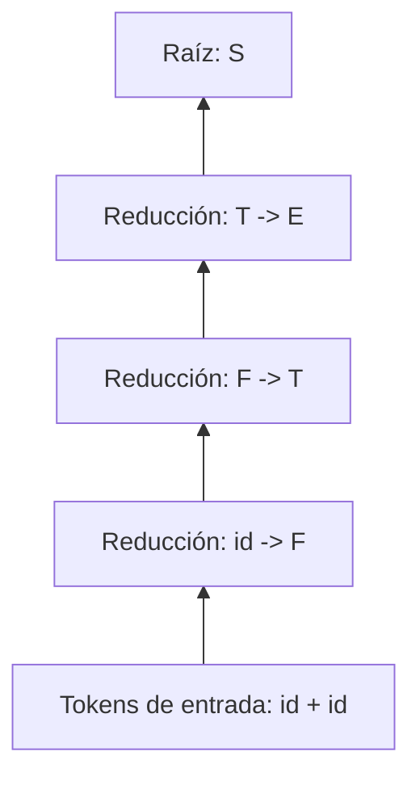
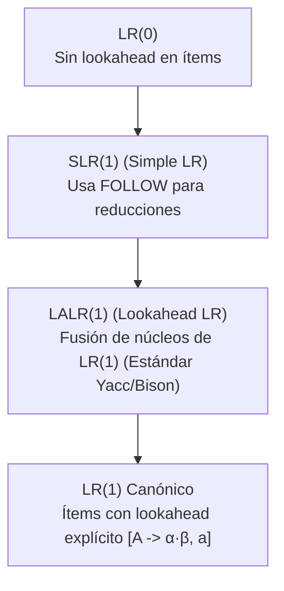

# Análisis Sintáctico (Parsers LL, LR y Gramáticas Libres de Contexto)

El **análisis sintáctico** (*parsing*) es la segunda fase del frontend de un compilador ([[Fases del Compilador y Analisis Lexico]]). Su función principal es determinar si la secuencia de tokens suministrada por el analizador léxico satisface las reglas estructurales del lenguaje de programación y construir, como subproducto, un **árbol sintáctico** que guiará el **[[calculo de atributos]]** y la posterior generación de código intermedio.

---

## 1. Gramáticas Libres de Contexto (CFG / BNF)

La sintaxis de los lenguajes de programación se formaliza matemáticamente mediante el formalismo de **Gramáticas Libres de Contexto (GLC o CFG)**, introducido por Noam Chomsky y adoptado en informática bajo la notación **BNF** (*Backus-Naur Form*).

### 1.1 Definición Matemática Formal
Una Gramática Libre de Contexto es una 4-tupla:
$$G = (V_N, V_T, P, S)$$

Donde:
1. **$V_N$ (No Terminales):** Conjunto finito de variables sintácticas que representan construcciones estructurales complejas (ej. $\text{Expresion}$, $\text{Sentencia}$).
2. **$V_T$ (Terminales / Tokens):** Conjunto finito de símbolos básicos del alfabeto del lenguaje, correspondientes a los tokens generados en la fase de escaneo (ej. $\mathbf{id}$, $\mathbf{if}$, $\mathbf{+}$, $\mathbf{;}$). Se cumple $V_N \cap V_T = \emptyset$.
3. **$P$ (Reglas de Producción):** Conjunto finito de reglas de reescritura de la forma:
   $$A \to \alpha \quad \text{donde } A \in V_N \text{ y } \alpha \in (V_N \cup V_T)^*$$
   El lado izquierdo está compuesto por un único símbolo no terminal; el lado derecho es una cadena finita de terminales y no terminales (incluyendo potencialmente la cadena vacía $\epsilon$).
4. **$S \in V_N$ (Símbolo Inicial):** Variable sintáctica distinguida que representa la construcción máxima del programa (ej. $\text{Programa}$).

---

## 2. Derivaciones, Árboles Sintácticos y Ambigüedad

Una **derivación** es una secuencia de sustituciones sucesivas que transforma el símbolo inicial $S$ en una cadena de terminales $w \in V_T^*$.

- **Derivación Más a la Izquierda (*Leftmost Derivation* $\Rightarrow_{lm}$):** En cada paso de reescritura, se reemplaza siempre el no terminal situado más a la izquierda de la forma sentencial.
- **Derivación Más a la Derecha (*Rightmost Derivation* $\Rightarrow_{rm}$):** En cada paso, se sustituye siempre el no terminal situado más a la derecha (también denominada *derivación canónica*).

### 2.1 Árbol de Análisis Sintáctico (*Parse Tree*) vs. Árbol de Sintaxis Abstracta (*AST*)
- **Árbol Sintáctico Concreto (Parse Tree / CST):** Representa gráficamente todos los pasos exactos de la derivación gramatical, incluyendo caracteres auxiliares como paréntesis, llaves y palabras clave.
- **Árbol de Sintaxis Abstracta (AST):** Versión condensada y depurada del CST que preserva únicamente la jerarquía lógica de operadores y operandos, eliminando la puntuación redundante. Es la estructura sobre la cual opera el **[[calculo de atributos]]**.



---

### 2.2 Ambigüedad Gramatical
Una gramática libre de contexto es **ambigua** si existe al menos una cadena $w \in L(G)$ que posee **dos o más árboles de análisis sintáctico distintos** (o equivalentemente, dos derivaciones por la izquierda distintas).

#### Demostración Clásica de Ambigüedad:
Considérese la gramática intuitiva de expresiones aritméticas:
$$E \to E + E \mid E * E \mid \mathbf{id}$$

Para la cadena de entrada `id + id * id`, existen dos interpretaciones estructurales incompatibles:



- En el **Árbol A**, la multiplicación $*$ queda más profunda en el árbol y se evalúa primero: respeta la precedencia algebraica estándar ($a + (b * c)$).
- En el **Árbol B**, la suma $+$ se evalúa primero: viola la semántica matemática estándar $((a + b) * c)$.

#### Técnica de Desambiguación: Estratificación por Niveles
Para eliminar la ambigüedad, se descompone la gramática introduciendo nuevos no terminales que fuerzan la **asociatividad por la izquierda** y asignan **mayor precedencia a los niveles inferiores**:
- $E$ (Expresión): Maneja sumas y restas (menor precedencia).
- $T$ (Término): Maneja multiplicaciones y divisiones (precedencia intermedia).
- $F$ (Factor): Maneja literales, identificadores y expresiones entre paréntesis (mayor precedencia).

$$\begin{aligned}
E &\to E + T \mid T \\
T &\to T * F \mid F \\
F &\to ( E ) \mid \mathbf{id}
\end{aligned}$$

---

## 3. Analizadores Sintácticos Descendentes (*Top-Down Parsers*)

Los analizadores descendentes intentan construir el árbol sintáctico partiendo desde la **raíz (símbolo inicial $S$) hacia las hojas (tokens de entrada)**, aplicando derivaciones sucesivas por la izquierda.



---

### 3.1 Parsers LL(1)
- **Significado del acrónimo:**
  - **L:** *Left-to-right scanning* (recorre la entrada de izquierda a derecha).
  - **L:** *Leftmost derivation* (construye una derivación por la izquierda).
  - **(1):** Utiliza exactamente **1 símbolo de preanálisis** (*lookahead*) para predecir qué producción expandir sin retroceso (*backtracking*).

#### Funciones Matemáticas de Soporte: FIRST y FOLLOW
1. **$\text{FIRST}(\alpha)$:** Para cualquier cadena de símbolos gramaticales $\alpha$, es el conjunto de terminales que inician cadenas derivadas de $\alpha$. Si $\alpha \Rightarrow^* \epsilon$, entonces $\epsilon \in \text{FIRST}(\alpha)$.
   - Si $X$ es terminal: $\text{FIRST}(X) = \{X\}$.
   - Si $X \to \epsilon$ es una producción: $\epsilon \in \text{FIRST}(X)$.
   - Si $X \to Y_1 Y_2 \dots Y_k$: Añadir $\text{FIRST}(Y_1) \setminus \{\epsilon\}$. Si $\epsilon \in \text{FIRST}(Y_1)$, añadir $\text{FIRST}(Y_2) \setminus \{\epsilon\}$, y así sucesivamente.

2. **$\text{FOLLOW}(A)$:** Para un no terminal $A$, es el conjunto de terminales $a$ que pueden aparecer inmediatamente a la derecha de $A$ en alguna forma sentencial derivada del símbolo inicial ($S \Rightarrow^* \alpha A a \beta$).
   - Regla 1: Colocar $\$$ (marcador de fin de entrada) en $\text{FOLLOW}(S)$.
   - Regla 2: Si existe la producción $A \to \alpha B \beta$, todo símbolo en $\text{FIRST}(\beta) \setminus \{\epsilon\}$ pertenece a $\text{FOLLOW}(B)$.
   - Regla 3: Si existe la producción $A \to \alpha B$, o $A \to \alpha B \beta$ donde $\epsilon \in \text{FIRST}(\beta)$, entonces todo lo que pertenece a $\text{FOLLOW}(A)$ pertenece también a $\text{FOLLOW}(B)$.

#### Construcción de la Tabla de Análisis Sintáctico $M[A, a]$
Para cada producción de la forma $A \to \alpha$:
1. Para cada símbolo terminal $a \in \text{FIRST}(\alpha)$, añadir $A \to \alpha$ a la celda $M[A, a]$.
2. Si $\epsilon \in \text{FIRST}(\alpha)$:
   - Para cada terminal $b \in \text{FOLLOW}(A)$, añadir $A \to \alpha$ a $M[A, b]$.
   - Si además $\$ \in \text{FOLLOW}(A)$, añadir $A \to \alpha$ a $M[A, \$]$.
3. Todas las celdas vacías restantes corresponden a condiciones de error sintáctico.

> [!important] Teorema de Pertenencia a la Clase LL(1)
> Una gramática es **LL(1)** si y solo si su tabla de análisis sintáctico $M[A, a]$ **no contiene entradas múltiples (conflictos)** en ninguna celda.

---

### 3.2 Transformaciones Gramaticales Obligatorias para LL(1)

Un parser LL(1) no tolera gramáticas con ambigüedad, recursión por la izquierda o prefijos comunes.

#### 1. Eliminación de Recursión por la Izquierda Directa
Una producción de la forma $A \to A \alpha \mid \beta$ (donde $\beta$ no empieza por $A$) produce bucles infinitos en un parser top-down. Se transforma algebraicamente mediante un nuevo no terminal $A'$:
$$\begin{aligned}
A &\to \beta A' \\
A' &\to \alpha A' \mid \epsilon
\end{aligned}$$

#### 2. Factorización por la Izquierda (*Left Factoring*)
Cuando dos producciones comparten un prefijo común ($A \to \alpha \beta_1 \mid \alpha \beta_2$), el parser no sabe cuál elegir con solo 1 token de lookahead. Se pospone la decisión factorizando el prefijo:
$$\begin{aligned}
A &\to \alpha A' \\
A' &\to \beta_1 \mid \beta_2
\end{aligned}$$

---

## 4. Analizadores Sintácticos Ascendentes (*Bottom-Up Parsers*)

Los parsers ascendentes construyen el árbol sintáctico partiendo desde las **hojas (tokens reales) hacia la raíz ($S$)**, realizando sucesivas **reducciones** (reemplazo del lado derecho de una producción por su lado izquierdo). Corresponde matemáticamente a rastrear una **derivación más a la derecha en orden inverso** (*Rightmost derivation in reverse*).



---

### 4.1 El Modelo Shift-Reduce (Desplazamiento y Reducción)
Un parser ascendente opera con una **pila de estados/símbolos** y un **búfer de entrada**, ejecutando cuatro acciones atómicas:
1. **Shift (Desplazamiento):** Traslada el siguiente token de entrada a la cima de la pila.
2. **Reduce (Reducción):** Identifica un **Handle** (mango) en la cima de la pila (una subcadena $\beta$ que coincide con el lado derecho de una producción $A \to \beta$) y lo sustituye por el no terminal $A$.
3. **Accept (Aceptación):** La entrada ha finalizado ($\$$) y la pila contiene únicamente el símbolo inicial aumentado $S'$; el análisis concluye exitosamente.
4. **Error:** No existe transición válida en la tabla para el estado actual y el token entrante.

---

### 4.2 La Jerarquía Canónica de Analizadores LR

Los analizadores **LR** (*Left-to-right, Rightmost derivation in reverse*) son los parsers más potentes y versátiles de la teoría de compiladores:



#### 1. Analizador LR(0)
- Construye la colección canónica de conjuntos de **ítems LR(0)** (un ítem es una producción con un punto $\cdot$ que denota el progreso del análisis: $A \to \alpha \cdot \beta$) utilizando las funciones $\text{CLOSURE}(I)$ y $\text{GOTO}(I, X)$.
- No examina ningún token de preanálisis para reducir. Muy limitado; sufre de colisiones continuas.

#### 2. Analizador SLR(1) (*Simple LR*)
- Utiliza la misma máquina de estados que LR(0), pero ante una reducción ($A \to \alpha \cdot$), **solo ejecuta la reducción en las columnas de terminales pertenecientes a $\text{FOLLOW}(A)$**.

#### 3. Analizador LR(1) Canónico
- Cada ítem contiene un terminal de lookahead explícito como segundo componente:
  $$[A \to \alpha \cdot \beta, \; a]$$
  Donde $a$ es el terminal que obligatoriamente debe seguir a $A$ para que la reducción sea legal.
- **Poder:** Máximo poder sintáctico determinista; reconoce casi todas las gramáticas prácticas libres de contexto.
- **Inconveniente:** Explosión exponencial de estados en la tabla sintáctica (miles de estados para lenguajes reales).

#### 4. Analizador LALR(1) (*Lookahead LR*)
- Es la solución de ingeniería por excelencia (implementada en herramientas como **Yacc**, **Bison** y **ANTLR**).
- **Mecanismo:** Toma la colección de estados de LR(1) y **fusiona todos los estados que tienen el mismo núcleo** (*core*: conjunto idéntico de producciones y posiciones de puntos, ignorando las etiquetas de lookahead).
- **Resultado:** Posee exactamente el **mismo número reducido de estados que LR(0) y SLR(1)**, pero con un poder de discriminación prácticamente idéntico al de LR(1) canónico.

---

### 4.3 Conflictos en Parsers Ascendentes
Ocurren cuando la tabla de análisis sintáctico contiene ambigüedad en el estado $s$ ante el token $a$:
1. **Conflicto Shift-Reduce:** El parser no puede determinar si debe desplazar el token entrante a la pila o reducir la cadena que ya tiene en la cima. (Ejemplo clásico: el problema del `else` huérfano / *dangling else*).
2. **Conflicto Reduce-Reduce:** La cima de la pila coincide simultáneamente con el lado derecho de dos producciones distintas ($A \to \alpha$ y $B \to \alpha$); el parser no puede discernir cuál no terminal generar. Señal inequívoca de una gramática mal estructurada o redundante.

> [!tip] Resolución de Conflictos en Yacc / Bison
> Las herramientas industriales resuelven conflictos shift-reduce declarando directivas de precedencia y asociatividad:
> ```yacc
> %left '+' '-'
> %left '*' '/'
> %right UMINUS
> ```
> Un token de mayor precedencia favorece el *Shift*; la asociatividad por la izquierda favorece el *Reduce*.

---

## 5. Cuadro Comparativo Exhaustivo: LL(1) vs. LALR(1)

| Dimensión | Analizador LL(1) | Analizador LALR(1) |
| :--- | :--- | :--- |
| **Dirección de Construcción** | Descendente (*Top-Down*, raíz a hojas) | Ascendente (*Bottom-Up*, hojas a raíz) |
| **Tipo de Derivación** | Derivación por la izquierda ($Leftmost$) | Derivación canónica por la derecha inversa ($Rightmost$) |
| **Poder Expresivo** | Menor ($LL(1) \subset LALR(1) \subset LR(1)$) | Mucho mayor; cubre la gran mayoría de lenguajes |
| **Recursión por la Izquierda** | Prohibida (causa bucle infinito; debe eliminarse) | Admitida de forma natural y altamente eficiente en uso de pila |
| **Factorización por la Izquierda** | Obligatoria para resolver ambigüedades locales | No requerida; el analizador pospone la decisión hasta reducir |
| **Manejo de Operadores Infijos** | Requiere estratificar la gramática ($E, T, F$) | Soporta gramáticas ambiguas compactas mediante precedencias |
| **Implementación Típica** | Parser recursivo descendente manual | Generador de parsers automático (Yacc, Bison, CUP) |
| **Diagnóstico de Errores** | Mensajes de error claros y predictivos | Detección exacta de fallos pero mensajes menos intuitivos |
| **Conexión con [[calculo de atributos]]** | Ideal para gramáticas L-atribuidas (heredados y sintetizados) | Ideal para gramáticas S-atribuidas (atributos sintetizados) |

---

## Notas Relacionadas y Enlaces de Vault
- [[Fases del Compilador y Analisis Lexico]] — Fase previa: tokenización y reconocimiento léxico con autómatas finitos.
- [[calculo de atributos]] — Evaluación formal de atributos semánticos sintetizados y heredados sobre los nodos del árbol.
- [[Pipeline de Instrucciones y Riesgos (Hazards)]] — Mapeo del código resultante hacia las etapas de ejecución del procesador.
- [[Jerarquia de Memoria y Memoria Cache]] — Optimización de estructuras de datos y tablas de símbolos en memoria.
