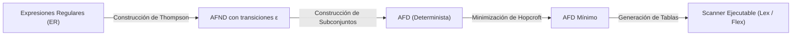
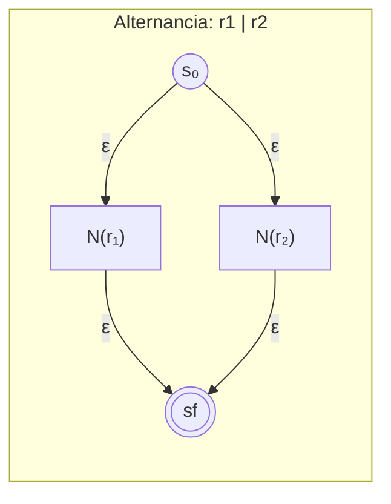
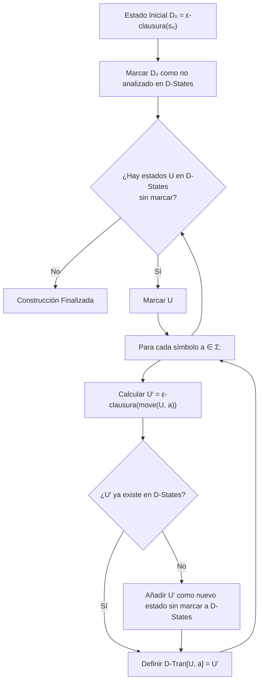
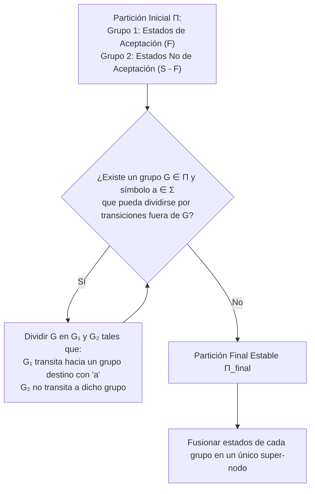

# Fases del Compilador y Análisis Léxico

Un **compilador** es un sistema de software de alta complejidad que traduce un programa expresado en un lenguaje fuente de alto nivel (orientado a la legibilidad y abstracción humana) a un lenguaje destino equivalente de bajo nivel (código ensamblador o lenguaje máquina), preservando estrictamente el significado semántico original del programa y optimizando el uso de los recursos de hardware ([[Pipeline de Instrucciones y Riesgos (Hazards)]] y [[Jerarquia de Memoria y Memoria Cache]]).

> [!info] 💡 ¿Cómo entender esto desde cero? (Guía para novatos de pregrado)
> - **Analogía del traductor de un libro en chino antiguo:**
>   - No puedes traducir todo el libro de golpe. Primero identificas los caracteres individuales y palabras (eso es el **Lexer** o escáner: reconoce "palabras válidas" o tokens).
>   - Luego verificas si la oración sigue las reglas gramaticales (el **Parser** sintáctico).
>   - Luego verificas si lo que dice tiene lógica (el analizador **semántico**: por ejemplo, no puedes sumar un caballo con una idea abstracta).
>   - Finalmente, redactas la versión en español moderno optimizando palabras repetidas (el **Generador y Optimizador de Código**).
> - **Tokens y Expresiones Regulares:** El escáner lee caracteres en bruto (`c`, `o`, `u`, `n`, `t`, ` `, `=`, ` `, `1`, `0`, `;`) y los agrupa en fichas con significado: `[IDENTIFICADOR: count]`, `[ASIGNACIÓN: =]`, `[NÚMERO_ENTERO: 10]`, `[PUNTO_Y_COMA]`. ¡Descarta espacios en blanco y comentarios para hacerle la vida fácil al parser!

---

## 1. Estructura General y Fases de un Compilador Moderno

La arquitectura clásica de un compilador se desacopla rigurosamente en dos subsistemas principales: el **Frontend** (independiente de la máquina de destino) y el **Backend** (dependiente de la arquitectura de la máquina).

```mermaid
flowchart TD
    subgraph Frontend ["Frontend (Independiente de la Máquina)"]
        Src["Código Fuente"] --> AL["1. Análisis Léxico (Scanner)"]
        AL -->|Flujo de Tokens| AS["2. Análisis Sintáctico (Parser)"]
        AS -->|Árbol de Análisis (CST) / AST| ASem["3. Análisis Semántico<br>([[calculo de atributos]])"]
        ASem -->|AST Decorado / Tabla de Símbolos| GCI["4. Generación de Código Intermedio"]
    end

    subgraph IR_Bridge ["Representación Intermedia (IR)"]
        GCI --> IR["Código Intermedio (TAC / Cuádruplas / LLVM IR)"]
    end

    subgraph Backend ["Backend (Dependiente de la Máquina)"]
        IR --> Opt["5. Optimización de Código Intermedio / Target"]
        Opt --> GC["6. Generación de Código Máquina / Ensamblador"]
        GC --> Target["Código Destino Ejecutable (MIPS / x86 / ARM)"]
    end

    subgraph Transversales ["Estructuras Transversales Globales"]
        ST[("Tabla de Símbolos<br>(Symbol Table)")]
        EH["Manejador de Errores<br>(Error Handler)"]
    end

    AL <--> ST
    AS <--> ST
    ASem <--> ST
    GCI <--> ST
    Opt <--> ST
    GC <--> ST

    AL -.-> EH
    AS -.-> EH
    ASem -.-> EH
```

### 1.1 Desglose de Fases del Frontend
1. **Análisis Léxico (*Scanning*):** Lee el flujo continuo de caracteres del código fuente y los agrupa en unidades atómicas con significado sintáctico llamadas **tokens**, descartando comentarios y espacios en blanco.
2. **Análisis Sintáctico (*Parsing*):** Impone una estructura jerárquica sobre los tokens de acuerdo con una [[Analisis Sintactico (Parsers LL, LR y Gramaticas Libres de Contexto)|Gramática Libre de Contexto]], produciendo un Árbol Sintáctico (*Parse Tree*) o un Árbol de Sintaxis Abstracta (*AST*).
3. **Análisis Semántico:** Verifica la consistencia lógica del programa respecto a las reglas del lenguaje (comprobación de tipos, resolución de ámbitos, concordancia de firmas). Se fundamenta en la evaluación dirigida por la sintaxis y el **[[calculo de atributos]]** (donde se computan atributos sintetizados y heredados a lo largo del árbol sintáctico).
4. **Generación de Código Intermedio:** Traduce el AST validado a una representación intermedia independiente de la arquitectura (como código de tres direcciones o cuádruplas `x = y op z`), facilitando la portabilidad a múltiples procesadores.

### 1.2 Fases del Backend
5. **Optimización de Código:** Transforma el código intermedio para que el programa resultante sea más veloz o consuma menos memoria (eliminación de subexpresiones comunes, propagación de constantes, desenrollado de bucles).
6. **Generación de Código:** Mapea las instrucciones intermedias a instrucciones de máquina concretas, gestionando la **asignación de registros** (mediante algoritmos de coloración de grafos) y la planificación de instrucciones para evitar bloqueos en el pipeline ([[Pipeline de Instrucciones y Riesgos (Hazards)#Solución 3: Optimización y Reordenamiento por el Compilador]]).

---

## 2. Análisis Léxico (*Scanning*): Formalización Matemática

El analizador léxico procesa el archivo de caracteres y construye abstracciones formales.

### 2.1 Definiciones Básicas
- **Alfabeto ($\Sigma$):** Conjunto finito y no vacío de símbolos admisibles (ej. caracteres ASCII o UTF-8).
- **Cadena (*String*):** Secuencia finita de símbolos elegidos del alfabeto $\Sigma$. La longitud de una cadena $s$ se denota $|s|$. La cadena vacía se denota $\epsilon$ ($|\epsilon| = 0$).
- **Lenguaje ($L$):** Cualquier conjunto contable de cadenas sobre un alfabeto fijo ($L \subseteq \Sigma^*$).
- **Lexema (*Lexeme*):** Secuencia concreta de caracteres del código fuente que coincide exactamente con el patrón de un token (ej. `if`, `contador`, `3.14159`).
- **Token:** Tupla abstracta compuesta por un nombre de categoría y un valor de atributo opcional:
  $$\langle \text{token\_name}, \text{attribute\_value} \rangle$$
  *Ejemplo:* El lexema `contador` produce el token $\langle \mathbf{id}, \text{puntero\_a\_tabla\_simbolos} \rangle$.
- **Patrón:** Descripción formal (habitualmente una expresión regular) que deben satisfacer las cadenas para constituir un token de cierto tipo.

---

### 2.2 Expresiones Regulares (ER) y su Álgebra
Una expresión regular sobre $\Sigma$ define de forma inductiva un lenguaje regular $L(r)$:
1. $\epsilon$ es una ER que denota $\{\epsilon\}$.
2. Para cada $a \in \Sigma$, $a$ es una ER que denota $\{a\}$.
3. Si $r$ y $s$ son ER que denotan $L(r)$ y $L(s)$:
   - **Unión / Alternancia:** $(r) \mid (s)$ denota $L(r) \cup L(s)$.
   - **Concatenación:** $(r)(s)$ denota $L(r)L(s) = \{ xy \mid x \in L(r), y \in L(s) \}$.
   - **Clausura de Kleene:** $(r)^*$ denota $\bigcup_{i=0}^{\infty} L(r)^i$.
   - **Clausura Positiva:** $(r)^+ = (r)(r)^*$.

---

## 3. De Expresiones Regulares a Código Ejecutable: El Pipeline Léxico

Para transformar especificaciones léxicas declarativas en un reconocedor de alta velocidad en tiempo de compilación, se sigue una cadena canónica de algoritmos matemáticos:



---

### 3.1 Algoritmo de Construcción de Thompson (ER $\to$ AFND)
El algoritmo de Ken Thompson construye un **Autómata Finito No Determinista (AFND)** con transiciones $\epsilon$ de forma recursiva y composicional a partir de la estructura sintáctica de la expresión regular.

#### Plantillas Estructurales Fundamentales:
1. **Símbolo básico $a$:**
   $$\to ((i)) \xrightarrow{\quad a \quad} ((f))$$
2. **Concatenación $r_1 r_2$:**
   El estado final de $N(r_1)$ se fusiona o conecta mediante $\epsilon$ con el estado inicial de $N(r_2)$.
3. **Alternancia $r_1 \mid r_2$:**
   Se introduce un nuevo estado inicial que bifurca en $\epsilon$ hacia $N(r_1)$ y $N(r_2)$, y sus estados finales convergen mediante $\epsilon$ a un nuevo estado final único.
4. **Clausura de Kleene $r^*$:**
   Se añade un nuevo estado inicial que permite saltar por $\epsilon$ directo al nuevo estado final (cadena vacía) o entrar a $N(r)$, y el final de $N(r)$ se retroalimenta por $\epsilon$ hacia su inicio.



- **Propiedades del AFND de Thompson:**
  - Posee exactamente un estado inicial y un estado final.
  - Cada estado tiene como máximo dos transiciones $\epsilon$ salientes y a lo sumo una transición etiquetada por un símbolo de $\Sigma$.
  - Si la ER tiene $n$ operadores y operandos, el AFND tiene $\le 2n$ estados.

---

### 3.2 Algoritmo de Construcción de Subconjuntos (AFND $\to$ AFD)
Un AFND no puede ejecutarse directamente de forma determinista en tiempo constante por cada carácter. El algoritmo de subconjuntos construye un **Autómata Finito Determinista (AFD)** equivalente, donde **cada estado del AFD representa un subconjunto de estados del AFND**.

#### Funciones Matemáticas de Soporte:
1. **$\epsilon\text{-clausura}(s)$:** Conjunto de estados del AFND alcanzables desde el estado $s$ tomando únicamente transiciones $\epsilon$.
2. **$\epsilon\text{-clausura}(T)$:** Unión de las $\epsilon$-clausuras para todos los estados $s \in T$:
   $$\epsilon\text{-clausura}(T) = \bigcup_{s \in T} \epsilon\text{-clausura}(s)$$
3. **$\text{move}(T, a)$:** Conjunto de estados del AFND hacia los cuales existe una transición etiquetada con el símbolo $a$ desde algún estado en $T$:
   $$\text{move}(T, a) = \{ q \mid \exists p \in T, \delta(p, a) = q \}$$



- Un estado $U$ del AFD es de **aceptación** si contiene al menos un estado de aceptación del AFND original.

---

### 3.3 Algoritmo de Hopcroft: Minimización de Estados de un AFD
Un AFD generado puede contener estados redundantes o equivalentes. El algoritmo de Hopcroft calcula la partición mínima del conjunto de estados en grupos indistinguibles en tiempo $\mathcal{O}(|\Sigma| \cdot n \log n)$.



El autómata resultante es el **AFD canónico mínimo único** (salvo isomorfismo de nombres) que reconoce el lenguaje.

---

## 4. Implementación Práctica del Scanner y Manejo de Búferes

En la práctica industrial de desarrollo de compiladores, el cuello de botella del análisis léxico es la lectura física de bytes desde el subsistema de archivos o memoria principal ([[Funcionamiento del Sistema de Memoria]]).

### 4.1 Esquema de Búfer Doble (*Two-Buffer Scheme*) con Centinelas
Para evitar realizar una llamada al sistema operativo por cada carácter y prevenir la verificación continua del límite del array (`if (p >= buffer_end)`), se emplea un **búfer doble con centinela `EOF`**:

```
Búfer 1 (N caracteres)             Búfer 2 (N caracteres)
+---+---+---+---+---+---+---+---+  +---+---+---+---+---+---+---+---+
| c | o | n | t | a | d | o |EOF|  | r |   | = |   | 1 | 0 | ; |EOF|
+---+---+---+---+---+---+---+---+  +---+---+---+---+---+---+---+---+
      ^                       ^
      |                       |
  lexemeBegin              forward
```

- **Punteros Operativos:**
  - `lexemeBegin`: Apunta al inicio del lexema actual en proceso de reconocimiento.
  - `forward`: Avanza reconociendo caracteres hasta que el autómata alcanza un estado de aceptación o fallo.
- **Centinela `EOF` al final de cada bloque:** Al topar con `EOF`, solo se comprueba una vez si se trata del final físico del archivo o simplemente del cambio de bloque para recargar el búfer complementario de forma asíncrona.

### 4.2 Reglas de Desambiguación Léxica
Cuando una cadena coincide con múltiples patrones o expresiones regulares, los generadores de scanners (como Lex / Flex) aplican dos reglas universales:
1. **Regla del Emparejamiento Más Largo (*Longest Match* o *Maximal Munch*):** Siempre se prefiere el token que consume la mayor cantidad de caracteres consecutivos. (Ejemplo: `<=` se reconoce como el operador relacional de menor o igual, y no como `<` seguido de `=`).
2. **Prioridad por Orden de Declaración:** Si un mismo lexema coincide exactamente con dos patrones de igual longitud, se selecciona la regla que fue escrita primero en el archivo de especificación. (Permite distinguir palabras clave de identificadores: si la regla de `if` precede a la regla de identificadores `[a-z]+`, la palabra `if` se categoriza como palabra reservada y no como nombre de variable).

### 4.3 Manejo de Errores Léxicos
Si un carácter no coincide con ninguna transición válida del autómata:
- **Modo Pánico (*Panic Mode*):** El scanner descarta los caracteres sucesivos hasta encontrar un delimitador válido (como un espacio en blanco o punto y coma) para continuar analizando.
- **Estrategias de Reparación:** Eliminación de caracteres espurios, inserción de caracteres faltantes o transposición de caracteres adyacentes comunes.

---

## Notas Relacionadas y Enlaces de Vault
- [[calculo de atributos]] — Evaluación de atributos semánticos sintetizados y heredados a lo largo del árbol sintáctico.
- [[Analisis Sintactico (Parsers LL, LR y Gramaticas Libres de Contexto)]] — Fase siguiente del frontend: construcción del árbol sintáctico a partir del flujo de tokens.
- [[Pipeline de Instrucciones y Riesgos (Hazards)]] — Optimización en la fase de generación de código destino para evitar stalls y hazards.
- [[Jerarquia de Memoria y Memoria Cache]] — Impacto de las cachés L1/L2 en el rendimiento de los búferes de entrada y tablas de símbolos.
