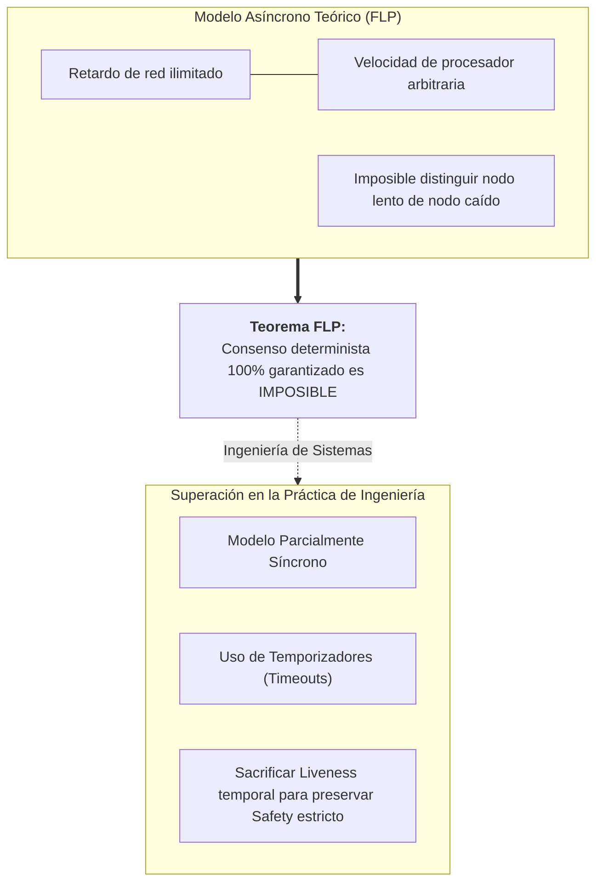
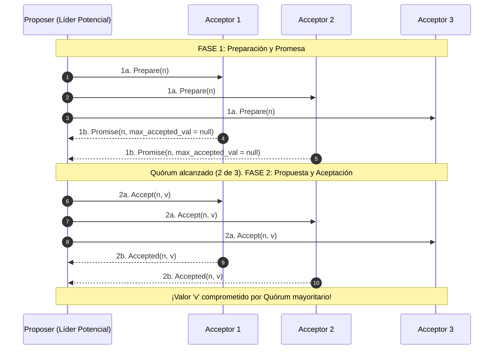
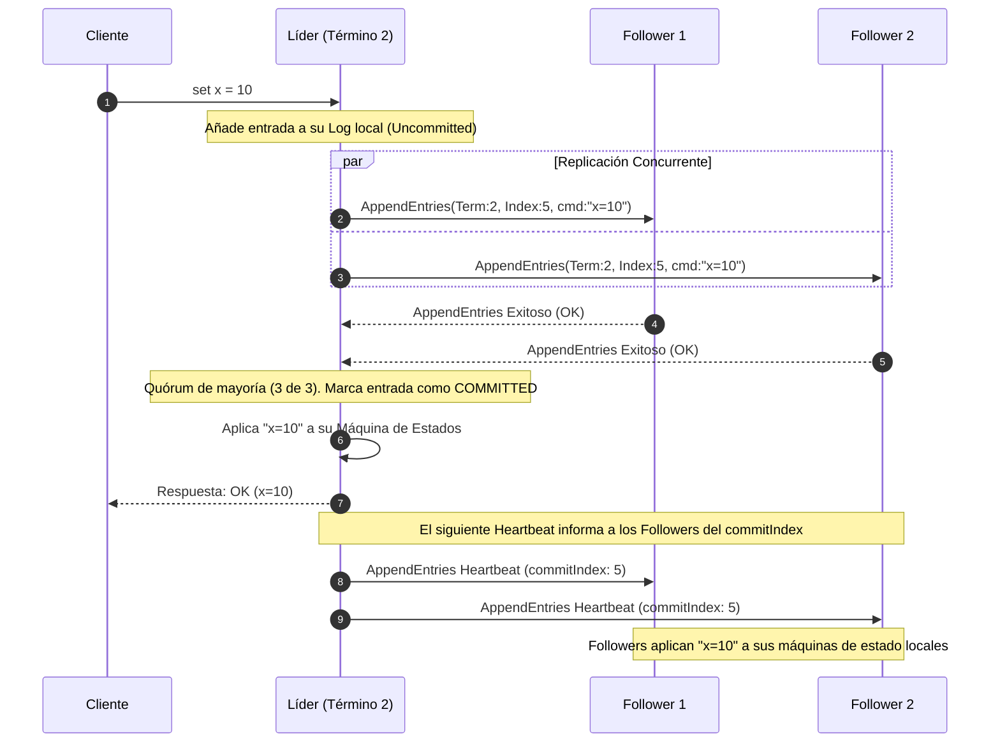

# Algoritmos de Consenso Distribuido: Paxos y Raft

En el diseño de sistemas distribuidos a gran escala (expandiendo los fundamentos de [[computacion distribuida]] y [[Consistencia y replicacion]]), el **Consenso Distribuido** es el problema más crítico y complejo: ¿cómo lograr que un clúster de computadoras independientes, interconectadas por una red no confiable y sujetas a caídas repentinas, acuerden de forma determinista un único valor o una secuencia ordenada de acciones (*State Machine Replication*)?

Garantizar la consistencia de los datos frente a fallos de hardware y particiones de red sin depender de un único punto de fallo (*Single Point of Failure*) requiere protocolos matemáticamente rigurosos de tolerancia a fallos por parada o recuperación (**Crash-Fault Tolerance - CFT**).

> [!info] 💡 ¿Cómo entender esto desde cero? (Guía para novatos de pregrado)
> - **Analogía del grupo de amigos decidiendo qué película ver por WhatsApp:**
>   - Tienes 5 amigos en un grupo. Algunos tienen mala conexión y sus mensajes llegan 10 minutos tarde; a otro se le apagó el celular. ¿Cómo se ponen de acuerdo de forma unánime sobre a qué cine ir sin que dos personas compren boletos para funciones distintas?
>   - **El consenso distribuido resuelve esto:** Reglas estrictas para que la mayoría (3 de 5 amigos) vote por un líder y acuerde cada decisión paso a paso, incluso si la red falla o se caen nodos.
> - **Paxos (El genio incomprendido de Lamport):** El primer algoritmo formal que demostró que el consenso es posible. Es matemáticamente perfecto, pero tan abstracto y difícil de entender que casi nadie en la industria lograba implementarlo sin cometer errores críticos.
> - **Raft (El consenso diseñado para humanos):** Creado en Stanford en 2014 para hacer lo mismo que Paxos pero dividido en 3 fases intuitivas: 1) Elección de un líder con temporizadores aleatorios, 2) El líder recibe órdenes y las replica, 3) Si la mayoría dice "ok", la orden queda grabada para siempre. ¡Es el motor que mantiene con vida a Kubernetes y etcd!

---

## 1. El Problema Fundamental y el Teorema FLP

Un protocolo de consenso correcto debe satisfacer obligatoriamente dos propiedades esenciales:
1. **Seguridad (*Safety*):** Nada malo sucede. Todos los nodos no defectuosos acuerdan el mismo valor, y el valor acordado debió haber sido propuesto por alguno de los participantes (no se inventan datos espurios).
2. **Vivacidad (*Liveness*):** Algo bueno eventualmente sucede. El sistema no entra en un bloqueo permanente (*deadlock* o *livelock*) y alcanza una decisión en un tiempo finito.

### El Teorema de Imposibilidad FLP (Fischer, Lynch y Paterson, 1985)
Uno de los resultados más trascendentales de la ciencia de la computación teórica establece que:
> *"En un sistema distribuido puramente asíncrono, no existe ningún algoritmo de consenso determinista que pueda garantizar tanto Seguridad (Safety) como Vivacidad (Liveness) ante la posibilidad de que falle tan solo un único nodo por caída (crash-stop)."*



#### ¿Cómo operan los sistemas reales ante FLP?
Los algoritmos prácticos como Paxos y Raft **priorizan la Seguridad de forma absoluta** sobre la Vivacidad. Si la red sufre demoras extremas o particiones, el sistema puede demorar temporalmente en confirmar nuevas operaciones (pérdida momentánea de vivacidad), pero jamás aceptará escrituras contradictorias que corrompan el estado (preservación de *Safety*).

---

## 2. El Algoritmo Paxos (Leslie Lamport, 1998)

Propuesto por el ganador del Premio Turing **Leslie Lamport**, Paxos sentó las bases formales del consenso moderno. Describe el acuerdo mediante una analogía con el parlamento de la isla griega de Paxos.

### Roles de los Nodos en Paxos
* **Proposer (Proponente):** Recibe solicitudes de los clientes y propone valores a la red.
* **Acceptor (Aceptador):** Almacena en memoria persistente los votos emitidos. Actúa como el custodio del consenso. Un quórum de mayoría de aceptores decide la validez de una propuesta.
* **Learner (Aprendiz):** No vota; observa las decisiones del quórum para ejecutar el comando en la máquina de estados local.

### Fases de Basic Paxos (Consenso para un Único Valor)

Para consensuar una única decisión, el algoritmo ejecuta un protocolo de dos fases:



1. **Fase 1a — Preparación (`Prepare`):**
   El proponente selecciona un identificador de propuesta $n$ único y estrictamente monótono creciente (usualmente compuesto por `timestamp.nodoId`) y lo envía a la mayoría de aceptores.
2. **Fase 1b — Promesa (`Promise`):**
   Si un aceptor recibe `Prepare(n)` con $n > n_{anterior}$, responde comprometiéndose formalmente a rechazar toda propuesta futura con identificador menor a $n$. Además, si ya había aceptado un valor en el pasado, adjunta el identificador y valor de su propuesta aceptada previa (`max_accepted_prop`, `max_accepted_val`).
3. **Fase 2a — Petición de Aceptación (`Accept`):**
   Si el proponente recibe respuestas afirmativas de un quórum de mayoría de aceptores ($\lfloor N/2 \rfloor + 1$), debe seleccionar el valor $v$ a proponer. **Regla fundamental:** Si algún aceptor reportó haber aceptado ya un valor previo, el proponente *debe* adoptar obligatoriamente el valor con el número de propuesta más alto reportado; si ningún aceptor reportó valores previos, el proponente es libre de usar el valor $v$ enviado por su cliente.
4. **Fase 2b — Aceptado (`Accepted`):**
   El aceptor valida si ha emitido alguna promesa superior a $n$. Si no es así, registra el valor $v$ en su disco y confirma la aceptación al proponente y a los aprendices.

### Multi-Paxos y el Problema de la Complejidad Práctica
* **Multi-Paxos:** Ejecutar Basic Paxos para cada comando de un log es inviable (requiere múltiples viajes de ida y vuelta por comando). Multi-Paxos elige un proponente estable (*Líder*) mediante la Fase 1 una sola vez; las transacciones subsiguientes ejecutan únicamente la Fase 2 en flujo continuo.
* **La Crítica de la Industria:** A pesar de su belleza matemática, Paxos es notoriamente críptico y omite detalles esenciales de ingeniería: cómo cambiar miembros del clúster de forma segura, cómo compactar logs mediante instantáneas (*snapshots*), y cómo resolver el duelo de proponentes (*livelock*, donde dos proponentes incrementan $n$ indefinidamente pisándose los `Prepare`). En palabras de Google en su célebre artículo *"Paxos Made Live"* (2007): *"Existe una enorme brecha entre la descripción teórica de Paxos y las necesidades operativas de un sistema de producción real"*.

---

## 3. El Algoritmo Raft (Ongaro y Ousterhout, 2014)

Diseñado en la Universidad de Stanford bajo el principio explícito de **comprensibilidad humana sin resignar rendimiento ni corrección**, Raft descompone el consenso distribuido en tres subproblemas ortogonales:

```mermaid
flowchart TD
    classDef state fill:#2d3748,stroke:#4a5568,stroke-width:2px,color:#fff;
    classDef action fill:#1a365d,stroke:#3182ce,stroke-width:2px,color:#fff;

    F["<b>Follower (Seguidor)</b><br/>• Estado pasivo inicial<br/>• Responde a RPCs<br/>• Monitorea Heartbeats"]:::state

    C["<b>Candidate (Candidato)</b><br/>• Incrementa Término (Term)<br/>• Vota por sí mismo<br/>• Envía RequestVote a todos"]:::state

    L["<b>Leader (Líder)</b><br/>• Atiende peticiones de clientes<br/>• Envía AppendEntries / Heartbeats<br/>• Gobierna la replicación del Log"]:::state

    F -->|Timeout de Elección expirado| C
    C -->|Obtiene mayoría de votos (N/2 + 1)| L
    C -->|Descubre líder con término mayor| F
    C -->|Split vote / Timeout sin ganador| C
    L -->|Descubre nodo con término superior| F
```

### Componente 1: Elección de Líder (*Leader Election*)
* **Términos Electorales (*Terms*):** El tiempo se divide en términos lógicos secuenciales representados por enteros monótonos crecientes ($T_1, T_2, T_3 \dots$). Actúan como relojes lógicos de Lamport: cualquier nodo que detecte un mensaje con un término mayor al suyo actualiza su término inmediatamente y pasa al estado de *Follower*.
* **Temporizadores de Elección Aleatorios (*Randomized Timeouts*):** Cada seguidor mantiene un temporizador de elección que se reinicia cada vez que recibe un latido (*heartbeat*) del líder. Si el líder deja de responder (por caída o partición de red), el temporizador expira. Para evitar que múltiples nodos pasen a candidatos al mismo instante y dividan los votos (*split votes*), **el timeout se elige al azar entre 150 ms y 300 ms**.
* **Elaboración del Voto (`RequestVote`):** El candidato incrementa su término, vota por sí mismo y difunde un RPC `RequestVote`. Si obtiene votos afirmativos de la mayoría estricta ($\lfloor N/2 \rfloor + 1$), asume de inmediato como Líder y comienza a enviar latidos periódicos vacíos para ratificar su autoridad.

---

### Componente 2: Replicación de Logs (*Log Replication*)

Una vez elegido el líder, este se convierte en el punto exclusivo de contacto para todos los comandos del sistema:



* **Mecánica del Log:** Cada entrada del log almacena:
  1. El comando de la máquina de estados.
  2. El término electoral en el que el líder recibió la propuesta.
  3. Un índice entero secuencial que marca su posición física.
* **Compromiso (*Commit*):** Una entrada se considera oficialmente comprometida (*committed*) tan pronto como ha sido replicada exitosamente en la mayoría estricta de los nodos del clúster. Las entradas comprometidas son duraderas e irrevocables.
* **Propiedad de Concordancia de Logs (*Log Matching Property*):** Si dos logs en nodos distintos contienen una entrada con el mismo índice y el mismo término:
  1. Ambas entradas almacenan idéntico comando.
  2. Todos los logs son rigurosamente idénticos en todas las entradas previas desde el inicio hasta ese índice.

---

### Componente 3: Seguridad y Restricción de Elección (*Safety*)

Para garantizar que ningún líder nuevo sobreescriba comandos comprometidos previamente, Raft impone la propiedad más importante del protocolo:

> [!important] Propiedad de Integridad del Líder (Leader Completeness)
> Si una entrada de log fue comprometida (*committed*) en algún término electoral, dicha entrada estará presente en los logs de los líderes de todos los términos electorales superiores.

#### Regla de Votación Restringida:
Un seguidor **niega su voto** a cualquier candidato si el log del candidato está menos actualizado que el suyo. El votante compara:
1. El término de la última entrada de log (`lastLogTerm`): el mayor término gana.
2. A igual término, la longitud del log (`lastLogIndex`): el log más largo gana.

Gracias a que un comando comprometido reside en la mayoría de nodos y una elección requiere una mayoría de votos, **por el principio del palomar (intersección de quórums), siempre habrá al menos un nodo en el quórum electoral que posee la entrada comprometida**, impidiendo que un candidato desactualizado sea electo.

---

## 4. Cuadro Comparativo: Paxos vs. Raft vs. ZAB

| Criterio | Paxos Tradicional | Raft | ZAB (Apache ZooKeeper) |
| :--- | :--- | :--- | :--- |
| **Diseñado para** | Elegancia formal matemática | Comprensibilidad y facilidad de implementación | Replicación atómica de estado en ZooKeeper |
| **Estructura de Liderazgo** | Sin líder inherente (Líder débil en Multi-Paxos) | Líder fuerte y absoluto (Todo el flujo pasa por él) | Líder fuerte con fases de recuperación (*Recovery/Sync*) |
| **Flujo de Logs** | Las entradas pueden comprometerse fuera de orden | Estrictamente secuencial y contiguo | Secuencial mediante identificadores epoch zxid |
| **Manejo de Membresía** | Extremadamente complejo de implementar | Consenso conjunto (*Joint Consensus*) y reconfiguraciones de a un nodo | Reconfiguración dinámica asistida |
| **Adopción Destacada** | Google Chubby, Spanner, Megastore | Kubernetes (etcd), HashiCorp Consul, CockroachDB | Apache Kafka (versiones históricas), Solr, Hadoop |

---

## 5. Casos de Éxito en Sistemas Modernos de Producción

1. **etcd (El Motor de Kubernetes):**
   Implementado en Go, etcd utiliza Raft para almacenar todos los metadatos de configuración, despliegue, secretos y estados de pods en un clúster de Kubernetes. Cuando un nodo maestro falla, Raft garantiza la elección transparente de un sucesor en menos de 1 segundo.
2. **CockroachDB (Multi-Raft NewSQL):**
   Divide las tablas de datos en rangos pequeños de 64 MB. Cada rango forma un grupo independiente de consenso Raft compuesto por 3 o 5 nodos distribuidos geográficamente. Esto permite ejecutar miles de elecciones Raft paralelas e independientes a escala masiva.
3. **Consul (HashiCorp):**
   Utiliza el protocolo Raft para mantener el catálogo centralizado de *Service Discovery* y la configuración de claves distribuidas en infraestructuras multi-cloud.

---

## Notas relacionadas
- [[computacion distribuida]]
- [[Consistencia y replicacion]]
- [[Tolerancia a fallos]]
- [[Sistemas de mensajeria]]
- [[Microservicios]]
- [[Bases de Datos NoSQL y Poliglota]]
