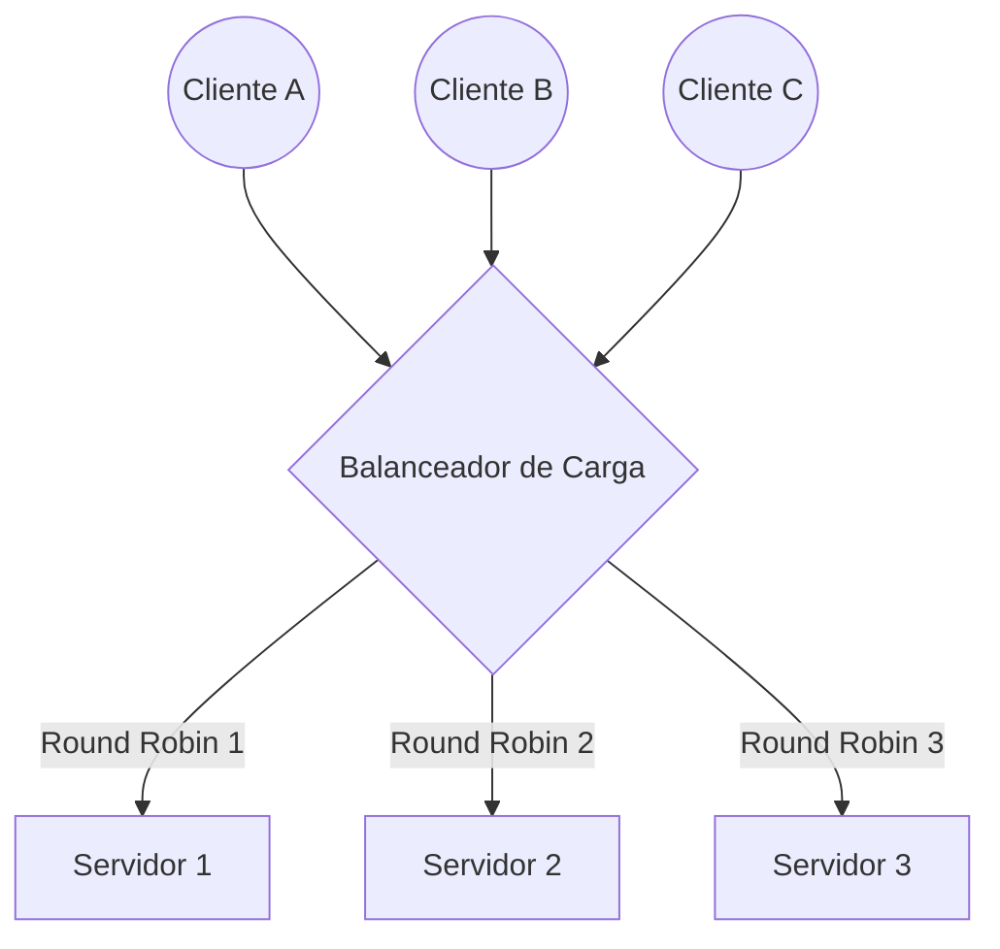

# Balanceo de Carga

El **Balanceo de Carga (Load Balancing)** es el proceso arquitectónico encargado de distribuir el tráfico de red entrante o las peticiones de los clientes a través de múltiples servidores (frecuentemente denominados como un "pool" de servidores o una granja de servidores). Esta técnica asegura rigurosamente que ningún servidor individual soporte un exceso de peticiones, mejorando de esta forma la disponibilidad del sistema y la capacidad de respuesta general de la aplicación.

## Algoritmos Comunes

Existen múltiples estrategias matemáticas y lógicas para enrutar este tráfico:

- **Round Robin:** Las peticiones entrantes se distribuyen de forma secuencial y circular a lo largo de toda la lista de servidores disponibles. Es un algoritmo sumamente simple y resulta muy útil en infraestructuras donde todos los servidores poseen idéntica capacidad de procesamiento.
- **Least Connections (Menos conexiones):** El balanceador redirige el tráfico nuevo hacia aquel servidor que mantenga la menor cantidad de conexiones activas concurrentes en ese instante preciso. Es una estrategia ideal para sistemas que manejan sesiones prolongadas.
- **Hash-based (Basado en Hash):** Emplea un algoritmo criptográfico o de hash para decidir a qué servidor específico se enviará el tráfico. Esta decisión se toma analizando un elemento constante de la petición, como puede ser la dirección IP del cliente o el valor de una cookie. Su principal beneficio es garantizar la persistencia de sesión (*sticky sessions*), dirigiendo a un usuario recurrente siempre hacia la misma máquina.

## Tipos de Balanceadores

Dependiendo de la capa del modelo OSI en la que operen, se distinguen dos categorías principales:

1. **Balanceador de Carga de Capa 4 (Transporte):** Toma decisiones de enrutamiento rápidas basándose exclusivamente en los datos básicos de la red y del protocolo de transporte, como por ejemplo las direcciones IP y los puertos TCP o UDP de los [[sockets]].
2. **Balanceador de Carga de Capa 7 (Aplicación):** Toma decisiones de distribución mucho más complejas al evaluar a fondo el contenido del mensaje HTTP. Puede analizar de forma inteligente las cabeceras, el contenido de las cookies o los parámetros específicos de la URL solicitada.

> [!info] Explicación: Evitando puntos únicos de fallo (SPOF)
> Un balanceador de carga moderno no se limita únicamente a distribuir el tráfico, sino que también ejecuta constantes comprobaciones de salud (*Health Checks*) sobre los servidores de la granja. Si uno de los nodos falla repetidamente, el balanceador cesa el envío de peticiones hacia este y lo remueve temporalmente del pool, logrando así un nivel avanzado de [[Tolerancia a fallos]]. Para prevenir que el propio dispositivo balanceador se convierta en un punto único de fallo (*Single Point of Failure*), estos equipos suelen implementarse en configuraciones de clúster Activo/Pasivo o Activo/Activo.

## Notas relacionadas
- [[servidores]]
- [[rendimineto de htpp]]
- [[Microservicios]]
