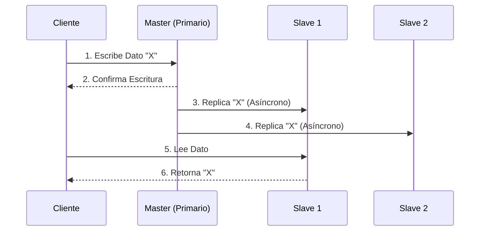

# Consistencia y Replicación

La estrategia de replicación de datos es absolutamente clave dentro del área de la [[computacion distribuida]] para lograr una alta [[Tolerancia a fallos]] y un rendimiento superior. No obstante, mantener copias exactas de los mismos datos esparcidas en distintos nodos físicos origina un enorme desafío de ingeniería: ¿cómo podemos asegurar que todas y cada una de las copias muestren la misma información sincronizada cada vez que se ejecutan nuevas actualizaciones?

## Modelos de Consistencia

Los sistemas de bases de datos distribuidas ofrecen distintos paradigmas para manejar este problema, equilibrando entre integridad y velocidad:

- **Consistencia Fuerte (Strong Consistency):** Este modelo garantiza estrictamente que, después de que se ha completado una operación de escritura, todas las peticiones de lectura posteriores devolverán indefectiblemente el valor actualizado más reciente. Lograr este nivel de certeza requiere mecanismos de sincronización muy estrictos (como el bloqueo transaccional de múltiples nodos), lo cual incrementa significativamente la latencia total de las transacciones.
- **Consistencia Eventual (Eventual Consistency):** Bajo este paradigma, el sistema no asegura que una operación de escritura se vea reflejada instantáneamente en todas las partes de la red. Sin embargo, sí garantiza que, siempre y cuando no se realicen escrituras adicionales, todas las réplicas eventualmente se sincronizarán y convergerán al mismo estado actualizado. Se trata del modelo predilecto para aplicaciones a gran escala que priorizan la altísima disponibilidad (conceptos ampliamente descritos en el Teorema CAP).

## Tipos de Replicación

Dependiendo de qué nodos tengan autorización para modificar los datos, encontramos arquitecturas diferentes:

- **Replicación Activo-Pasivo (Master-Slave):** Todo el tráfico de escrituras y actualizaciones se dirige exclusivamente hacia un único nodo primario (conocido como *Master*). Las réplicas secundarias (*Slaves*) se actualizan asíncronamente a partir de este nodo central, y se emplean únicamente para absorber el tráfico de lecturas o para fungir como respaldo en el evento de que el nodo primario falle.
- **Replicación Activo-Activo (Multi-Master):** Esta arquitectura permite ejecutar operaciones de lectura y escritura en cualquier nodo del sistema. Aunque maximiza el rendimiento y la disponibilidad, resulta inmensamente más compleja de gestionar, puesto que pueden generarse graves colisiones o conflictos de versiones si dos usuarios distintos intentan actualizar un mismo registro simultáneamente en nodos separados.

> [!info] Explicación: Quorum de Lectura y Escritura
> Con el propósito de encontrar un balance ideal entre la consistencia fuerte y la latencia operativa en los sistemas distribuidos modernos (tales como Apache Cassandra o Amazon DynamoDB), la industria utiliza ampliamente el concepto matemático de **Quorum**. 
> Si un clúster de datos está compuesto por $N$ nodos en total, una operación de escritura se considera oficialmente exitosa únicamente cuando logra ser confirmada por al menos $W$ nodos. Por otro lado, una operación de lectura se considera válida si obtiene respuestas consistentes de un mínimo de $R$ nodos. La regla matemática fundamental establece que, si la suma $W + R$ resulta estrictamente mayor a $N$ ($W + R > N$), el sistema garantiza lógicamente un estado de consistencia fuerte, debido a que forzosamente existirá una intersección física de nodos entre la operación de escritura previa y la operación de lectura actual.

## Notas relacionadas
- [[Tolerancia a fallos]]
- [[computacion distribuida]]
