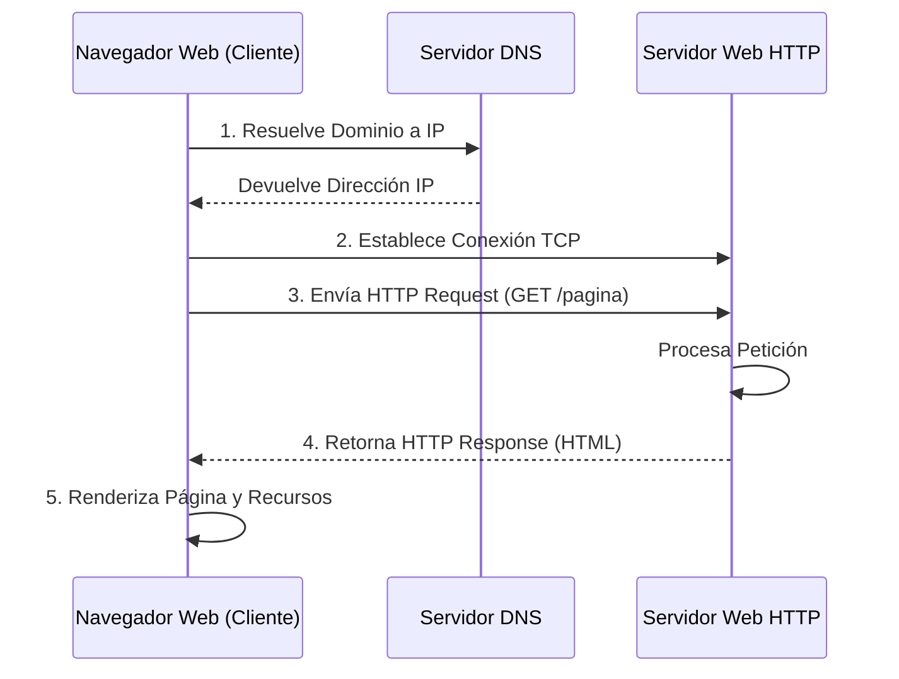

# Introducción a HTTP

El **HTTP (Hypertext Transfer Protocol)** es el protocolo de comunicaciones universal utilizado para la transferencia estructurada de los recursos (como texto, imágenes y video) que componen una página web, facilitando el diálogo entre aplicaciones clientes (navegadores) y servidores.

![[Pasted image 20240429220901.png]]

A nivel arquitectónico, HTTP es un protocolo fundamentado en el clásico modelo de petición-respuesta (*request/response*). Fue diseñado originalmente para la localización, solicitud y transferencia de documentos y recursos multimedia a lo largo y ancho de la World Wide Web.
En términos de infraestructura de red, HTTP opera típicamente sobre conexiones persistentes de transporte TCP, utilizando históricamente el puerto estándar 80 (y el puerto 443 para su variante segura, HTTPS).
Constituye el pilar fundamental de la inmensa mayoría de las aplicaciones con arquitectura cliente-servidor, siendo el lenguaje nativo de los navegadores web modernos. Además, es vital recalcar que la implementación lógica de HTTP se ejecuta íntegramente a nivel de usuario en el modelo OSI (capa de aplicación), a diferencia de los protocolos de transporte como TCP/UDP, los cuales residen profundamente implementados en el kernel del sistema operativo.

> [!info] Explicación Estratégica: Protocolo Sin Estado
> Un rasgo fundamental y distintivo es que **HTTP es un protocolo de naturaleza "sin estado" (stateless).** Esto significa rigurosamente que el servidor web no guarda ni recuerda por defecto absolutamente ninguna información ni contexto sobre las peticiones anteriores enviadas por un mismo cliente. Para lograr mantener una sesión activa o un estado continuo (como recordar un usuario logueado o un carrito de compras), la industria se ve obligada a utilizar mecanismos complementarios a nivel de aplicación, tales como las **Cookies**, las variables de sesión o los modernos tokens de autenticación (ej. JWT).

## Buscando la web con HTTP

Todo el proceso se inicia a partir de una dirección URL, la cual se descompone estructuralmente en:
- **Protocolo o esquema:** `http://` o `https://`
- **Servidor o dominio:** `es.wikipedia.org`
- **Ruta del recurso (Path):** `/wiki/vegemite`

*Pasos secuenciales de la comunicación web:*
1. El sistema operativo cliente resuelve el nombre del dominio del servidor hacia su dirección IP numérica correspondiente utilizando el sistema DNS.
2. Se establece un "apretón de manos" para forjar una conexión TCP confiable directamente con el servidor destino.
3. El cliente (navegador) ensambla y envía una petición HTTP formal (`HTTP Request`) solicitando la entrega de la página o documento.
4. El cliente queda a la espera y, eventualmente, recibe del servidor la respuesta HTTP (`HTTP Response`) que contiene el código fuente del documento solicitado.
5. El motor del navegador interpreta el código HTML, detecta, ejecuta o descarga de forma asíncrona todos los recursos adicionales embebidos en el documento (tales como imágenes, hojas de estilo CSS o scripts de JavaScript) y procede a renderizar visualmente la página en pantalla.
6. Finalmente, se cierran o reciclan las conexiones TCP subyacentes que quedan inactivas (*idle*).

## Estático vs Dinámico

* **Páginas web estáticas:** Todo el contenido servido corresponde exactamente a un archivo físico preexistente en el disco del servidor, el cual se entrega tal cual y sin modificaciones (por ejemplo, una imagen JPG, o un archivo de código HTML o CSS plano).
* **Páginas web dinámicas:** El contenido devuelto no existe previamente como archivo estático. En su lugar, es el resultado directo de un programa, script o motor lógico que se ejecuta en tiempo real en el momento de procesar la petición. Esta lógica puede ejecutarse tanto del lado del servidor (usando lengejues como PHP, Python, Java o Node.js) como del lado del cliente (mediante JavaScript en el navegador).

> [!info] Explicación: Métodos HTTP (Verbos)
> En el estándar de las peticiones web, HTTP utiliza una serie predefinida de "métodos" o "verbos" para indicarle explícitamente al servidor qué tipo de acción se desea realizar sobre un recurso. Los más utilizados en arquitecturas modernas son:
> - **GET:** Solicitar un recurso con el único fin de leerlo y obtener sus datos.
> - **POST:** Enviar un cuerpo de datos al servidor para que sea procesado (por ejemplo, al enviar un formulario de registro o crear un nuevo registro en una base de datos).
> - **PUT / PATCH:** Actualizar o modificar información ya existente en el servidor.
> - **DELETE:** Solicitar la eliminación definitiva de un recurso almacenado en el servidor.

## Notas relacionadas
- [[Desarollo web]]
- [[WEB RESTful]]
- [[http caching and proxies]]
- [[rendimineto de htpp]]
- [[content delivery networks]]
