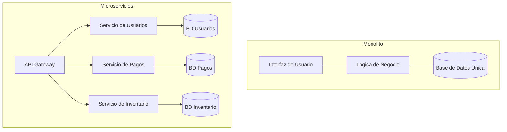

# Microservicios

La arquitectura de **Microservicios** representa un enfoque moderno para el desarrollo de software, donde una aplicación compleja se diseña y construye como un conjunto de pequeños servicios completamente independientes. Estos servicios se encuentran acoplados débilmente y se comunican entre sí utilizando protocolos ligeros, operando habitualmente sobre [[Http introduccion]] o integrándose a través de [[Sistemas de mensajeria]].

## Monolito vs Microservicios

Es fundamental comprender las diferencias arquitectónicas frente al modelo tradicional:

- **Arquitectura Monolítica:** Todo el código fuente de la aplicación, incluyendo la interfaz de usuario, la lógica de negocio y el acceso a los datos, se combina y despliega como un único programa ejecutable. Aunque es un modelo fácil para iniciar un proyecto, resulta extremadamente difícil de escalar, mantener y actualizar a medida que la aplicación crece.
- **Microservicios:** Cada componente fundamental o dominio del negocio (por ejemplo: el módulo de pagos, el control de inventario o la gestión de usuarios) opera como un servicio completamente independiente. Cada uno de estos servicios puede desarrollarse en distintos lenguajes de programación, administrar su propia base de datos exclusiva y desplegarse de forma individual sin afectar al resto del sistema.

## Componentes de una Arquitectura de Microservicios

Para operar de forma efectiva, una arquitectura basada en microservicios depende de varios componentes clave:

- **API Gateway:** Un servidor dedicado que actúa como el único punto de entrada para todas las peticiones de los clientes. Se encarga de manejar el enrutamiento de las peticiones hacia los servicios correspondientes, la composición de respuestas y la gestión de tareas transversales críticas, como la autenticación centralizada y el [[Balanceo de carga]].
- **Service Registry y Discovery:** Es un mecanismo dinámico que permite a los múltiples servicios descubrirse y encontrarse unos a otros en la red de manera automatizada. Esto es vital dado que, en entornos modernos y contenerizados, las direcciones IP de los servicios pueden cambiar de forma muy frecuente.

> [!info] Ventajas y Desventajas
> - **Ventajas:** Permite un despliegue verdaderamente independiente por equipo o servicio. Facilita una escalabilidad precisa (permitiendo escalar únicamente el servicio que requiere más recursos) y asegura un excelente aislamiento de fallos (un error crítico en el módulo de facturación no provocará la caída de la aplicación entera).
> - **Desventajas:** La adopción de esta arquitectura aumenta de forma exponencial la complejidad operativa del sistema. Tareas como monitorear las transacciones distribuidas, asegurar la red interna y gestionar de manera correcta la [[Consistencia y replicacion]] de los datos se convierten en desafíos de ingeniería sumamente importantes.

## Notas relacionadas
- [[computacion distribuida]]
- [[Remote Procedure Call (rpc)]]
- [[Virtualizacion y contenedores]]
