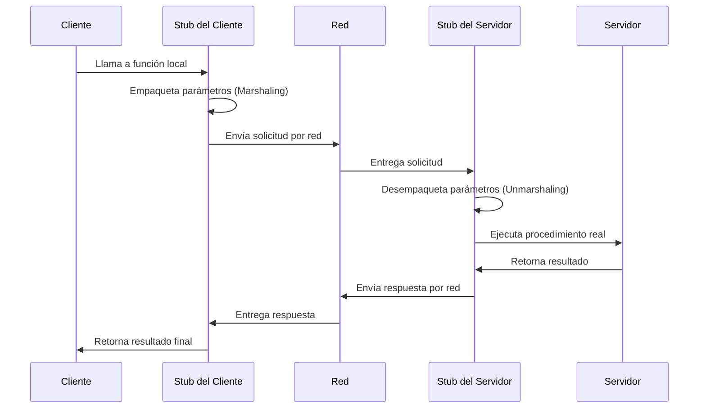

# Remote Procedure Call (RPC)

**RPC (Remote Procedure Call)** es un protocolo de red y mecanismo de comunicación que permite a un programa ejecutar procedimientos o funciones en otro espacio de direcciones, generalmente ubicado en una máquina remota, exactamente como si fueran llamadas a funciones locales. Este mecanismo facilita enormemente la comunicación y la coordinación entre programas distribuidos a lo largo de diferentes computadoras en una red, logrando ocultar casi por completo la complejidad intrínseca de la comunicación de red subyacente.

> [!info] Explicación: ¿Cómo funciona RPC?
> Cuando el cliente invoca una función remota, en la práctica está ejecutando un fragmento de código local denominado **"stub"**. Este stub tiene la responsabilidad de empaquetar los parámetros de la función (un proceso que se conoce técnicamente como **serialización** o **marshaling**), transmitirlos a través de la red utilizando sockets, y quedar a la espera de la respuesta. 
>
> En el lado del servidor, un stub correspondiente se encarga de desempaquetar los datos recibidos, ejecutar la función original y, finalmente, devolver el resultado al cliente siguiendo el proceso inverso. Entre los ejemplos modernos y ampliamente utilizados de RPC se encuentran **gRPC** (desarrollado por Google) y tRPC.

## Notas relacionadas
- [[computacion distribuida]]
- [[sockets]]
- [[servidores]]
