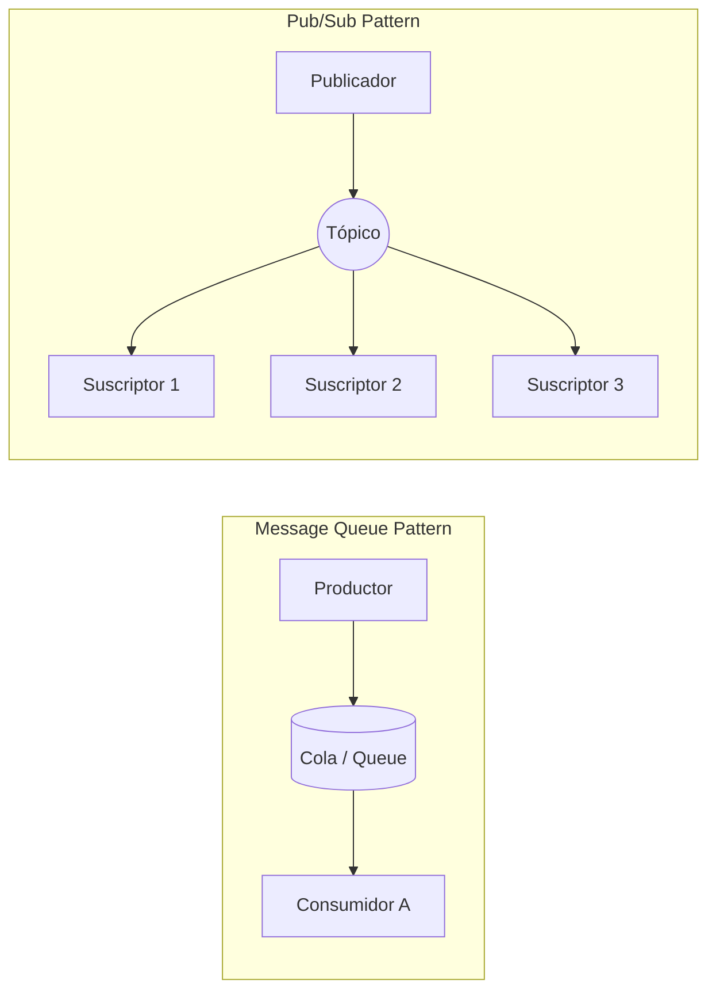

# Sistemas de Mensajería y Eventos

En entornos de [[computacion distribuida]], los múltiples nodos y servicios independientes frecuentemente requieren intercambiar datos, compartir flujos de información o notificarse mutuamente acerca de cambios críticos en sus estados operativos, todo esto sin generar dependencias de código o quedar fuertemente acoplados. Para solucionar este enorme desafío arquitectónico se emplean sistemas especializados de mensajería (comúnmente conocidos como *Message Brokers*).

## Patrones Comunes de Arquitectura

El intercambio de datos se estructura generalmente bajo ciertos paradigmas operativos consolidados en la industria:

- **Colas de Mensajes (Message Queues):** Un servicio emisor (remitente) despacha un mensaje dirigiéndolo directamente a una cola central; del otro lado, un servicio consumidor lo lee. Una vez que el mensaje es procesado con éxito, desaparece permanentemente de la cola. Este patrón garantiza una comunicación de naturaleza asíncrona y ayuda en gran medida a absorber picos repentinos de tráfico de red (proceso conocido como *Load Leveling*). 
  - *Ejemplo Tecnológico:* RabbitMQ, Amazon SQS.
- **Publicación/Suscripción (Pub/Sub):** En este patrón, un mensaje es emitido hacia un canal centralizado denominado "Tópico" (Topic). Todos y cada uno de los múltiples consumidores que se encuentren previamente suscritos a dicho tópico recibirán de forma simultánea e independiente una copia exacta del mismo mensaje.
  - *Ejemplo Tecnológico:* Apache Kafka, Google Cloud Pub/Sub, AWS SNS.

## Apache Kafka vs RabbitMQ

La elección de la herramienta debe alinearse con la naturaleza exacta del problema a resolver:

- **RabbitMQ:** Se fundamenta arquitectónicamente en colas inteligentes y reglas de enrutamiento muy complejas. Resulta una opción excelente cuando las políticas de la aplicación requieren saber con total exactitud si un mensaje específico fue procesado de manera exitosa (mediante *acknowledgement* o acuse de recibo), o cuando las lógicas de negocio para distribuir los mensajes a diferentes grupos de consumidores son excepcionalmente intrincadas.
- **Apache Kafka:** Su arquitectura se asemeja más a la de un "Log o registro de eventos distribuido" de naturaleza inmutable. Los flujos de eventos se almacenan secuencialmente en los discos duros físicos, y los consumidores se encargan de leerlos desde una posición numérica específica (denominada *offset*). Kafka es ridículamente escalable y está diseñado idealmente para procesar y absorber flujos masivos e ininterrumpidos de datos de alta velocidad (como telemetría de dispositivos IoT, transacciones financieras en tiempo real o registros lógicos de miles de servidores).

> [!info] Explicación Estratégica: Desacoplamiento Asíncrono
> La implementación estratégica de sistemas de mensajería habilita el verdadero **desacoplamiento** dentro de un ecosistema de [[Microservicios]]. A modo de ejemplo, si el servicio externo encargado del envío de correos electrónicos colapsa o pierde conexión temporal, el servicio central de registro de usuarios puede continuar operando con normalidad. Este último simplemente almacena la orden o petición lógica de "enviar correo de bienvenida al nuevo usuario" dentro de una cola segura. Una vez que el servicio de correo recupere su estabilidad y vuelva a estar en línea, procesará ordenadamente todos los mensajes que quedaron encolados, evitando la pérdida de información y garantizando una experiencia de usuario fluida.

## Notas relacionadas
- [[Microservicios]]
- [[Tolerancia a fallos]]
- [[Remote Procedure Call (rpc)]]
