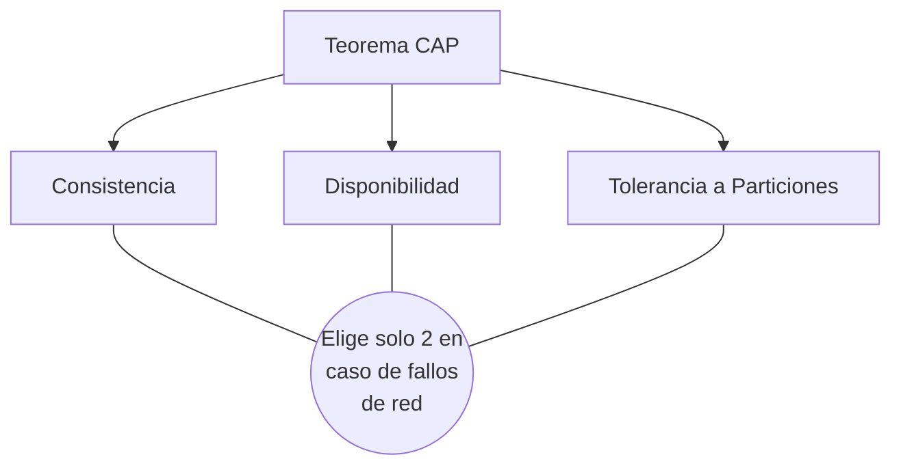

# Tolerancia a Fallos

La **Tolerancia a Fallos** se define como la capacidad integral de un sistema informático para continuar operando correctamente, posiblemente asumiendo un nivel de degradación en el rendimiento o prestando servicios reducidos, en lugar de sufrir un colapso sistémico o fallar completamente, cuando una o múltiples partes (ya sean fallos de componentes de hardware, módulos de software o enlaces de red) colapsan. Esta característica es considerada indudablemente como uno de los principios fundacionales e inamovibles de la moderna [[computacion distribuida]].

## Conceptos Clave

Para lograr un sistema verdaderamente resiliente, los arquitectos de software se apoyan fuertemente en tres pilares conceptuales críticos:

- **Replicación Estratégica:** Consiste en mantener de forma paralela y sincronizada copias múltiples de los mismos conjuntos de datos o de los procesos de cálculo distribuido en diversos nodos de red. Si un nodo primario experimenta una avería crítica, otro nodo secundario puede asumir automáticamente la carga de trabajo en milisegundos.
- **Redundancia Física y Lógica:** Refiere al despliegue deliberado de componentes y equipos adicionales que no son estrictamente necesarios para el funcionamiento cotidiano y normal, pero que se mantienen siempre disponibles en reserva activa para entrar en funcionamiento en caso de una catástrofe. Ejemplos de esta práctica incluyen configuraciones de discos duros en arreglo RAID o la implementación de múltiples fuentes de alimentación eléctrica redundantes en los centros de datos.
- **Consenso Distribuido:** En un ecosistema distribuido donde no existe un servidor maestro unánime, los nodos independientes deben poseer mecanismos algorítmicos robustos para lograr ponerse de acuerdo colectivamente sobre un valor específico o un estado transaccional determinado (por ejemplo, al elegir democráticamente un nuevo nodo líder, o al momento de decidir si se completa y aprueba definitivamente un *commit* de datos). Entre los algoritmos matemáticos más famosos y utilizados para lograr este consenso se encuentran protocolos históricos como Paxos y Raft, además de los conocidos protocolos transaccionales de Commit de 2 Fases (2PC).

## El Teorema CAP

Formulado por el informático Eric Brewer a finales de los noventa, el Teorema CAP establece dogmáticamente que en el diseño de cualquier sistema informático distribuido es matemáticamente imposible proporcionar simultáneamente, y al cien por ciento, las siguientes tres garantías operativas:

1. **Consistencia Estricta (Consistency):** Todos los nodos conectados dentro de la red perciben y devuelven matemáticamente los mismos datos actualizados, exactamente al mismo tiempo y ante cualquier lectura solicitada.
2. **Disponibilidad Alta (Availability):** El sistema mantiene una operatividad ininterrumpida, de manera tal que el sistema sigue funcionando e iterando velozmente. Como resultado, cada petición generada por un usuario final recibe invariablemente una respuesta exitosa que no sea de error.
3. **Tolerancia Plena a Particiones de Red (Partition tolerance):** El sistema distribuido sigue funcionando a pesar de que la infraestructura de red subyacente sufra, pierda mensajes silenciosamente o experimente cortes abruptos de comunicación entre distintos subgrupos de nodos en operación.

> [!info] Explicación Avanzada: Aplicación Práctica del Teorema CAP
> En la cruda realidad operativa de las infraestructuras a gran escala y de redes complejas, es obligatorio asumir por diseño que las fallas de comunicación y las divisiones de red invariablemente llegarán a ocurrir (por lo cual la Tolerancia a Particiones no resulta ser opcional, sino más bien obligatoria). De acuerdo al Teorema CAP, cuando un sistema confronta de manera imprevista una indeseable partición de red, se ve forzado lógicamente a tomar una decisión excluyente: 
> Debe priorizar, por una parte, asegurar fuertemente la Consistencia (rechazando las nuevas peticiones entrantes o bloqueando el sistema para prevenir lecturas de datos gravemente desactualizados), o bien optar por privilegiar al máximo la Disponibilidad (respondiendo forzosamente y de manera afirmativa con los datos que todavía posea a mano, aunque exista un gran riesgo de que estos no representen el estado más reciente, veraz y verificado del sistema).

## Notas relacionadas
- [[computacion distribuida]]
- [[Consistencia y replicacion]]
- [[servidores]]
- [[Balanceo de carga]]
