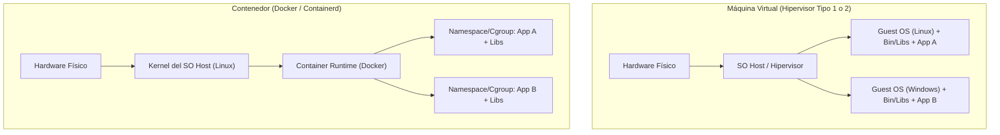

# Virtualización y Contenedores en Sistemas Distribuidos

En la ingeniería de sistemas distribuidos y computación moderna, el aislamiento y empaquetado de cargas de trabajo de cómputo es fundamental para garantizar portabilidad, escalabilidad elástica y reproducibilidad operativa.

> [!info] 💡 ¿Cómo entender esto desde cero? (Guía para novatos de pregrado)
> - **Máquina Virtual (La casa independiente):** Cada inquilino compra un terreno, construye cimientos, levanta paredes y contrata su propia policía y servicios (cada VM incluye un Sistema Operativo Invitado completo con su propio kernel de 4 GB o más). Es ultra seguro y completamente aislado, pero pesa cientos de gigabytes y tarda minutos en arrancar.
> - **Contenedor (El apartamento en un edificio):** Todos los inquilinos comparten el mismo edificio, las mismas tuberías maestras y la misma administración (comparten el **kernel del sistema operativo anfitrión** mediante *Namespaces* y *Cgroups* de Linux). Cada inquilino solo decora su espacio privado. Pesa pocos megabytes, arranca en milisegundos y consume una fracción de memoria RAM.

---

## 1. Comparativa Arquitectónica: VMs vs Contenedores

| Criterio | Máquinas Virtuales (VM) | Contenedores (Docker / OCI) |
| :--- | :--- | :--- |
| **Nivel de Aislamiento** | Nivel de Hardware (Hipervisor) | Nivel de Sistema Operativo (Kernel Linux) |
| **Kernel del SO** | Múltiples kernels independientes | Kernel único compartido del Host |
| **Tiempo de Inicio** | Minutos (arranque de BIOS y SO) | Milisegundos / Segundos |
| **Sobrecarga de Memoria** | Gigabytes por instancia | Megabytes por instancia |
| **Rendimiento I/O** | Penalización por emulación/hipervisor | Cercano a *Bare-Metal* nativo |
| **Portabilidad** | Archivos OVA/VHD pesados | Imágenes OCI multicapa ligeras |

---

## 2. Los Mecanismos Internos del Kernel de Linux

Los contenedores no son "magia", sino una combinación coordinada de primitivas nativas del kernel de Linux:

1. **Namespaces (Aislamiento de visión):** Determinan qué puede *ver* un proceso.
   - `PID`: Aísla el árbol de procesos (el contenedor se cree el PID 1).
   - `NET`: Aísla interfaces de red, tablas de rutas y puertos.
   - `MNT`: Aísla los puntos de montaje de sistemas de archivos.
   - `IPC`: Aísla la comunicación entre procesos (semáforos, memoria compartida).
   - `UTS`: Aísla nombres de host y dominio.
   - `USER`: Mapea UIDs del contenedor a UIDs sin privilegios en el host.
2. **Control Groups (cgroups - Aislamiento de recursos):** Determinan cuánto puede *consumir* un proceso.
   - Límites máximos de CPU (`cpu.max`).
   - Límites de memoria RAM (`memory.max`) para evitar que un contenedor hambriento cause *Out Of Memory* (OOM Killer) en todo el servidor.
   - Límites de I/O de disco y ancho de banda de red.
3. **OverlayFS (Union File Systems):** Sistema de archivos por capas de solo lectura (imágenes base) con una delgada capa superior de lectura/escritura efímera.

---

## 3. Rol en Microservicios y Cloud Native

En una arquitectura de [[Microservicios]], los contenedores son la unidad atómica de despliegue:
- Permiten que cada servicio esté programado en diferentes tecnologías (persistencia políglota y lenguajes mixtos).
- Orquestadores como **Kubernetes** gestionan el ciclo de vida, autoreparación (*self-healing*) y balanceo de carga automático de miles de contenedores distribuidos.

---

## Notas Relacionadas
- [[Microservicios]] — Arquitectura de servicios desacoplados empaquetados en contenedores.
- [[computacion distribuida]] — Principios de procesamiento a través de múltiples nodos.
- [[servidores]] — Infraestructura física y lógica de computación.
- [[Cloud computing]] — Modelos IaaS, PaaS y CaaS en la nube.
