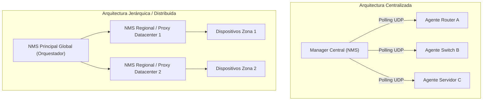
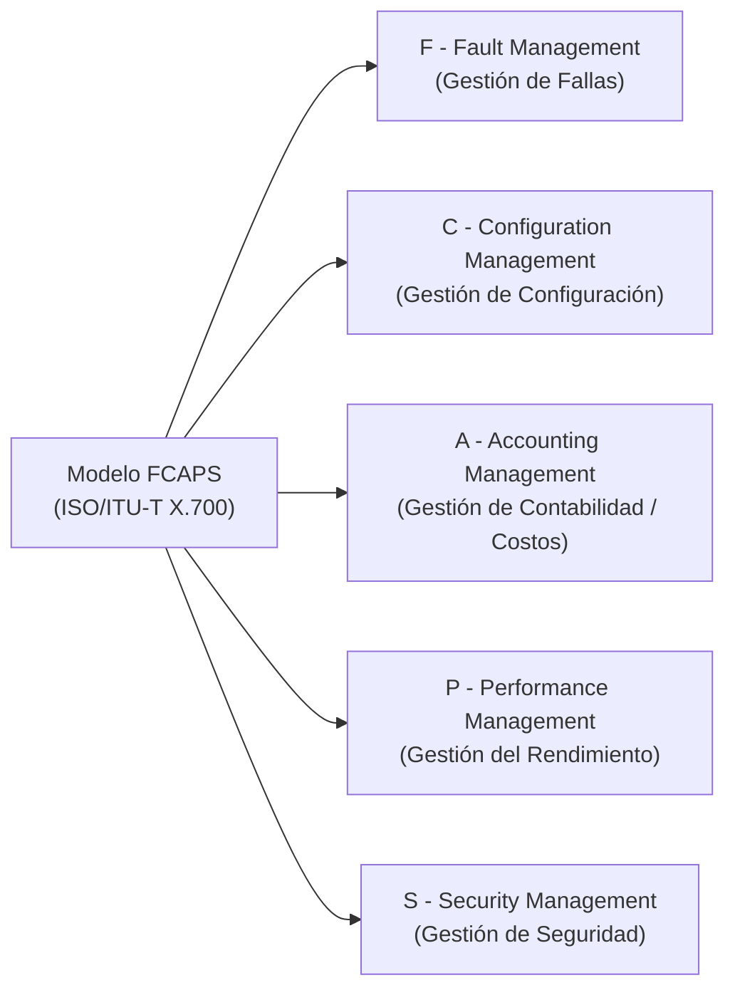
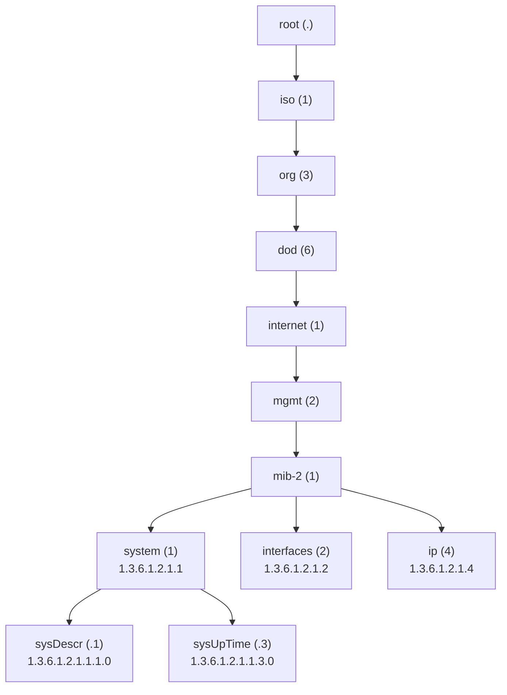
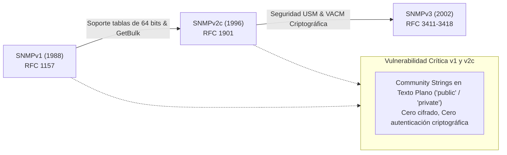
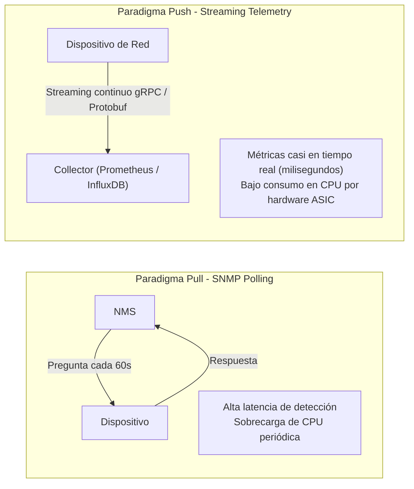

# Administración de Redes en Sistemas Distribuidos: Arquitectura, Modelo FCAPS y Protocolos de Telemetría

## Notas relacionadas
- [[computacion distribuida]]
- [[servidores]]
- [[sockets]]
- [[Historia del internet]]

---

## 1. Fundamentos y Arquitectura de la Administración de Redes

En los sistemas distribuidos de escala industrial (centros de datos, nubes públicas y redes corporativas heterogéneas), la **Administración y Gestión de Redes** engloba el conjunto sistemático de procesos operacionales, protocolos de comunicación, arquitecturas de software y herramientas de telemetría dedicadas a inicializar, monitorear, configurar y optimizar todos los recursos físicos y lógicos de conectividad.

Su meta operativa es garantizar acuerdos de nivel de servicio (**SLAs**) rigurosos, preservando una alta disponibilidad ($99.999\%$ o "cinco nueves"), baja latencia, máxima resiliencia ante contingencias y estricto cumplimiento de políticas de seguridad.

### 1.1 Modelos Topológicos de Gestión



* **Modelo Centralizado:** Una única estación de gestión de red (*Network Management Station* - **NMS**) interroga periódicamente a cada uno de los dispositivos administrados. Funciona bien en redes pequeñas o medianas, pero sufre de cuellos de botella por congestión de tráfico y consumo excesivo de CPU en grandes centros de datos.
* **Modelo Jerárquico / Distribuido:** Emplea recolectores intermedios (*Proxies* o *Mid-Level Managers*) que agregan telemetría localmente y solo transmiten eventos filtrados y métricas consolidadas a la consola central.

---

## 2. El Modelo Estándar de Gestión FCAPS (ISO / ITU-T X.700)

El marco normativo **FCAPS** establecido por la ISO descompone las responsabilidades operacionales de gestión de redes en 5 dominios conceptuales interdependientes:



### 2.1 F - Fault Management (Gestión de Fallas)
Tiene por objeto descubrir, aislar, correlacionar y subsanar anomalías operativas de hardware y software antes de que impacten a los usuarios finales:
* **Detección Activa vs Pasiva:** Polling continuo de disponibilidad (*Keep-Alives*, pings ICMP) frente a recepción pasiva de eventos asíncronos (*Traps* SNMP, eventos Syslog).
* **Correlación de Eventos y Análisis de Causa Raíz (RCA):** Algoritmos que determinan si la caída de 50 servidores virtuales se debe a la falla de un único enlace troncal de fibra óptica subyacente.
* **Métricas Operativas:** MTBF (*Mean Time Between Failures*) y MTTR (*Mean Time To Repair*).

### 2.2 C - Configuration Management (Gestión de Configuración)
Registra, coordina y aplica ajustes sobre dispositivos de red (tablas de ruteo, VLANs, ACLs, versiones de firmware):
* **Inventario de Activos (CMDB):** Registro exacto de hardware, números de serie, módulos y parches.
* **Infraestructura como Código (IaC):** Automatización mediante herramientas declarativas (Ansible, Terraform, Netmiko) evitando configuraciones manuales propensas al error humano por consola CLI.
* **Detección de Desviaciones (*Configuration Drift*):** Comparación continua entre la configuración operativa en ejecución (*running-config*) y la configuración base aprobada en repositorios Git.

### 2.3 A - Accounting Management (Gestión de Contabilidad y Costos)
Mide y audita el consumo de recursos de red por departamento, cliente o aplicación distribuida:
* **Métricas:** Volumen de bytes transmitidos, horas de enlace activo, uso de ancho de banda garantizado.
* **Modelos Financieros:** *Showback* (visibilidad y concientización del gasto en infraestructura) y *Chargeback* (facturación y asignación presupuestal precisa de costos de nube o transporte).

### 2.4 P - Performance Management (Gestión del Rendimiento)
Monitorea continuamente la calidad del servicio de red mediante indicadores clave de rendimiento (**KPIs**):
* **Throughput (Rendimiento Efectivo):** Tasa neta de datos útiles transferidos por segundo ($\text{Mbps} / \text{Gbps}$).
* **Latencia / Retardo (RTT - Round Trip Time):** Tiempo que tarda un paquete en viajar de origen a destino y recibir confirmación.
* **Jitter (Variación del Retardo):** Fluctuación estadística temporal en la llegada de paquetes consecutivos; factor destructivo para llamadas VoIP y streaming de video.
* **Tasa de Pérdida de Paquetes (*Packet Loss*):** Porcentaje de datagramas descartados por congestión de búfer en colas de switches/routers.
* **QoS (Quality of Service):** Mecanismos de priorización de paquetes basados en DiffServ (DSCP) o etiquetado MPLS.

### 2.5 S - Security Management (Gestión de Seguridad)
Controla el acceso y preserva la confidencialidad, integridad y disponibilidad del plano de red:
* **Marco AAA:** Autenticación, Autorización y Auditoría mediante protocolos centralizados como **RADIUS** y **TACACS+**.
* **Protección Perimetral:** Firewalls de próxima generación (NGFW), sistemas de detección/prevención de intrusiones (**IDS/IPS**), protección contra ataques de denegación de servicio distribuido (**DDoS**).
* **Cifrado de Enlaces:** Implementación de túneles IPsec, VPNs WireGuard o seguridad a nivel de enlace de datos (MACsec 802.1AE).

---

## 3. El Protocolo SNMP (Simple Network Management Protocol) en Detalle

**SNMP** es el protocolo de capa de aplicación (puertos UDP 161 y 162) más extendido históricamente para consultar y configurar dispositivos de red en entornos TCP/IP.

```mermaid
flowchart TD
    subgraph Manager_Station [Estación de Gestión - NMS]
        NMS["Network Management Station (NMS)<br/>Consola / Prometheus Exporter"]
    end

    subgraph Managed_Device [Dispositivo Administrado (Switch / Router)]
        Agent["Agente SNMP (Daemon)"]
        MIB["MIB (Management Information Base)<br/>Árbol Jerárquico de OIDs"]
        HW["Hardware del Dispositivo<br/>Interfaces, CPU, Memoria, Búferes"]
        
        Agent <--> MIB
        Agent <--> HW
    end

    NMS -->|1. GetRequest / GetNextRequest / GetBulkRequest / SetRequest<br/>UDP Port 161| Agent
    Agent -->|2. GetResponse<br/>UDP Port 161| NMS
    Agent -.->|3. Trap / InformRequest (Asíncrono)<br/>UDP Port 162| NMS
```

### 3.1 Componentes Arquitectónicos

1. **NMS (Network Management Station):** Estación central que aloja el software de gestión (ej. Zabbix, Nagios, Grafana SNMP Exporter), responsable de emitir consultas y procesar notificaciones.
2. **Dispositivo Administrado (*Managed Device*):** Elemento de hardware o software bajo supervisión (switch, router, firewall, servidor Linux/Windows, UPS).
3. **Agente SNMP (*SNMP Agent*):** Proceso demonio ligero residente en el dispositivo administrado que mantiene actualizada la telemetría del sistema y responde a las solicitudes del NMS.
4. **MIB (Management Information Base):** Base de datos virtual y estructurada jerárquicamente en forma de árbol que almacena las variables de estado y control del dispositivo. Cada variable se referencia mediante un **OID (Object Identifier)** numérico único universal estandarizado por el SMI (*Structure of Management Information*).



### 3.2 Operaciones del Protocolo y PDUs (Protocol Data Units)

| Operación / PDU | Dirección | Puerto UDP | Propósito y Comportamiento |
| :--- | :---: | :---: | :--- |
| **`GetRequest`** | NMS $\to$ Agente | 161 | Solicita el valor de uno o varios OIDs específicos y exactos. |
| **`GetNextRequest`** | NMS $\to$ Agente | 161 | Solicita el siguiente OID lexicográfico en el árbol MIB (permite iterar tablas secuencialmente con `snmpwalk`). |
| **`GetBulkRequest`** | NMS $\to$ Agente | 161 | *(Introducido en SNMPv2)* Solicita múltiples registros sucesivos en un solo paquete UDP, reduciendo drásticamente el overhead en tablas grandes. |
| **`SetRequest`** | NMS $\to$ Agente | 161 | Modifica o asigna el valor de una variable configurable en el agente (ej. apagar administrativamente un puerto de switch). |
| **`GetResponse`** | Agente $\to$ NMS | 161 | Respuesta síncrona que transporta los valores de las variables consultadas o el código de confirmación/error. |
| **`Trap`** | Agente $\to$ NMS | 162 | Notificación asíncrona no solicitada enviada de inmediato cuando ocurre un suceso crítico (ej. caída de interfaz, reinicio no programado). **No requiere acuse de recibo** (no confiable). |
| **`InformRequest`** | Agente $\to$ NMS | 162 | Notificación asíncrona que **exige explícitamente una respuesta de confirmación (`GetResponse`)** del NMS. Si no llega acuse, el agente reintenta el envío. |

---

### 3.3 Evolución de Versiones y Seguridad Criptográfica



1. **SNMPv1 (RFC 1157):** Versión fundacional. Insegura por diseño: utiliza *Community Strings* transmitidas en texto plano sin cifrado. Contadores limitados a enteros de 32 bits (enlaces gigabit desbordan los contadores de bytes en pocos segundos).
2. **SNMPv2c (RFC 1901–1908):** Introduce tipos de datos de 64 bits (`Counter64`), el PDU optimizado `GetBulkRequest` y códigos de error enriquecidos. Retiene el uso inseguro de contraseñas en texto claro (*Community Strings*).
3. **SNMPv3 (RFC 3411–3418):** Introduce una arquitectura completa de seguridad modular basada en el modelo de seguridad por usuario (**USM** - *User-Based Security Model*) y control de acceso basado en vistas (**VACM**):
   - **Niveles de Seguridad:**
     * `noAuthNoPriv`: Sin autenticación ni cifrado (similar a v2c pero con usuarios).
     * `authNoPriv`: Autenticación con verificación de integridad de mensajes mediante **HMAC-MD5**, **HMAC-SHA-1** o **SHA-256** (previene spoofing y manipulación de paquetes).
     * `authPriv`: Máxima seguridad. Añade cifrado simétrico robusto de los datos mediante **DES**, **3DES**, **AES-128**, **AES-192** o **AES-256** (garantiza confidencialidad contra escuchas no autorizadas).

---

## 4. Paradigmas Modernos: De SNMP Polling a Telemetría de Red y SDN

Aunque SNMP sigue vigente en dispositivos heredados, las infraestructuras de centros de datos y telecomunicaciones de alta velocidad han migrado hacia enfoques más escalables y reactivos:



### 4.1 Principales Tecnologías de Monitoreo Contemporáneo
* **Syslog Estandarizado (RFC 5424):** Protocolo para transmisión de eventos y logs en tiempo real hacia servidores centralizados (Elasticsearch, Logstash, Kibana - ELK, o Grafana Loki), clasificados en 8 niveles de severidad (0: *Emergency*, 1: *Alert*, ..., 7: *Debug*).
* **NetFlow, sFlow e IPFIX:** Monitoreo y exportación a nivel de flujos de tráfico (capas 3 y 4: IP origen/destino, puerto origen/destino, protocolo). Vital para análisis de ciberseguridad forense, detección de ataques DDoS y auditoría de consumo de enlaces.
* **Telemetría de Red Streaming (Model-Driven Telemetry):** Los switches y routers emiten flujos continuos de métricas serializadas mediante **Protocol Buffers (Protobuf)** a través de conexiones seguras basadas en **gRPC** (usando modelos estructurados **YANG** y el protocolo **gNMI** - *gRPC Network Management Interface*).
* **Observabilidad Cloud-Native con Prometheus + Grafana:**
  - Los recolectores o *Exporters* (SNMP Exporter, Node Exporter) exponen métricas en formato clave-valor indexado por etiquetas (*labels*).
  - **Prometheus** ejecuta *scraping* eficiente almacenando series de tiempo (*TSDB*).
  - **Grafana** renderiza paneles en tiempo real y dispara alertas automatizadas hacia canales como Slack, PagerDuty o Webhooks.
* **Redes Definidas por Software (SDN - Software-Defined Networking):** 
  Desacopla el plano de datos (*Data Plane* - reenvío de paquetes por ASICs) del plano de control (*Control Plane* - algoritmos de ruteo y políticas de gestión). Un controlador centralizado (ej. OpenDaylight, ONOS) programa dinámicamente el comportamiento de los switches de la red mediante protocolos abiertos como **OpenFlow**, **NETCONF** o **RESTCONF**.
