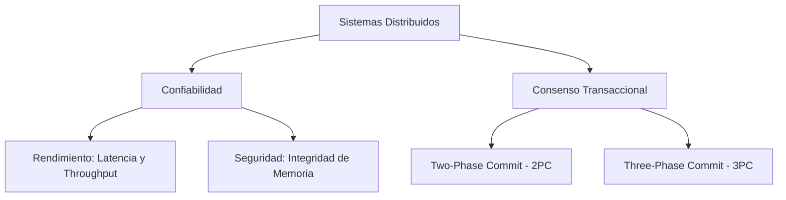

# Introducción a la Computación Distribuida

La computación distribuida aborda la complejidad de orquestar el **procesamiento**, el **almacenamiento** y las operaciones de **entrada/salida (I/O)** a través de múltiples nodos independientes que colaboran en red para resolver problemas complejos a gran escala.

## Notas relacionadas
- [[sockets]]
- [[Remote Procedure Call (rpc)]]
- [[servidores]]
- [[peer to peer]]
- [[tiempo de respuesta vs Throughput]]

## Fundamentos de Comunicación en Red

Los **sockets** representan la piedra angular de esta arquitectura. Establecen las conexiones físicas y lógicas, y asocian las direcciones de red a los procesos. En el fondo, absolutamente toda comunicación en red utiliza sockets, ya que constituyen la interfaz de bajo nivel estándar proporcionada directamente por el sistema operativo.

> [!info] Explicación: Sockets en Computación Distribuida
> Los **sockets** son la abstracción fundamental para la comunicación bidireccional en red a nivel del sistema operativo. Estos componentes de software permiten que procesos independientes, alojados en máquinas físicamente diferentes (o incluso dentro del mismo host), intercambien y envíen ráfagas de datos de forma altamente estandarizada utilizando protocolos robustos como TCP o UDP. Debido a esto, son la base indiscutible sobre la cual se construye toda la computación distribuida.

## Computación Semi-centralizada y Distribuida

La computación tradicional, de naturaleza centralizada o secuencial, opera bajo estructuras de control sumamente estrictas. Sigue un orden parcial y lineal de ejecución de instrucciones. En principio, al respetarse rigurosamente ese orden monolítico, el espacio para lograr un paralelismo puro se vuelve inexistente o muy limitado.

A nivel de sistema operativo, un proceso individual representa un espacio de direcciones de memoria unificado y aislado.
Una **computación distribuida** nace formalmente en el momento en que se separan física o lógicamente estos datos y flujos de ejecución.
Es importante destacar que se puede lograr una arquitectura de computación distribuida ejecutando simplemente dos procesos informáticos diferentes y comunicados entre sí dentro de la misma computadora física.

Para que el sistema sea útil, todos los nodos involucrados deben cooperar activamente. Sin embargo, este entorno introduce el gran problema de la desconfianza: ¿es la red y el otro nodo verdaderamente confiable?
La confiabilidad en sistemas distribuidos se cuantifica mediante métricas estrictas:
* **Rendimiento Operativo:** Se mide utilizando indicadores como el tiempo de respuesta (*latency*) y el caudal de procesamiento (*throughput*), factores que determinan el costo operativo del sistema.
* **Seguridad de la Información:** Se basa en la tríada clásica de Confidencialidad, Integridad y Disponibilidad.

El mayor desafío técnico radica en que cada uno de los nodos posee y administra su propia memoria privada. Por consiguiente, siempre existe el problema latente de incertidumbre y desconfianza, ya que un nodo nunca sabe con absoluta certeza si el otro nodo de la red le está enviando el dato correcto o si ha sufrido un fallo silencioso.

> [!info] Explicación: Computación Distribuida y Confiabilidad
> La **Computación Distribuida** se refiere al ecosistema donde múltiples nodos informáticos (computadoras físicas, contenedores o procesos lógicos) trabajan juntos en armonía. Coordinan sus acciones exclusivamente mediante un flujo constante de paso de mensajes con el fin de lograr un objetivo de procesamiento común. 
> - **Paralelismo vs Distribución:** Mientras que el paralelismo computacional clásico suele referirse a arquitecturas que operan sobre una memoria de hardware compartida de muy alta velocidad, la distribución implica obligatoriamente una memoria aislada y separada por cada nodo, conectados a través de una red propensa a errores.
> - **Desafíos Principales:** El desarrollo distribuido debe superar obstáculos formidables, destacando la sincronización de relojes, la tolerancia a fallos de hardware o cortes de red (¿qué medidas tomar si un nodo crítico colapsa repentinamente?), y el delicado problema de la consistencia de datos (asegurar criptográficamente que todos los nodos vean y repliquen la misma versión de la información).

## Protocolos de Consenso Transaccional

Para resolver problemas de inconsistencia, se aplican estrategias rigurosas de confirmación (*commit*). Las arquitecturas varían desde modelos centralizados hasta descentralizados, operando con actualizaciones síncronas o asíncronas entre distintas regiones.

> [!info] Explicación: Protocolos de Commit (2PC y 3PC)
> El **Two-Phase Commit (2PC)** es un afamado algoritmo distribuido diseñado para asegurar que absolutamente todos los nodos involucrados en un clúster apliquen exitosamente una transacción compleja o, en caso de cualquier fallo, la descarten por completo (garantizando así el principio de Atomicidad). El protocolo se divide rígidamente en una fase de preparación (se interroga a los nodos si están listos para hacer *commit*) y una fase de decisión final (ejecutar definitivamente el *commit* o abortar la operación). 
> Su evolución, el **Three-Phase Commit (3PC)**, añade inteligentemente una fase extra intermedia diseñada específicamente para prevenir y evitar bloqueos paralizantes e indefinidos en la red en caso de que el nodo coordinador sufra un colapso catastrófico.

*(Conceptos históricos relacionados: teletype, interfaces estándar de entrada/salida como el descriptor 0 para teclado y 1/2 para pantalla. Protocolos arcaicos como Telnet funcionaban como un teletype operando sobre la red. Conceptos asociados a fallos: segmentation fault en C/C++, Infraestructuras de Clave Pública PKI).*

## Aplicación Práctica: Data Engineering Freelance

Esta teoría fundacional se aplica de manera intensiva en las arquitecturas Big Data modernas:
- [[Obsidian/freelance/Data Engineering/Spark/01 Arquitectura y procesamiento distribuido|01 Arquitectura y procesamiento distribuido]] — Detalla la arquitectura subyacente de Apache Spark y la relación jerárquica existente entre los procesos ejecutores, las tareas y las particiones distribuidas.
