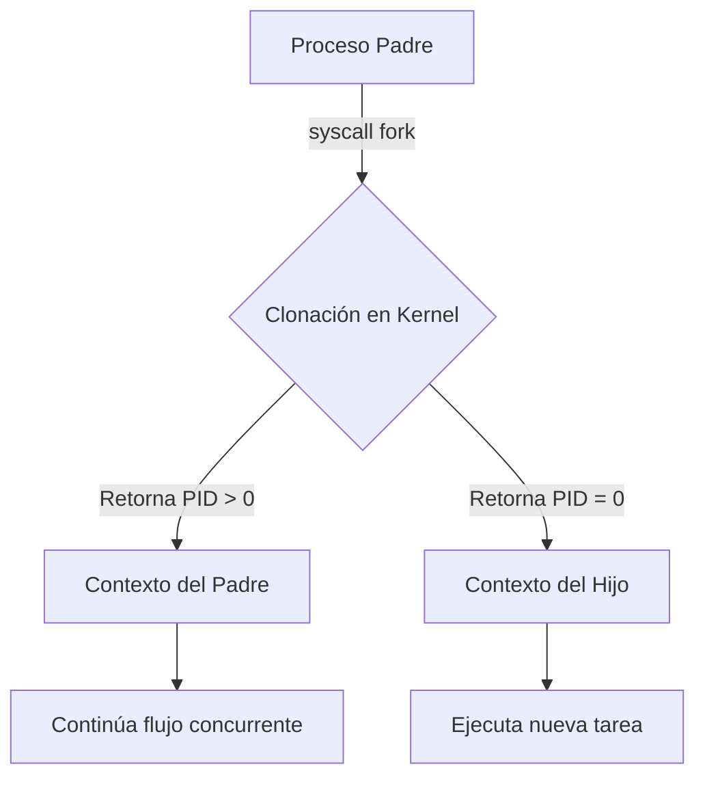

# Servidores y Procesos Concurrentes

¿Cómo podríamos proteger a un servidor basado en el protocolo UDP y de naturaleza iterativa contra letales ataques de denegación de servicio distribuido (DDoS)? Dado que los servidores UDP no establecen una sesión de conexión persistente y verificada como lo hace TCP, la tarea de detectar y mitigar eficazmente los intentos de inundación masiva de paquetes y ataques maliciosos representa un desafío enorme en la administración de sistemas.

> [!info] Explicación Estratégica: Mitigación de DDoS en UDP
> A diferencia directa del protocolo TCP, donde la fase inicial del *Three-Way Handshake* permite verificar que la dirección IP de origen es real y legítima antes de que el servidor comprometa recursos pesados de memoria, UDP es por definición un protocolo sin estado (*stateless*). Esta debilidad intrínseca facilita enormemente la ejecución de ataques de amplificación y de inundación (*flood*). Para mitigar estos riesgos en arquitecturas de red reales, es vital implementar tácticas como:
> - **Escalabilidad y Balanceo:** Optar por escalar verticalmente el hardware (aumentar capacidad de CPU y red del servidor) o emplear técnicas de enrutamiento como DNS Round Robin para distribuir inteligentemente el tráfico de ataque a través de una granja de diversas IPs públicas.
> - **Rate Limiting:** Imponer estrictos límites sobre la cantidad máxima de paquetes UDP procesados o aceptados por segundo provenientes desde una misma dirección IP fuente.
> - **Firewalls y WAF:** Bloquear proactivamente patrones de tráfico anómalo en la capa de red o, idealmente, utilizar robustos servicios de mitigación perimetral a nivel mundial (por ejemplo, Cloudflare o AWS Shield).
> - **Descarte de paquetes malformados:** Es imperativo mantener el kernel del sistema operativo siempre actualizado con los últimos parches de seguridad para evitar caídas por vulnerabilidades históricas, tales como el infame ataque del *Ping of Death*.

## Conceptos Fundamentales de Servidores y Sistemas Operativos

La arquitectura de un servidor robusto se basa en la correcta gestión concurrente de sus recursos:

- **Pool de Hilos (Thread Pool):** Crear y destruir un hilo nuevo para atender cada solicitud entrante consume demasiado tiempo de CPU. Para optimizar radicalmente el rendimiento, el sistema reutiliza un conjunto preexistente de hilos inactivos ubicados en un "pool", asignándolos dinámicamente conforme llegan las solicitudes.
- **Tabla de Descriptores de Archivo Abiertos:** El kernel del sistema operativo rastrea y maneja absolutamente todas las operaciones de entrada y salida (I/O) de los procesos mediante descriptores. Por configuración predeterminada en sistemas Unix, todo proceso nuevo arranca poseyendo tres descriptores fundamentales: Standard Input (descriptor 0), Standard Output (descriptor 1) y Standard Error (descriptor 2).
- **Tabla de Señales:** Es una estructura interna utilizada por el kernel para permitir la comunicación asíncrona entre procesos independientes y notificaciones críticas del sistema operativo (por ejemplo, enviar una señal SIGTERM o SIGKILL para terminar forzosamente un proceso).
- **Programación Concurrente:** Diseñar software que se ejecute en concurrencia constituye un enorme desafío de ingeniería debido a la altísima probabilidad de generar condiciones de carrera (*Race Conditions*) que corrompen la memoria, o posibles bloqueos mutuos paralizantes (*Deadlocks*).
- **Llamadas Bloqueantes (Blocking Calls):** La gran mayoría de las llamadas al sistema (syscalls) dirigidas al kernel son de naturaleza síncrona. Esto significa que el sistema operativo bloqueará deliberadamente la ejecución del hilo invocador, poniéndolo a dormir temporalmente, hasta que la costosa operación de I/O solicitada finalice.

## Creación de Procesos y Clonación (Fork)

En los sistemas POSIX y distribuciones de Linux, la famosa llamada al sistema `fork()` desencadena la clonación exacta del proceso actual, duplicando su espacio de memoria.

- Inmediatamente después de ejecutar el `fork()`, el hilo de ejecución se bifurca. Si el valor devuelto en la variable `pid` es exactamente igual a `0`, esto le indica al código que se está ejecutando en el contexto del nuevo proceso **hijo**.
- Por el contrario, si el valor devuelto `pid > 0`, indica que el código sigue ejecutándose dentro del proceso **padre**, y el valor devuelto corresponde precisamente al identificador de proceso (PID) del recién creado proceso hijo.



> [!warning] Peligro Crítico: Actualizaciones Perdidas
> En entornos altamente concurrentes, cuando varios procesos o hilos de software independientes intentan acceder y modificar los mismos registros de memoria o datos simultáneamente sin haber implementado mecanismos estrictos de sincronización y exclusión mutua (tales como bloqueos *mutex* o semáforos), se producen invariablemente "actualizaciones perdidas". Esto deriva de manera directa en la corrupción catastrófica de los datos almacenados.

*Ejemplo ilustrativo de script para probar e identificar condiciones de concurrencia inestable en bash:*
```bash
for i in {1..20}; do 
    rm f2; 
    ./fileconc f2 padre hijo; 
    sleep 2; 
    more f2;
done
```
*(Nota Técnica: A nivel teórico estricto, es importante no confundir jamás los conceptos lógicos de concurrencia con los del paralelismo físico real de múltiples núcleos).*

## Notas relacionadas
- [[sockets]]
- [[Remote Procedure Call (rpc)]]
- [[administracion de redes]]
- [[computacion distribuida]]
