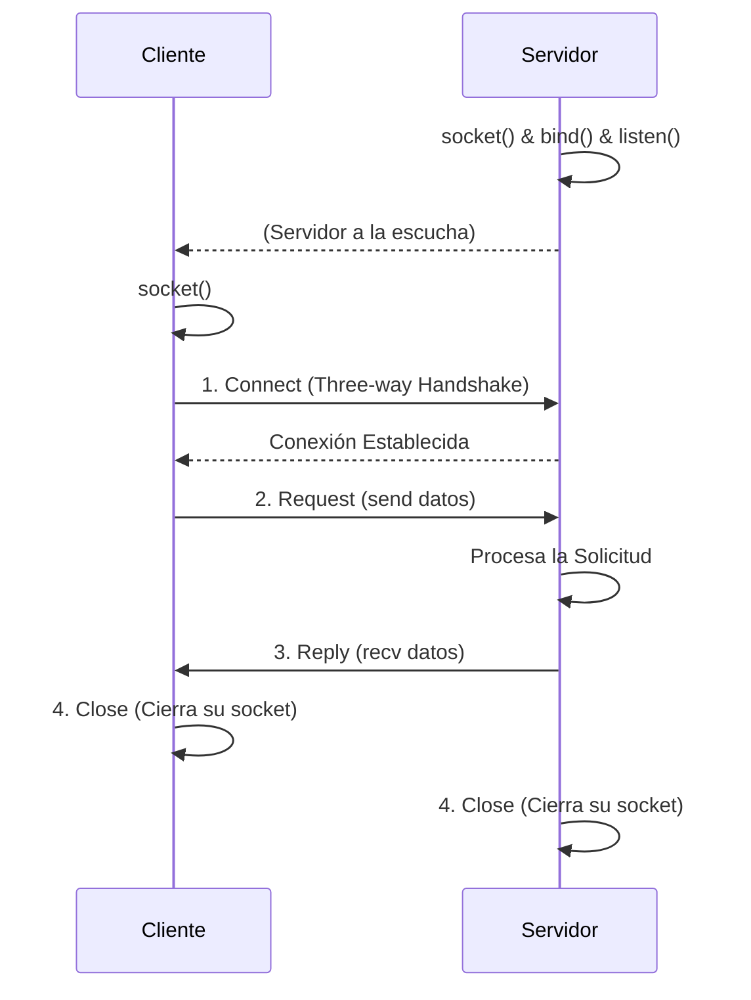

# Sockets y Programación de Red

La API de **sockets** es el componente de software fundamental que define exactamente cómo las aplicaciones interactúan y utilizan la infraestructura de red subyacente. Esta poderosa interfaz de programación permite que múltiples aplicaciones se comuniquen fluidamente entre sí, operando a través de diferentes hosts y computadoras a nivel mundial. Su valor radica en que logra esconder casi por completo de los desarrolladores todos los complejos y áridos detalles de la transmisión física de la red (como el enrutamiento y fragmentación IP, o la gestión del hardware de los routers). En esencia, el propósito primario de usar la API de sockets es proporcionar un canal estándar y universal para que los procesos de software puedan dialogar.

> [!info] Explicación Técnica: ¿Qué es exactamente un Socket?
> En términos operativos muy simples, un **socket** puede visualizarse como un "enchufe" virtual lógico o un punto final (*endpoint*) de comunicación bidireccional. 
> 
> A nivel de implementación del sistema, está definido inequívocamente por la conjunción de una dirección IP (que identifica a la máquina) y un número de puerto (que identifica al proceso de aplicación específico corriendo dentro de dicha máquina). El kernel del sistema operativo expone esta interfaz precisamente para que los programadores de software no tengan que lidiar con la inmensa complejidad que supondría construir las cabeceras y verificar los checksums de los paquetes de red a nivel binario.

## El Modelo de Aplicación

La arquitectura y configuración más universalmente adoptada es, sin duda, el modelo Cliente-Servidor:

1. **La aplicación Servidora:** Activa un socket que permanece constantemente a la escucha (*listening*) de conexiones, recibe las solicitudes entrantes, procesa la información y retorna una respuesta formateada.
2. **La aplicación Cliente:** Crea un socket local, envía proactivamente una solicitud estructurada dirigida a la IP y puerto del servidor, y espera bloqueada hasta recibir los datos de respuesta.

![[Pasted image 20240520223126.png]]

Este sencillo y elegante modelo básico constituye la columna vertebral absoluta para una infinidad de aplicaciones críticas, abarcando desde servicios primitivos de transferencia de archivos (como FTP), la arquitectura masiva de la World Wide Web (a través de HTTP), hasta servicios básicos de monitoreo de eco (Echo).

## La API de Sockets

Para poder escribir y compilar código de red robusto, los desarrolladores precisan de una interfaz programática concreta (API), a través de la cual múltiples aplicaciones que se ejecutan concurrentemente en un host puedan interactuar simultáneamente con la tarjeta de red.

- A nivel conceptual, los sockets representan la abstracción lógica principal requerida para utilizar y programar las redes de computadoras modernas.
- Se utilizan ubicuamente y son la base de la inmensa mayoría de aplicaciones de internet modernas que utilizamos a diario.
- Están disponibles de forma ubicua y se encuentran implementados de forma nativa en prácticamente la totalidad de los sistemas operativos comerciales (Unix, Windows, Linux, macOS) y en casi todos los lenguajes de programación modernos (C, Python, Java, Go).

Existen principalmente dos tipos de servicios fundamentales de red que provee la API clásica de sockets:

- **Streams (basados en TCP):** Transmite y entrega un flujo continuo de bytes de manera **estrictamente confiable**, totalmente ordenada y orientada a conexión. A través de acuses de recibo transparentes, este mecanismo garantiza a nivel de protocolo que todos los datos emitidos lleguen a su destino intactos y sin pérdida de fragmentos.
- **Datagramas (basados en UDP):** Despacha mensajes separados e independientes de manera **no confiable** y sin establecer una conexión previa (sin *handshake*). Si bien su sobrecarga y latencia es considerablemente menor, resultando mucho más rápido, no ofrece ninguna garantía de que los paquetes lleguen en su orden original, o siquiera de que logren llegar a su destino.

Desde la perspectiva del sistema operativo, los sockets permiten que las aplicaciones en espacio de usuario se "adjunten" a la red local anclándose lógicamente a diferentes puertos numéricos específicos (por ejemplo, asignando el puerto 80 para tráfico HTTP sin cifrar, o el puerto 443 para conexiones seguras HTTPS). En definitiva, la API de sockets ejerce como un puente traductor intermedio de altísimo rendimiento entre el código de la aplicación de usuario y la compleja pila de protocolos de red implementada dentro del espacio protegido del kernel, utilizando complejas estructuras de datos internas administradas y monitorizadas celosamente por el propio sistema operativo.

![[Pasted image 20240520224457.png]]

## Ciclo de Vida y Flujo Básico TCP

El patrón estandarizado para establecer y consumir un flujo de datos confiable involucra los siguientes pasos lógicos:

1. **Connect:** El cliente invoca la llamada al sistema para establecer una conexión formal y sincronizada con el servidor (proceso conocido como *three-way handshake*).
2. **Request:** Utilizando el socket conectado, el cliente envía o empuja su bloque de datos o solicitud hacia el buffer de red.
3. **Reply:** El servidor, al detectar y procesar los bytes entrantes, formatea y despacha la respuesta correspondiente de vuelta a través de la misma conexión TCP persistente.
4. **Close:** Una vez finalizado el intercambio de información, ambas partes invocan el cierre ordenado del socket para liberar los limitados descriptores de archivo y puertos asignados en el sistema operativo.

## Notas relacionadas
- [[Http introduccion]]
- [[Remote Procedure Call (rpc)]]
- [[servidores]]
- [[computacion distribuida]]
