# Capítulo 1: Fundamentos de la Empresa, Organización y TICs

> [!info] 💡 ¿Cómo entender esto desde cero? (Guía para novatos de pregrado)
> Imagina a una empresa como un **organismo biológico complejo** (un cuerpo humano):
> 1. **El Cerebro y la Mente (Nivel Estratégico - Directorio y C-Level):** Determinan a dónde ir, evalúan peligros a largo plazo y fijan el rumbo vital.
> 2. **Los Órganos y Músculos (Áreas Funcionales):** Finanzas bombea el capital (sangre), Operaciones fabrica y ejecuta el movimiento, Ventas consigue los nutrientes del exterior y Talento Humano cuida la salud celular del organismo.
> 3. **El Metabolismo (Procesos de Negocio):** Es el flujo ordenado que toma insumos (comida/oxígeno), los transforma químicamente añadiendo valor y produce energía (bienes y servicios) desechando desperdicios. Si un proceso falla, el órgano se atrofia.
> 4. **El Sistema Nervioso Central y Periférico (Área de TICs):** Conecta cada célula, sensor y músculo con el cerebro. Transmite impulsos eléctricos (datos) a la velocidad de la luz, coordina los movimientos involuntarios (automatizaciones) y permite al cerebro tomar decisiones conscientes basadas en lo que siente en tiempo real. 
> 
> Una empresa sin TICs contemporáneas es un organismo desconectado, paralizado o ciego; pero una infraestructura de TICs sin alineamiento con el negocio es un sistema nervioso hiperactivo que dispara espasmos descontrolados sin ningún propósito vital.

---

## 1.1 La Empresa y su Estructura Fundamental

### 1.1.1 Definición Formal de Empresa y su Rol en la Economía

Desde la teoría económica y la ciencia de la administración, la **empresa** se define formalmente como una **unidad económico-social integrada por elementos humanos, materiales, financieros y tecnológicos**, organizada formalmente para la transformación de insumos en bienes o servicios, orientada a satisfacer necesidades de un mercado específico y generar valor económico y social dentro de un entorno de riesgo e incertidumbre.

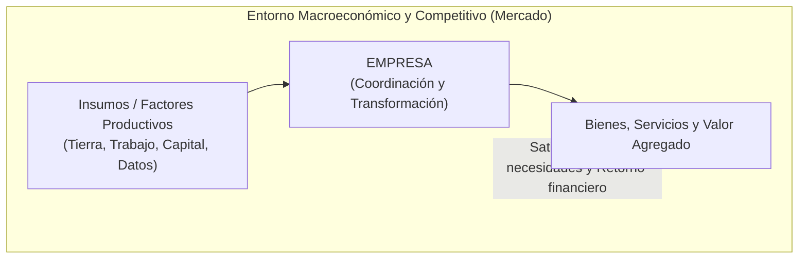

#### El Rol Económico y la Teoría de los Costos de Transacción
En la economía de mercado, la empresa desempeña funciones vitales:
1. **Creación de Valor Agregado (*Value Creation*):** Transforma recursos de bajo valor relativo en productos o servicios cuya utilidad marginal percibida por el consumidor supera la suma de los costos individuales de sus componentes.
2. **Coordinación Económica:** En su seminal trabajo *The Nature of the Firm* (1937), el premio Nobel **Ronald Coase** demostró que las empresas existen porque realizar transacciones en el mercado abierto no es gratuito; existen **costos de transacción** (búsqueda de información, negociación de contratos, supervisión del cumplimiento y resolución de disputas). La empresa internaliza estas operaciones bajo una jerarquía formal cuando el costo administrativo interno es menor que el costo de transaccionar en el mercado libre.
3. **Distribución de Riqueza:** Genera empleo formal, remunera al capital invertido, adquiere bienes de proveedores locales e internacionales y contribuye al gasto público mediante tributos.
4. **Impulso de la Innovación (Destrucción Creativa):** Siguiendo a **Joseph Schumpeter**, la empresa es el vehículo principal para la innovación tecnológica y de procesos, reemplazando viejos paradigmas mediante saltos productivos continuos.

---

### 1.1.2 Clasificación Taxonómica de las Empresas

Las organizaciones se clasifican bajo criterios estandarizados que condicionan directamente su arquitectura tecnológica, requerimientos regulatorios y volumen de inversión en TICs:

| Criterio Taxonómico | Categorías | Características Clave y Dinámica Operativa | Relevancia e Impacto en TICs |
| :--- | :--- | :--- | :--- |
| **Por Actividad Económica** | **Sector Primario** (Extractivo) | Agricultura, ganadería, minería, pesca y explotación forestal. Explotación directa de recursos naturales sin transformación sustancial. | Telemetría, sensores IoT en campo, geolocalización satelital y drones para agricultura de precisión o monitoreo de extracción minera. |
| | **Sector Secundario** (Industrial / Manufacturero) | Transformación física o química de materias primas en bienes semielaborados o terminados (automotriz, alimentos, textil). | Sistemas ciberfísicos, SCADA, MES (*Manufacturing Execution Systems*), robótica industrial e integración IT/OT (*Industrial Internet of Things*). |
| | **Sector Terciario** (Servicios) | Provisión de actividades intangibles (banca, salud, educación, hotelería, logística, consultoría). | Plataformas web, portales transaccionales de autoservicio, ERPs de servicios, CRMs analíticos y aplicaciones móviles orientadas al cliente. |
| | **Sector Cuaternario** (Conocimiento / Información) | Generación, procesamiento y distribución de información, I+D+i, consultoría de software, biotecnología y analítica avanzada. | Nube nativa (*Cloud-native*), pipelines de *Machine Learning*, arquitecturas de microservicios, seguridad criptográfica y gestión de patentes de software. |
| **Por Propiedad del Capital** | **Empresa Privada** | Capital aportado en su totalidad por inversionistas particulares. Maximización de rentabilidad, supervivencia de mercado y retorno de inversión. | Foco en eficiencia de costos (TCO), retorno de inversión rápida (ROI de TICs), agilidad competitiva y ventaja diferenciadora en el mercado. |
| | **Empresa Pública** | Capital de propiedad estatal o gubernamental. Prioridad en la rentabilidad social, cobertura universal y provisión de servicios públicos esenciales. | Cumplimiento estricto de leyes de contratación pública, interoperabilidad gubernamental, transparencia, código abierto y trámites ciudadanos digitales (*E-Government*). |
| | **Empresa Mixta** | Concurrencia coordinada de capital público y privado. | Gobernanza híbrida, auditorías duales, sistemas con estrictos controles de cumplimiento financiero y estatal. |

#### Clasificación por Tamaño Empresarial
La clasificación por dimensión varía ligeramente según el marco normativo (p. ej., CAN, Unión Europea, Banco Mundial o INEC/SRI en Ecuador). Los tres parámetros universales son: **número de trabajadores contratados**, **volumen de facturación anual** y **valor contable de los activos totales**.

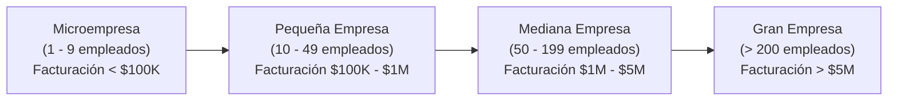

- **Microempresa:** Estructuras planas, informalidad en procesos, uso de herramientas ofimáticas genéricas (hojas de cálculo) y aplicaciones SaaS de bajo costo. Rara vez cuentan con personal dedicado a TICs.
- **Pequeña Empresa:** Nacimiento de la necesidad de control; adopción de ERPs básicos monolíticos en la nube (ej. Odoo, Zoho), soporte técnico terciarizado (*outsourcing*).
- **Mediana Empresa:** Existencia de un departamento formal de TICs (1 a 5 personas). Infraestructura híbrida (nube + local), necesidad de estandarización documental e inicio de políticas de ciberseguridad formales.
- **Gran Empresa / Corporación:** Departamentos de TICs robustos (decenas a cientos de especialistas), división interna (Infraestructura, DevOps, Ciberseguridad, Datos), marcos de gobernanza formal (COBIT, ITIL, ISO 27001), sistemas distribuidos de alta disponibilidad y presupuestos tecnológicos multimillonarios.

---

### 1.1.3 Objetivos Organizacionales: Dimensiones y Niveles

Una empresa no persigue un único fin; se rige por un **vector multidimensional de objetivos** que deben mantenerse en equilibrio homeostático para garantizar su viabilidad a largo plazo.

```
       ▲  [NIVEL ESTRATÉGICO]  (Largo plazo: 3-5 años | Directorio / C-Level)
      / \  - Visión, Cuota de mercado global, Transformación digital
     /   \
    /     \  [NIVEL TÁCTICO]  (Mediano plazo: 1-2 años | Gerencias Funcionales)
   /       \  - Migración a la Nube, Reducción de costos de inventario un 15%
  /_________\
 /           \  [NIVEL OPERATIVO]  (Corto plazo: Diario - Trimestral | Supervisores / Línea)
/_____________\ - Uptime del servidor 99.95%, Resolver tickets L1 en < 30 min
```

#### Dimensiones Fundamentales de Objetivos
1. **Objetivos Económicos:**
   - **Rentabilidad sobre el Patrimonio (ROE) y Activos (ROA):** Medidas financieras de eficiencia en el uso de los fondos.
   - **Retorno de Inversión (ROI) y Valor Económico Agregado (EVA):** Justificación de que cada dólar invertido genera un rendimiento superior al costo promedio ponderado de capital (WACC).
   - **Valor para los Accionistas (*Shareholder Value*) vs. Partes Interesadas (*Stakeholders*):** Transición de la mera maximización de dividendos hacia la creación de valor sostenible para clientes, empleados, proveedores y la comunidad.
2. **Objetivos Sociales:**
   - **Empleo Digno y Salud Ocupacional:** Ambientes de trabajo seguros, no discriminatorios y con compensación justa.
   - **Responsabilidad Social Corporativa (RSE) y Criterios ESG (*Environmental, Social, Governance*):** Reducción de la huella de carbono digital (Green IT), eficiencia energética de centros de datos y ética algorítmica.
3. **Objetivos Tecnológicos:**
   - **Digitalización de Canales:** Eliminación de fricciones físicas en el ciclo de vida del cliente.
   - **Automatización de Procesos:** Minimización del error humano y reducción de tiempos de ciclo mediante software.
   - **Resiliencia Operativa y Ciberseguridad:** Garantizar la continuidad del negocio (*Business Continuity Management - BCM*) ante ataques cibernéticos, fallas catastróficas o catástrofes naturales.

#### Niveles Temporales de Objetivos
- **Estratégicos (Largo Plazo, 3 a 5 años):** Formulados por la alta dirección. Marcan el destino macro de la organización. *Ejemplo:* "Convertirse en el banco con mayor adopción de canales digitales del país, logrando que el 80% de las transacciones se realicen por vía móvil".
- **Tácticos (Mediano Plazo, 1 a 2 años):** Traducen la estrategia en metas departamentales coordinadas. *Ejemplo:* "El área de TICs implementará una arquitectura de microservicios contenerizada con un SLA de respuesta transaccional inferior a 200 ms".
- **Operativos (Corto Plazo, metas diarias, semanales o mensuales):** Asignados a células de trabajo o individuos. Métricas directas (*KPIs*). *Ejemplo:* "Desplegar 3 actualizaciones semanales sin interrupción de servicio y mantener una tasa de resolución de incidentes críticos en menos de dos horas".

---

### 1.1.4 Los Cuatro Recursos Esenciales de la Empresa

Para operar, coordinar y transformar la realidad económica, toda organización moviliza cuatro tipos de recursos interdependientes:

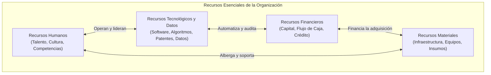

1. **Recursos Humanos (Capital Intelectual):**
   - El factor más complejo e insustituible. Abarca el talento técnico, el liderazgo, las habilidades blandas, la experiencia tácita y la cultura organizativa.
   - En TICs, representa la capacidad de diseñar arquitecturas de software, resolver problemas no estructurados y adaptarse a tecnologías emergentes.
2. **Recursos Materiales / Físicos:**
   - Activos tangibles: predios, edificios administrativos, plantas industriales, servidores físicos, cableado estructurado, terminales de usuario y vehículos de transporte.
3. **Recursos Financieros:**
   - La liquidez que permite la dinámica operativa: capital social, fondos de reserva, líneas de crédito bancarias, utilidades retenidas y flujo de caja operativo (*cash flow*). Determinan el presupuesto de capital (CAPEX) y operativo (OPEX) disponible para iniciativas tecnológicas.
4. **Recursos Tecnológicos y Datos (El Activo Estratégico Moderno):**
   - No solo comprende el hardware y software licenciado, sino la **propiedad intelectual**, patentes, algoritmos propietarios, arquitecturas de información y, críticamente, **los datos**.
   - Los datos corporativos estructurados y no estructurados (*Data as an Asset*) constituyen el activo con rendimientos crecientes a escala: a mayor volumen de datos limpios, mayor precisión en la toma de decisiones algorítmicas predictivas.

---

### 1.1.5 Niveles de Decisión Organizacional

La toma de decisiones en una empresa se distribuye jerárquicamente según el grado de certidumbre, el horizonte temporal y el nivel de estructuración del problema a resolver (modelo clásico de Robert Anthony):

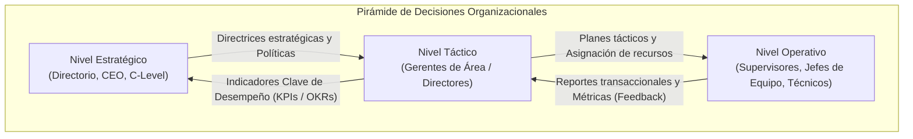

| Nivel de Decisión | Actores Principales | Tipo de Decisión | Nivel de Riesgo e Incertidumbre | Horizonte Temporal | Requerimiento Típico de Sistemas de Información |
| :--- | :--- | :--- | :--- | :--- | :--- |
| **Estratégico** | Directorio, CEO, CIO, CTO, CFO | **No Estructuradas:** Problemas difusos sin algoritmo previo. ¿Compramos a un competidor? ¿Migramos el core bancario a la nube pública? | Máximo riesgo financiero y de supervivencia corporativa. | 3 a 5+ años | **Executive Support Systems (ESS)**, dashboards de inteligencia estratégica, analítica prescriptiva y simulación de escenarios macro. |
| **Táctico** | Gerentes funcionales, Líderes de unidad de negocio | **Semiestructuradas:** Existen pautas, pero se requiere juicio administrativo. ¿Qué proveedor de nube ofrece mejor balance costo/seguridad? | Riesgo moderado; impacto acotado a la eficiencia departamental. | 6 meses a 2 años | **Management Information Systems (MIS)**, plataformas de Business Intelligence (BI), OLAP y reportes de control presupuestario. |
| **Operativo** | Supervisores de línea, ingenieros de soporte, cajeros | **Estructuradas:** Reglas explícitas y algoritmos deterministas. ¿Cómo se procesa la devolución de este producto? ¿Qué hacer si la CPU supera el 90%? | Bajo riesgo individual, pero alto riesgo acumulativo si falla el volumen. | Diario, por turno, tiempo real | **Transaction Processing Systems (TPS)**, sistemas de tickets de help desk (ITSM), monitoreo APM y registros contables directos. |

---

## 1.2 Organización y Procesos de la Empresa

### 1.2.1 El Proceso de Organización y Departamentalización

Organizar consiste en determinar qué tareas deben realizarse, quién las ejecutará, cómo se agruparán esas actividades, quién reportará a quién y en qué punto se tomarán formalmente las decisiones.

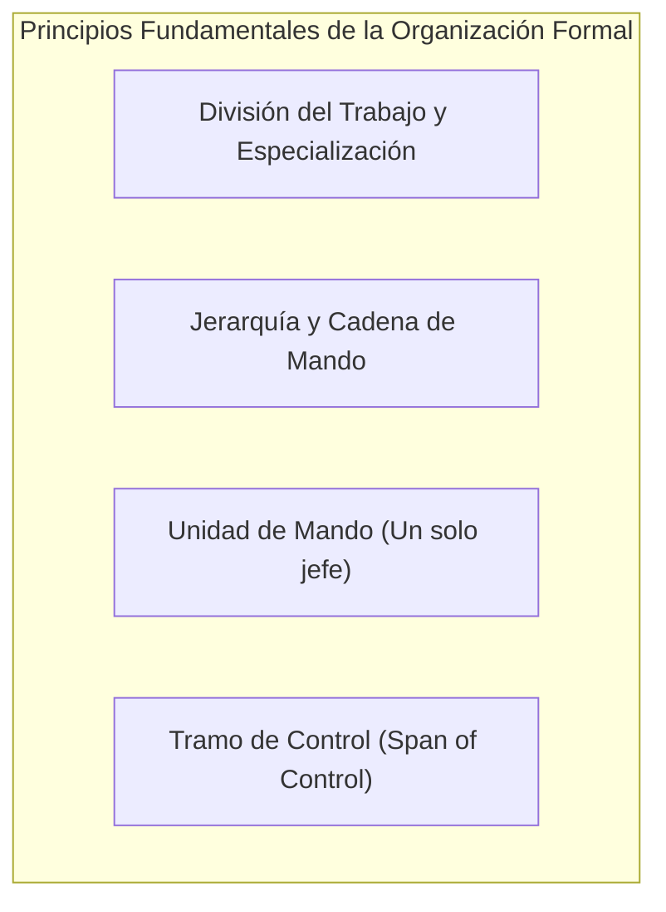

- **División del Trabajo y Especialización:** Principio formulado por Adam Smith y sistematizado por Henri Fayol. Consiste en descomponer un proceso complejo en tareas elementales ejecutadas por especialistas. Permite un rápido aprendizaje, destreza técnica y reducción de tiempos muertos.
- **Jerarquía y Cadena de Mando:** Línea continua de autoridad formal que conecta los niveles superiores de la empresa con las posiciones más operativas, definiendo quién supervisa a quién.
- **Unidad de Mando:** Principio clásico según el cual un colaborador debe recibir órdenes de un único superior directo para evitar directrices contradictorias, dilución de responsabilidades y estrés laboral.
- **Tramo de Control (*Span of Control*):** Cantidad de subordinados que un líder puede supervisar de forma efectiva y eficiente.
  - *Tramo Estrecho (Organizaciones Altas/Piramidales):* Pocos empleados por supervisor. Permite un control estricto, pero genera burocracia excesiva, altos costos administrativos y lentitud en la circulación de la información.
  - *Tramo Amplio (Organizaciones Planas/Ágiles):* Muchos colaboradores por líder. Fomenta el empoderamiento (*empowerment*) y la agilidad comunicativa, pero exige profesionales con alta autonomía y madurez técnica.

---

### 1.2.2 Estructura de la Organización Funcional Tradicional

La estructura funcional agrupa las actividades de acuerdo con las funciones esenciales de la empresa (Ingeniería, Ventas, Finanzas, Recursos Humanos, Operaciones).

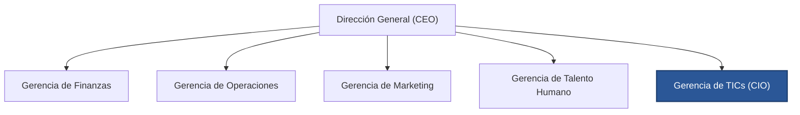

#### Ventajas del Modelo Funcional
1. **Alta Especialización Técnica:** Los ingenieros trabajan con ingenieros, los contadores con contadores; esto maximiza el perfeccionamiento disciplinar y la calidad del entregable técnico.
2. **Economías de Escala Internas:** Se centralizan recursos homogéneos (p. ej., un solo departamento de servidores o un único centro de compras de licencias).
3. **Trayectorias Profesionales Claras:** Escalafón jerárquico bien definido dentro de cada especialidad.

#### Desventajas Críticas y Patologías Organizacionales
1. **Silos Organizacionales (*Silo Mentality*):** Cada departamento se comporta como un feudo aislado con metas propias desarticuladas del objetivo corporativo. Por ejemplo, TICs puede vanagloriarse de mantener el 99.9% de uptime mientras los usuarios de Ventas experimentan una lentitud inoperable en el CRM.
2. **Pérdida de la Visión Global del Cliente:** Ningún área funcional es dueña exclusiva de la experiencia del cliente final; la responsabilidad se atomiza y se diluye ("el error fue de base de datos, no de mi módulo").
3. **Lentitud Comunicativa Extrema:** Para coordinar dos áreas operativas, la comunicación debe ascender por la pirámide hasta la gerencia y descender por el otro brazo funcional, destruyendo la agilidad competitiva.

---

### 1.2.3 Concepto Formal de Proceso de Negocio

> [!definition] Definición de Proceso de Negocio (BPM)
> Un **proceso de negocio** es una secuencia coordinada, lógica y estructurada de actividades interrelacionadas, ejecutadas por personas, sistemas o máquinas, que toma uno o más insumos específicos (*Inputs*), les añade valor mediante una transformación deliberada, y produce un resultado medible (*Output*) para un cliente interno o externo.

El modelo canónico que describe un proceso es el marco **SIPOC / IPO ampliado con Control y Retroalimentación**:

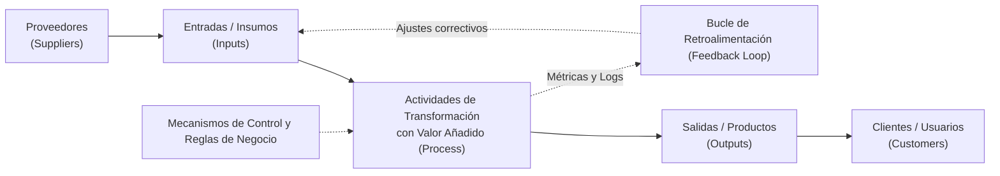

1. **Entradas (Inputs):** Materias primas, datos, documentos, solicitudes, energía o señales que inician el flujo.
2. **Actividades de Transformación de Valor:** Conjunto de tareas que consumen tiempo y recursos para modificar el estado de los inputs. Si una actividad no añade valor perceptible para el cliente final ni es requerida por normativa, se considera un **desperdicio (*Waste / Muda*)**.
3. **Salidas (Outputs):** El bien tangible, servicio digital, reporte o cambio de estado entregado al destinatario.
4. **Retroalimentación y Control (Feedback Loop):** Indicadores de desempeño (*KPIs*), mecanismos de aseguramiento de calidad y monitoreo de errores que permiten retroalimentar el sistema para corregir desviaciones en tiempo de ejecución.

---

### 1.2.4 Características Esenciales de los Procesos

Los procesos empresariales contemporáneos poseen tres atributos intrínsecos que rigen su diseño e ingeniería de software:

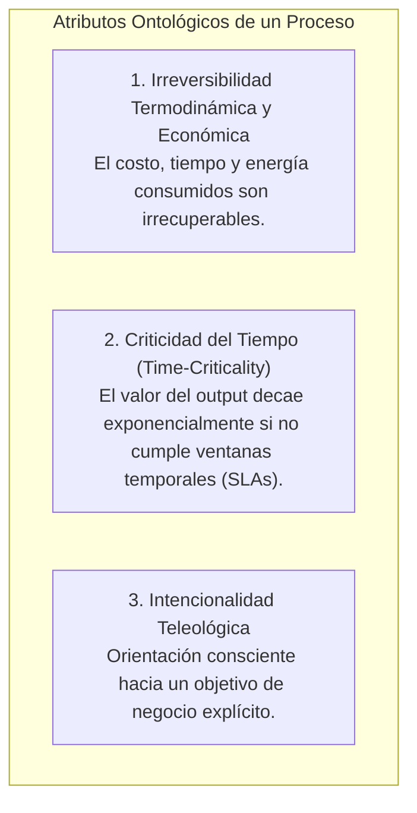

1. **Irreversibilidad (*Irreversibility*):**
   - Una vez que un proceso se ejecuta, los recursos invertidos (tiempo de procesamiento de cómputo, horas-hombre de ingenieros, transacciones bancarias compensadas) no pueden "deshacerse" sin incurrir en un costo de compensación adicional.
   - En sistemas de TICs, esto fundamenta patrones arquitectónicos complejos como transacciones distribuidas (*Two-Phase Commit* o *Saga Pattern*), donde el error en un subproceso obliga a ejecutar una transacción de compensación explícita.
2. **Criticidad del Tiempo (*Time-Criticality*):**
   - La validez del output de un proceso depende estrictamente del tiempo. Un reporte de fraude financiero generado tres horas después del retiro ilícito carece de utilidad operativa.
   - Esto impone la suscripción de **Acuerdos de Nivel de Servicio (SLAs)** rígidos que dictan los tiempos máximos tolerables de ejecución y latencia transaccional.
3. **Intencionalidad Teleológica (*Purposefulness*):**
   - El proceso no ocurre de forma fortuita; responde a una causa final (*telos*). Cada tarea, condicional y validación dentro del flujo de trabajo existe para cumplir una regla de negocio y aportar a los objetivos organizacionales.

---

### 1.2.5 Descomposición Jerárquica de Procesos

Para gobernar la complejidad empresarial sin perderse en el detalle operativo, se aplica el principio de abstracción mediante una descomposición jerárquica estandarizada:

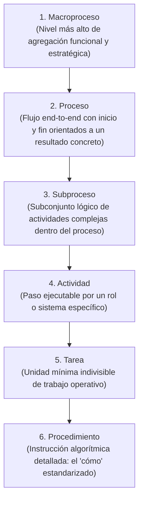

#### Ejemplos Concretos Aplicados al Área de TICs
Para clarificar la granularidad de cada nivel, analicemos el dominio de **Gestión de Incidentes y Operaciones de TI**:

- **Nivel 1: Macroproceso:** *Gestión de la Continuidad y Soporte Operativo de Servicios Digitales*.
- **Nivel 2: Proceso:** *Gestión de Incidentes Críticos (Major Incident Management)*.
- **Nivel 3: Subproceso:** *Diagnóstico y Restauración del Servicio en Producción*.
- **Nivel 4: Actividad:** *Escalar el incidente al equipo de Ingeniería de Confiabilidad del Sitio (SRE)*.
- **Nivel 5: Tarea:** *Ejecutar el script automatizado de failover de la base de datos hacia la réplica secundaria en la nube*.
- **Nivel 6: Procedimiento:** *Documento técnico o Runbook que estipula paso a paso: 1) Verificar sincronización de WALs en PostgreSQL, 2) Ejecutar comando `repmgr standby promote`, 3) Modificar DNS interno con TTL de 30 segundos, 4) Notificar en el canal `#incident-war-room` de Slack.*

---

### 1.2.6 Clasificación de Procesos según su Impacto en la Cadena de Valor

Basado en el modelo de Cadena de Valor de Michael Porter y las mejores prácticas de BPM (*Business Process Management*), los procesos corporativos se estructuran en tres grandes categorías:

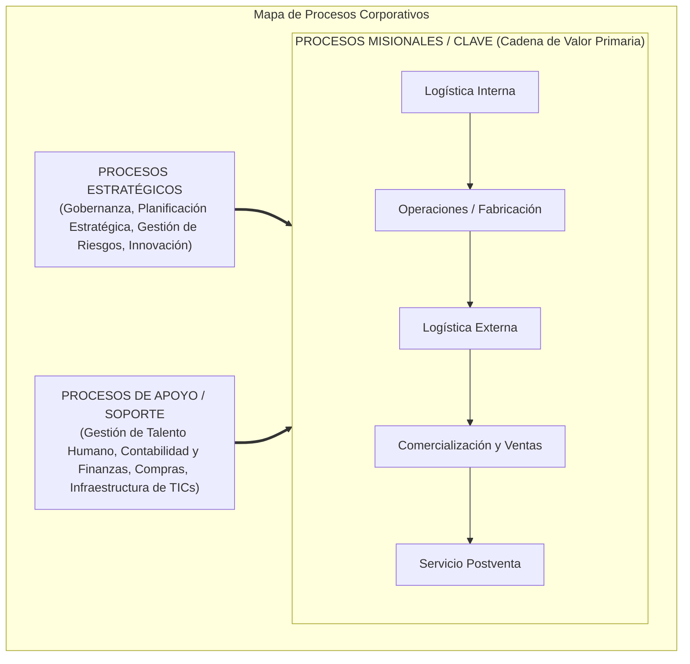

```
+-----------------------------------------------------------------------------------+
|                            PROCESOS ESTRATÉGICOS                                  |
|   Gobernanza Corporativa | Planificación Financiera | Políticas de Seguridad      |
+-----------------------------------------------------------------------------------+
                                        | (Direccionan y dictan políticas)
                                        v
+-----------------------------------------------------------------------------------+
|                     PROCESOS MISIONALES (CORE BUSINESS)                           |
|       (Generan valor directo para el cliente y sostienen la ventaja competitiva)  |
|                                                                                   |
|  [Prospección] -> [Originación de Crédito] -> [Desembolso] -> [Recaudación]       |
+-----------------------------------------------------------------------------------+
                                        ^
                                        | (Habilitan y sustentan)
+-----------------------------------------------------------------------------------+
|                        PROCESOS DE APOYO (SUPPORT / ENABLERS)                     |
|   Mesa de Ayuda TICs | Gestión de Servidores | Nómina | Adquisiciones Legales      |
+-----------------------------------------------------------------------------------+
```

1. **Procesos Estratégicos:**
   - Proporcionan directrices, fijan límites operativos, definen la arquitectura empresarial y evalúan el cumplimiento normativo. No tocan directamente el producto final pero aseguran la supervivencia a largo plazo de la organización.
2. **Procesos Misionales / Clave (*Core Processes*):**
   - Son la razón de ser de la compañía. Contactan directamente al cliente externo, transforman el producto y generan los ingresos operativos directos. Si fallan, el negocio se detiene inmediatamente.
3. **Procesos de Apoyo / Soporte (*Enablers*):**
   - Proveen los insumos, infraestructura, personal capacitado y servicios auxiliares necesarios para que los procesos clave operen sin interrupciones. 
   - **Nota crítica para el ingeniero de TICs:** Históricamente, TICs fue clasificada exclusivamente como un *proceso de apoyo*; en la era digital contemporánea, TICs se ha fusionado indisolublemente con los *procesos misionales* (en un banco digital o una fintech, el software **es** el core misional del negocio).

---

## 1.3 El Área de TICs

### 1.3.1 Definición Formal de TICs según Organismos Internacionales

> [!definition] Definición de TICs (Comisión Europea / OCDE / UIT)
> Las **Tecnologías de la Información y la Comunicación (TICs)** representan el conjunto convergente de sistemas, herramientas, dispositivos electrónicos, redes de telecomunicaciones, software y protocolos que hacen posible la **captura, almacenamiento, procesamiento, transmisión, protección y presentación automatizada de datos e información** en formato digital.

Esta definición abarca no únicamente los artefactos tecnológicos físicos (hardware) y lógicos (software), sino las infraestructuras de interconexión global (redes de fibra óptica, 5G, satélites) y los estándares de intercambio interoperable de datos que sostienen la sociedad de la información.

---

### 1.3.2 Propósito y Misión del Área de TICs: La Gran Transición Paradigmática

La percepción y el rol organizativo del área de TICs ha sufrido la transformación más profunda en la historia de la administración moderna:

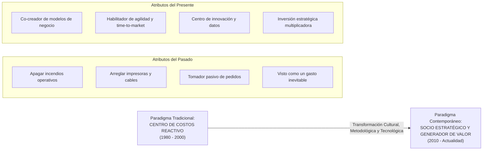

- **El Viejo Paradigma (Centro de Costos):** La gerencia general concebía a TICs como un mal necesario, un rubro pasivo en el presupuesto contable destinado a comprar computadoras y dar soporte ofimático. El éxito de TICs se medía únicamente por "reducir el presupuesto" y "no hacer caer los sistemas".
- **El Nuevo Paradigma (Generador Estratégico de Valor):** En la economía digital, las empresas líderes son empresas de software que además operan en un dominio específico (p. ej., Uber es una empresa de software que coordina transporte; Nubank es una empresa de software con licencia financiera). La misión de TICs hoy es:
  1. Habilitar nuevos modelos de ingresos basados en plataformas digitales.
  2. Acelerar radicalmente el *Time-to-Market* de nuevos productos.
  3. Proteger la reputación corporativa frente a amenazas cibernéticas globales.
  4. Transformar datos crudos en ventajas competitivas analíticas sostenibles.

---

### 1.3.3 Ventajas del Uso Intensivo de TICs

1. **Automatización de Operaciones y Reducción del Error Humano:**
   - Eliminación de tareas manuales repetitivas mediante RPA (*Robotic Process Automation*) y scripts de orquestación, reduciendo costos marginales a niveles cercanos a cero.
2. **Disponibilidad y Analítica de Información en Tiempo Real:**
   - Transición del "cierre contable mensual a ciegas" hacia arquitecturas de streaming de eventos (Kafka, dashboards en tiempo real) que permiten tomar decisiones correctivas en cuestión de segundos.
3. **Reducción de Costos de Transacción y Coordinación:**
   - Al digitalizar las comunicaciones internas y externas (APIs, plataformas B2B), los costos de coordinar proveedores geográficamente dispersos colapsan, facilitando cadenas de suministro globales.
4. **Agilidad y Elasticidad Competitiva:**
   - La computación en la nube permite a una organización desplegar infraestructura en minutos en lugar de esperar meses por la importación de servidores físicos, posibilitando experimentar y pivotar a bajo costo.

---

### 1.3.4 Desventajas y Riesgos del Uso Intensivo de TICs

Toda ganancia en eficiencia tecnológica conlleva una exposición sistemática a nuevos vectores de vulnerabilidad:

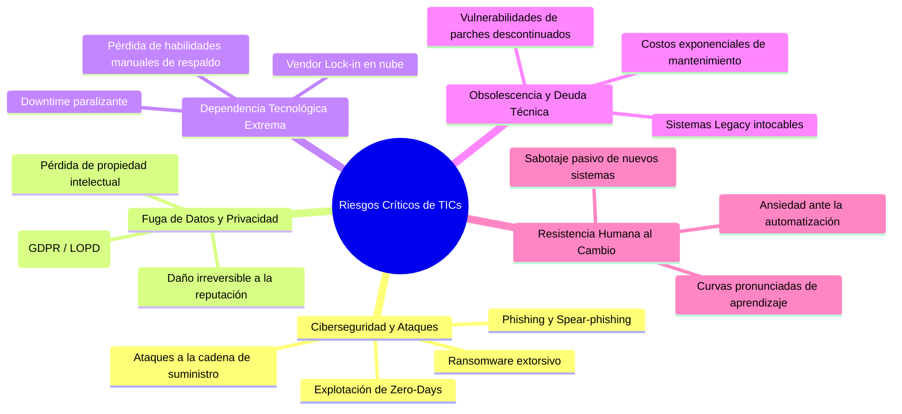

- **Ciberseguridad y Cibercrimen Industrial:** El ransomware moderno paraliza operaciones enteras secuestrando bases de datos críticas. Las empresas pueden quebrar en cuestión de semanas debido a la interrupción operativa.
- **Riesgos de Privacidad y Cumplimiento Normativo (GDPR / LOPD):** En Ecuador y a nivel global, la Ley Orgánica de Protección de Datos Personales (LOPD) y el RGPD europeo imponen sanciones económicas devastadoras (hasta el 4% de la facturación global) si se vulnera la confidencialidad de los datos de usuarios.
- **Dependencia Tecnológica Operativa Extrema:** Si el sistema central de facturación o el ERP colapsa, la empresa es incapaz de emitir una nota de entrega física, paralizando el despacho de camiones o la atención hospitalaria.
- **Obsolescencia Acelerada y Deuda Técnica:** Los ciclos de vida del software son vertiginosos. Las tecnologías adoptadas hace cinco años pueden quedar sin soporte del fabricante, acumulando una deuda técnica que devora hasta el 70% del presupuesto operativo de TI solo en parches de emergencia.
- **Resistencia Organizacional al Cambio:** La implementación del mejor sistema ERP del mundo fracasará rotundamente si los usuarios rechazan la herramienta y construyen flujos paralelos en hojas de cálculo informales por falta de gestión del cambio cultural.

---

### 1.3.5 Funciones Clave del Área de TICs

Las responsabilidades de TICs se estructuran en tres horizontes complementarios:

```
[HORIZONTE ESTRATÉGICO]   -->  Innovación Tecnológica | Rediseño de Modelos Digitales | Scouting de Tendencias
                                     ▲
[HORIZONTE DE DATOS]      -->  Gobernanza de Datos | Arquitectura de Pipelines ETL/ELT | Business Intelligence
                                     ▲
[HORIZONTE OPERATIVO]     -->  Uptime 99.999% | Mesa de Ayuda (Help Desk) | Redes/Telecom | Seguridad Perimetral
```

1. **Funciones Operativas (Mantener la Luz Encendida - *Run the Business*):**
   - Administración de redes locales (LAN), enlaces corporativos (WAN/SD-WAN) y telefonía IP.
   - Operación y parcheo continuo de servidores físicos y virtuales, almacenamiento SAN/NAS y recursos de nube.
   - Gestión ininterrumpida de la Mesa de Ayuda (Service Desk), resolución de fallas de equipos de usuario final y soporte a incidencias.
   - Ejecución y validación estricta de respaldos (*backups*) y simulacros de planes de recuperación ante desastres (*DRP*).
2. **Funciones de Gestión de Datos e Información (*Information Asset Management*):**
   - Administración de bases de datos relacionales y NoSQL: indexación, particionamiento, integridad referencial y alta disponibilidad.
   - Diseño y mantenimiento de pipelines de extracción, transformación y carga (ETL/ELT).
   - Implementación de almacenes de datos (*Data Warehouses*) y lagos de datos (*Data Lakes*) para proveer información a los dashboards de BI.
   - Aplicación de marcos de Gobierno de Datos (estándar DAMA-DMBOK) para garantizar la calidad, linaje y seguridad del dato.
3. **Funciones Estratégicas e Innovación (Transformar el Negocio - *Transform the Business*):**
   - *Technology Scouting:* Investigación y pruebas de concepto con tecnologías de frontera (Inteligencia Artificial generativa, computación perimetral, contratos inteligentes).
   - Arquitectura Empresarial: Definición del mapa de sistemas a 3-5 años para evitar la duplicidad de aplicaciones y alinear TI con los objetivos del negocio.
   - Rediseño de Procesos y Automatización Avanzada: Liderar proyectos de reingeniería de procesos para habilitar canales omnicanal e interacciones automatizadas.

---

### 1.3.6 Niveles Jerárquicos y Roles Clave en TICs

La estructura contemporánea de un departamento de TICs de alto desempeño se organiza bajo liderazgos ejecutivos especializados y un esquema escalonado de soporte:

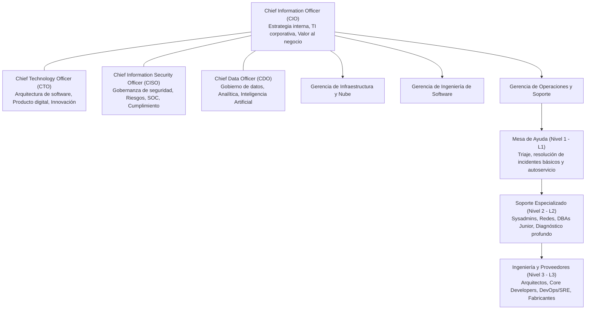

#### Roles Ejecutivos C-Level
- **CIO (Chief Information Officer):** El máximo líder de TI de la empresa. Su función principal es **política y estratégica**: alinea las TICs con los objetivos de rentabilidad, lidera el presupuesto, interactúa con el Directorio y asegura que las operaciones internas cuenten con herramientas eficientes.
- **CTO (Chief Technology Officer):** Enfocado en la tecnología como **producto hacia el cliente exterior**. Lidera la arquitectura de software, el equipo de desarrolladores y la adopción de tecnologías de vanguardia para crear ventajas competitivas en el mercado.
- **CISO (Chief Information Security Officer):** Liderazgo autónomo e independiente. Diseña la estrategia de ciberseguridad, gestiona las defensas del Security Operations Center (SOC), responde a incidentes y audita el cumplimiento normativo. (Por gobernanza sana, el CISO a menudo reporta al CEO o al Comité de Riesgos, no al CIO, para evitar conflictos de interés entre agilidad y seguridad).
- **CDO (Chief Data Officer):** Custodio del valor de los datos corporativos. Define políticas de gobierno, linaje, monetización de datos y plataformas de analítica predictiva.

#### La Estructura de Soporte Técnico en Tres Niveles (Modelo ITIL)
1. **Nivel 1 (L1 - Service Desk / Mesa de Ayuda):**
   - Primer punto de contacto unificado (*Single Point of Contact - SPOC*).
   - Recibe llamadas, correos o tickets de portal de autoservicio.
   - Aplica guías de resolución estándar (*Runbooks / Knowledge Base*): reseteo de contraseñas, asignación de permisos básicos, configuración de VPNs. Si no se resuelve en 15-30 minutos, escala con documentación detallada.
2. **Nivel 2 (L2 - Soporte Técnico Especializado / Field Support):**
   - Administradores de sistemas (*Sysadmins*), especialistas en redes (CCNA/CCNP), técnicos de hardware en sitio y DBAs junior.
   - Resuelven problemas de configuración avanzada de sistemas operativos, fallas de conectividad en switches/routers, corrupción de perfiles de usuario o análisis de logs de aplicaciones departamentales.
3. **Nivel 3 (L3 - Ingeniería de Producto, Arquitectura y Fabricantes):**
   - Los perfiles de mayor seniority técnica: arquitectos de software, ingenieros DevOps/SRE, desarrolladores senior y consultores de los fabricantes originales (Cisco, Red Hat, Oracle, AWS).
   - Corrigen *bugs* en el código fuente de las aplicaciones, optimizan consultas SQL complejas a nivel de motor, depuran problemas de kernel o abren casos de soporte directo con el fabricante del hardware/cloud.

---

## 1.4 Organización y Procesos del Área de TICs

### 1.4.1 El Concepto de Sistema Socio-Técnico en Sistemas de Información

Uno de los errores más graves y comunes en la ingeniería de sistemas es asumir que un proyecto de TI es un desafío meramente tecnológico. En la década de 1950, Eric Trist y el Instituto Tavistock de Londres demostraron que las organizaciones son **Sistemas Socio-Técnicos**.

Posteriormente, Harold Leavitt formalizó el célebre **Diamante de Leavitt**, que ilustra la interdependencia indisoluble de cuatro componentes:

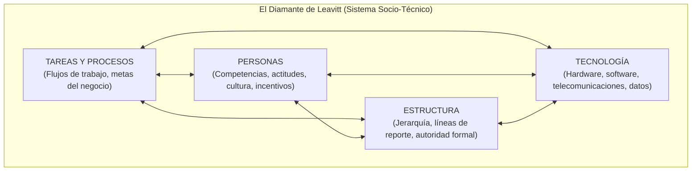

> [!important] Principio de Interdependencia Sistémica
> Ningún componente del diamante puede modificarse de forma aislada sin inducir perturbaciones y forzar ajustes compensatorios en los otros tres.
> - Si cambias la **Tecnología** (p. ej., se migra de un sistema local a un ERP global SAP en la nube):
>   1. Debes transformar los **Procesos y Tareas** (las operaciones se ejecutan ahora bajo las mejores prácticas globales del software).
>   2. Debes reentrenar a las **Personas** y gestionar su resistencia psicológica (nuevas habilidades, diferente interfaz).
>   3. Debes reconfigurar la **Estructura** organizativa (desaparecen roles manuales de digitación y surgen auditores de flujo de datos).
> Ignorar las variables humanas y estructurales es la causa raíz de más del 70% de fracasos en proyectos de software empresarial.

---

### 1.4.2 La Organización como un Sistema Interdependiente (Teoría General de Sistemas)

Formulada por el biólogo **Ludwig von Bertalanffy**, la **Teoría General de Sistemas (TGS)** sostiene que las entidades complejas deben estudiarse no mediante el análisis reduccionista de sus partes separadas, sino a través de las relaciones dinámicas que las conectan. La empresa es un **sistema abierto, dinámico, probabilístico y teleológico**.

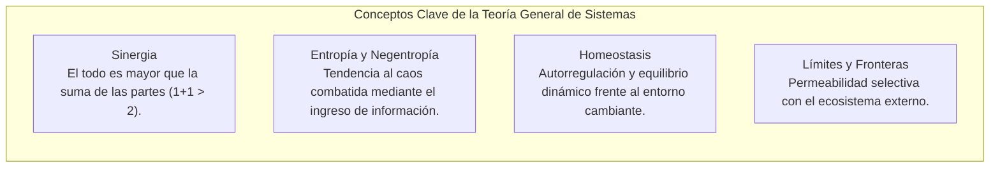

1. **Sinergia:** La acción coordinada de los subsistemas produce un impacto significativamente superior a la suma de sus rendimientos individuales ($1 + 1 > 2$). Un software excelente sin personal calificado genera valor cero; personal calificado sin software opera con baja productividad; la conjunción armónica genera una ventaja competitiva extraordinaria.
2. **Entropía y Negentropía:**
   - La *entropía* es la ley universal que dicta que todo sistema tiende naturalmente a la degradación, desorganización y caos.
   - Las empresas combaten la entropía mediante la **negentropía (entropía negativa)**, que consiste en la absorción continua de **información, energía y datos depurados**. El área de TICs es la principal proveedora de negentropía organizativa: pone orden, estandariza y clarifica la realidad corporativa.
3. **Homeostasis:** Propiedad de un sistema autorregulado para mantener un estado de equilibrio dinámico interno a pesar de las perturbaciones violentas del entorno externo (inflación, pandemias, ciberataques). Los sistemas de monitoreo y alertas automáticas de TI son los termostatos que preservan la homeostasis operativa.
4. **Límites y Fronteras (*System Boundaries*):** Definen qué pertenece a la empresa y qué al entorno. En la era de las APIs abiertas y la nube, las fronteras organizativas se han vuelto sumamente porosas: una empresa transacciona datos con proveedores, bancos y pasarelas de pago de forma transparente.

---

### 1.4.3 Las Áreas Funcionales y las TICs como Sistema Nervioso Transversal

Tradicionalmente, la administración dividió a la empresa en silos verticales. En la organización contemporánea, las TICs operan como el **tejido conectivo y sistema nervioso transversal** que atraviesa horizontalmente todas las áreas:

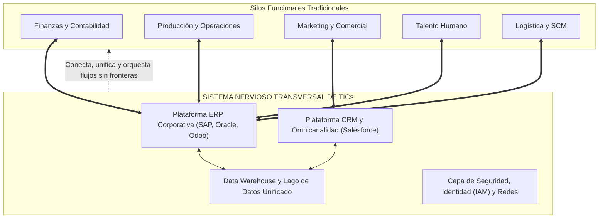

- **Finanzas:** Utiliza el ERP para procesar asientos contables en tiempo real, emitir facturación electrónica autorizada por el ente tributario y conciliar flujos de tesorería automatizados con la banca.
- **Producción / Operaciones:** Controlada por sistemas MES y SCADA que capturan telemetría de máquinas industriales, reportando desperdicios y alertando sobre mantenimiento predictivo.
- **Marketing y Ventas:** Gestionada mediante herramientas de CRM y plataformas de e-commerce que centralizan las interacciones omnicanal del cliente, alimentando algoritmos de recomendación.
- **Talento Humano:** Respaldada por sistemas de gestión del capital humano (HRMS) que controlan la nómina, evaluaciones de desempeño y portales de autoatención para colaboradores.
- **Logística:** Gobernado por sistemas de gestión de almacenes (WMS) y ruteo dinámico con GPS, optimizando la última milla.

Sin el sistema nervioso de TICs, estas cinco áreas operarían con "versiones contradictorias de la verdad", perdiendo semanas en reconciliar discrepancias entre datos de ventas, despachos de almacén y facturas contables.

---

### 1.4.4 Evolución Histórica de las Aplicaciones de TI hacia la Industria 4.0

El uso organizativo de las tecnologías ha atravesado cinco olas generacionales bien diferenciadas:

```
[1960-1970]  Ola 1: Procesamiento por Lotes y Mainframes Centralizados
     │
[1980-1990]  Ola 2: Computación Departamental y Arquitectura Cliente-Servidor
     │
[2000-2005]  Ola 3: La Era de Internet, E-Business y Sistemas ERP Integrados
     │
[2010-2015]  Ola 4: Cloud Computing, Movilidad Masiva y Big Data
     │
[2020-Pres]  Ola 5: Industria 4.0, Sistemas Ciberfísicos, Gemelos Digitales e IA
```

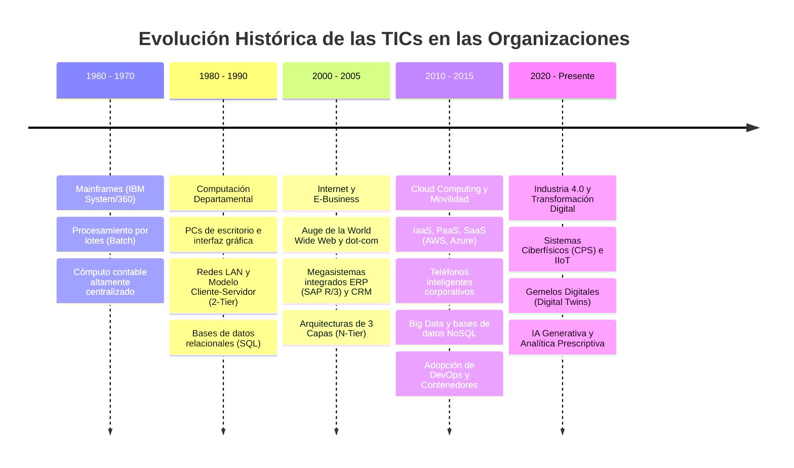

1. **Ola 1: Mainframes y Procesamiento por Lotes (1960-1970):**
   - Equipos masivos de costo astronómico (ej. IBM System/360).
   - Acceso restringido exclusivamente a sacerdotes informáticos mediante tarjetas perforadas.
   - Computación diferida (*batch*): los datos se acumulaban durante el día y se procesaban durante la noche para generar reportes impresos de nómina y balances contables básicos.
2. **Ola 2: Computación Departamental y Cliente-Servidor (1980-1990):**
   - Adopción de minicomputadoras (DEC VAX) y proliferación masiva de computadoras personales (IBM PC) en cada escritorio.
   - Nacimiento de las Redes de Área Local (LAN) y el paradigma **Cliente-Servidor (2-Tier)**.
   - Maduración de las Bases de Datos Relacionales (RDBMS) basadas en álgebra relacional y lenguaje SQL (Oracle, IBM DB2, Microsoft SQL Server).
3. **Ola 3: La Era de Internet, E-Business y ERPs Integrados (2000-2005):**
   - Masificación del protocolo TCP/IP y la World Wide Web.
   - Superación de los sistemas fragmentados mediante los mega-sistemas de **Planificación de Recursos Empresariales (ERP)** (como SAP R/3).
   - Transición hacia arquitecturas desacopladas en 3 capas (N-Tier: Presentación Web, Servidor de Aplicaciones, Motor de Base de Datos).
4. **Ola 4: Cloud Computing, Movilidad y Big Data (2010-2015):**
   - Desmaterialización del centro de datos local hacia gigantes de la nube (*Cloud Providers*: AWS, Microsoft Azure, Google Cloud) bajo modelos bajo demanda (IaaS, PaaS, SaaS).
   - Ubicuidad móvil: los colaboradores operan desde cualquier lugar mediante smartphones y tabletas corporativas.
   - Explosión del Big Data (las 3Vs: Volumen, Velocidad y Variedad), obligando al nacimiento de bases de datos no relacionales (NoSQL) y herramientas distribuidas (Hadoop, Spark).
5. **Ola 5: Industria 4.0, Sistemas Ciberfísicos e Inteligencia Artificial (2020 - Presente):**
   - **Sistemas Ciberfísicos (CPS):** Integración profunda entre algoritmos computacionales y componentes físicos (sensores, actuadores mecánicos).
   - **Gemelos Digitales (*Digital Twins*):** Réplicas virtuales hiperrealistas en tiempo real de turbinas, plantas de producción o cadenas logísticas completas, permitiendo simulaciones sin interrumpir la operación física.
   - **Inteligencia Artificial y Analítica Prescriptiva:** Uso de modelos fundacionales de Machine Learning y LLMs no solo para describir lo que ocurrió, sino para recomendar de forma autónoma el mejor curso de acción empresarial.

---

## 1.5 Alineamiento TICs y Empresa

### 1.5.1 TICs en Sentido Estricto vs. TICs en Sentido Ampliado

Una de las principales trampas epistemológicas en la gerencia tecnológica es confundir la herramienta con la capacidad organizacional.

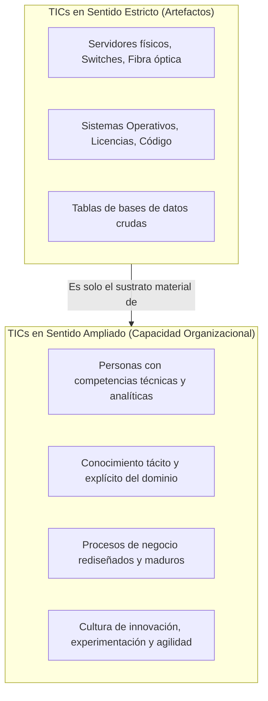

| Dimensión | TICs en Sentido Estricto (*Narrow IT*) | TICs en Sentido Ampliado (*Broad IT / IT Capability*) |
| :--- | :--- | :--- |
| **Componentes Principales** | Servidores, racks, cables, computadoras, sistemas operativos, frameworks de desarrollo, licencias de software, repositorios Git. | Personas altamente calificadas, cultura de toma de decisiones basada en datos, procesos ágiles, gobierno de TI y capacidades de innovación. |
| **Facilidad de Replicación** | **Extremadamente Alta:** Cualquier competidor con capital suficiente puede comprar exactamente los mismos servidores en AWS o contratar las mismas licencias de software. | **Muy Difícil de Replicar:** La cultura organizativa, la sinergia entre ingenieros y directores de negocio y el aprendizaje acumulado son inimitables (ventaja competitiva según el VRIO Framework). |
| **Generación de Valor** | Valor nulo por sí misma; representa únicamente un costo de adquisición de activos (*Commodity*). | **Motor Primario de Diferenciación Estratégica:** Transforma las herramientas en soluciones de negocio que multiplican los ingresos corporativos. |

---

### 1.5.2 Mapeo de Procesos de TI según la Naturaleza del Negocio

Los objetivos y la arquitectura de TICs no pueden ser idénticos para todas las industrias; se configuran estrictamente según las presiones operativas y regulatorias del sector económico de la organización:

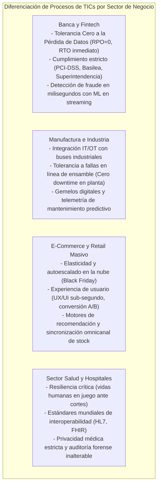

1. **Banca, Fintech y Seguros:**
   - *Foco Central:* Consistencia transaccional ACID estricta, seguridad criptográfica, prevención de lavado de activos y cumplimiento regulatorio bancario.
   - *Métricas Clave:* Cero pérdida de transacciones (RPO = 0), latencia menor a 150 ms en pasarelas de pago, cumplimiento estricto del estándar PCI-DSS.
2. **Manufactura y Logística Industrial:**
   - *Foco Central:* Convergencia IT/OT (*Information Technology / Operational Technology*). Los sistemas de software deben interactuar con autómatas programables (PLCs) y redes de tiempo real deterministas (CAN bus, Profinet).
   - *Métricas Clave:* Uptime de la línea de ensamblaje (el costo de parar una planta automotriz puede superar los $20,000 por minuto), mantenimiento predictivo efectivo de maquinaria.
3. **Comercio Electrónico y Retail Digital (*E-Commerce*):**
   - *Foco Central:* Hiper-escalabilidad horizontal en días pico (*Black Friday*, promociones flash), optimización de conversión de checkout, personalización en tiempo real mediante algoritmos de grafos.
   - *Métricas Clave:* Capacidad de soportar 100x de tráfico sin degradación (*auto-scaling*), tiempo de carga interactivo (*Largest Contentful Paint - LCP*) inferior a 1.5 segundos.
4. **Salud y Hospitales (*HealthTech*):**
   - *Foco Central:* Continuidad operativa en unidades de cuidados intensivos, interoperabilidad de historiales clínicos electrónicos (estándares HL7/FHIR), confidencialidad extrema de la información del paciente.
   - *Métricas Clave:* Cero tiempo fuera de servicio en quirófanos y emergencias, tiempos de respuesta instantáneos en acceso a imágenes diagnósticas (PACS/DICOM).

---

### 1.5.3 Diálogo Permanente y Bidireccional entre Estrategia y Tecnología

Históricamente, la formulación estratégica seguía un modelo jerárquico secuencial y lineal: el Directorio y la Gerencia General redactaban la estrategia empresarial a puerta cerrada y luego "llamaban al jefe de cómputo" para encargarle la construcción o compra de un sistema que soportara dicha estrategia.

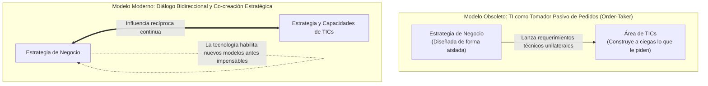

> [!tip] La Tecnología como Co-creadora de la Estrategia
> En las organizaciones maduras, la tecnología no se limita a **apoyar (*support*)** la estrategia; la tecnología **define y amplía lo que es estratégicamente posible (*enable & shape*)**. 
> - Caso ejemplar: Amazon Web Services (AWS) no nació porque el negocio de retail le pidió a TI construir un servicio de servidores para alquilar; nació porque el equipo técnico de Amazon resolvió su propia arquitectura interna de infraestructura y descubrió que esa capacidad técnica podía comercializarse como un modelo de negocio billonario autónomo.
> - La relación contemporánea es una **co-adaptación dialéctica**: el negocio formula metas que retan a la tecnología, y los líderes tecnológicos proponen innovaciones disruptivas que transforman las metas del negocio.

---

### 1.5.4 Modelos Formales de Alineamiento Estratégico

Para estructurar, medir y gobernar este alineamiento, la academia y la industria han desarrollado cuatro marcos metodológicos de referencia obligatoria:

---

#### 1. Strategic Alignment Model (SAM) de Henderson & Venkatraman (1993)

El **Modelo de Alineamiento Estratégico (SAM)**, publicado por John Henderson y N. Venkatraman en el *IBM Systems Journal*, es la piedra angular teórica en la gestión de TICs. Se basa en una matriz de cuatro cuadrantes articulada sobre dos ejes ortogonales:

1. **Ajuste Estratégico (*Strategic Fit*):** Eje vertical. Conecta el dominio **Externo** (cómo se posiciona la empresa en el mercado competitivo) con el dominio **Interno** (cómo se estructuran los procesos, la infraestructura y las personas).
2. **Integración Funcional (*Functional Integration*):** Eje horizontal. Conecta el dominio del **Negocio** con el dominio de las **Tecnologías de la Información**.

```mermaid
flowchart TD
    subgraph MatrizSAM["Strategic Alignment Model (SAM) - Henderson & Venkatraman"]
        subgraph Externo["DOMINIO EXTERNO (Estratégico / Competitivo)"]
            BS["1. Estrategia de Negocio<br/>- Alcance de Negocio<br/>- Competencias Distintivas<br/>- Gobernanza de Negocio"]
            IS["2. Estrategia de TICs<br/>- Alcance Tecnológico<br/>- Competencias Sistémicas<br/>- Gobernanza de TI"]
        end
        
        subgraph Interno["DOMINIO INTERNO (Operativo / Infraestructura)"]
            OI["3. Infraestructura Organizacional<br/>- Estructura Administrativa<br/>- Procesos de Negocio<br/>- Habilidades y RRHH"]
            II["4. Infraestructura de TICs<br/>- Arquitectura de Sistemas<br/>- Procesos de TI / DevOps<br/>- Habilidades Técnicas"]
        end
        
        BS <==>|"Integración Funcional Externa"| IS
        OI <==>|"Integración Funcional Interna"| II
        BS <==>|"Ajuste Estratégico de Negocio"| OI
        IS <==>|"Ajuste Estratégico de TI"| II
    end
```

#### Los 4 Cuadrantes del Modelo SAM
1. **Estrategia de Negocio (Business Strategy):**
   - *Alcance de Negocio:* Mercados donde compite, productos, clientes y nichos geográficos.
   - *Competencias Distintivas:* Precios bajos, diferenciación de marca, canales exclusivos.
   - *Gobernanza de Negocio:* Alianzas estratégicas, fusiones, adquisiciones y relaciones corporativas.
2. **Estrategia de TICs (IT Strategy):**
   - *Alcance Tecnológico:* Tecnologías críticas requeridas (nube, IA, IoT, blockchain).
   - *Competencias Sistémicas:* Capacidades diferenciales de software y confiabilidad de sistemas.
   - *Gobernanza de TI:* Decisión de comprar software comercial vs. desarrollar internamente (*Make vs. Buy*), alianzas con hiperescaladores de nube.
3. **Infraestructura y Procesos Organizacionales (Organizational Infrastructure):**
   - *Estructura Administrativa:* Organigrama, jerarquía, unidades de negocio y gobernanza.
   - *Procesos de Negocio:* Flujos de valor, BPM, actividades de diseño, venta y servicio.
   - *Habilidades:* Capacitación del personal de negocio, perfiles culturales y liderazgo.
4. **Infraestructura y Procesos de TICs (IT Infrastructure):**
   - *Arquitectura de Aplicaciones y Datos:* Modelos de microservicios, bases de datos, redes y protocolos.
   - *Procesos de TI:* Marcos ITIL para incidentes y cambios, pipelines CI/CD, metodologías Scrum/DevOps.
   - *Habilidades Técnicas:* Competencias en lenguajes de programación, ciberseguridad, administración cloud y analítica.

#### Las 4 Perspectivas Dominantes de Alineamiento en el SAM
El modelo demuestra que para alinear la organización se debe trazar una ruta secuencial de **tres cuadrantes** (un cuadrante impulsor, un cuadrante pivote y un cuadrante impactado):

```mermaid
flowchart LR
    subgraph P1["1. Ejecución Estratégica"]
        direction LR
        P1_BS["Estrategia de Negocio"] --> P1_OI["Infraestructura Organizacional"] --> P1_II["Infraestructura de TI"]
    end
    
    subgraph P2["2. Potencial Tecnológico"]
        direction LR
        P2_BS["Estrategia de Negocio"] --> P2_IS["Estrategia de TICs"] --> P2_II["Infraestructura de TI"]
    end
    
    subgraph P3["3. Potencial Competitivo"]
        direction LR
        P3_IS["Estrategia de TICs"] --> P3_BS["Estrategia de Negocio"] --> P3_OI["Infraestructura Organizacional"]
    end
    
    subgraph P4["4. Nivel de Servicio"]
        direction LR
        P4_IS["Estrategia de TICs"] --> P4_II["Infraestructura de TI"] --> P4_OI["Infraestructura Organizacional"]
    end
```

1. **Perspectiva de Ejecución Estratégica (*Strategy Execution*):**
   - *Ruta:* Estrategia de Negocio $\rightarrow$ Infraestructura Organizacional $\rightarrow$ Infraestructura de TICs.
   - *Concepción:* El enfoque clásico y más intuitivo. El negocio define su estrategia comercial; esta exige una estructura de procesos departamentales, y finalmente TICs adapta su infraestructura de soporte para satisfacer dichos procesos. El rol de TICs es puramente reactivo y ejecutor.
2. **Perspectiva de Potencial Tecnológico (*Technology Transformation*):**
   - *Ruta:* Estrategia de Negocio $\rightarrow$ Estrategia de TICs $\rightarrow$ Infraestructura de TICs.
   - *Concepción:* La estrategia de negocio no se limita a los procesos actuales; formula una visión que requiere seleccionar la mejor estrategia tecnológica del mercado, la cual luego condiciona la infraestructura de sistemas. El CIO actúa como un asesor visionario de tecnología para la alta dirección.
3. **Perspectiva de Potencial Competitivo (*Competitive Potential*):**
   - *Ruta:* Estrategia de TICs $\rightarrow$ Estrategia de Negocio $\rightarrow$ Infraestructura Organizacional.
   - *Concepción:* Enfoque disruptivo. Nuevas capacidades emergentes de TICs permiten concebir modelos de negocio que antes eran imposibles. La tecnología arrastra a la estrategia de negocio, la cual a su vez reestructura la organización. *Ejemplo:* La computación en la nube y el streaming masivo permitieron a Netflix abandonar el alquiler postal de DVDs y fundar el negocio de streaming por suscripción.
4. **Perspectiva de Nivel de Servicio (*Service Level*):**
   - *Ruta:* Estrategia de TICs $\rightarrow$ Infraestructura de TICs $\rightarrow$ Infraestructura Organizacional.
   - *Concepción:* Foco en la excelencia operativa interna de TI. La estrategia de TICs se enfoca en construir una infraestructura y una mesa de servicios de clase mundial, convirtiendo al área de TICs en el proveedor de servicios más eficiente y confiable para toda la organización.

---

#### 2. Strategic Alignment Maturity Model (SAMM) de Jerry Luftman

Mientras que el modelo SAM de Henderson y Venkatraman es un marco conceptual cualitativo, **Jerry Luftman** (2000) desarrolló un modelo empírico para **medir cuantitativamente la madurez del alineamiento estratégico** a través de **6 dimensiones clave** evaluadas en **5 niveles evolutivos**:

```mermaid
flowchart TD
    subgraph DimensionesLuftman["Las 6 Dimensiones de Madurez de Luftman"]
        D1["1. Comunicaciones (Entendimiento mutuo de lenguaje de negocio y TI)"]
        D2["2. Medición de Valor y Métricas (ROI conjunto, SLAs, tableros compartidos)"]
        D3["3. Gobernanza de TI (Comités conjuntos de decisión y priorización)"]
        D4["4. Asociación y Confianza (Partnership: TI vista como socio, no proveedor)"]
        D5["5. Alcance y Arquitectura (Flexibilidad, estándares y escalabilidad)"]
        D6["6. Habilidades y Talento (Cultura de innovación, retención, capacitación cruzada)"]
    end
```

```
[Nivel 5: Proceso Optimizado]   --> Fusión total Negocio-TI, Co-adaptación dinámica
        ▲
[Nivel 4: Proceso Gestionado]    --> TI como centro de valor, Coinversión estratégica
        ▲
[Nivel 3: Proceso Enfocado]      --> Alineamiento departamental, Gobernanza formalizada
        ▲
[Nivel 2: Proceso Comprometido]  --> Intención de alineamiento, TI como soporte funcional
        ▲
[Nivel 1: Proceso Inicial / Ad-hoc] --> Desalineamiento total, TI vista como costo molesto
```

##### Los 5 Niveles de Madurez de Luftman
1. **Nivel 1 - Proceso Inicial / Ad-hoc:**
   - La alta dirección y TICs no se entienden. Lenguaje técnico crudo vs. objetivos financieros incomprensibles.
   - TICs es vista como un generador de gastos que debe recortarse a toda costa. No existen comités formales de priorización; los proyectos se aprueban por urgencia o capricho del ejecutivo más ruidoso.
2. **Nivel 2 - Proceso Comprometido (*Committed*):**
   - Comienza a reconocerse que TICs es vital para la operación. Se inician reuniones periódicas entre gerentes de negocio y líderes técnicos.
   - El alineamiento ocurre a nivel táctico básico; TICs es concebida como un buen centro de soporte funcional.
3. **Nivel 3 - Proceso Enfocado (*Focused*):**
   - Se formalizan comités directivos de gobernanza de TI (*IT Steering Committees*).
   - Se evalúa formalmente el retorno de inversión (ROI) antes de aprobar presupuestos de software. La infraestructura adopta estándares arquitectónicos y se formalizan acuerdos de nivel de servicio (SLAs).
4. **Nivel 4 - Proceso Gestionado (*Managed*):**
   - TICs es considerada formalmente un socio estratégico (*Strategic Partner*).
   - Existe coinversión y riesgo compartido: si un proyecto de software fracasa, la responsabilidad se asume de manera conjunta entre el líder de negocio y el líder técnico. Existen rotaciones de puestos entre áreas.
5. **Nivel 5 - Proceso Optimizado (*Optimized*):**
   - Fusión indisoluble entre la estrategia corporativa y la visión tecnológica. Las fronteras entre "el negocio" y "el equipo de TI" se desvanecen; todos operan como una sola entidad digital ágil.
   - La organización no solo reacciona con maestría a su mercado, sino que influye activamente en el entorno competitivo mediante innovaciones disruptivas continuas.

---

#### 3. Enfoque de Alineamiento Multidimensional de Chan & Reich (2007b)

Yolande Chan y Blaize Horner Reich demostraron en su influyente estado del arte que el alineamiento no puede reducirse únicamente a documentos formales de planificación. El alineamiento estratégico es un fenómeno holístico compuesto por cuatro dimensiones:

```mermaid
flowchart LR
    subgraph ChanReich["Alineamiento Multidimensional de Chan & Reich"]
        AE["Alineamiento Estratégico<br/>(Planes, misiones y presupuestos coherentes)"]
        AES["Alineamiento Estructural<br/>(Ubicación del CIO en el organigrama y comités)"]
        AS["Alineamiento Social<br/>(Lenguaje compartido, empatía y lazos interpersonales)"]
        AC["Alineamiento Cultural<br/>(Valores, tolerancia al riesgo e innovación)"]
    end
    
    AE <--> AES
    AES <--> AS
    AS <--> AC
    AC <--> AE
```

- **Alineamiento Estratégico:** Coherencia explícita entre los planes de negocio escritos y los planes maestros de TI. Es el nivel formal y documental.
- **Alineamiento Estructural:** Diseño institucional que facilita la integración. Incluye la posición del CIO en la mesa del Directorio (reportando al CEO y no al Director Financiero), la conformación de células de trabajo multidisciplinarias (tribus ágiles) y políticas presupuestarias descentralizadas.
- **Alineamiento Social:** Uno de los aportes más novedosos. Sostiene que el alineamiento real depende de las redes informales, la confianza interpersonal, la empatía y la comprensión mutua entre los ejecutivos de negocio y los ingenieros de software. Si no hay comprensión social ni respeto profesional, los planes formales quedan archivados.
- **Alineamiento Cultural:** Armonía entre los valores compartidos de la empresa y la mentalidad del área tecnológica: apetito hacia la experimentación, tolerancia al fracaso rápido como vía de aprendizaje, enfoque centrado en el usuario final y compromiso ético con la protección de datos.

---

#### 4. IT Balanced Scorecard (IT-BSC) de Van Grembergen

Para traducir la estrategia de alineamiento en un sistema integral de medición y gestión del desempeño, **Wim Van Grembergen** y **Steven De Haes** adaptaron el célebre marco del **Balanced Scorecard (Cuadro de Mando Integral)** de Robert Kaplan y David Norton al ámbito específico del gobierno y la gestión de TICs:

```mermaid
flowchart TD
    subgraph ITBSC["IT Balanced Scorecard (Van Grembergen)"]
        FC["1. Perspectiva Financiera / Contribución Corporativa<br/>¿TI entrega valor económico medible y optimiza el costo?"]
        UO["2. Perspectiva del Cliente / Orientación al Usuario<br/>¿Satisface TI las necesidades operativas de los usuarios?"]
        OP["3. Perspectiva de Procesos Internos / Excelencia Operativa<br/>¿Son ágiles, seguros y eficientes los procesos de TI?"]
        FR["4. Perspectiva de Aprendizaje / Preparación Futura<br/>¿Está el equipo de TI capacitado e innovando continuamente?"]
        
        FC <==> UO
        UO <==> OP
        OP <==> FR
        FR <==> FC
    end
```

| Perspectiva del IT-BSC | Pregunta Clave de Control | Objetivos Típicos en TICs | Métricas e Indicadores de Rendimiento (KPIs) |
| :--- | :--- | :--- | :--- |
| **Contribución Corporativa** (*Corporate Contribution / Financiera*) | ¿Las inversiones y operaciones de TICs están generando valor económico tangible y optimizando el capital de la organización? | - Maximizar el retorno de inversión en proyectos de software.<br/>- Control estricto de costos operativos (OPEX/CAPEX).<br/>- Reducción del costo unitario por transacción digital. | - ROI de proyectos de software.<br/>- Variación porcentual de costo real vs. presupuesto asignado.<br/>- Porcentaje del presupuesto de TI dedicado a innovación vs. mantenimiento. |
| **Orientación al Usuario** (*Customer / User Orientation*) | ¿Cómo perciben a TICs los usuarios internos (empleados) y los clientes externos en términos de servicio y confiabilidad? | - Elevar la satisfacción del usuario corporativo.<br/>- Provisión de aplicaciones estables y fáciles de usar.<br/>- Cumplimiento estricto de Acuerdos de Nivel de Servicio (SLAs). | - Índice de Satisfacción del Usuario (CSAT / NPS de TI).<br/>- Porcentaje de incidentes resueltos dentro del tiempo SLA acordado.<br/>- Tasa de adopción de nuevas aplicaciones digitales. |
| **Excelencia Operativa** (*Operational Excellence / Procesos Internos*) | ¿Los procesos internos de ingeniería de software, operaciones, incidentes y ciberseguridad se ejecutan con alta eficiencia y calidad? | - Excelencia en la entrega de proyectos en tiempo y alcance.<br/>- Alta disponibilidad y resiliencia de la infraestructura.<br/>- Cero brechas de seguridad críticas no mitigadas. | - Uptime de servicios críticos (disponibilidad 99.9x%).<br/>- Tiempo Medio de Reparación (MTTR) y Tiempo Medio entre Fallas (MTBF).<br/>- Frecuencia de despliegue y tasa de fallas en cambios en producción (*DORA Metrics*). |
| **Preparación Futura** (*Future Readiness / Aprendizaje y Crecimiento*) | ¿Está el área de TICs desarrollando las competencias, arquitecturas y cultura necesarias para afrontar los desafíos tecnológicos del mañana? | - Capacitación y certificación continua del equipo de ingenieros.<br/>- Investigación activa y adopción de tecnologías emergentes.<br/>- Retención del talento técnico clave y clima laboral motivante. | - Horas de capacitación anual por ingeniero en nuevas tecnologías.<br/>- Tasa de rotación voluntaria del personal técnico especializado.<br/>- Número de pruebas de concepto (PoCs) de innovación evaluadas al año. |

---

## Síntesis Conceptual del Capítulo

> [!important] 📌 Conclusiones Clave para el Futuro Ingeniero de TICs de la EPN
> 1. **La Empresa es un Sistema Abierto:** La empresa no es una entidad estática ni un conjunto aislado de computadoras; es un sistema socio-técnico complejo que transforma insumos en valor bajo incertidumbre. Su supervivencia depende del equilibrio homeostático entre personas, procesos, estructura y tecnología.
> 2. **Superación del Silo Tradicional:** La departamentalización funcional clásica engendra barreras burocráticas que paralizan la agilidad. Los procesos de negocio deben gestionarse de forma horizontal y transversal, donde el cliente final es el árbitro supremo de la calidad.
> 3. **TICs como Núcleo Estratégico:** El departamento de TICs ha dejado de ser un centro de costos auxiliar de "cableado y soporte" para erigirse en el **sistema nervioso central** que habilita la estrategia corporativa, la automatización masiva y la analítica en tiempo real.
> 4. **Alineamiento Estratégico Continuo:** Comprar la última tecnología de moda no garantiza el éxito. El valor surge exclusivamente cuando existe una integración funcional y un ajuste estratégico profundo entre los objetivos organizacionales y las capacidades tecnológicas, gobernado por modelos rigurosos como el **SAM de Henderson & Venkatraman**, el **SAMM de Luftman** y el **IT Balanced Scorecard**.

---

## Referencias y Lecturas Complementarias
- Henderson, J. C., & Venkatraman, N. (1993). *Strategic alignment: Leveraging information technology for transforming organizations*. IBM Systems Journal, 32(1), 4-16.
- Luftman, J. (2000). *Assessing business-IT alignment maturity*. Communications of the Association for Information Systems, 4(1), 9.
- Van Grembergen, W., & De Haes, S. (2009). *Enterprise Governance of Information Technology: Achieving Strategic Alignment and Value*. Springer Science & Business Media.
- Coase, R. H. (1937). *The Nature of the Firm*. Economica, 4(16), 386-405.
- Leavitt, H. J. (1965). *Applied organizational change in industry: Structural, technological and humanistic approaches*. Handbook of Organizations.
- Von Bertalanffy, L. (1968). *General System Theory: Foundations, Development, Applications*. New York: George Braziller.
- ITGI / ISACA. (2019). *COBIT 2019 Framework: Introduction and Methodology*. Information Systems Audit and Control Association.
