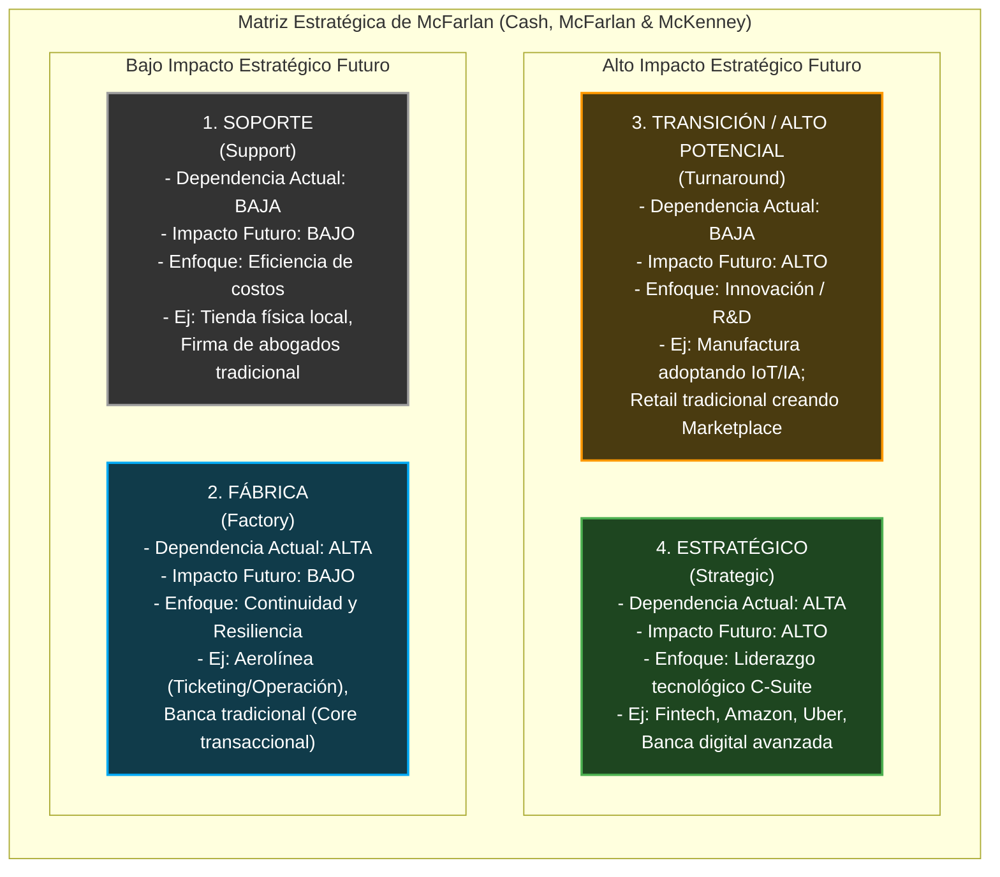
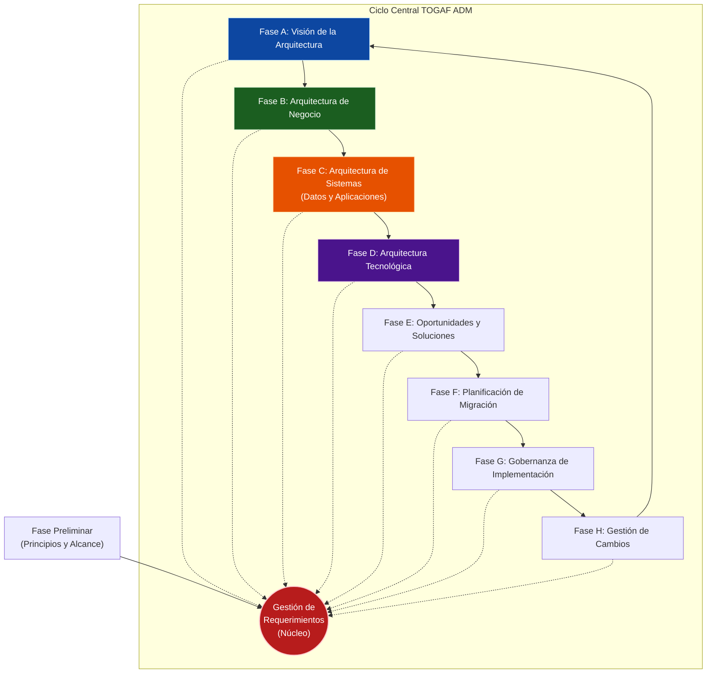
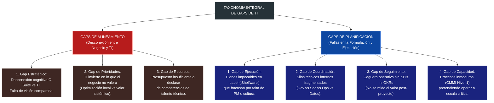
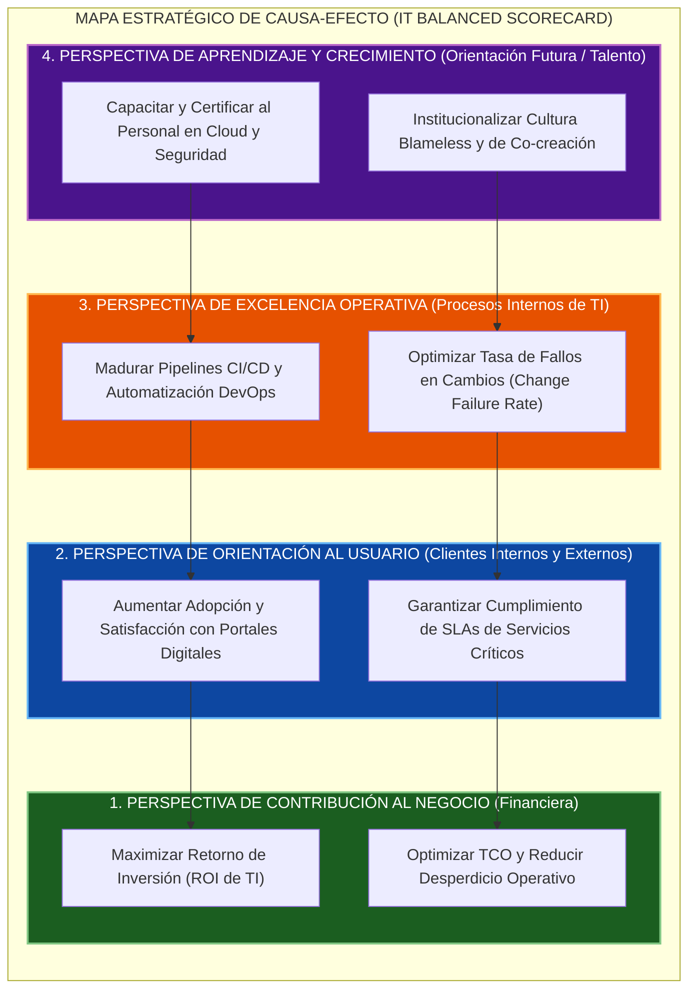

# Capítulo 2: Análisis de Situación Actual, Diagnóstico y Planeación Estratégica de TICs

> [!info] 💡 ¿Cómo entender esto desde cero? (Guía para novatos de pregrado)
> Imagina que te nombran Director de Tecnología (CIO) de una de las cadenas de hospitales más grandes del país. Llegas el primer día y encuentras que la junta directiva quiere que los cirujanos operen con robots teleasistidos mediante Inteligencia Artificial y realidad aumentada para el próximo año. Sin embargo, al bajar al centro de cómputo, descubres que la red interna usa cables dañados de hace quince años, los servidores principales no tienen respaldo automático, las enfermeras siguen anotando recetas en papeles que se extravían y los médicos no quieren usar el sistema informático porque afirman que "les hace perder el tiempo".
> 
> Si compras los robots de inmediato sin arreglar los cimientos, provocarás una catástrofe financiera y operativa. ¿Cómo sales de esta trampa?
> 1. **Diagnóstico 360 y Situación Actual:** Primero necesitas saber con precisión científica dónde estás parado hoy: evaluar los procesos de las personas, el estado real de la infraestructura tecnológica, la cultura del personal y las fallas del día a día (usando herramientas como la Brújula Organizacional, FODA y la Matriz de McFarlan).
> 2. **Arquitectura y Planeación Estratégica (PETIC):** Luego, defines a dónde debe llegar la institución y trazas un puente de ingeniería riguroso entre los objetivos médicos del hospital (Plan Estratégico Institucional - PEI) y los proyectos tecnológicos (Plan Estratégico de TICs - PETIC), aplicando marcos como TOGAF y COBIT 2019.
> 3. **Cierre de Brechas (Gaps):** Finalmente, identificas por qué falla la ejecución (falta de presupuesto, resistencia al cambio, prioridades distorsionadas) y aplicas modelos de valor (como Val IT y el Cuadro de Mando Integral) para garantizar que cada centavo invertido salve vidas y genere valor tangible. Este capítulo es el manual de vuelo para realizar esa transformación.

---

## 2.1 Estudio de Reconocimiento Organizacional (Modelo 360)

### 2.1.1 Concepto Formal de Diseño Organizacional

En el ámbito de la ingeniería de software y la gestión de tecnologías de la información, existe con frecuencia la falsa premisa de que los problemas corporativos se resuelven exclusivamente mediante la adquisición o desarrollo de nuevo software. La teoría moderna de la administración estratégica y la ingeniería organizacional desmiente categóricamente esta visión tecnocéntrica.

> [!definition] Definición Formal: Diseño Organizacional
> El **Diseño Organizacional** es el proceso deliberado, multidimensional y sistemático de configurar y alinear de forma coherente la **estrategia**, la **estructura formal**, los **procesos de negocio**, los **sistemas de información y recompensa**, y el **talento humano** con el propósito de optimizar la efectividad colectiva y asegurar la supervivencia y ventaja competitiva de la organización en un entorno dinámico (Galbraith, 2002; Nadler & Tushman, 1997).

El diseño organizacional trasciende el simple dibujo de un organigrama. Constituye la arquitectura operativa subyacente que determina cómo fluye la información, cómo se distribuye el poder de decisión, cómo se incentiva a los colaboradores y cómo se coordinan los esfuerzos multidisciplinarios. Una organización debe concebirse como un **sistema sociotécnico abierto**, donde cualquier alteración en el componente tecnológico (TI) induce tensiones inmediatas e ineludibles sobre el componente social (roles, jerarquías, hábitos culturales y distribución del poder).

```
                      ┌─────────────────────────┐
                      │  Estrategia de Negocio  │
                      └────────────┬────────────┘
                                   │ (Alineación)
         ┌─────────────────────────┼─────────────────────────┐
         │                         │                         │
         ▼                         ▼                         ▼
┌─────────────────┐       ┌─────────────────┐       ┌─────────────────┐
│   Estructura    │◄─────►│    Procesos     │◄─────►│    Personas     │
│ (Líneas, Roles) │       │ (Flujos Valor)  │       │ (Cultura/Skill) │
└────────┬────────┘       └────────┬────────┘       └────────┬────────┘
         │                         │                         │
         └─────────────────────────┼─────────────────────────┘
                                   │
                                   ▼
                      ┌─────────────────────────┐
                      │    Sistemas de TICs     │
                      │  (Habilitador Técnico)  │
                      └─────────────────────────┘
```

Si la infraestructura tecnológica no se encuentra en perfecta congruencia con la estructura de poder y los procesos operativos, el resultado inevitable es la entropía organizacional: sistemas informáticos millonarios que son saboteados por los usuarios, duplicidad de esfuerzos y frustración en la alta dirección.

---

### 2.1.2 El Desafío de la Ejecución Estratégica

Uno de los hallazgos más consistentes en la literatura de administración de empresas (desde los estudios seminales de Kaplan y Norton hasta las investigaciones de Harvard Business School y McKinsey & Company) es que **entre el 60% y el 90% de las estrategias formuladas fracasan durante su fase de ejecución, no durante su formulación teórica**.

> [!important] ¿Por qué fallan las estrategias tecnológicas y corporativas?
> Las estrategias no fracasan porque los objetivos sean deficientes o poco ambiciosos, sino porque las organizaciones sufren de desconexiones estructurales profundas:
> 
> 1. **La tiranía del torbellino operativo (*The Whirlwind*):** Las urgencias cotidianas (servidores caídos, tickets de soporte técnico, incidentes de producción) consumen el 95% de la energía y tiempo del equipo de TI, postergando indefinidamente las iniciativas transformadoras de largo plazo.
> 2. **Silos funcionales y balcanización corporativa:** Cada departamento (Ventas, Finanzas, Operaciones, TI) opera como un feudo independiente con sus propias agendas y presupuestos, optimizando sus propios indicadores locales a expensas del valor sistémico global.
> 3. **La desconexión semántica C-Suite vs. TI:** La alta gerencia habla el lenguaje de EBITDA, cuota de mercado, margen operativo y mitigación de riesgo corporativo; mientras tanto, el departamento de TI habla de microservicios, latencia de base de datos, Kubernetes y parches de seguridad. Al no existir un vocabulario común, las prioridades se distorsionan.
> 4. **Incentivos perversos o contradictorios:** Se le exige al departamento de TI que sea "innovador, ágil y disruptivo", pero se evalúa y premia a los gerentes de TI exclusivamente en función del tiempo de actividad (*uptime*) de sistemas heredados y la reducción drástica de costos operativos.
> 5. **Subestimación de la inercia cultural:** Como sentenció célebremente Peter Drucker: *"La cultura se come a la estrategia en el desayuno"*. Si la cultura premia el ocultamiento del error y castiga la experimentación, ninguna metodología ágil o herramienta moderna logrará despegar.

---

### 2.1.3 La Brújula del Diseño Organizacional (*Organizational Design Compass*)

Para evitar diagnósticos sesgados o superficiales, el reconocimiento organizacional debe abordarse mediante un marco holístico de 360 grados. La **Brújula del Diseño Organizacional** es un modelo analítico que descompone la realidad de una empresa o departamento de TI en cuatro cuadrantes interconectados e interdependientes:

```
                       [1. TRABAJO A REALIZAR]
                       (Work to be done)
                       - Propósito misional
                       - Flujos de valor clave
                       - Actividades críticas
                               ▲
                               │
                               │
[4. NORMAS Y COMPORTAMIENTOS] ◄─┼─► [2. ESTRUCTURA]
(Norms & Behaviors)            │    (Structure)
- Cultura real del día a día   │    - Líneas de reporte y jerarquía
- Estilos de liderazgo         │    - Agrupación departamental
- Tolerancia al error          │    - Límites de autoridad (RACI)
- Patrones de colaboración     ▼
                       [3. FACILITADORES]
                       (Enablers)
                       - Plataformas de TI y Datos
                       - Métricas (KPIs / OKRs)
                       - Políticas de compensación
                       - Mecanismos de gobernanza
```

#### 1. Trabajo a Realizar (*Work to be done*)
Este cuadrante responde a la pregunta ontológica fundamental: **¿Qué valor concreto crea esta organización y qué actividades son indispensables para lograrlo?**
- **Propósito misional:** La razón última de existir de la función de TI (ejemplo: no es "mantener encendidos los servidores", sino "garantizar la disponibilidad ininterrumpida de las transacciones financieras de los clientes").
- **Flujos de valor (*Value Streams*):** El conjunto de actividades secuenciales de extremo a extremo que transforman una solicitud de un interesado en un resultado con valor medible (ejemplo: desde la concepción de una nueva funcionalidad en la banca móvil hasta su despliegue seguro en producción).
- **Actividades prioritarias vs. accesorias:** Distinción clara entre el trabajo de alta diferenciación competitiva (desarrollo de algoritmos propietarios, analítica predictiva de clientes) y el trabajo comoditizado que puede tercerizarse o automatizarse (respaldos de cintas, aprovisionamiento manual de máquinas virtuales).

#### 2. Estructura (*Structure*)
Define el andamiaje formal a través del cual se organiza el trabajo y se distribuye el poder de toma de decisiones:
- **Líneas de reporte y jerarquía:** Relaciones formales de subordinación, tramos de control (*span of control* — número óptimo de colaboradores directos por supervisor) y niveles jerárquicos entre el CIO y los ingenieros operativos.
- **Modelos de agrupación:** Evaluación de la conveniencia entre estructuras funcionales (equipos de desarrollo separados de infraestructura y seguridad), estructuras orientadas a productos/servicios (equipos multidisciplinarios tipo *Squads* de DevOps) o estructuras matriciales.
- **Límites de autoridad y derechos de decisión:** Definición precisa de quién tiene el poder de veto, quién aprueba presupuestos y quién ejecuta, formalizado mediante herramientas como la matriz RACI (*Responsible, Accountable, Consulted, Informed*).

#### 3. Facilitadores (*Enablers*)
Representa los instrumentos, palancas institucionales y recursos tangibles que permiten al personal ejecutar el trabajo dentro de la estructura:
- **Sistemas de información y datos:** El ecosistema de herramientas tecnológicas (ERP, CRM, ITSM, pipelines de CI/CD, repositorios de código, plataformas de observabilidad) que soportan la operación.
- **Métricas de rendimiento (KPIs / OKRs):** Indicadores cuantitativos que definen el éxito y orientan el comportamiento individual y grupal (ej. tasa de fallas en cambios - *Change Failure Rate*, tiempo medio de recuperación - *MTTR*, disponibilidad de servicios).
- **Políticas de compensación y recompensas:** Estructuras salariales, bonificaciones por desempeño, planes de carrera técnica paralelos a la gestión administrativa (*Dual Career Tracks*).
- **Gobernanza y políticas operativas:** Políticas de seguridad, comités de arquitectura, estándares de codificación y cumplimiento regulatorio.

#### 4. Normas y Comportamientos (*Norms & Behaviors*)
Este cuadrante captura la realidad humana intangible, es decir, **la cultura real de trabajo que se respira cuando los directivos no están presentes**:
- **Cultura real vs. cultura declarada:** Contraste entre los valores colgados en las paredes de la empresa ("Innovación y Transparencia") y la práctica diaria ("No toques ese código viejo porque si falla te despiden").
- **Estilos de liderazgo:** Predominio de liderazgos de comando y control autocrático vs. liderazgos serviciales (*Servant Leadership*) y facilitadores de autonomía técnica.
- **Gestión del error y seguridad psicológica:** Grado en que los ingenieros se sienten seguros para admitir fallas operativas o proponer ideas experimentales. Existencia de auditorías de culpa punitivas vs. análisis retrospectivos constructivos (*Blameless Post-Mortems*).
- **Colaboración interfuncional:** Nivel de empatía, confianza y fluidez de comunicación entre los desarrolladores, el personal de operaciones y los líderes de negocio.

---

### 2.1.4 El Enfoque Participativo OPTIMAL

El rediseño organizacional impuesto de manera vertical (*top-down*) por consultores externos suele generar un rechazo inmunitario inmediato en los equipos de ingeniería. Para mitigar este fenómeno, se aplica el enfoque metodológico **OPTIMAL**, diseñado para diagnosticar y rediseñar organizaciones de TI mediante co-creación colaborativa e iterativa.

| Fase OPTIMAL | Nombre de la Fase | Objetivo Central y Actividades Clave | Entregables Principales |
| :--- | :--- | :--- | :--- |
| **O** | **Orientación y Alcance** (*Orientation*) | Delimitar los límites del sistema a diagnosticar, identificar a los patrocinadores ejecutivos y acordar los objetivos estratégicos que motivan la revisión. | Mandato de diagnóstico, Carta del Proyecto (*Charter*), Matriz de Interesados clave. |
| **P** | **Participación y Mapeo** (*Participation*) | Levantar información mediante talleres interactivos, entrevistas y encuestas anónimas con todos los niveles operativos, mapeando la realidad actual. | Mapas de flujos de valor *As-Is*, diagnóstico de clima sociotécnico, inventario de dolores operativos. |
| **T** | **Tipificación de Brechas** (*Typology of Gaps*) | Categorizar las inconsistencias encontradas entre los cuatro cuadrantes de la Brújula de Diseño, separando síntomas superficiales de causas raíz. | Matriz de Brechas Sistémicas, Diagramas de Ishikawa (Causa-Efecto), Análisis de Cuellos de Botella. |
| **I** | **Ideación y Diseño To-Be** (*Ideation*) | Diseñar participativamente la nueva estructura de TI, los nuevos procesos y los mecanismos de facilitación en sesiones de diseño ágil (*Design Thinking*). | Modelo Operativo de TI Futuro (*Target Operating Model* - TOM), nuevas matrices RACI, mapa de capacidades. |
| **M** | **Medición y Modelado** (*Measurement*) | Simular el impacto operativo, financiero y técnico del nuevo diseño propuesto, contrastándolo contra métricas de rendimiento esperadas. | Modelo financiero de costos (CAPEX/OPEX), definición de nuevos KPIs/OKRs, análisis de viabilidad. |
| **A** | **Alineamiento y Aprobación** (*Alignment*) | Presentar el diseño integral a la junta directiva y comités de gobierno para obtener el consenso, financiamiento y respaldo institucional. | Plan de Aprobación Formal, Estrategia de Gestión del Cambio (*Change Management*), Matriz de Riesgos. |
| **L** | **Lanzamiento e Institucionalización** (*Launch*) | Desplegar el nuevo diseño mediante fases piloto iterativas, ajustando la estructura continuamente y consolidando los nuevos hábitos culturales. | Hoja de Ruta de Transición (*Roadmap*), Informes de Retrospectivas, Auditorías de Madurez Post-Lanzamiento. |

> [!tip] Principio Pedagógico de Cátedra: Co-creación Organizacional
> Un ingeniero de sistemas no diseña una base de datos sin consultar las entidades y atributos del negocio. De la misma manera, un CIO o Gerente de TI jamás debe diseñar una estructura departamental sin sentar a la mesa a los desarrolladores, administradores de sistemas y analistas de datos. El método OPTIMAL convierte a los potenciales detractores del cambio en los propios autores de la solución.

---

## 2.2 Diagnóstico de TICs dentro de la Empresa

### 2.2.1 Metodología de Evaluación Sistemática del Estado Actual de TI

El diagnóstico del estado actual de las Tecnologías de la Información (**Baseline / As-Is Assessment**) constituye la línea base probatoria sin la cual es imposible justificar cualquier inversión tecnológica futura. Un diagnóstico riguroso exige auditar cuatro dimensiones críticas:

1. **Catálogo de Activos y Deuda Técnica:** Inventario exhaustivo de hardware, software, licencias, versiones de sistemas operativos, frameworks en uso y servicios en la nube. Cuantificación de la deuda técnica: sistemas sin soporte de fabricante (*End-of-Life*), parches de seguridad ausentes y código fuente espagueti no mantenible.
2. **Capacidad y Madurez de Procesos:** Evaluación de la repetibilidad, estandarización y control de los procesos de entrega y soporte de TI (gestión de incidentes, cambios, problemas, despliegues y seguridad).
3. **Talento y Competencias:** Matriz de habilidades del personal técnico vs. las competencias requeridas por las tendencias de la industria (ej. brecha en arquitectura de microservicios, seguridad en la nube, gobierno de datos).
4. **Desempeño Financiero de TI:** Desglose del presupuesto histórico entre **Run the Business** (mantener las luces encendidas / gasto operativo rutinario) vs. **Grow/Transform the Business** (iniciativas estratégicas de innovación).

---

### 2.2.2 Análisis FODA Aplicado a TICs

El análisis FODA (Fortalezas, Oportunidades, Debilidades y Amenazas) o DAFO es una herramienta analítica clásica que, cuando se aplica con rigor técnico al entorno de TI, permite contrastar las capacidades internas del departamento de tecnología con las fuerzas disruptivas del ecosistema exterior.

```
                         ANÁLISIS FODA DE TICs
          ┌─────────────────────────────────────────────────┐
          │               ORIGEN INTERNO                    │
          │ (Controlable por la gestión del departamento TI)│
          ├────────────────────────┬────────────────────────┤
          │     FORTALEZAS (F)     │     DEBILIDADES (D)    │
          │ - Personal certificado │ - Deuda técnica legacy │
          │ - Infraestructura cloud│ - Falta documentación  │
          │ - Alta disponibilidad  │ - Rotación de personal │
          └────────────────────────┴────────────────────────┘
          ┌─────────────────────────────────────────────────┐
          │               ORIGEN EXTERNO                    │
          │ (Fuerzas macroeconómicas, de mercado y entorno) │
          ├────────────────────────┬────────────────────────┤
          │    OPORTUNIDADES (O)   │      AMENAZAS (A)      │
          │ - APIs gubernamentales │ - Nuevas variantes     │
          │ - Adopción de IA Gen   │   de Ransomware        │
          │ - Open Banking / Datos │ - Leyes de protección  │
          │ - Ecosistema SaaS      │   de datos (LOPDP/GDPR)│
          │                        │ - Aumento de licencias │
          └────────────────────────┴────────────────────────┘
```

#### Análisis de Factores Internos de TI
- **Fortalezas Internas:**
  - Infraestructura de telecomunicaciones moderna basada en enlaces redundantes y centros de datos hiperconvergentes con certificación TIER III.
  - Equipo técnico con certificaciones reconocidas a nivel internacional (AWS Solutions Architect, CISA, CISSP, PMP, Kubernetes CKA).
  - Tasa de disponibilidad operativa (*uptime*) en aplicaciones críticas superior al $99.95\%$.
  - Implementación madura de cultura DevOps con despliegues automatizados y pruebas continuas.
- **Debilidades Internas:**
  - Existencia de un sistema transaccional central (*Core*) monolítico desarrollado hace 20 años en lenguaje heredado, sin soporte ni documentación técnica disponible.
  - Graves silos de información y bases de datos relacionales fragmentadas con redundancia e inconsistencia de datos de clientes.
  - Alta rotación voluntaria de desarrolladores e ingenieros de infraestructura debido a tablas salariales no competitivas.
  - Procesos de control de cambios predominantemente manuales y dependientes de aprobaciones burocráticas en comités mensuales.

#### Análisis de Factores Externos de TI
- **Oportunidades Externas:**
  - Disponibilidad de nuevas interfaces de interoperabilidad pública (APIs gubernamentales como la Dirección General de Registro Civil o el Servicio de Rentas Internas en el contexto ecuatoriano) para validar identidades en tiempo real.
  - Maduración y reducción de costos de modelos fundacionales de Inteligencia Artificial Generativa y computación en la nube elástica.
  - Nuevas normativas de *Open Banking* y finanzas abiertas que habilitan la monetización de servicios de datos a través de APIs de terceros.
- **Amenazas Externas:**
  - Proliferación exponencial de ataques sofisticados de *Ransomware-as-a-Service* (RaaS) e ingeniería social impulsada por IA.
  - Exigencias legales y regulatorias sumamente estrictas con altas sanciones financieras (como la Ley Orgánica de Protección de Datos Personales - LOPDP en Ecuador o el GDPR en Europa).
  - Volatilidad del tipo de cambio e incremento unilateral e impredecible de costos de licenciamiento por parte de monopolios tecnológicos internacionales (ej. incrementos del 300% en licencias de virtualización o SaaS).

#### Matriz FODA Cruzada de Estrategias de TI

El verdadero valor de la herramienta no radica en listar los factores, sino en cruzar los cuadrantes para derivar **estrategias de acción tecnológica**:

| Cuadrante Estratégico | Lógica de Formulación | Ejemplo Práctico de Estrategia de TICs |
| :--- | :--- | :--- |
| **Estrategias FO**<br>*(Maxi - Maxi)* | **Usar Fortalezas para Aprovechar Oportunidades:**<br>¿Cómo utilizamos nuestras ventajas internas para capitalizar las tendencias del entorno? | Utilizar al equipo certificado en Cloud y DevOps (**F**) para construir una pasarela segura de microservicios que consuma las nuevas APIs del Registro Civil y bancarias (**O**), lanzando al mercado un sistema de apertura de cuentas 100% digital en menos de 3 meses. |
| **Estrategias DO**<br>*(Mini - Maxi)* | **Vencer Debilidades Aprovechando Oportunidades:**<br>¿Cómo aprovechamos las oportunidades externas para superar y neutralizar nuestras fallas internas? | Aprovechar la maduración y economía de escala de plataformas Cloud de Base de Datos como Servicio (DBaaS) e IA (**O**) para migrar y jubilar gradualmente el sistema monolítico heredado sin documentación (**D**), eliminando la deuda técnica de raíz. |
| **Estrategias FA**<br>*(Maxi - Mini)* | **Usar Fortalezas para Mitigar Amenazas:**<br>¿Cómo utilizamos nuestra solidez técnica para protegernos de los peligros del mercado? | Aprovechar la infraestructura redundante de hiperconvergencia y el personal de alta especialización (**F**) para implementar una arquitectura de seguridad *Zero Trust* e inmutabilidad de respaldos, blindando la institución contra nuevas cepas de Ransomware y garantizando cumplimiento LOPDP (**A**). |
| **Estrategias DA**<br>*(Mini - Mini)* | **Minimizar Debilidades y Eludir Amenazas:**<br>¿Cómo nos atrincheramos para que una falla interna no se combine fatalmente con un peligro externo? | Establecer planes de retención salarial agresivos y programas de documentación intensiva de código (**D**) para evitar que la rotación de programadores clave deje a la empresa indefensa ante una auditoría regulatoria punitiva de protección de datos o un fallo de licenciamiento (**A**). |

---

### 2.2.3 La Matriz Estratégica de McFarlan (*Strategic Grid*)

Desarrollada originalmente por Warren McFarlan, James Cash y James McKenney en la *Harvard Business School*, la **Matriz Estratégica de McFarlan** es uno de los instrumentos más influyentes para diagnosticar el rol real que juegan las TICs en una corporación y determinar el nivel apropiado de involucramiento de la junta directiva en las decisiones tecnológicas.

La matriz evalúa la tecnología bajo dos dimensiones fundamentales:
1. **Eje Horizontal (Dependencia Operativa Actual):** Grado en que la operación del negocio se paraliza de inmediato si los sistemas informáticos actuales sufren una caída o interrupción no programada (*¿Qué tan grave es que los sistemas caigan hoy durante dos horas?*).
2. **Eje Vertical (Impacto Estratégico Futuro):** Grado en que los proyectos y nuevas aplicaciones de TI planificadas transformarán el modelo de negocio, abrirán nuevas fuentes de ingresos o generarán ventajas competitivas sostenibles a futuro (*¿Depende el futuro de la empresa de las nuevas inversiones de TI?*).



#### Análisis Detallado de los Cuadrantes

#### Cuadrante 1: Soporte (*Support*)
- **Características:** Las TI son consideradas una utilidad básica indispensable pero comoditizada (similar al suministro de agua potable o energía eléctrica en una oficina). Si los sistemas fallan durante medio día, los empleados recurren a procesos manuales o papel sin que la viabilidad del negocio colapse; asimismo, el plan de TI a futuro no contempla crear ventajas competitivas.
- **Ejemplo Típico:** Empresas de consultoría jurídica tradicional, comercializadoras de suministros al por mayor basadas en relaciones personales, pequeños colegios o talleres artesanales.
- **Postura del CIO y Comité de Dirección:** El objetivo primordial es la **eficiencia extrema de costos**. El departamento de TI suele reportar a la Gerencia Financiera (CFO) y se priorizan soluciones comerciales empaquetadas (COTS) sin desarrollos a medida.

#### Cuadrante 2: Fábrica (*Factory*)
- **Características:** La empresa presenta una **dependencia operativa de vida o muerte** respecto a sus sistemas actuales en tiempo real. Una interrupción de 15 minutos en el sistema informático cuesta millones de dólares, genera caos logístico masivo o paraliza por completo la facturación. Sin embargo, las nuevas aplicaciones proyectadas para los próximos tres años no tienen como objetivo reinventar el modelo comercial, sino mantener la estabilidad y eficiencia de la maquinaria existente.
- **Ejemplo Típico:** El sistema de control de tráfico y despacho de vuelos de una aerolínea comercial, el sistema de facturación en cajas de una cadena de supermercados masivos, o el sistema de liquidación interbancaria en un banco tradicional.
- **Postura del CIO y Comité de Dirección:** La máxima prioridad es la **confiabilidad, resiliencia, ciberseguridad y tolerancia a fallos**. La innovación experimental no planificada se mira con desconfianza porque cualquier cambio fallido arriesga la continuidad operativa. Se invierte fuertemente en redundancia, planes de recuperación ante desastres (DRP) y monitoreo 24/7.

#### Cuadrante 3: Transición / Alto Potencial (*Turnaround*)
- **Características:** Los sistemas operativos actuales de la empresa son modestos, manuales o tradicionales (por lo que una caída hoy no quiebra el negocio), pero la organización ha tomado la decisión estratégica de que **su supervivencia o liderazgo en los próximos años depende de una transformación digital disruptiva**.
- **Ejemplo Típico:** Una planta manufacturera pesada de acero que decide implementar sensores IoT en toda su cadena para predecir fallas mediante *Machine Learning* y vender "acero inteligente como servicio"; o una librería tradicional que decide transformarse en una plataforma global de audiolibros y suscripción digital.
- **Postura del CIO y Comité de Dirección:** El enfoque es la **innovación agresiva, agilidad, gestión de capital de riesgo y velocidad de comercialización (*Time-to-Market*)**. Si estos proyectos fallan, la empresa quedará obsoleta ante la competencia. El CIO debe tener línea directa con el Director Ejecutivo (CEO).

#### Cuadrante 4: Estratégico (*Strategic*)
- **Características:** El escenario de máxima intensidad tecnológica. Las TICs son absolutamente críticas tanto para la operación del segundo a segundo de hoy, como para la creación de las capacidades que definirán la supervivencia y el liderazgo de la empresa mañana.
- **Ejemplo Típico:** Compañías como Amazon, MercadoLibre, Uber, Nubank o empresas de telecomunicaciones globales. Si su plataforma cae cinco minutos, sufren pérdidas multimillonarias y titulares en la prensa mundial; si dejan de lanzar nuevos algoritmos o modelos de negocio digitales cada semana, la competencia los destruye en cuestión de meses.
- **Postura del CIO y Comité de Dirección:** El CIO/CTO no es un simple administrador de sistemas, sino un líder corporativo de primer nivel que se sienta en la mesa del Directorio. Las decisiones de TI y las decisiones de negocio son indistinguibles. Se combinan las prácticas más estrictas de resiliencia operativa con metodologías ágiles continuas.

#### Análisis de Trayectorias y Migración entre Cuadrantes

Las organizaciones no permanecen estáticas en un cuadrante; evolucionan a lo largo de ciclos de vida tecnológicos y competitivos:

```
          [TRAYECTORIA CLÁSICA DE TRANSFORMACIÓN DIGITAL]
          
              (Turnaround)                      (Strategic)
              TRANSICIÓN ─────────────────────► ESTRATÉGICO
                  ▲                                 │
                  │ (Decisión                       │ (Maduración de
                  │  Disruptiva)                    │  la tecnología)
                  │                                 ▼
               SOPORTE   ◄─────────────────────  FÁBRICA
              (Support)    (Comoditización       (Factory)
                            del sector)
```

1. **La Ruta de la Transformación (Soporte $\rightarrow$ Transición $\rightarrow$ Estratégico):** Una empresa con TI tradicional (Soporte) detecta que nuevos competidores digitales amenazan su negocio. Invierte agresivamente en proyectos disruptivos (entra a Transición). Una vez que esos nuevos sistemas entran en producción y se convierten en el canal primario de ventas y servicio, la empresa pasa al cuadrante Estratégico.
2. **La Ruta de la Maduración y Comoditización (Estratégico $\rightarrow$ Fábrica):** Lo que hoy es una ventaja estratégica disruptiva (ej. banca móvil transaccional en el año 2010), diez años después se convierte en el estándar mínimo que todo cliente asume como obvio. El sistema ya no otorga ventaja competitiva futura, pero no puede apagarse un solo segundo: ha migrado al cuadrante Fábrica.

---

### 2.2.4 Herramientas Complementarias de Diagnóstico

Para lograr un diagnóstico cuantitativo y objetivo que complemente la intuición cualitativa, la cátedra exige el dominio de tres herramientas formales:

1. **COBIT 2019 (Evaluación de Capacidad de Procesos):**
   - COBIT 2019 propone un modelo de evaluación de capacidad de procesos basado en los estándares CMMI (*Capability Maturity Model Integration*), asignando a cada uno de sus 40 objetivos de gobierno y gestión una escala de 0 a 5:
     - **Nivel 0 (Incompleto):** El proceso no se ejecuta o no alcanza su propósito.
     - **Nivel 1 (Inicial):** El proceso logra su propósito de manera intuitiva y desorganizada.
     - **Nivel 2 (Gestionado):** El proceso se planifica, ejecuta, mide y controla a nivel de proyectos individuales.
     - **Nivel 3 (Definido):** El proceso está estandarizado e institucionalizado a nivel de toda la empresa.
     - **Nivel 4 (Cuantitativamente Gestionado):** El proceso se controla mediante métricas estadísticas y predicción de rendimiento.
     - **Nivel 5 (Optimizado):** El proceso se mejora continuamente mediante innovación proactiva y automatización.
   - En el diagnóstico situacional, se contrastan los **Niveles de Capacidad Actuales (*As-Is*)** contra los **Niveles de Capacidad Meta (*Target*)** determinados por los factores de diseño institucional.

2. **La Brújula de Diseño Organizacional como Matriz de Coherencia:**
   - Se audita si existe incongruencia entre cuadrantes (ej. la estructura premia la jerarquía piramidal, pero el facilitador tecnológico es una herramienta de mensajería plana sin filtros de autorización).

3. **Auditoría de TI mediante Balanced Scorecard (BSC):**
   - Auditoría de los indicadores actuales bajo las cuatro perspectivas adaptadas a TI: Contribución al Negocio (Financiera), Orientación al Usuario (Cliente), Excelencia Operativa (Procesos Internos) y Preparación Futura (Aprendizaje y Crecimiento).

---

## 2.3 Planeación Estratégica de TICs (PETIC)

### 2.3.1 Las Etapas de la Administración Estratégica Formal

La planeación estratégica no es un evento burocrático que ocurre una vez al año para redactar un documento que se archiva en una estantería; es un ciclo dinámico continuo de gobierno corporativo estructurado en tres grandes macroetapas:

```
┌─────────────────────────────────────────────────────────────────────────────┐
│ 1. FORMULACIÓN ESTRATÉGICA                                                  │
│ - Análisis externo (PESTEL, Mercado) e interno (FODA, McFarlan, COBIT)      │
│ - Declaración de Visión, Misión y Principios Guía de TI                     │
│ - Definición de Objetivos Estratégicos de TI alineados al negocio            │
└──────────────────────────────────────┬──────────────────────────────────────┘
                                       │
                                       ▼
┌─────────────────────────────────────────────────────────────────────────────┐
│ 2. IMPLEMENTACIÓN Y DESPLIEGUE                                              │
│ - Traducción en Iniciativas, Programas y Portafolios de Proyectos           │
│ - Asignación de Presupuesto formal (CAPEX vs OPEX)                          │
│ - Definición de Arquitecturas de Transición y Cronograma Maestro (Roadmap)  │
│ - Gestión del Cambio Organizacional y Asignación de Responsabilidades RACI  │
└──────────────────────────────────────┬──────────────────────────────────────┘
                                       │
                                       ▼
┌─────────────────────────────────────────────────────────────────────────────┐
│ 3. EVALUACIÓN, MONITOREO Y CONTROL                                          │
│ - Tableros de Control Integral (IT Balanced Scorecard / OKRs)               │
│ - Auditorías de Valor Ganado (EVM) y Gestión de Riesgos Emergentes          │
│ - Ciclos de Revisión de Realización de Beneficios (Post-Implementation)     │
│ - Retroalimentación iterativa para reajuste de la Formulación               │
└─────────────────────────────────────────────────────────────────────────────┘
```

---

### 2.3.2 Derivación Sistemática del PETIC desde el Plan Estratégico Institucional (PEI)

El **Plan Estratégico Institucional (PEI)** es la carta magna que rige el rumbo de la corporación o entidad pública para un horizonte de 3 a 5 años. Define la misión corporativa, los nichos de mercado, la rentabilidad esperada, las metas de expansión y el impacto social.

> [!important] Principio Fundamental de Alineamiento
> **El PETIC (Plan Estratégico de TICs) no tiene legitimidad propia.** No puede existir en el vacío ni formularse para satisfacer caprichos técnicos del departamento informático. Cada línea de código, cada servidor aprovisionado y cada dólar invertido en el PETIC debe tener una línea de derivación directa y trazable hacia una meta u objetivo estratégico del PEI.

#### Metodología de Cascada de Objetivos (*Goals Cascading*)
Basada en el modelo de cascada de COBIT 2019, la derivación sistemática opera en cuatro niveles jerárquicos continuos:

$$\text{Metas de los Interesados} \longrightarrow \text{Metas de Negocio (PEI)} \longrightarrow \text{Metas de Alineamiento de TI (PETIC)} \longrightarrow \text{Metas de Gobierno y Gestión (Proyectos/Procesos)}$$

#### Ejemplo Práctico de Cascada de Alineamiento (Trazabilidad PEI $\rightarrow$ PETIC)

| Nivel Jerárquico | Código | Declaración Estratégica | Métrica / Indicador de Éxito |
| :--- | :--- | :--- | :--- |
| **Meta Institucional (PEI)** | **OBJ-PEI-03** | Reducir en un $40\%$ los tiempos de atención y trámites presenciales de los ciudadanos en los próximos dos años, incrementando la satisfacción del usuario a $>90\%$. | Tiempo promedio en ventanilla; Índice de Satisfacción Ciudadana (CSAT). |
| **Meta de Alineamiento de TI** | **OBJ-PETIC-01** | Construir e integrar una plataforma de identidad digital y autoservicio web/móvil con interoperabilidad transaccional en tiempo real. | Número de trámites ejecutados de punta a punta en el portal digital sin intervención humana. |
| **Objetivo de Gestión COBIT** | **APO02 / BAI03** | Definir la estrategia de arquitectura orientada a microservicios e implementar la solución de software de ventanilla única ciudadana. | Cumplimiento del cronograma; Disponibilidad de la API de autenticación en $>99.9\%$. |
| **Iniciativa / Proyecto Concreto** | **PRJ-TI-2027** | Adquisición, desarrollo y despliegue del sistema de validación biométrica facial conectado a la base registral civil con seguridad criptográfica. | Despliegue en producción en mes 8; Presupuesto ejecutado: \$120,000 USD (CAPEX). |

---

### 2.3.3 Arquitectura Empresarial (Enterprise Architecture - EA) como Puente entre PEI y PETIC

Uno de los mayores errores conceptuales en la ingeniería de sistemas es creer que la estrategia del PEI puede traducirse directamente a requerimientos de software sin un paso intermedio. Este abismo conceptual se supera mediante la **Arquitectura Empresarial (EA)**.

> [!definition] Definición: Arquitectura Empresarial (EA)
> La Arquitectura Empresarial es una disciplina holística de ingeniería que mapea conceptual y operativamente los componentes fundamentales de una organización, sus interrelaciones y los principios que guían su diseño y evolución en el tiempo, asegurando que la tecnología traduzca fielmente el modelo de negocio (The Open Group, 2018).

#### El Marco TOGAF y el Método de Desarrollo de Arquitectura (ADM)

**TOGAF (The Open Group Architecture Framework)** es el estándar de facto a nivel global en la industria para estructurar la Arquitectura Empresarial. Su núcleo operativo es el **ADM (*Architecture Development Method*)**, un proceso iterativo y cíclico compuesto por fases organizadas alrededor de la gestión de requerimientos.



#### Los Cuatro Dominios de la Arquitectura Empresarial

Para diseñar una solución coherente que vincule el PEI con el PETIC, TOGAF estructura el análisis en cuatro capas o dominios:

```
┌─────────────────────────────────────────────────────────────────────────────┐
│ 1. ARQUITECTURA DE NEGOCIO (Business Architecture)                          │
│ - Estrategia, metas corporativas (PEI), modelo operativo                    │
│ - Procesos de negocio (BPMN), flujos de valor, organigramas y funciones     │
└──────────────────────────────────────┬──────────────────────────────────────┘
                                       │ (Demanda requerimientos a)
                                       ▼
┌─────────────────────────────────────────────────────────────────────────────┐
│ 2. ARQUITECTURA DE DATOS (Data Architecture)                                │
│ - Estructura lógica y física de datos, modelos conceptuales (ER/UML)         │
│ - Gobernanza, linaje de datos, políticas de almacenamiento y privacidad     │
└──────────────────────────────────────┬──────────────────────────────────────┘
                                       │ (Es consumida y producida por)
                                       ▼
┌─────────────────────────────────────────────────────────────────────────────┐
│ 3. ARQUITECTURA DE APLICACIONES (Application Architecture)                  │
│ - Catálogo de sistemas de software, interfaces API, microservicios          │
│ - Desacoplamiento de componentes, interacción entre aplicaciones            │
└──────────────────────────────────────┬──────────────────────────────────────┘
                                       │ (Se ejecuta sobre)
                                       ▼
┌─────────────────────────────────────────────────────────────────────────────┐
│ 4. ARQUITECTURA TECNOLÓGICA (Technology Architecture)                       │
│ - Infraestructura física y virtual (Servidores, Cloud IaaS/PaaS, Redes)     │
│ - Plataformas de cómputo, sistemas operativos, firewalls, almacenamiento    │
└─────────────────────────────────────────────────────────────────────────────┘
```

1. **Arquitectura de Negocio:** Modela la forma en que la organización crea valor para sus usuarios. Define los procesos comerciales, las unidades organizacionales y los flujos de trabajo. Si esta capa no está clara, cualquier sistema de software automatizará el caos.
2. **Arquitectura de Datos:** Define qué información necesita la organización, dónde reside la verdad única (*Single Source of Truth*), cómo se clasifican los datos sensibles y cómo transitan entre los diferentes repositorios.
3. **Arquitectura de Aplicaciones:** Define los planos maestros del software corporativo: aplicaciones móviles, sistemas transaccionales (*Core*), pasarelas de pago, sistemas de CRM y su protocolo de interacción mediante APIs seguras.
4. **Arquitectura Tecnológica:** La infraestructura dura y blanda que aloja las aplicaciones y los datos: centros de cómputo locales, nubes públicas o híbridas, topología de redes, enlaces de fibra óptica y defensas perimetrales de ciberseguridad.

#### Estado Actual (*Baseline / As-Is*) vs. Estado Futuro (*Target / To-Be*) y Análisis de Brechas (*Gap Analysis*)

El corazón operativo de la planeación con Arquitectura Empresarial radica en comparar formalmente el estado de partida contra el estado deseado:

- **Línea Base (*As-Is*):** Mapeo riguroso de cómo opera la arquitectura en el momento del diagnóstico (incluyendo sistemas legados, servidores físicos obsoletos y procesos duplicados).
- **Arquitectura Objetivo (*To-Be*):** Diseño de la arquitectura ideal optimizada para cumplir con los objetivos del PEI a tres años plazo.
- **Análisis de Brechas (*Gap Analysis*):** Técnica matemática y matricial que contrasta cada elemento de los 4 dominios identificando:
  - Componentes que se mantienen sin cambios (*Unchanged*).
  - Componentes que deben eliminarse por ser redundantes u obsoletos (*Eliminated*).
  - Componentes existentes que deben modificarse o refactorizarse (*Modified*).
  - Nuevos componentes que deben adquirirse o desarrollarse desde cero (*New*).

Las brechas resultantes de este análisis se agrupan en paquetes de trabajo (*Work Packages*) que constituyen, de forma directa y justificada, los proyectos del **PETIC**.

---

### 2.3.4 Articulación de la Planeación entre Gobernanza y Gestión en COBIT 2019

Para evitar que la planeación de TI sea un ejercicio caótico sin supervisión superior, COBIT 2019 establece una clara línea divisoria y articulación funcional entre dos instancias institucionales:

```
                      ┌─────────────────────────────────────────┐
                      │            GOBERNANZA DE TI             │
                      │        (Junta Directiva / C-Suite)      │
                      │               Dominio EDM               │
                      │   - EVALUATE (Evaluar necesidades)      │
                      │   - DIRECT (Dirigir prioridades)        │
                      │   - MONITOR (Monitorear resultados)     │
                      └────────────────────┬────────────────────┘
                                           │
                        Dirección, Políticas│  Reporte de Desempeño
                        y Límites de Riesgo│  y Entrega de Valor
                                           ▼
                      ┌─────────────────────────────────────────┐
                      │              GESTIÓN DE TI              │
                      │         (CIO / Gerencia de TICs)        │
                      │               Dominio APO               │
                      │   - ALIGN (Alinear con negocio)         │
                      │   - PLAN (Planificar operaciones/PETIC) │
                      │   - ORGANIZE (Organizar arquitectura)   │
                      └─────────────────────────────────────────┘
```

#### El Dominio EDM (*Evaluate, Direct and Monitor*)
Es la responsabilidad indelegable del **Comité de Gobernanza de TI de la Junta Directiva**. Sus funciones no implican programar ni configurar servidores, sino:
- **Evaluar (EDM01, EDM02, EDM03):** Examinar continuamente las opciones estratégicas de inversión tecnológica, los riesgos corporativos aceptables y las demandas de los accionistas/ciudadanos.
- **Dirigir:** Establecer las políticas generales, prioridades de inversión y límites de tolerancia al riesgo dentro de los cuales la administración de TI tiene libertad para operar.
- **Monitorear:** Supervisar objetivamente si el PETIC está entregando el valor prometido y si la operación técnica cumple con los marcos legales y regulatorios.

#### El Dominio APO (*Align, Plan and Organize*)
Es el ámbito de acción del **CIO y los Directores Técnicos de TI**. Tiene a su cargo traducir las directrices corporativas en planes de ingeniería ejecutables. Tres objetivos de este dominio son vitales para la planeación del PETIC:

1. **APO02 - Gestionar la Estrategia:** Proporciona un enfoque holístico para traducir la dirección estratégica de negocio en una estrategia de TI concreta y comunicable, manteniendo el PETIC actualizado y alineado en el tiempo.
2. **APO03 - Gestionar la Arquitectura Empresarial:** Responsable de mantener actualizados los modelos *As-Is* y *To-Be* en los cuatro dominios arquitectónicos, asegurando que las decisiones tecnológicas no generen islas ni deuda técnica incontrolable.
3. **APO05 - Gestionar el Portafolio:** Prioriza las inversiones y proyectos de tecnología de acuerdo con su retorno de inversión, alineación estratégica y nivel de riesgo, garantizando que el presupuesto disponible financie las iniciativas más críticas para el negocio.

---

## 2.4 Gaps de Alineamiento y Planificación

### 2.4.1 Taxonomía Rigurosa de los Gaps Organizacionales

En la gestión de TICs, un **Gap (Brecha)** representa la distancia crítica que separa el estado actual de las cosas respecto al estado requerido para el éxito estratégico. Se clasifican fundamentalmente en dos grandes familias: Gaps de Alineamiento y Gaps de Planificación.



#### Taxonomía de Gaps de Alineamiento

1. **Gap Estratégico:**
   - *Manifestación:* Se produce una desconexión cognitiva profunda entre la junta directiva y el liderazgo de TI. La alta dirección desconoce cómo las tecnologías emergentes pueden habilitar nuevos modelos de ingresos, mientras que el departamento de TI no comprende la visión comercial a cinco años ni las presiones de rentabilidad que enfrenta la institución.
   - *Impacto:* TI es relegada a un mero centro de costos pasivo ("reparadores de computadoras"), perdiendo oportunidades millonarias de diferenciación digital.
2. **Gap de Prioridades:**
   - *Manifestación:* Incongruencia temporal y presupuestaria en el orden de los proyectos. El negocio establece como prioridad número uno expandir los canales de captación digital de clientes, pero el área de TI decide destinar el 70% de sus recursos del año a migrar la base de datos interna a un motor más sofisticado sin impacto visible para los usuarios finales.
   - *Impacto:* Frustración de las áreas comerciales, acusaciones mutuas de ineficiencia y surgimiento de **Shadow IT** (las gerencias contratan servicios SaaS por su cuenta sin notificar a TI).
3. **Gap de Recursos:**
   - *Manifestación:* Discrepancia insostenible entre la ambición de las metas corporativas y los recursos reales asignados (financieros y humanos). Se aprueba un mandato para "construir una arquitectura bancaria moderna y segura", pero se recorta el presupuesto en un 30% y no se contratan arquitectos Cloud ni ingenieros de datos especializados.
   - *Impacto:* Sobrecarga del personal técnico, agotamiento (*burnout*), rotación masiva de talentos y proyectos que colapsan antes de llegar a producción.

#### Taxonomía de Gaps de Planificación

1. **Gap de Ejecución:**
   - *Manifestación:* El fenómeno del "documento en la repisa" (*Shelfware*). El PETIC fue redactado de manera impecable por consultores externos con diagramas vistosos, pero carece de un desglose operativo realista en paquetes de trabajo, cronogramas de hitos y metodologías de gestión de proyectos (PMBOK / Agile).
   - *Impacto:* Parálisis por análisis; los plazos se vencen sin entregables concretos y el plan pierde toda credibilidad.
2. **Gap de Coordinación:**
   - *Manifestación:* Balcanización técnica interna dentro del propio departamento de TI. El equipo de Seguridad Informática bloquea de manera arbitraria los despliegues del equipo de Desarrollo; el equipo de Infraestructura no aprovisiona los entornos a tiempo; y el equipo de Analítica de Datos opera en un universo paralelo sin estándares compartidos.
   - *Impacto:* Entregas tardías con defectos graves, desconfianza interna y degradación del clima laboral.
3. **Gap de Seguimiento:**
   - *Manifestación:* Ausencia total de telemetría de negocio y métricas objetivas de avance. Los proyectos se declaran "terminados al 100%" cuando se apagan las alarmas técnicas del servidor, sin auditar jamás si los usuarios utilizan el sistema o si se materializaron los ahorros financieros prometidos en el caso de negocio original.
   - *Impacto:* Incapacidad de demostrar el Retorno de Inversión (ROI) de TI ante la Junta Directiva.
4. **Gap de Capacidad:**
   - *Manifestación:* Desfase de madurez operativa. Una organización de TI que opera en el Nivel 1 de CMMI (procesos improvisados, reactivos y dependientes del heroísmo individual) intenta implementar una arquitectura distribuida hipercompleja que exige estándares de madurez de Nivel 4 o 5 (integración continua, pruebas automatizadas, observabilidad avanzada).
   - *Impacto:* Colapso operativo sistémico y caídas continuas de producción.

---

### 2.4.2 Modelos Formales de Realineamiento y Cierre de Brechas

Para diagnosticar el nivel de desalineación y prescribir intervenciones estructuradas, la ingeniería de gestión utiliza tres marcos teóricos universales:

#### 1. Modelo de Alineamiento Estratégico (SAM - Henderson & Venkatraman)

El **Strategic Alignment Model (SAM)** postula que el valor de las TICs no surge de la tecnología en sí misma, sino de la capacidad de la organización de armonizar cuatro dominios analíticos fundamentales a través de dos dimensiones ortogonales:

```
             AJUSTE ESTRATÉGICO (Externo)
             ┌─────────────────────────┬─────────────────────────┐
             │  Estrategia de Negocio  │    Estrategia de TI     │
             │ - Alcance de Negocio    │ - Alcance Tecnológico   │
             │ - Competencias Distint. │ - Competencias Sistémic.│
             │ - Gobernanza Corporativa│ - Gobernanza de TI      │
INTEGRACIÓN  ├─────────────────────────┼─────────────────────────┤
FUNCIONAL    │ Infraestructura y       │ Infraestructura y       │
             │ Procesos de Negocio     │ Procesos de TI          │
             │ - Estructura Org.       │ - Arquitecturas TI      │
             │ - Procesos Críticos     │ - Procesos de Operación │
             │ - Habilidades de Talent.│ - Habilidades Técnicas  │
             └─────────────────────────┴─────────────────────────┘
             AJUSTE OPERATIVO (Interno)
```

- **Dimensión de Ajuste Estratégico:** Conexión vertical entre el posicionamiento externo en el mercado y la infraestructura interna que lo soporta.
- **Dimensión de Integración Funcional:** Conexión horizontal entre los dominios de Negocio y los dominios de TI.

El modelo identifica cuatro perspectivas dinámicas de alineamiento para cerrar brechas:
- **Ejecución de Estrategia:** El negocio formula la estrategia, esta moldea la organización interna y finalmente TI actúa como un soporte operativo reactivo.
- **Transformación Tecnológica:** La estrategia de negocio define la estrategia de TI, y esta última diseña la infraestructura tecnológica óptima.
- **Potencial Competitivo:** TI descubre una tecnología disruptiva emergente que redefine e impulsa una nueva estrategia de negocio (ej. cómo Netflix utilizó el *streaming* para destruir su modelo original de alquiler de DVDs).
- **Nivel de Servicio:** La estrategia de TI optimiza la infraestructura interna de TI para garantizar la máxima satisfacción de los clientes internos de la empresa.

#### 2. Modelo de Madurez de Alineamiento Estratégico de Luftman

Jerry Luftman operacionalizó el modelo SAM estableciendo un instrumento psicométrico y cuantitativo basado en **6 Criterios de Madurez** evaluados en **5 Niveles de Alineamiento**:

| Criterio de Madurez | Descripción del Atributo Evaluado | Indicadores Clave de Madurez |
| :--- | :--- | :--- |
| **1. Comunicaciones** | Fluidez del intercambio de conocimiento bidireccional y entendimiento mutuo de las prioridades entre Negocio y TI. | Ausencia de jerga técnica excluyente; comités de enlace regulares; protocolos de retroalimentación abiertos. |
| **2. Medición de Valor** | Rigor métrico para cuantificar la contribución real de las TICs al éxito financiero y operativo del negocio. | Cuadros de Mando Integrados (*IT Balanced Scorecards*); auditorías post-implementación de ROI y TCO; penalizaciones compartidas por fallos. |
| **3. Gobernanza** | Estructuras formales mediante las cuales se priorizan y aprueban los recursos de inversión tecnológica. | Comités de dirección con patrocinio del CEO; involucramiento activo de líderes comerciales en la selección de proyectos. |
| **4. Asociación (*Partnership*)** | Percepción del rol del departamento de TI por parte de los directores de negocio: ¿Mero proveedor de servicios o socio estratégico igualitario? | Compartición de riesgos y beneficios; el CIO es invitado permanente a las sesiones de planeación de negocios corporativos. |
| **5. Alcance y Arquitectura** | Grado en que la infraestructura tecnológica es flexible, modular, transparente e interoperable con clientes y proveedores externos. | Adopción de arquitecturas orientadas a eventos y microservicios; interoperabilidad basada en estándares abiertos; computación en la nube elástica. |
| **6. Habilidades (*Skills*)** | Prácticas de gestión del talento humano que fomentan la polifuncionalidad y la empatía técnica-corporativa. | Programas de rotación de ingenieros por áreas de negocio; planes de carrera técnica y gerencial; fomento de la innovación experimental. |

> [!definition] Los 5 Niveles de Madurez de Luftman
> 1. **Nivel 1 - Proceso Inicial / Ad-hoc:** Desalineación total. El negocio y TI operan como enemigos acérrimos que se culpan mutuamente; cero métricas de valor.
> 2. **Nivel 2 - Compromiso Emergente:** Comienza a existir interés por el alineamiento en proyectos aislados; la comunicación es esporádica y las decisiones se basan en transacciones de costo.
> 3. **Nivel 3 - Foco Integrado:** Procesos estandarizados en toda la empresa; TI es reconocida como un habilitador de servicios indispensable; métricas tradicionales de disponibilidad y tiempo de entrega.
> 4. **Nivel 4 - Gestionado Estratégicamente:** TI es un socio de negocios estratégico coconstructor de valor; se comparten riesgos financieros y se miden indicadores de resultado de negocio (*Business KPIs*).
> 5. **Nivel 5 - Optimizado:** Fusión completa entre Negocio y TI; la infraestructura tecnológica anticipa las necesidades futuras del mercado; capacidad de adaptación instantánea ante la disrupción competitiva.

---

### 2.4.3 Val IT Combinado con COBIT 2019: Realización de Beneficios

Tradicionalmente, la gestión de proyectos de TI celebra cuando un sistema se despliega a tiempo y dentro del presupuesto convenido (*Project On-Time & On-Budget*). Sin embargo, un proyecto puede ser técnicamente perfecto en su entrega y representar un **fracaso financiero estrepitoso** si nadie utiliza la herramienta o si no generó un solo centavo de ahorro ni nuevo ingreso.

Para superar este dilema, ISACA desarrolló el marco **Val IT**, que se integra orgánicamente con COBIT 2019 estructurando la creación de valor en tres dominios interconectados:

```
                    ┌─────────────────────────────────────────┐
                    │      1. GOBERNANZA DE VALOR (VG)        │
                    │         (Value Governance)              │
                    │ - Establece las reglas del juego        │
                    │ - Criterios de evaluación financiera    │
                    │ - Asignación de roles y responsabilidades│
                    └────────────────────┬────────────────────┘
                                         │
                                         ▼
                    ┌─────────────────────────────────────────┐
                    │    2. GESTIÓN DE PORTAFOLIO (PM)        │
                    │        (Portfolio Management)           │
                    │ - Optimiza la mezcla de inversiones TI  │
                    │ - Balancea riesgo vs retorno esperado   │
                    │ - Run vs. Grow vs. Transform Business   │
                    └────────────────────┬────────────────────┘
                                         │
                                         ▼
                    ┌─────────────────────────────────────────┐
                    │    3. GESTIÓN DE INVERSIÓN (IM)         │
                    │       (Investment Management)           │
                    │ - Casos de Negocio rigurosos (Business) │
                    │ - Monitoreo de ciclo de vida completo   │
                    │ - Auditoría de Realización de Beneficios│
                    └─────────────────────────────────────────┘
```

1. **Gobernanza de Valor (VG):** Define las políticas institucionales y directrices que determinan qué constituye "valor" para la empresa, cómo se evalúa el costo total de propiedad (**TCO - Total Cost of Ownership**) y quién rinde cuentas por los resultados financieros finales.
2. **Gestión de Portafolio (PM):** Garantiza que los fondos disponibles no se asignen al proyecto del gerente que grite más fuerte, sino a una cartera equilibrada que contemple:
   - Inversiones para mantener la operación (*Run the Business*).
   - Inversiones para hacer crecer el negocio actual (*Grow the Business*).
   - Inversiones de alto riesgo para transformar disruptivamente el modelo corporativo (*Transform the Business*).
3. **Gestión de Inversión (IM):** Exige que cada proyecto de TI presente un **Caso de Negocio (*Business Case*)** vivo y auditable. El valor no se termina de evaluar cuando el desarrollador hace el último *commit* a producción, sino durante los dos o tres años posteriores de operación continua, midiendo formalmente si los beneficios proyectados se materializaron en la realidad.

---

### 2.4.4 IT Balanced Scorecard en Cascada con Mapas Estratégicos de Causa-Efecto

El **IT Balanced Scorecard (IT BSC)**, adaptado formalmente por Van Grembergen y De Haes, traduce la estrategia tecnológica abstracta en un sistema integrado de medición y gestión del rendimiento. Su principio arquitectónico es el encadenamiento de hipótesis causales: el desarrollo de las competencias humanas habilita la excelencia en los procesos internos, lo que produce satisfacción en los usuarios finales, derivando finalmente en retorno financiero y valor para la organización.



#### Fórmulas de Evaluación Financiera y Control de Proyectos de TICs

Para que un plan estratégico de TI adquiera rigor matemático y contable ante la Dirección Financiera, el ingeniero a cargo debe dominar las siguientes métricas cuantitativas:

#### 1. Retorno de Inversión Tecnológica (ROI - Return on Investment)
$$\text{ROI}_{\text{TI}} = \frac{\text{Beneficios Netos Obtenidos (\$) } - \text{ Costo Total de Inversión (\$) }}{\text{Costo Total de Inversión (\$) }} \times 100$$

#### 2. Costo Total de Propiedad (TCO - Total Cost of Ownership)
El TCO cuantifica no sólo la adquisición inicial de licencias o hardware, sino la totalidad del ciclo de vida del activo tecnológico:
$$\text{TCO} = \text{CAPEX}_{\text{inicial}} + \sum_{t=1}^{n} \frac{\text{OPEX}_{t} + \text{Costos Mantenimiento}_{t} + \text{Costos Capacitación}_{t} + \text{Costos Inactividad/Falla}_{t}}{(1 + r)^t}$$
Donde:
- $\text{CAPEX}$: Gasto de Capital inicial (compra de servidores, licencias perpetuas, cableado estructurado).
- $\text{OPEX}$: Gasto Operativo recurrente (suscripciones Cloud SaaS/PaaS, consumo eléctrico, enlaces de Internet, soporte técnico).
- $r$: Tasa de descuento o costo de capital de la institución.
- $n$: Vida útil proyectada del sistema informático (en años).

#### 3. Control de Proyectos mediante Valor Ganado (EVM - Earned Value Management)
Para monitorear el Gap de Ejecución en tiempo real durante la implementación del PETIC:
- **Índice de Rendimiento del Cronograma (*Schedule Performance Index*):**
  $$\text{SPI} = \frac{\text{EV (Valor Ganado)}}{\text{PV (Valor Planificado)}}$$
  - $\text{SPI} > 1.0$: Proyecto adelantado respecto al cronograma.
  - $\text{SPI} < 1.0$: Proyecto retrasado respecto a la fecha comprometida.
- **Índice de Rendimiento del Costo (*Cost Performance Index*):**
  $$\text{CPI} = \frac{\text{EV (Valor Ganado)}}{\text{AC (Costo Real Incurrido)}}$$
  - $\text{CPI} > 1.0$: Eficiencia de costos; el proyecto gasta menos de lo presupuestado.
  - $\text{CPI} < 1.0$: Sobrecosto financiero en la ejecución de la iniciativa de TI.

---

## 2.5 Resumen Ejecutivo y Síntesis Pedagógica de Cátedra

> [!summary] Conceptos Clave para Evaluación de Pregrado (Checklist del Ingeniero)
> 1. **Diseño Organizacional:** Las TICs no operan en el vacío. Cualquier cambio en software o hardware exige rediseñar la estructura formal, los flujos de trabajo y los incentivos del personal mediante modelos como la **Brújula de Diseño** (Trabajo, Estructura, Facilitadores y Normas/Comportamientos).
> 2. **Metodología OPTIMAL:** El rediseño participativo de TI disminuye el rechazo cultural mediante la co-creación iterativa en sus fases de Orientación, Participación, Tipificación, Ideación, Medición, Alineamiento y Lanzamiento.
> 3. **Matriz de McFarlan:** Evalúa si la empresa ve a TI como **Soporte** (bajo impacto, baja dependencia), **Fábrica** (alta dependencia operativa, bajo impacto futuro), **Transición** (baja dependencia actual, alto impacto disruptivo futuro) o **Estratégico** (máxima dependencia y máximo impacto). Determina el nivel de gobierno que la Junta Directiva debe ejercer.
> 4. **Alineamiento PEI $\rightarrow$ PETIC:** El Plan Estratégico Institucional manda sobre el Plan Estratégico de TICs mediante la cascada de objetivos. La **Arquitectura Empresarial (TOGAF ADM)** sirve como puente técnico riguroso entre ambos a través de sus cuatro dominios: Negocio, Datos, Aplicaciones y Tecnología.
> 5. **Gobernanza vs. Gestión (COBIT 2019):** La Gobernanza (**EDM**) evalúa, dirige y monitorea el valor y los riesgos; la Gestión (**APO**) alinea, planifica y organiza el portafolio y los proyectos operativos (APO02, APO03, APO05).
> 6. **Cierre de Brechas (Gaps):** Las estrategias fallan por Gaps de Alineamiento (Estratégico, Prioridades, Recursos) y Gaps de Planificación (Ejecución, Coordinación, Seguimiento, Capacidad). Se cierran usando el modelo SAM de Henderson & Venkatraman, los 6 criterios de madurez de Luftman, el marco **Val IT** para la realización de beneficios y el **IT Balanced Scorecard** con relaciones causa-efecto cuantificadas.

---

## Referencias Bibliográficas y Lecturas Complementarias

1. **Galbraith, J. R.** (2002). *Designing Organizations: An Executive Guide to Strategy, Structure, and Process*. Jossey-Bass.
2. **Nadler, D. A., & Tushman, M. L.** (1997). *Competing by Design: The Power of Organizational Architecture*. Oxford University Press.
3. **Cash, J. I., McFarlan, F. W., & McKenney, J. L.** (1992). *Corporate Information Systems Management: Text and Cases*. Richard D. Irwin.
4. **The Open Group.** (2018). *The TOGAF® Standard, Version 9.2: A Business-Driven Approach to Enterprise Architecture*. Van Haren Publishing.
5. **ISACA.** (2019). *COBIT 2019 Framework: Governance and Management Objectives*. Information Systems Audit and Control Association.
6. **ISACA.** (2008). *Enterprise Value: Governance of IT Investments, The Val IT Framework 2.0*. IT Governance Institute.
7. **Henderson, J. C., & Venkatraman, N.** (1993). Strategic Alignment: Leveraging information technology for transforming organizations. *IBM Systems Journal*, 32(1), 4-16.
8. **Luftman, J.** (2003). Assessing IT-Business Alignment. *Information Systems Management*, 20(4), 9-15.
9. **Van Grembergen, W., & De Haes, S.** (2009). *Enterprise Governance of Information Technology: Achieving Strategic Alignment and Value*. Springer.
10. **Kaplan, R. S., & Norton, D. P.** (2004). *Strategy Maps: Converting Intangible Assets into Tangible Outcomes*. Harvard Business School Press.
