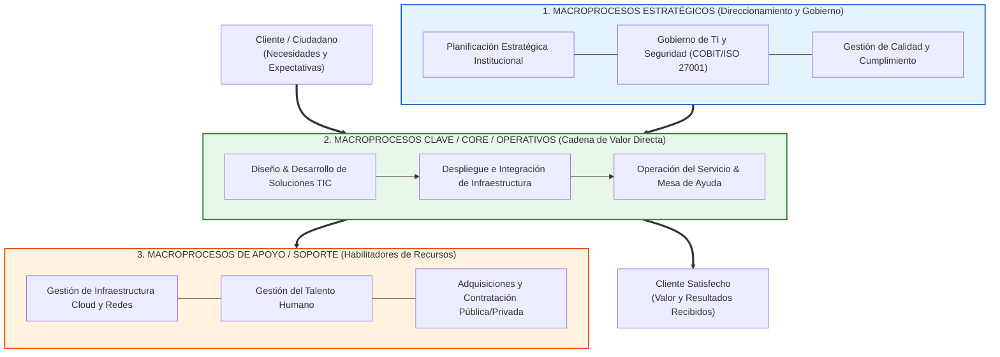
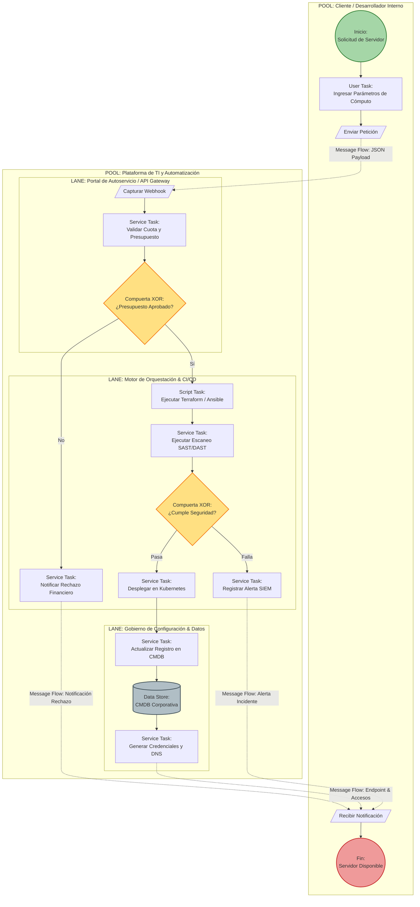
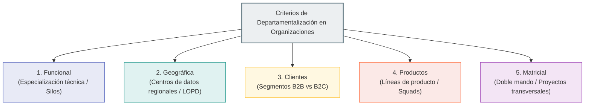
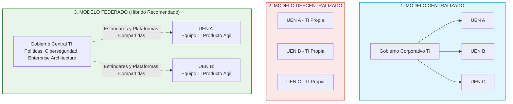
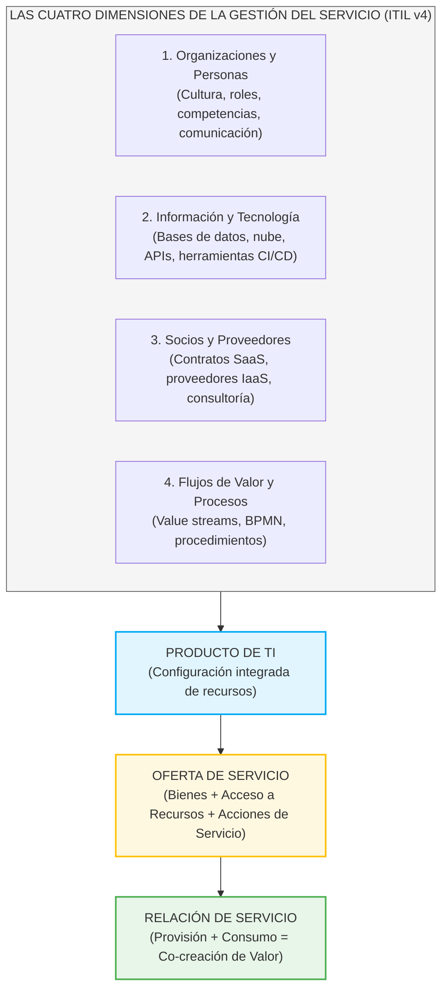
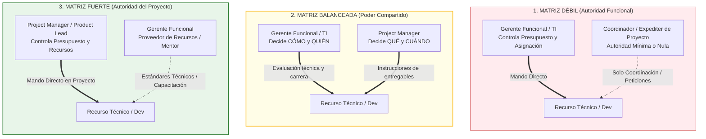
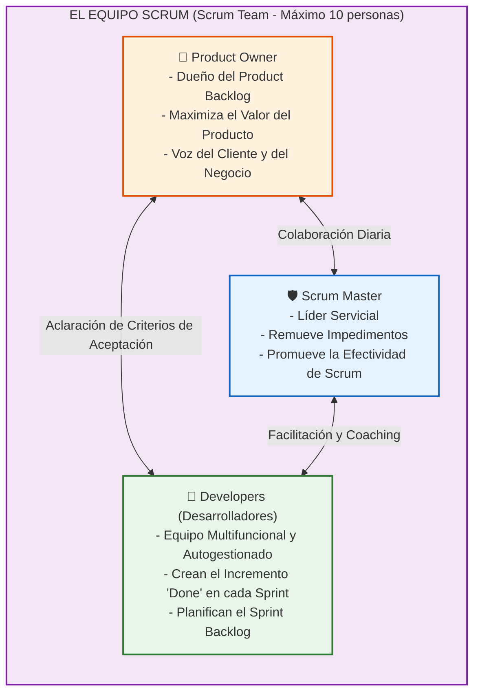

# Capítulo 3: Estructuras Organizacionales, Procesos y Roles en la Gestión de TICs

> **Asignatura:** Gestión de Tecnologías de la Información y Comunicación (ICCD943)  
> **Unidad Académica:** Facultad de Ingeniería de Sistemas — Escuela Politécnica Nacional (EPN)  
> **Nivel:** Pregrado Avanzado / Titulación  
> **Docente Catedrático:** Cátedra de Gestión de TICs  

---

> [!info] 💡 ¿Cómo entender esto desde cero? (Guía para novatos de pregrado)
> Imagina que una empresa no es un edificio lleno de escritorios, sino una **fábrica digital de software y valor**. En el modelo antiguo (el tradicional), los ingenieros estaban encerrados en un sótano llamado "Departamento de Sistemas", los vendedores en otro piso y los operadores en otro. Nadie hablaba con nadie; cuando el cliente pedía un cambio, el papel pasaba de un departamento a otro como una patata caliente, y si algo fallaba, todos se culpaban entre sí. A esto se le conoce como **silos funcionales**.
>
> Este capítulo te enseña la ingeniería detrás de cómo se organiza el trabajo humano y tecnológico para romper esos muros:
> 1. **La Cadena de Valor:** Comprender el camino exacto que recorre una idea o un insumo desde que entra a la organización hasta que se transforma en dinero y satisfacción para el cliente, y cómo las TICs (ERP, Cloud, CRM, DevOps) potencian cada centímetro de esa ruta.
> 2. **Gestión por Procesos (BPMN 2.0):** Dejar de ver a la empresa como un "organigrama jerárquico de jefes" y empezar a verla como un **algoritmo de negocio horizontal**, donde existen flujos, eventos, compuertas lógicas y carriles de responsabilidad formalmente modelados.
> 3. **Servicios (ITIL v4):** Entender que un departamento de TI moderno ya no "vende computadoras ni instala software", sino que **habilita capacidades y co-crea valor** para que el negocio venda más o atienda mejor, absorbiendo los riesgos tecnológicos para que el cliente no tenga que preocuparse por ellos.
> 4. **Estructuras Matriciales y Equipos Multifuncionales:** Aprender a convivir en estructuras donde tienes dos líderes (el técnico y el de proyecto) y cómo diseñar equipos autónomos donde convivan desarrolladores, testers, analistas de negocio y expertos de seguridad sin estorbarse.
> 5. **Roles Claros:** Distinguir entre quién es el dueño del problema (*Product Owner* o *Project Manager*), quién guía la arquitectura, quién escribe código y quién responde legalmente ante la empresa.

---

## 3.1 Procesos Empresariales, Cadena de Valor y TICs

### 3.1.1 Los Procesos dentro de la Organización Funcional Tradicional

Históricamente, la organización del trabajo empresarial ha seguido los postulados de la administración científica de Frederick Taylor y la teoría clásica de Henri Fayol, fundamentadas en la **especialización del trabajo** y la **departamentalización funcional**. Bajo este paradigma, las empresas se estructuran en silos jerárquicos verticales (Finanzas, Producción, Marketing, Recursos Humanos, Sistemas/TI), donde la autoridad, la asignación presupuestaria y las líneas de reporte fluyen estrictamente de arriba hacia abajo (*top-down*).

```
[Dirección General]
   ├── [Finanzas]  ──────> Métrica: Reducción de costos
   ├── [Ventas]    ──────> Métrica: Volumen de colocación
   ├── [TI / Sist] ──────> Métrica: Uptime de servidores y tickets cerrados
   └── [Operac.]   ──────> Métrica: Producción por lote
       
* Problema: El flujo de valor al cliente atraviesa horizontalmente todas las áreas,
  pero las decisiones y presupuestos se gestionan verticalmente.
```

#### Patologías de la Organización Funcional en la Gestión de TI:
1. **Silos Funcionales y Guerra de Feudos:** Cada departamento optimiza sus propios indicadores locales (KPIs locales) a expensas de la eficiencia global del negocio (*suboptimización sistémica*). Por ejemplo, el departamento de TI puede celebrar una disponibilidad del 99.9% en sus servidores mientras el departamento de ventas pierde clientes debido a que la pasarela de pagos integrada tarda 45 segundos en confirmar una transacción.
2. **Fragmentación Extrema del Servicio al Cliente (Efecto "Pasar la Pelota" o *Throwing over the wall*):** El cliente experimenta una atención fracturada. Cuando ocurre una incidencia, Ventas culpa a Facturación, Facturación a Logística y Logística al "sistema que se cayó". Nadie es dueño de la experiencia del cliente de punta a punta (*End-to-End Ownership*).
3. **Pérdida de Contexto y Costos de Transacción Internos:** Cada traspaso de información entre departamentos genera asimetrías de información, tiempos muertos en colas de espera (*lead time* inflado) y reinterpretación de requisitos, elevando exponencialmente la tasa de retrabajo y el desperdicio (*waste* o *muda*).

---

### 3.1.2 La Cadena de Valor de Michael Porter

En 1985, Michael E. Porter (profesor de Harvard Business School) revolucionó la teoría de la gestión estratégica con su obra *Competitive Advantage: Creating and Sustaining Superior Performance*, introduciendo el concepto de la **Cadena de Valor**. Porter demostró que la ventaja competitiva no puede comprenderse mirando a la empresa como un todo monolítico, sino desagregando a la organización en sus **actividades discretas de generación de valor**.

> [!definition] Definición Formal: Cadena de Valor
> Conjunto articulado e interdependiente de actividades diseñadas, ejecutadas y coordinadas por una organización que permiten transformar insumos en productos o servicios finales con un valor económico superior al costo acumulado de todas las actividades.

El modelo de Porter divide las actividades organizacionales en dos grandes grupos: **Actividades Primarias** y **Actividades de Soporte (o Secundarias)**, las cuales culminan en el **Margen de Valor**.

```mermaid
flowchart LR
    subgraph Soporte["ACTIVIDADES DE SOPORTE / SECUNDARIAS"]
        direction TB
        S1["Infraestructura de la Empresa (Finanzas, Legal, Planificación, Gobierno TI)"]
        S2["Gestión de Recursos Humanos (Reclutamiento, Retención, Plan de Carrera Tech)"]
        S3["Desarrollo Tecnológico (I+D, Arquitectura TI, Ingeniería de Software)"]
        S4["Aprovisionamiento / Compras (Adquisición de Hardware, Licenciamiento Cloud, SaaS)"]
    end

    subgraph Primarias["ACTIVIDADES PRIMARIAS"]
        direction LR
        P1["Logística Interna\n(Inbound)"] --> P2["Operaciones\n(Operations)"]
        P2 --> P3["Logística Externa\n(Outbound)"]
        P3 --> P4["Marketing y Ventas\n(Mkt & Sales)"]
        P4 --> P5["Servicios Postventa\n(Service)"]
    end

    Primarias --> Margen["MARGEN DE VALOR\n(Beneficio = Valor Percibido - Costos Totales)"]
    Soporte -.-> Primarias
    Soporte --> Margen

    style Margen fill:#f96,stroke:#333,stroke-width:2px,color:#000
    style Soporte fill:#e1f5fe,stroke:#0288d1,stroke-width:1px
    style Primarias fill:#e8f5e9,stroke:#388e3c,stroke-width:1px
```



#### A. Actividades Primarias
Son aquellas que intervienen directamente en la creación física del producto o servicio, su transferencia al comprador y el soporte posterior a la venta:

1. **Logística Interna (*Inbound Logistics*):**
   - *Definición:* Recepción, almacenamiento, control de inventario y distribución interna de materias primas o insumos de información.
   - *Ejemplo tradicional:* Recepción de granos en una planta cervecera.
   - *Impacto de TICs:* Sistemas de identificación por radiofrecuencia (RFID), lectores IoT, escaneo automatizado en almacenes inteligentes y sistemas WMS (*Warehouse Management Systems*) integrados al ERP en tiempo real.
2. **Operaciones (*Operations*):**
   - *Definición:* Transformación de los insumos en el producto o servicio final (mecanizado, empaque, ensamblaje, ejecución de servicios).
   - *Ejemplo tradicional:* Línea de montaje automotriz.
   - *Impacto de TICs:* Manufactura Integrada por Computadora (CIM), robótica industrial conectada por 5G privado, gemelos digitales (*Digital Twins*) para mantenimiento predictivo y orquestadores de microservicios para transacciones digitales.
3. **Logística Externa (*Outbound Logistics*):**
   - *Definición:* Recolección, almacenamiento, despacho y distribución física o digital del producto terminado hacia los compradores o centros de distribución.
   - *Ejemplo tradicional:* Flota de camiones distribuidores con guías impresas.
   - *Impacto de TICs:* Sistemas TMS (*Transportation Management Systems*), optimización de rutas mediante algoritmos genéticos y telemetría satelital (GPS), redes CDN (*Content Delivery Networks*) y plataformas de distribución continua para software y contenidos digitales.
4. **Marketing y Ventas (*Marketing & Sales*):**
   - *Definición:* Mecanismos mediante los cuales los clientes conocen el producto o servicio, son persuadidos de su valor y pueden consumar la compra legal y económicamente.
   - *Ejemplo tradicional:* Publicidad en prensa y vendedores de puerta a puerta.
   - *Impacto de TICs:* Plataformas de Comercio Electrónico (B2B/B2C), pasarelas de pago tokenizadas, sistemas CRM (*Customer Relationship Management* como Salesforce o HubSpot), motores de personalización basados en *Machine Learning* y analítica de embudos de conversión (*funnel analytics*).
5. **Servicios Postventa (*Service*):**
   - *Definición:* Actividades destinadas a mantener, potenciar o recuperar el valor del producto o servicio tras su entrega (instalación, reparación, entrenamiento, actualizaciones y soporte técnico).
   - *Ejemplo tradicional:* Taller de garantías con boletas de servicio manuales.
   - *Impacto de TICs:* Mesas de ayuda omnicanal con acuerdos de nivel de servicio (SLAs) automatizados, agentes conversacionales basados en Modelos de Lenguaje (LLMs), diagnóstico remoto telemático y portales de autogestión de usuarios (*Self-service portals*).

#### B. Actividades de Soporte (o Secundarias)
Respaldan a las actividades primarias y se sustentan entre sí proporcionando insumos, tecnología, personal y funciones administrativas:

1. **Infraestructura de la Empresa (*Firm Infrastructure*):**
   - Gestión general, planificación estratégica, contabilidad, finanzas, asesoría legal y gobierno corporativo.
   - *Rol de las TICs:* Sistemas ERP (*Enterprise Resource Planning* como SAP S/4HANA u Oracle Cloud), paneles de control ejecutivo (*Executive Dashboards* y Power BI) y plataformas de auditoría y cumplimiento regulatorio automatizado (*GRC - Governance, Risk and Compliance*).
2. **Gestión de Recursos Humanos (*Human Resource Management*):**
   - Reclutamiento, contratación, compensación, evaluación del desempeño y plan de capacitación del personal.
   - *Rol de las TICs:* Sistemas HCM (*Human Capital Management* como Workday), plataformas de aprendizaje virtual (LMS), algoritmos de *people analytics* y herramientas de trabajo colaborativo distribuido (Slack, Microsoft Teams, GitHub Enterprise).
3. **Desarrollo Tecnológico (*Technology Development / R&D*):**
   - Conocimiento técnico, procedimientos, métodos de diseño, patentes y la infraestructura de TICs de la empresa.
   - *Rol de las TICs:* Pipelines de CI/CD, entornos de pruebas en la nube efímeros, marcos de experimentación A/B, herramientas de modelado de software (Enterprise Architect) e infraestructura como código (IaC con Terraform).
4. **Compras / Aprovisionamiento (*Procurement*):**
   - Función de adquisición de insumos, materiales, consumibles, licencias y servicios externos utilizados en toda la cadena de valor.
   - *Rol de las TICs:* Plataformas de aprovisionamiento electrónico (*e-Procurement* como SAP Ariba), subastas inversas en línea y contratos inteligentes (*Smart Contracts*) en cadenas de suministro corporativas.

---

### 3.1.3 El Margen de Valor y la Transformación Digital por TICs

> [!important] Fórmula Teórica del Margen
> $$\text{Margen de Valor} = \text{Valor Total Percibido (Monto que el cliente está dispuesto a pagar)} - \sum (\text{Costos de Actividades Primarias y de Soporte})$$

La rentabilidad superior de una empresa surge de una de dos estrategias competitivas básicas de Porter:
1. **Liderazgo en Costos:** Realizar las actividades de la cadena de valor con menor costo que los competidores sin degradar la calidad aceptable.
2. **Diferenciación:** Ejecutar las actividades de forma única y superior, permitiendo cobrar un sobreprecio (*premium price*) que supera con creces el costo de diferenciarse.

#### Matriz de Transformación Digital por Actividad de la Cadena de Valor:

| Actividad de la Cadena | Tecnología TIC Aplicada | Mecanismo de Impacto en el Margen | Métrica de Desempeño (KPI) |
| :--- | :--- | :--- | :--- |
| **Logística Interna** | RFID pasivo/activo + WMS Cloud + Sensores IoT | Eliminación de descuadres de bodega, recepción automatizada de mercancía sin intervención manual. | Tasa de exactitud de inventario (*Inventory Accuracy Rate* > 99.8%) |
| **Operaciones** | MES (*Manufacturing Execution Systems*) + Machine Learning | Detección predictiva de defectos de manufactura antes del empaque, optimización de uso de CPU/RAM en cómputo nube. | Tasa de defectos (*Scrap Rate* / DPMO), OEE (*Overall Equipment Effectiveness*) |
| **Logística Externa** | Algoritmos de enrutamiento dinámico (VRP) + API Tracking | Reducción de costos de combustible, consolidación automática de despachos y notificación telemática al cliente. | Tiempo de entrega en última milla (*Order-to-Delivery Lead Time*) |
| **Marketing y Ventas** | CRM Analítico + CDP (*Customer Data Platform*) + IA Generativa | Hiperpersonalización de ofertas, reducción del costo de adquisición de clientes (CAC) y aumento del ticket promedio. | CAC (*Customer Acquisition Cost*), LTV (*Customer Lifetime Value*) |
| **Servicios Postventa** | Chatbots NLP + Telemetría remota + ITIL Service Desk | Resolución en primer contacto (FCR), autoservicio guiado y soporte proactivo antes de que el usuario reporte la falla. | FCR (*First Contact Resolution*), MTTR (*Mean Time to Resolve*), CSAT |
| **Infraestructura (TI)** | Nube Híbrida / FinOps + ERP Integrado | Consolidación financiera en tiempo real, elasticidad de cómputo y reducción de costos operativos fijos (OpEx vs CapEx). | TCO (*Total Cost of Ownership*), ROI de proyectos de TI |

---

### 3.1.4 Cadenas de Valor de Innovación y Cadenas de Valor de Software

En la economía del conocimiento y la era digital, la cadena de valor física de Porter debe complementarse con la **Cadena de Valor de Innovación y Software**. Una empresa moderna no compite únicamente por su capacidad de mover átomos, sino por su velocidad para transformar **ideas en software operativo** entregado a los usuarios finales.

```mermaid
flowchart LR
    A["💡 Requerimiento / Hipótesis de Negocio"] --> B["🎨 Diseño & Arquitectura\n(DDD, UX/UI, Wireframes)"]
    B --> C["💻 Desarrollo Ágil\n(Clean Code, TDD, Git Branching)"]
    C --> D["⚙️ Integración Continua (CI)\n(Build, Static Analysis, Unit Tests)"]
    D --> E["🧪 Testing Automatizado\n(Integration, Security SAST/DAST)"]
    E --> F["🚀 Despliegue Continuo (CD)\n(ArgoCD, K8s, Canary/Blue-Green)"]
    F --> G["📈 Operación & Observabilidad\n(Prometheus, Grafana, OpenTelemetry)"]
    G --> H["🔄 Telemetría & Retroalimentación\n(Analítica de Producto, A/B Testing)"]
    H -.->|Retroalimenta Backlog| A

    style A fill:#fff3e0,stroke:#e65100,stroke-width:2px
    style D fill:#e8eaf6,stroke:#283593,stroke-width:2px
    style F fill:#e8f5e9,stroke:#2e7d32,stroke-width:2px
    style G fill:#fce4ec,stroke:#c2185b,stroke-width:2px
```



#### Fases de la Cadena de Valor de Software:
1. **Ideación e Hipótesis de Negocio (*Product Discovery*):** Identificación de dolores del usuario mediante entrevistas, métricas y diseño de experimentos mínimos viables (MVP).
2. **Diseño y Modelado:** Definición de la experiencia del usuario (UX) y arquitectura de software alineada al dominio (*Domain-Driven Design - DDD*).
3. **Construcción e Integración Continua (CI):** Fusión frecuente de código en ramas compartidas, activando pruebas unitarias automáticas y análisis estático de vulnerabilidades (SonarQube).
4. **Validación y Pruebas Automatizadas:** Pruebas de integración, rendimiento (JMeter), seguridad y validación de contratos entre microservicios.
5. **Entrega y Despliegue Continuo (CD):** Lanzamiento de versiones a entornos de producción mediante estrategias de riesgo mínimo como *Canary Releases* o *Blue-Green Deployments*.
6. **Operación y Observabilidad:** Monitoreo en tiempo real de los *Four Golden Signals* (Latencia, Tráfico, Errores y Saturación) utilizando trazabilidad distribuida y registros centralizados.
7. **Bucle de Aprendizaje (*Feedback Loop*):** Los datos telemáticos de uso real alimentan de nuevo la cartera de productos, cerrando el ciclo *Lean Startup* (*Build-Measure-Learn*).

---

### 3.1.5 Cadena de Valor (Value Chain) vs. Cadena de Suministro (Supply Chain)

Es común que los estudiantes de pregrado confundan ambos conceptos debido a la traducción semántica y a que operan de manera simultánea en las corporaciones. Sin embargo, su orientación ontológica, metodológica y operativa es profundamente diferente.

> [!definition] Tabla Comparativa: Value Chain vs. Supply Chain

| Criterio Diferenciador | Cadena de Valor (*Value Chain*) | Cadena de Suministro (*Supply Chain*) |
| :--- | :--- | :--- |
| **Autor Intelectual / Referencia** | Michael E. Porter (1985). | Concepto evolutivo de logística integrada (Oliver & Webber, 1982; SCOR Model). |
| **Perspectiva Central** | **Estratégica y orientada al cliente:** ¿Cómo generamos valor percibido suficiente para maximizar el margen de beneficio? | **Operativa y orientada al producto/insumo:** ¿Cómo movemos materiales y productos desde el proveedor original hasta el cliente final al menor costo y tiempo? |
| **Flujo Primario** | **Flujo de Valor y Diferenciación:** Adición de atributos apreciados por el cliente a lo largo del proceso. | **Flujo Físico y Logístico:** Materiales, componentes, inventarios, almacenaje y transporte físico/digital. |
| **Dirección del Pensamiento** | Desde la demanda/cliente hacia atrás (¿Qué valora el cliente y cuánto está dispuesto a pagar?). | Desde el suministro hacia adelante (¿Cómo abastecemos eficientemente la demanda esperada?). |
| **Indicador Clave de Éxito** | Margen de rentabilidad ($\% \text{ Margen EBITDA}$), Retorno sobre el Capital Empleado (ROCE), Ventaja Competitiva Sostenible. | Costo Logístico Total, Tasa de cumplimiento perfecto (*Perfect Order Rate*), Rotación de Inventarios, *Lead Time* de entrega. |
| **Sistemas de Información Críticos** | CRM, Business Intelligence, Big Data Analytics, Plataformas de Innovación, Herramientas de Diseño y Pricing. | SCM (*Supply Chain Management*), TMS, WMS, EDI (*Electronic Data Interchange*), Planificación de Demanda (APS). |

> [!example] Caso Práctico EPN: Fabricante de Software Bancario en Quito
> - Su **Cadena de Suministro** gestiona la adquisición de servidores en rack, contratación de enlaces troncales de fibra óptica con proveedores locales de telecomunicaciones, y licencias de bases de datos relacionales asegurando stock y aprovisionamiento oportuno.
> - Su **Cadena de Valor** abarca la arquitectura de microservicios con alta tolerancia a fallos, la certificación PCI-DSS, el soporte 24/7 con ingenieros especializados y la interfaz bancaria web accesible que permite a una cooperativa ecuatoriana captar 100,000 nuevos cuentahabientes. El cliente no paga por los servidores físicos (suministro), sino por la confiabilidad y cumplimiento financiero (valor y margen).

---

## 3.2 Organización basada en Procesos

### 3.2.1 De la Visión Vertical Jerárquica a la Visión Horizontal BPM

El enfoque de **Gestión por Procesos de Negocio** (*Business Process Management* - BPM) rompe con el paradigma de los organigramas estáticos basados en puestos y jefaturas, reorientando a la organización hacia los flujos de actividades transversales que crean valor directamente para el cliente final.

```
VISIÓN FUNCIONAL VERTICAL (Silos)          VISIÓN POR PROCESOS HORIZONTAL (BPM)
┌────────┐ ┌────────┐ ┌────────┐           ┌──────────────────────────────────────┐
│ Finan. │ │ Operac │ │ TI/Sis │           │ PROCESO: Solicitud de Crédito Online │
│   │    │ │   │    │ │   │    │           │ (Entrada: Cédula -> Finanzas ->      │
│   ▼    │ │   ▼    │ │   ▼    │           │  TI valida Score -> Operaciones      │
│ Silo 1 │ │ Silo 2 │ │ Silo 3 │           │  desembolsa -> Salida: Dinero en Cta)│
└────────┘ └────────┘ └────────┘           └──────────────────────────────────────┘
  Enfoque: ¿Quién es mi jefe?                Enfoque: ¿Quién es el cliente y qué valor recibe?
```

> [!definition] Proceso de Negocio (Definición Formal)
> Secuencia ordenada y coordinada de actividades lógicamente relacionadas, ejecutadas por personas o sistemas informáticos, que consumen recursos (entradas o *inputs*) y los transforman para generar un resultado medible (*output*) que añade valor a un cliente interno o externo.

El ciclo de vida BPM consta de 5 fases iterativas:
1. **Diseño:** Identificación de procesos y diseño de reglas de negocio.
2. **Modelado:** Representación formal en notación gráfica estandarizada (BPMN 2.0).
3. **Ejecución:** Implementación manual, asistida o automatizada mediante motores BPMS.
4. **Monitoreo:** Seguimiento en tiempo real mediante indicadores clave de procesos (BAM - *Business Activity Monitoring*).
5. **Optimización:** Minería de procesos (*Process Mining*) y rediseño continuo eliminando cuellos de botella.

---

### 3.2.2 El Mapa de Procesos de la Organización

El Mapa de Procesos constituye la representación gráfica global de la arquitectura de procesos de una entidad. Se estructura universalmente en tres categorías de macroprocesos:



#### Jerarquía de Desagregación de Procesos:
* **Nivel 0 (Macroproceso):** Agrupación de alto nivel de procesos con objetivos afines (ej. *Gestión de Servicios de Telecomunicaciones*).
* **Nivel 1 (Proceso):** Conjunto específico de actividades que responden a una misión concreta (ej. *Atención y Resolución de Incidentes Críticos*).
* **Nivel 2 (Subproceso):** Subconjunto de actividades con lógica operativa propia y entradas/salidas definidas (ej. *Diagnóstico de Caída de Enlace WAN*).
* **Nivel 3 (Actividad / Tarea Procedimentada):** Nivel de máxima granularidad ejecutable por un operador o script (ej. *Reiniciar interfaz BGP en router perimetral*).

---

### 3.2.3 Documentación y Diagramación Formal en BPMN 2.0 (ISO/IEC 19510)

BPMN 2.0 (*Business Process Model and Notation*) es el estándar industrial internacional mantenido por el OMG (*Object Management Group*) y ratificado por ISO/IEC 19510. Permite unificar el entendimiento entre analistas de negocio, auditores, arquitectos de software y motores de ejecución.

#### Taxonomía Fundamental de Elementos BPMN 2.0:

```
ELEMENTOS BPMN 2.0
├── 1. Objetos de Flujo
│   ├── Eventos (Inicio, Intermedio, Fin)
│   ├── Actividades (Tareas y Subprocesos)
│   └── Compuertas / Pasarelas (Gateways)
├── 2. Datos y Artefactos
│   ├── Objetos de Datos (Data Object)
│   ├── Almacenes de Datos (Data Store)
│   └── Anotaciones de Texto y Grupos
├── 3. Contenedores de Organización
│   ├── Pools (Participantes / Empresas independientes)
│   └── Lanes (Roles, Departamentos, Sistemas)
└── 4. Conectores
    ├── Flujo de Secuencia (Sólido, dentro de un Pool)
    ├── Flujo de Mensaje (Punteado, entre Pools distintos)
    └── Asociación (Puntos cortos, hacia Datos o Anotaciones)
```

#### A. Eventos (*Events*)
Indican algo que sucede durante el curso del proceso. Afectan el flujo y suelen tener una causa (disparador o *trigger*) o un impacto (resultado):
* **Eventos de Inicio (*Start Events*):** Círculo de línea delgada simple. Inician el proceso.
  - *Simple (None):* Inicio genérico no tipificado.
  - *Mensaje:* Se activa al recibir un mensaje externo o *webhook*.
  - *Temporizador (*Timer*):* Se dispara a una fecha fija o con periodicidad (ej. cron job).
  - *Condicional:* Se dispara cuando una regla de negocio se vuelve verdadera.
* **Eventos Intermedios (*Intermediate Events*):** Círculo de doble línea. Ocurren entre el inicio y el fin.
  - Pueden ser *Catching* (capturan un evento y pausan el flujo hasta que ocurra) o *Throwing* (emiten una señal o mensaje y continúan).
  - *Tipos comunes:* Temporizador (espera 24 horas), Enlace (*Link*), Error, Cancelación.
* **Eventos de Fin (*End Events*):** Círculo de línea gruesa. Señalan la culminación de un camino del proceso.
  - *Simple:* Término natural de la rama.
  - *Error:* Lanza una excepción técnica o de negocio para ser capturada.
  - *Mensaje:* Envía una confirmación al concluir.
  - *Terminación (*Terminate End Event*):* Círculo relleno; mata instantáneamente todas las ramas activas del proceso en ejecución.

#### B. Actividades (*Activities*)
Trabajo ejecutado dentro del proceso. Se representan con rectángulos de esquinas redondeadas:
* **Tareas Simples (*Atomic Tasks*):**
  - **User Task (Tarea de Usuario):** Ejecutada por un humano asistido por un sistema informático (ícono de usuario).
  - **Service Task (Tarea de Servicio):** Ejecutada automáticamente por un software, API o microservicio sin intervención humana (ícono de engranajes).
  - **Script Task (Tarea de Script):** Ejecutada directamente por el motor BPMS ejecutando código interpretado (ícono de documento/script).
  - **Manual Task (Tarea Manual):** Ejecutada físicamente por una persona sin soporte informático (ícono de mano).
  - **Business Rule Task:** Invoca un motor de reglas de negocio (DMN).
* **Subprocesos (*Subprocesses*):** Actividad compuesta que puede desglosarse.
  - *Embebido:* Vive únicamente dentro del proceso padre.
  - *Reusable (*Call Activity*):* Proceso independiente referenciado y reutilizado con su propio ciclo de vida (borde más grueso).

#### C. Pasarelas o Compuertas (*Gateways*)
Controlan la divergencia y convergencia de los flujos de secuencia. Se representan con un rombo:
* **Exclusiva basada en Datos (XOR - ícono con X o vacío):** Evalúa condiciones y selecciona **exactamente un camino** saliente. En convergencia, espera que llegue un flujo para avanzar.
* **Paralela (AND - ícono con signo +):** Bifurca el flujo en **todas las ramas concurrentemente sin evaluar condiciones**. En convergencia, actúa como punto de sincronización: detiene la ejecución hasta que todas las ramas paralelas hayan alcanzado la compuerta.
* **Inclusiva (OR - ícono con círculo interno O):** Evalúa condiciones y puede activar **una, varias o todas las ramas** cuyas expresiones resulten verdaderas. En convergencia, sincroniza solo aquellas ramas que fueron efectivamente activadas.
* **Basada en Eventos (*Event-Based Gateway* - ícono con pentágono interno):** La decisión no depende de datos del proceso, sino de cuál evento externo ocurra primero (ej. ¿Llega la confirmación de pago por webhook o expira el temporizador de 15 minutos?).

#### D. Contenedores de Organización y Conectores
* **Pools:** Representan entidades legales, organizaciones o sistemas autónomos distintos. La comunicación entre dos Pools se realiza **exclusivamente mediante Flujos de Mensaje** (líneas discontinuas con círculo de inicio y flecha abierta).
* **Lanes (Carriles):** Subdivisiones dentro de un mismo Pool. Representan roles, unidades funcionales o componentes de software internos.
* **Regla Sintáctica Estricta de BPMN 2.0:** Los **Flujos de Secuencia** (líneas continuas con flecha sólida) jamás pueden cruzar los límites de un Pool a otro; solo operan dentro del mismo Pool (aunque pueden cruzar Lanes internamente).

---

### 3.2.4 Diagrama Formal de Proceso: Aprovisionamiento de Servicios Cloud

A continuación se modela un proceso integral de provisión de infraestructura corporativa utilizando la semántica estricta de BPMN 2.0, ilustrando Pools, Lanes, Compuertas lógicas, Tareas tipificadas y Almacenes de Datos:



---

### 3.2.5 Metodología de Diseño: Greenfield vs. Reingeniería (BPR: As-Is / To-Be)

Existen dos abordajes fundamentales para estructurar procesos en las organizaciones:

```
ENFOQUE GREENFIELD (Desde cero)            REINGENIERÍA BPR (As-Is -> To-Be)
┌──────────────────────────────┐           ┌──────────────┐     ┌──────────────┐
│  Hoja en Blanco              │           │ Modelo As-Is │ ──> │ Modelo To-Be │
│  - Sin deuda técnica previa  │           │ (Diagnóstico │     │ (Optimizado, │
│  - 100% Nativo en la Nube    │           │  de cuellos  │     │  automatizado│
│  - Máxima agilidad inicial   │           │  de botella) │     │  sin silos)  │
└──────────────────────────────┘           └──────────────┘     └──────────────┘
```

1. **Diseño Greenfield (Desde Cero):**
   - Se utiliza en *startups*, nuevas subsidiarias o lanzamientos de productos disruptivos. No existe un proceso preexistente ni sistemas legados (*legacy*).
   - *Ventajas:* Libertad total de arquitectura, adopción inmediata de mejores prácticas nativas de nube y cero resistencia al cambio organizativo previo.
   - *Riesgos:* Falta de datos históricos de volumetría, incertidumbre regulatoria y necesidad de probar hipótesis en producción.
2. **Rediseño y Reingeniería de Procesos de Negocio (*Business Process Reengineering - BPR*):**
   - Propuesto originalmente por Michael Hammer y James Champy (1993). Busca mejoras radicales en costo, calidad, servicio y rapidez mediante el rediseño fundamental.
   - **Fase As-Is (Estado Actual):** Modelado forense del proceso tal como opera hoy en día, revelando desperdicios (*muda*), duplicidad de aprobaciones, traspasos manuales y pasos sin valor agregado.
   - **Fase de Análisis de Brechas (*Gap Analysis*) y Métricas:** Medición del tiempo de ciclo (*Cycle Time*), tiempo de procesamiento (*Touch Time*) y eficiencia del flujo de trabajo:
     $$\text{Eficiencia de Ciclo del Proceso} = \frac{\text{Tiempo con Valor Agregado (Touch Time)}}{\text{Tiempo Total de Ciclo (Lead Time)}} \times 100\%$$
     *(En procesos tradicionales de TI no optimizados, esta eficiencia suele ser inferior al 5% debido a tiempos de espera en tickets).*
   - **Fase To-Be (Estado Objetivo Deseado):** Modelo optimizado donde se eliminan aprobaciones burocráticas redundantes, se reemplazan tareas manuales por integraciones de API y se reconfiguran las responsabilidades hacia la autonomía del equipo.

---

### 3.2.6 Niveles de Granularidad en el Modelado de Procesos

Para evitar confusiones en los proyectos de transformación digital, el estándar BPM define tres niveles de abstracción:

```
NIVEL 3: EJECUTABLE (XML / WSDL / REST / Camunda / Variables de Memoria)
  ▲
NIVEL 2: ANALÍTICO (BPMN Completo, Manejo de Errores, Compuertas, SLAs)
  ▲
NIVEL 1: DESCRIPTIVO (Macroflujos, Directivos, Sin Detalles Técnicos)
```

1. **Nivel Descriptivo (Nivel 1 - Orientado a la Dirección Ejecutiva):**
   - *Audiencia:* Junta directiva, gerentes generales y tomadores de decisiones no técnicos.
   - *Características:* Utiliza un subconjunto simplificado de BPMN (eventos de inicio y fin simples, tareas genéricas y compuertas XOR básicas). El objetivo es comunicar el propósito estratégico del proceso y las áreas participantes sin entrar en casuísticas complejas.
2. **Nivel Analítico (Nivel 2 - Orientado a Calidad, Auditores y Analistas de Negocio):**
   - *Audiencia:* Ingenieros de procesos, analistas de negocio (*Business Analysts*), oficiales de cumplimiento y auditores ISO/IEC.
   - *Características:* Define rigurosamente todas las excepciones del flujo, compuertas inclusivas/paralelas, eventos temporizadores de escalamiento, políticas de compensación transaccional y Acuerdos de Nivel de Servicio (SLAs).
3. **Nivel Ejecutable (Nivel 3 - Orientado a Motores BPMS y Arquitectura de Software):**
   - *Audiencia:* Desarrolladores de software, ingenieros de integración y motores BPMS (Camunda BPM, jBPM, Bonita, IBM BPM).
   - *Características:* El diagrama genera una especificación XML ejecutable conforme al esquema BPMN 2.0. Cada tarea contiene metadatos de configuración técnica: variables de entrada/salida tipificadas, llamadas HTTP/REST a microservicios, mapeo JSON, clases Java subyacentes y expresiones condicionales legibles por máquina (JUEL / Camunda FEEL).

---

## 3.3 Organización basada en Departamentos

### 3.3.1 Criterios Tradicionales de Departamentalización y su Impacto en TI

La departamentalización es la división formal de la organización en unidades especializadas bajo directrices comunes. Cada criterio de departamentalización impone condiciones arquitectónicas y operativas específicas sobre las Tecnologías de Información.



#### 1. Departamentalización Funcional
- **Concepto:** Agrupación basada en la similitud de actividades y competencias técnicas (ej. Finanzas, Producción, Marketing, TI).
- **Ventajas Técnicas:** Alta eficiencia por economías de escala internas; desarrollo profundo de especialidades técnicas; trayectorias de carrera claras para los ingenieros (ej. Junior DBA -> Senior DBA).
- **Impacto y Desventajas en TI:** Formación de silos infranqueables; los ingenieros de TI se desconectan de las necesidades comerciales de los clientes; tiempos prolongados de respuesta ante cambios del mercado; la TI es percibida como un "centro de costos" en lugar de un socio estratégico.

#### 2. Departamentalización Geográfica o Territorial
- **Concepto:** Agrupación basada en áreas geográficas o mercados regionales (ej. Región Sierra, Región Costa, Subsidiaria Internacional).
- **Impacto y Desafíos en TI:**
  - *Latencia y Conectividad:* Necesidad de diseñar redes de área amplia (SD-WAN) y topologías distribuidas de nube multi-región para garantizar tiempos de respuesta aceptables.
  - *Soberanía de Datos y Cumplimiento Legal:* Obligación de mantener bases de datos dentro de fronteras específicas según las regulaciones locales (ej. Ley Orgánica de Protección de Datos Personales del Ecuador - LOPDP, o GDPR en la Unión Europea).
  - *Sincronización de Datos:* Implementación de arquitecturas de consistencia eventual, replicación activa-pasiva o activa-activa entre centros de datos geodistribuidos.

#### 3. Departamentalización por Clientes
- **Concepto:** Agrupación según el tipo o segmento de cliente atendido (ej. Banca Corporativa vs Banca Retail; Sector Público vs Sector Privado).
- **Impacto en TI:**
  - Desarrollo de sistemas y portales altamente especializados para cada tipología de cliente.
  - Exigencias de seguridad y acuerdos de nivel de servicio (SLA) dispares: mientras el segmento B2B exige autenticación basada en certificados mTLS y APIs dedicadas, el segmento B2C requiere aplicaciones móviles ligeras con autenticación biométrica y alta concurrencia.

#### 4. Departamentalización por Productos o Servicios
- **Concepto:** Agrupación de todas las funciones necesarias para concebir, producir y comercializar una línea de producto bajo una sola dirección (ej. División de Tarjetas de Crédito, División de Seguros de Vida).
- **Impacto en TI:**
  - Creación de equipos de TI dedicados por producto, lo que acelera enormemente el *Time-to-Market*.
  - *Riesgo Técnico:* Duplicidad innecesaria de infraestructura, licencias de software y herramientas de desarrollo entre divisiones hermanas (ej. tres divisiones contratando proveedores de nube diferentes).

#### 5. Departamentalización Matricial
- **Concepto:** Estructura que superpone una autoridad basada en proyectos o productos sobre la estructura funcional permanente (analizada a fondo en la sección 3.5).

---

### 3.3.2 Unidades Estratégicas de Negocio (UEN / SBU - Strategic Business Units)

En grandes corporaciones y conglomerados multisectoriales, la escala organizativa hace inmanejable una estructura departamental única. Surge entonces el concepto de **Unidad Estratégica de Negocio (UEN)**, formulado originalmente por McKinsey y General Electric en la década de 1970.

> [!definition] Definición Formal: Unidad Estratégica de Negocio (UEN)
> Entidad organizativa semiautónoma dentro de una corporación que cuenta con su propia visión, plan estratégico, mercado objetivo, clientes y competidores identificables, y cuyo responsable directo rinde cuentas por la rentabilidad integral de la unidad.

#### Tres Condiciones Indispensables para Calificar como UEN:
1. **Misión y Mercado Propios:** Poseer un conjunto claramente definido de clientes externos y un mercado diferenciado con su propio portafolio de productos/servicios.
2. **Competidores Específicos e Identificables:** Competir contra rivales directos en su sector industrial particular (no compite con los mismos rivales que otras UENs del grupo corporativo).
3. **Control Sustancial sobre Recursos Clave:** Poseer autonomía suficiente para tomar decisiones operativas y estratégicas sobre sus funciones nucleares (desarrollo de producto, precios, operaciones y tecnología).

#### Modelos de Gobierno de TI en Corporaciones con UENs:



* **Modelo Centralizado:** Una sola dirección corporativa de TI atiende a todas las UENs. Maximiza economías de escala y estandarización, pero se convierte en un cuello de botella para la innovación rápida.
* **Modelo Descentralizado:** Cada UEN crea su propio departamento de TI independiente. Proporciona máxima agilidad local, pero genera islas de datos, redundancia masiva de costos y graves riesgos de ciberseguridad heterogénea (*Shadow IT institucionalizado*).
* **Modelo Federado (Estándar de la Industria):** El corporativo central define las directrices maestras (Arquitectura Empresarial, Ciberseguridad, Gobernanza de Datos y Negociación de Infraestructura Cloud), mientras que cada UEN mantiene equipos autónomos de ingeniería de software enfocados en la lógica particular de su negocio.

---

## 3.4 Organización basada en Servicios

### 3.4.1 Definición Formal de Servicio según ITIL v4

El marco de referencia global para la gestión de servicios digitales, **ITIL v4** (*Information Technology Infrastructure Library*), redefine la naturaleza misma de las tecnologías de la información dentro del ecosistema empresarial contemporáneo:

> [!definition] Definición Canónica de Servicio (ITIL v4)
> *"Un medio para facilitar la **co-creación de valor** al habilitar los **resultados** que los clientes quieren lograr, sin que el cliente tenga que gestionar **costos** y **riesgos** específicos."*

```
DESGLOSE ONTOLÓGICO DE LA DEFINICIÓN ITIL v4:
├── 1. Co-creación de Valor: El valor no lo "entrega" TI unilateralmente; surge de la colaboración
│                            activa entre el proveedor del servicio y el consumidor.
├── 2. Resultados (Outcomes): Lo que el cliente busca lograr en su negocio (ej. vender pasajes aéreos),
│                            diferente de una simple salida o entregable técnico (Output: un servidor activo).
├── 3. Eliminación de Costos: El cliente no compra racks de servidores ni licencias perpetuas; paga por
│                            el uso del servicio (OpEx) y TI asume la adquisición y amortización (CapEx).
└── 4. Mitigación de Riesgos: TI absorbe los riesgos de disponibilidad, fallos de hardware, parches de
                             ciberseguridad y escalabilidad; el cliente se enfoca en su actividad comercial.
```

---

### 3.4.2 Empresas Orientadas a Productos vs. Empresas Orientadas a Servicios

La teoría económica y la gestión de operaciones diferencian radicalmente los bienes tangibles manufacturados de los servicios intangibles mediante las cuatro dimensiones canónicas del paradigma **IHIP** (*Intangibility, Heterogeneity, Inseparability, Perishability*):

| Dimensión Canónica | Empresa Orientada a Productos (Bienes) | Empresa Orientada a Servicios (TI / Digital) | Implicación en Ingeniería de Software |
| :--- | :--- | :--- | :--- |
| **Tangibilidad (*Intangibility*)** | **Tangible:** El producto puede ser tocado, visto, pesado y almacenado en un inventario físico antes de su venta. | **Intangible:** El servicio es una experiencia, capacidad o desempeño que no tiene masa física directa. | El software empaquetado en CD-ROM (histórico) era un producto; el software como servicio (SaaS en la nube) es un servicio continuo. |
| **Separabilidad (*Inseparability*)** | **Separable:** La producción se realiza en una fábrica lejos del cliente, y el consumo ocurre tiempo después. | **Inseparable / Simultáneo:** La provisión del servicio ocurre concurrentemente con su consumo por parte del usuario. | Una API REST produce respuestas en el milisegundo exacto en que la aplicación del cliente realiza el consumo. Si la API cae, el servicio deja de existir. |
| **Homogeneidad (*Heterogeneity*)** | **Homogéneo / Estandarizado:** Producción en masa idéntica con tolerancias de manufactura estrictas bajo Six Sigma. | **Heterogéneo / Variable:** Cada interacción varía según la condición del usuario, la carga de la red, los datos de entrada y la experiencia humana. | Requiere observabilidad continua, ingeniería de confiabilidad de sitios (SRE), circuit breakers y degradación elegante del servicio. |
| **Perecibilidad (*Perishability*)** | **Almacenable:** Lo que no se vende hoy permanece en el almacén como activo corriente para venderse mañana. | **Perecedero / No almacenable:** La capacidad no utilizada en un instante dado se pierde irreversiblemente. | Los ciclos de CPU, ancho de banda y disponibilidad de agentes de soporte no pueden "guardarse en una caja"; si no se aprovechan o escalan dinámicamente, generan costo sin retorno. |

---

### 3.4.3 Productos y Servicios en ITIL v4

Bajo ITIL v4, los servicios no flotan en el vacío; se estructuran mediante la configuración balanceada de recursos organizacionales agrupados en las **Cuatro Dimensiones de la Gestión del Servicio**:



#### Componentes de una Oferta de Servicio (*Service Offering*):
1. **Bienes (*Goods*):** Elementos tangibles transferidos al consumidor, cuya propiedad pasa a este (ej. un teléfono IP corporativo entregado a un analista, un token físico de autenticación).
2. **Acceso a Recursos (*Access to Resources*):** Concesión de derechos para utilizar una infraestructura o activo bajo términos y condiciones predeterminados, sin transferir la propiedad (ej. acceso a una máquina virtual en AWS, cuenta corporativa de GitHub, cuota de conexión a red Wi-Fi).
3. **Acciones de Servicio (*Service Actions*):** Actividades ejecutadas por el proveedor para satisfacer una necesidad particular del usuario (ej. resolución de una duda en la mesa de ayuda, mantenimiento de parches en un clúster de base de datos, restauración de un respaldo).

#### La Dinámica de la Relación de Servicio:
* **Provisión de Servicios:** Actividades realizadas por la organización de TI para desplegar y operar los servicios (gestión de recursos, SLAs, soporte y facturación).
* **Consumo de Servicios:** Actividades realizadas por los usuarios para utilizar los servicios (solicitudes, consumo de transacciones, personalización).
* **Gestión de Relaciones de Servicio (*Service Relationship Management*):** Interacción bilateral continua entre proveedor y cliente para asegurar que las necesidades de negocio sigan alineadas con las capacidades de TI a lo largo del tiempo.

---

### 3.4.4 El Cambio de Paradigma: De "Entregar Tecnología" a la "Co-Creación de Valor"

Históricamente, los departamentos de TI se consideraban centros de soporte técnico evaluados por métricas de salidas físicas (*Outputs*):
- *"Instalamos 50 servidores nuevos."*
- *"Cerramos 1,200 tickets de soporte este mes."*
- *"La base de datos estuvo encendida el 99.5% del tiempo."*

En la organización moderna orientada a servicios, esas métricas son secundarias. El foco se traslada a los **Resultados de Negocio (*Outcomes*)** y a la **Co-Creación de Valor**:
- *"Habilitamos que la Cooperativa apruebe créditos de consumo en 3 minutos desde el celular, captando 15 millones de dólares adicionales en depósitos."*
- *"Redujimos el abandono del carrito de compras del 40% al 12% gracias a la optimización de latencia en la pasarela de pagos."*

```
PARADIGMA TRADICIONAL (Entrega Tecnológica)    PARADIGMA MODERNO (Co-creación de Valor)
┌─────────────────────────────────────────┐    ┌─────────────────────────────────────────┐
│ Proveedor de TI: Diseña, programa y     │    │ Negocio + TI: Diseñan juntos la         │
│ lanza el software "por encima del muro" │    │ experiencia del usuario en base a       │
│ al usuario. Si no lo usa o es difícil, │    │ hipótesis de valor compartidas. Ambos   │
│ no es problema de TI ("el código corre")│    │ co-diseñan, co-operan y responden por   │
│                                         │    │ la satisfacción y el impacto económico. │
└─────────────────────────────────────────┘    └─────────────────────────────────────────┘
```

---

## 3.5 Organizaciones Multifuncionales, Matriciales y Multidisciplinarias

### 3.5.1 Distinción Teórica Fundamental: Función vs. Disciplina

Un error recurrente en el diseño organizativo de ingeniería es utilizar indistintamente los términos "función" y "disciplina". Epistemológica y administrativamente representan realidades distintas:

> [!definition] Tabla de Diferenciación: Función vs. Disciplina

| Criterio | Función Organizacional | Disciplina Profesional / Científica |
| :--- | :--- | :--- |
| **Definición** | Unidad estructural, rol o departamento formalmente instituido en la empresa con una responsabilidad operativa específica. | Cuerpo acumulado de conocimiento, metodologías, rigor científico y técnicas dominadas por un individuo. |
| **Naturaleza** | Estructural, administrativa, jerárquica y corporativa. | Académica, epistemológica, profesional y vocacional. |
| **Pregunta que responde** | *¿Qué objetivo organizativo persigue y dentro de qué área opera?* | *¿Qué sabe hacer profesionalmente y con qué métodos resuelve problemas?* |
| **Ejemplos** | Departamento de Facturación, Gerencia de Operaciones de TI, Unidad de Aseguramiento de Calidad, Mesa de Servicios. | Ingeniería de Software, Ciberseguridad Forense, Ciencia de Datos, Criptografía, Interacción Humano-Computador (HCI). |
| **Mutabilidad** | Cambia cuando la empresa rediseña su organigrama o procesos. | Permanece con el profesional a lo largo de su carrera y se actualiza con la investigación y el estudio. |

---

### 3.5.2 Equipos Multifuncionales (Cross-Functional Teams) y la Ley de Conway

> [!definition] Equipo Multifuncional (*Cross-Functional Team*)
> Grupo autónomo de colaboradores pertenecientes a diferentes áreas de la cadena de valor (Desarrollo, Pruebas, Operaciones, Negocio, Seguridad, Finanzas) que trabajan coordinadamente con responsabilidad colectiva para entregar incrementos de producto utilizables de extremo a extremo.

#### La Ley de Conway y las Topologías de Equipo:
En 1967, Melvin Conway formuló una observación que hoy constituye un principio de la ingeniería de software moderna:

> [!important] Ley de Conway
> *"Las organizaciones que diseñan sistemas están limitadas a producir diseños que son copias exactas de las estructuras de comunicación de dichas organizaciones."*

Si una empresa organiza a sus ingenieros en un equipo aislado de bases de datos, otro equipo aislado de lógica de negocio y otro de interfaz de usuario, la arquitectura de su software inevitablemente resultará en un monolito acoplado en 3 capas. Por el contrario, si la empresa se organiza en **equipos multifuncionales autónomos orientados a flujos de valor** (*Stream-Aligned Teams* en la terminología de *Team Topologies* de Skelton y Pais), los sistemas convergerán naturalmente hacia una arquitectura de **microservicios desacoplados** alineados con los dominios del negocio.

---

### 3.5.3 Equipos Multidisciplinarios

A diferencia del equipo multifuncional (que reúne diferentes etapas de procesos corporativos), el **Equipo Multidisciplinario** reúne a especialistas que dominan ramas del saber profundamente distintas para atacar problemas de alta complejidad técnica o científica.

```
EQUIPO MULTIDISCIPLINARIO DE CIENCIA DE DATOS Y SALUD DIGITAL:
├── 1. Ingeniero de Software: Diseña APIs y pipelines de datos de alto rendimiento.
├── 2. Científico de Datos / ML Engineer: Entrena y optimiza modelos de Deep Learning.
├── 3. Médico Especialista / Epidemiólogo: Valida hipótesis clínicas y diagnósticos.
├── 4. Experto en Ciberseguridad y Privacidad: Garantiza cumplimiento HIPAA y LOPDP.
├── 5. Diseñador UX/UI: Modela la interfaz para que el médico opere sin sobrecarga cognitiva.
└── 6. Abogado Tecnológico: Asegura que el uso de datos anonimizados cumpla con la ley.
```

El reto en estos equipos radica en la creación de un **Vocabulario Ubicuo** (*Ubiquitous Language*), dado que cada disciplina maneja jergas, marcos epistemológicos y criterios de éxito diferentes.

---

### 3.5.4 Estructuras Matriciales en Organizaciones de TI

La estructura matricial surge como una respuesta a la rigidez funcional, combinando la especialización técnica vertical con el dinamismo y enfoque horizontal de proyectos o productos. Existen tres variantes canónicas definidas formalmente en el estándar *PMBOK* del Project Management Institute (PMI):



#### Análisis Comparativo de Estructuras Matriciales:

| Criterio | Matriz Débil (*Weak Matrix*) | Matriz Balanceada (*Balanced Matrix*) | Matriz Fuerte (*Strong Matrix*) |
| :--- | :--- | :--- | :--- |
| **Autoridad del Project Manager** | Muy baja o nula; actúa como coordinador, facilitador o *expediter*. | Media; comparte la toma de decisiones con el gerente funcional. | Alta o casi total; controla el proyecto como una empresa dentro de la empresa. |
| **Control del Presupuesto** | En manos exclusivas del Gerente Funcional. | Compartido o negociado formalmente entre ambas partes. | En manos exclusivas del Project Manager. |
| **Rol del Gerente Funcional** | Asigna las tareas y evalúa directamente el desempeño diario. | Gestiona las personas de su departamento y decide los estándares técnicos. | Actúa como un proveedor interno de talento calificado (*pool* de talento). |
| **Gestión de Recursos Humanost** | Los técnicos trabajan en el proyecto a tiempo parcial sin desvincularse de su área. | Asignación temporal formal; dedicación compartida entre proyecto y funciones base. | Asignación a tiempo completo al proyecto durante su ciclo de vida. |
| **Riesgo Organizativo Principal** | Lentitud en el avance del proyecto, ya que las urgencias funcionales siempre se priorizan. | Conflicto continuo de intereses y estrés del empleado por responder a dos jefes. | Duplicidad de costos y desalineación con las políticas técnicas globales corporativas. |

---

## 3.6 Roles y Responsabilidades en TI

### 3.6.1 Tríada Conceptual: Rol vs. Puesto/Cargo vs. Responsabilidad

En ingeniería de software y gestión empresarial, la falta de distinción entre estos tres conceptos provoca duplicidad de esfuerzos, brechas de rendición de cuentas y fricciones laborales.

```
ROL (Dinámico, Contextual, Funcional)
  ▲
  │   Una persona con un CARGO formal asume uno o más ROLES
  │   y rinde cuentas de sus RESPONSABILIDADES mediante una Matriz RACI.
  ▼
CARGO / PUESTO (Estático, Contractual, Salarial)  <--->  RESPONSABILIDAD (Ética, Legal, Técnica)
```

> [!definition] Definiciones Rigurosas:
> 1. **Rol:** Conjunto coherente de comportamientos, actividades y obligaciones asignadas a una persona o equipo en el marco de un proceso o proyecto determinado. Es dinámico y flexible: una sola persona puede ejercer el rol de *Desarrollador* por la mañana y de *Facilitador de Despliegue* por la tarde.
> 2. **Puesto o Cargo:** Posición formal, institucional y jurídica dentro de la jerarquía de la empresa, formalizada en un contrato laboral legal, asociada a un escalafón salarial, beneficios, nivel de subordinación y manual de funciones.
> 3. **Responsabilidad:** Compromiso ético, profesional y jurídico que tiene un individuo de asegurar que una tarea o resultado se cumpla con la calidad, tiempo y estándares definidos.

#### Asignación Operativa: La Matriz RACI
Para operacionalizar las responsabilidades sin ambigüedad en los procesos de TI, se utiliza el estándar de asignación de responsabilidades **RACI**:

| Sigla | Término en Inglés | Significado y Definición Operativa | Regla de Oro en Gobierno de TI |
| :---: | :--- | :--- | :--- |
| **R** | **Responsible** (Responsable) | Quien ejecuta materialmente la actividad para completar la tarea. | Puede haber más de un *Responsible* en una tarea compartida. |
| **A** | **Accountable** (Rendidor de Cuentas / Dueño) | La única persona que responde en última instancia por el éxito o fracaso global de la tarea ante la alta dirección. Aprueba el resultado. | **REGLA ESTRICTA:** Debe existir **exactamente un solo Accountable** por cada actividad para evitar la dilución de culpas. |
| **C** | **Consulted** (Consultado) | Experto o interesado al que se le solicita opinión o información técnica antes o durante la ejecución de la tarea (comunicación bidireccional). | No toma la decisión final; asesora técnicamente. |
| **I** | **Informed** (Informado) | Persona o área que debe ser notificada sobre el avance o conclusión de la tarea, pero que no interviene en su ejecución (comunicación unidireccional). | Mantiene la visibilidad sin ralentizar el flujo de trabajo. |

---

### 3.6.2 Descripción y Análisis de Puestos de Trabajo (Job Description)

El análisis de puestos es el procedimiento técnico mediante el cual la organización determina los deberes, naturaleza y requerimientos de cada puesto formal de trabajo. 

#### Estructura Estándar de un Job Description en Tecnologías de Información:
1. **Identificación del Puesto:** Título formal (ej. *Ingeniero de Plataforma y Confiabilidad / SRE*), departamento de adscripción, nivel de reporte jerárquico y subordinados directos.
2. **Misión del Puesto:** Resumen conciso del valor que el puesto aporta al negocio.
3. **Requisitos Mínimos Exigibles:**
   - *Educación Formal:* Título de tercer nivel en Ingeniería de Sistemas, Software, Ciencias de la Computación o afines.
   - *Experiencia Comprobable:* Años de experiencia en entornos similares (ej. mínimo 3 años administrando clústeres Kubernetes en producción).
   - *Certificaciones Profesionales:* Certificaciones reconocidas en la industria (ej. CKA - Certified Kubernetes Administrator, AWS Certified Solutions Architect, ITIL v4 Foundation).
4. **Competencias Técnicas (*Hard Skills*):**
   - Dominio de lenguajes de programación (Go, Python, Java).
   - Infraestructura como Código (Terraform, CloudFormation, Ansible).
   - Administración de redes, protocolos TCP/IP, mTLS y arquitecturas de microservicios.
5. **Competencias Conductuales y Blandas (*Soft Skills*):**
   - Comunicación asertiva y empatía técnica con equipos de desarrollo.
   - Capacidad analítica bajo presión durante incidentes críticos de producción (Sev-1).
   - Trabajo colaborativo y resolución de conflictos interdepartamentales.
6. **Indicadores Clave de Desempeño (KPIs / OKRs del Puesto):**
   - Disponibilidad (*Uptime*) de los servicios productivos ($\ge 99.95\%$).
   - Tiempo Medio de Recuperación ante Incidentes ($MTTR < 15 \text{ min}$).
   - Porcentaje de despliegues automatizados sin intervención manual ($100\%$).

---

### 3.6.3 Comparación de Roles en Metodologías de Desarrollo de Software

La evolución de la ingeniería de software ha transformado radicalmente la definición, granularidad y dinamismo de los roles dentro del ciclo de vida del desarrollo.

#### 1. Enfoque Tradicional / Predictivo (Cascada / Waterfall)
Se caracteriza por una estricta especialización por fases secuenciales donde cada rol interviene en su etapa y entrega documentación formal a la siguiente:
* **Jefe de Proyecto (*Project Manager - PM*):** Planifica el cronograma global (diagramas de Gantt), gestiona el presupuesto, asigna tareas a los miembros del equipo y controla el cumplimiento estricto del alcance original.
* **Analista Funcional / de Negocio:** Levanta los requerimientos con los clientes, redacta el documento formal de especificación de requisitos de software (SRS) y obtiene la firma de aprobación del cliente.
* **Arquitecto de Software:** Define los diagramas de componentes, selección de frameworks, patrones de diseño y estructura de base de datos técnica.
* **Programador / Desarrollador:** Escribe el código en estricto apego a las especificaciones arquitectónicas y de análisis recibidas, sin contacto directo con el cliente final.
* **Especialista en Aseguramiento de Calidad (*QA / Tester*):** Recibe el sistema terminado al final del ciclo y ejecuta planes de pruebas manuales exhaustivos para detectar discrepancias contra la especificación inicial.
* **Administrador de Base de Datos (*DBA*) y Administrador de Sistemas (*SysAdmin*):** Responsables exclusivos de ejecutar los scripts de base de datos y desplegar el software en los servidores físicos productivos.

#### 2. Estándar Internacional ISO/IEC 12207 (Procesos del Ciclo de Vida del Software)
La norma ISO/IEC 12207 establece un marco común para los procesos del ciclo de vida del software, definiendo cinco roles o partes contractuales fundamentales:
* **Adquisidor (*Acquirer*):** La entidad u organización que adquiere o arrienda un producto o servicio de software para satisfacer una necesidad de negocio.
* **Suministrador (*Supplier*):** La organización que formaliza un contrato con el adquiriente para entregarle el producto o servicio de software pactado.
* **Desarrollador (*Developer*):** La organización o equipo técnico que ejecuta las actividades de diseño, codificación, integración y pruebas del software.
* **Operador (*Operator*):** La entidad que gestiona el software en su entorno operacional real, garantizando su funcionamiento diario y disponibilidad para los usuarios.
* **Mantenedor (*Maintainer*):** La entidad que presta servicios de modificación, corrección de defectos, migración y retiro del software a lo largo de su ciclo de vida posterior al despliegue.

#### 3. Extreme Programming (XP)
Formulado por Kent Beck, Ward Cunningham y Ron Jeffries, XP propone roles hiper-colaborativos orientados a la excelencia técnica extrema y a la retroalimentación instantánea:
* **Programadores en Pareja (*Pair Programmers*):** Dos ingenieros trabajando frente a un mismo teclado y pantalla. Uno asume el rol de **Conductor (*Driver*)**, escribiendo el código actual; el otro asume el rol de **Navegante (*Navigator*)**, observando con perspectiva estratégica, detectando fallos lógicos, verificando pruebas unitarias y proponiendo refactorizaciones en tiempo real. Los roles se alternan periódicamente.
* **Cliente en el Equipo (*On-site Customer*):** Un representante auténtico del negocio integrado físicamente (o virtualmente a tiempo completo) en el equipo de desarrollo, disponible en todo momento para aclarar requisitos, priorizar casos de prueba y validar funcionalidades en marcha.
* **Probador (*Tester*):** Ayuda al cliente a redactar y automatizar las pruebas de aceptación funcionales del sistema.
* **Rastreador de Métricas (*Tracker*):** Monitorea de manera discreta la velocidad del equipo, las horas estimadas vs reales, la cobertura de pruebas de código y los defectos encontrados, compartiendo métricas transparentes con el equipo.
* **Entrenador / Guía (*Coach*):** Experto técnico y metodológico que vela por la disciplina en la aplicación de las prácticas de XP (TDD, Integración Continua, Refactorización, Código Limpio) y facilita la resolución de bloqueos.

#### 4. Marco de Trabajo Scrum
Definido por Ken Schwaber y Jeff Sutherland en la Guía Oficial de Scrum, este marco ágil prescinde deliberadamente de jerarquías tradicionales y define únicamente **tres responsabilidades fundamentales dentro del Equipo Scrum (*Scrum Team*)**:



* **Product Owner (Dueño del Producto):**
  - Es **una sola persona**, no un comité.
  - Es el único responsable de gestionar el *Product Backlog* (ordenar ítems por valor, asegurar su claridad y transparencia).
  - Su misión no es hacer que el equipo trabaje más horas, sino maximizar el valor del trabajo que el equipo entrega al negocio.
* **Scrum Master:**
  - Es un **líder servicial** (*Servant Leader*), no un jefe de proyecto tradicional ni un capataz.
  - No asigna tareas ni controla horarios; ayuda al equipo a autogestionarse y a eliminar cualquier impedimento organizativo o técnico que obstaculice el avance hacia el Objetivo del Sprint.
  - Asegura que todos los eventos de Scrum (Sprint Planning, Daily, Sprint Review, Sprint Retrospective) se realicen de forma constructiva y dentro de su límite de tiempo (*timebox*).
* **Developers (Desarrolladores):**
  - Cualquier profesional que contribuya a la creación de un Incremento de producto utilizable en el Sprint (incluye programadores, diseñadores de UX, ingenieros de infraestructura, testers y científicos de datos).
  - No existen títulos intermedios ni subequipos dentro de los Developers (no hay un "equipo de pruebas" ni un "equipo de base de datos" dentro del Sprint).
  - Son **colectivamente responsables** del plan del Sprint (*Sprint Backlog*) y de cumplir rigurosamente con la Definición de Terminado (*Definition of Done - DoD*).

---

### 3.6.4 Matriz Comparativa Consolidada de Marcos Metodológicos

| Dimensión de Análisis | Cascada Tradicional | Estándar ISO/IEC 12207 | Extreme Programming (XP) | Marco Scrum |
| :--- | :--- | :--- | :--- | :--- |
| **Filosofía Dominante** | Predictiva, documental y secuencial. | Contractual, formal, procesal y estandarizada. | Adaptativa, empírica con enfoque técnico extremo. | Adaptativa, empírica basada en transparencia, inspección y adaptación. |
| **Estructura de Autoridad** | Jerárquica y centralizada en el Project Manager. | Contractual entre Adquirente y Proveedor. | Horizontal, colegiada, guiada por el Coach. | Autogestionada; no hay jerarquías internas en el Scrum Team. |
| **Asignación de Tareas** | El Project Manager asigna tareas individuales a cada recurso. | Basada en procesos formales de ingeniería definidos contractualmente. | Dinámica; los pares de programadores toman tareas del tablero. | El equipo de Developers se autogestiona y toma ítems del Sprint Backlog. |
| **Gestión del Cambio** | Rígida; requiere un Comité Formal de Control de Cambios (CCB). | Procedimental; evaluación de impacto contractual y técnico. | Bienvenida continua; los cambios enriquecen el software. | Bienvenida continua entre Sprints; el PO reprioriza el Product Backlog. |
| **Rol del Cliente** | Firma contratos al inicio y valida el software entregado al final. | Actúa formalmente como la parte "Adquirente" en el contrato. | Integrado permanentemente en la sala de trabajo (*On-site Customer*). | Representado por el *Product Owner*, participa activamente en el *Sprint Review*. |
| **Métrica Principal de Éxito** | Conformidad con el cronograma y presupuesto original (*Triángulo de Hierro*). | Conformidad con los requerimientos contractuales y normativos. | Software simple, cubierto de pruebas que funciona y satisface al cliente. | Incrementos de producto de alto valor y potencialmente desplegables cada Sprint. |

---

## 3.7 Resumen del Capítulo y Preguntas de Evaluación

### Síntesis Pedagógica
1. **La Cadena de Valor de Porter** descompone la empresa en actividades primarias y de soporte. Las TICs ya no son una herramienta accesoria de oficina, sino el sistema nervioso central que automatiza, interconecta y maximiza el margen económico de cada eslabón.
2. **La Gestión por Procesos (BPM)** trasciende los silos jerárquicos verticales y modela la organización como un flujo continuo de valor orientado al cliente, utilizando la rigurosa sintaxis gráfica de **BPMN 2.0** (eventos, actividades tipificadas, compuertas lógicas, piscinas y carriles).
3. **Las Unidades Estratégicas de Negocio (UEN)** requieren un modelo federado de gobierno de TI que combine la estandarización y ciberseguridad corporativa con la agilidad e innovación local de cada línea de negocio.
4. **La Gestión de Servicios según ITIL v4** redefine a TI como un facilitador de la co-creación de valor, permitiendo a los clientes lograr sus resultados de negocio sin cargar con la gestión de costos ni riesgos tecnológicos.
5. **Las Estructuras Matriciales y Multifuncionales** responden a la Ley de Conway: solo organizaciones con equipos autónomos, transversales y multidisciplinarios son capaces de construir arquitecturas de software modernas, resilientes y desacopladas.
6. **Los Roles en TI** deben diferenciarse con precisión de los puestos contractuales y las responsabilidades. Mientras que las metodologías tradicionales segregan la autoridad en jefaturas de proyecto y silos de análisis/diseño/programación/QA, los marcos ágiles como Scrum y XP promueven la autogestión, la propiedad colectiva del código y la entrega continua de valor.

---

### Preguntas de Autoevaluación y Casos de Estudio Aplicados

1. **Caso Práctico EPN — Silos Funcionales en una Empresa Pública:**
   Una empresa pública ecuatoriana de telecomunicaciones tarda 45 días laborables en habilitar una conexión de fibra óptica corporativa a un hospital en Quito. El proceso pasa por Ventas (5 días), Jurídico para contratos (15 días), Facturación (5 días), Bodega central para despacho de routers (10 días) y Técnicos de Campo para instalación (10 días).
   - *Pregunta:* Utilizando los conceptos de la sección 3.1 y 3.2, analice por qué este problema es producto de una estructura funcional tradicional. ¿Cómo rediseñaría este flujo mediante un enfoque BPR y qué elementos BPMN 2.0 utilizaría para automatizar el traspaso de información?
2. **Diferenciación Conceptual:**
   ¿Por qué es un error ontológico y administrativo que un CIO afirme que *"el desarrollo de software es una actividad de la Cadena de Suministro"*? Fundamente su respuesta contrastando los objetivos de valor, flujos y métricas de Porter frente a la logística integral.
3. **Análisis de Compuertas BPMN 2.0:**
   En un proceso de onboarding de personal en el Departamento de TI, se requiere que simultáneamente se configure el correo corporativo, se asigne acceso al clúster de AWS y se entregue una laptop configurada. El proceso no puede finalizar hasta que los tres requisitos se hayan cumplido. ¿Qué compuerta BPMN 2.0 debe utilizarse para la bifurcación y cuál para la convergencia? Justifique técnicamente su respuesta.
4. **Gobierno en Estructuras Matriciales:**
   Un desarrollador senior de la Facultad de Ingeniería de Sistemas está asignado a un proyecto institucional de modernización del SAEw (*Sistema de Administración Estudiantil*). El Jefe de Proyecto le ordena desplegar un parche urgente el día viernes a las 18:00 para cumplir con el cronograma del Sprint. El Gerente de Infraestructura Funcional le prohíbe terminantemente realizar cambios fuera de la ventana de mantenimiento del domingo.
   - *Pregunta:* ¿Bajo qué tipo de matriz (débil, balanceada o fuerte) se resolvería este conflicto y qué mecanismos formales de la matriz RACI deberían estar preestablecidos para evitar el bloqueo del profesional?
5. **Co-Creación de Valor según ITIL v4:**
   Explique cómo una institución financiera cooperativa co-crea valor con sus socios mediante una aplicación móvil de banca electrónica, desglosando las cuatro dimensiones del servicio y los conceptos de *Outcomes*, costos transferidos y riesgos mitigados.

---

## Referencias Bibliográficas Académicas

1. **Porter, M. E. (1985).** *Competitive Advantage: Creating and Sustaining Superior Performance*. Free Press. New York.
2. **Object Management Group (OMG) & ISO/IEC. (2013).** *ISO/IEC 19510:2013 Information technology — Object Management Group Business Process Model and Notation (BPMN 2.0)*. Geneva: International Organization for Standardization.
3. **AXELOS. (2019).** *ITIL Foundation: ITIL 4 Edition*. TSO (The Stationery Office). London, UK.
4. **International Organization for Standardization. (2017).** *ISO/IEC/IEEE 12207:2017 Systems and software engineering — Software life cycle processes*. IEEE Computer Society Press.
5. **Schwaber, K., & Sutherland, J. (2020).** *The Scrum Guide: The Definitive Guide to Scrum: The Rules of the Game*. Scrum.org.
6. **Beck, K., & Andres, C. (2004).** *Extreme Programming Explained: Embrace Change* (2nd Edition). Addison-Wesley Professional.
7. **Skelton, M., & Pais, M. (2019).** *Team Topologies: Organizing Business and Technology Teams for Fast Flow*. IT Revolution Press.
8. **Hammer, M., & Champy, J. (1993).** *Reengineering the Corporation: A Manifesto for Business Revolution*. Harper Business.
9. **Project Management Institute (PMI). (2021).** *A Guide to the Project Management Body of Knowledge (PMBOK Guide)* (7th Edition). Project Management Institute.
