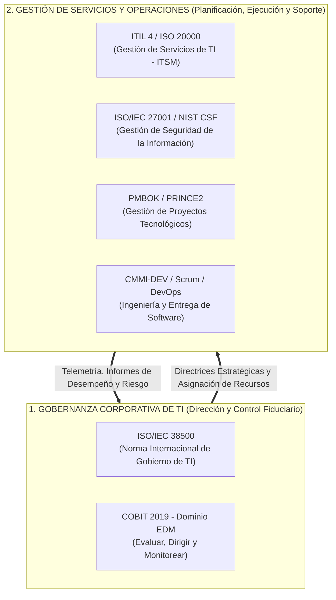
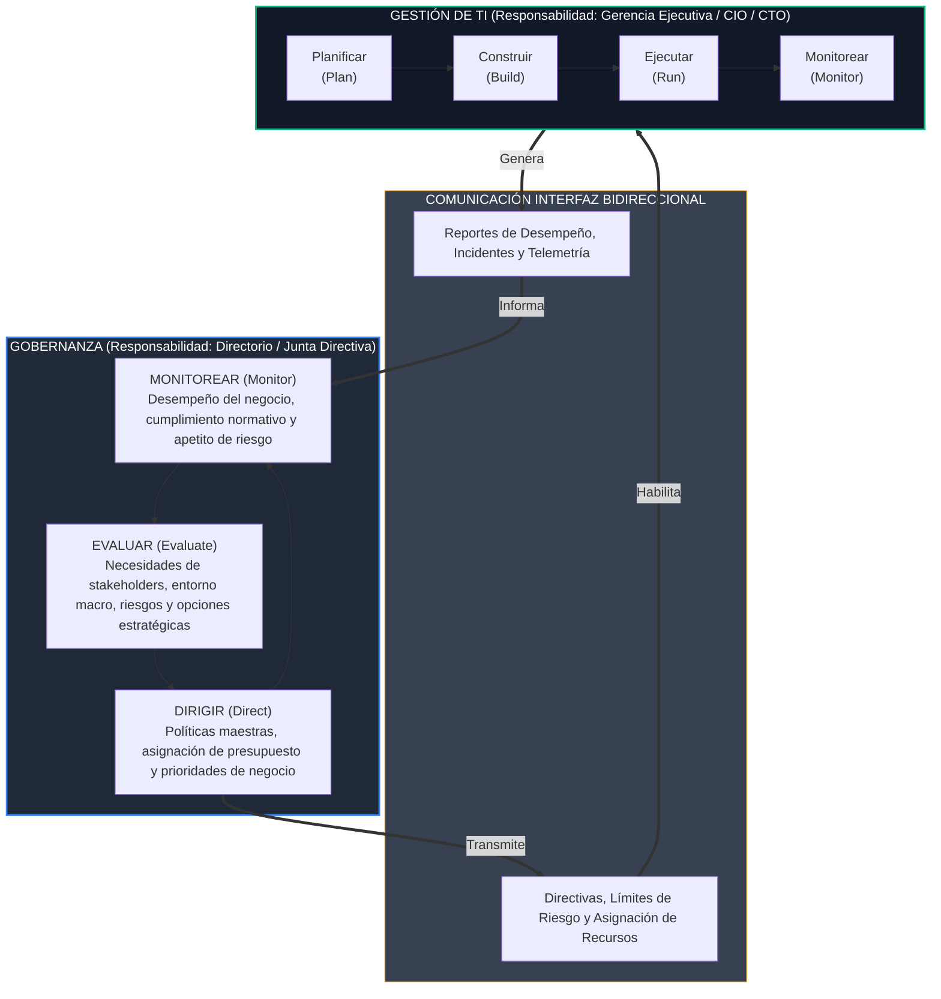
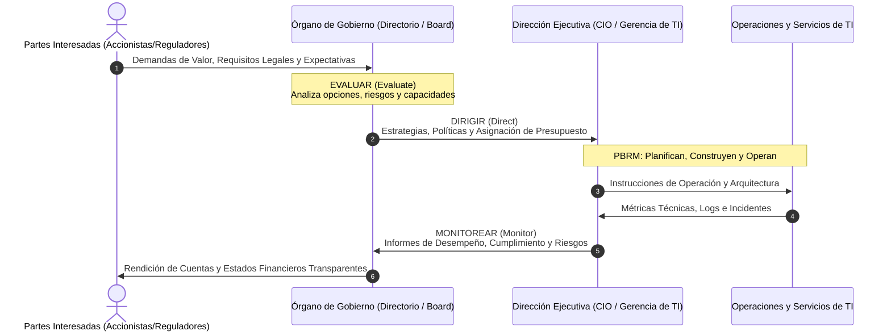
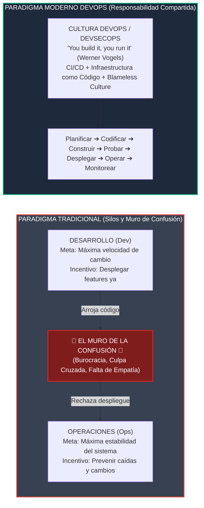
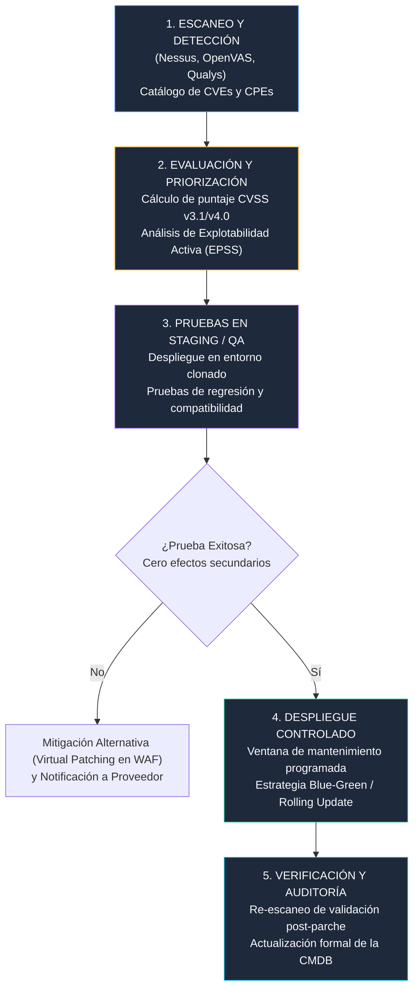

# Capítulo 4: Marcos de Referencia, Gobernanza y Operaciones de TICs

> [!abstract] Ficha Técnica de la Asignatura
> **Asignatura:** Gestión de Tecnologías de la Información y Comunicación (**ICCD943**)  
> **Nivel:** Pregrado en Ingeniería de Software / Computación — Escuela Politécnica Nacional (EPN)  
> **Eje Temático:** Modelos, Marcos de Referencia, Gobierno Corporativo de TI (EGIT) y Gestión Operacional de Infraestructura (ITOps/ITOM)  
> **Prerrequisitos Conceptuales:** [[Triada CIA]], Arquitectura de Sistemas Distribuidos, Fundamentos de Redes y Sistemas Operativos.

---

> [!info] 💡 ¿Cómo entender esto desde cero? (Guía para novatos de pregrado)
> Imagina a una organización moderna como un **transatlántico de alta velocidad en aguas abiertas**:
> 
> 1. **El Directorio y el Capitán (Gobernanza - EGIT / ISO 38500):** Se encuentran en el puente de mando. No están paleando carbón ni reparando válvulas de vapor. Su responsabilidad es decidir *a dónde va el barco*, verificar que la ruta maximice las ganancias de los pasajeros, establecer las reglas de seguridad marítima (normativa) y vigilar que el buque no colisione contra un iceberg (gestión del riesgo). Trabajan bajo el ciclo **Evaluar, Dirigir y Monitorear (EDM)**.
> 2. **Los Oficiales de Navegación y Jefes de Máquinas (Gestión - Management / ITIL):** Toman las órdenes del puente de mando y organizan los recursos para cumplirlas. Diseñan los turnos, coordinan el abastecimiento de combustible y orquestan los servicios a bordo. Operan bajo el ciclo **Planificar, Construir, Ejecutar y Monitorear (PBRM)**.
> 3. **La Sala de Calderas y Mantenimiento Técnico (Operaciones de TI - ITOps):** Son los ingenieros que están 24/7 en el corazón de la maquinaria. Si una caldera falla, la reparan de inmediato; monitorean la presión del vapor, mantienen los generadores eléctricos encendidos, gestionan los respaldos de energía y limpian los filtros. Su lema es *"Keep the lights on"* con alta disponibilidad y cero fallos.
> 4. **Las Cartas de Navegación y Códigos de Ingeniería (Modelos y Marcos):** 
>    - Un **Modelo** (como CMMI o ISO 33000) es el plano teórico ideal que describe cómo debe comportarse un sistema propulsor de clase mundial y mide cuán maduro es el barco (describe *"qué debe ser"*).
>    - Un **Marco de Referencia** (como ITIL o COBIT) es el manual de mejores prácticas que explica paso a paso cómo inspeccionar los motores, cómo reportar averías y cómo coordinar la tripulación en la vida real (describe *"cómo implementarlo"*).

---

## 4.1 Introducción a Modelos y Marcos de Referencia

En el ámbito de la ingeniería de software y la gestión de tecnologías de la información, existe una recurrente confusión terminológica entre los conceptos de **modelo**, **marco de referencia (*framework*)**, **estándar/norma** y **metodología**. Para un ingeniero politécnico, dominar la distinción ontológica, epistemológica y práctica entre estos instrumentos es indispensable para liderar transformaciones digitales y auditorías de sistemas sin incurrir en fallas de diseño institucional.

```
+-------------------------------------------------------------------------------+
|                       TAXONOMÍA DE LOS INSTRUMENTOS DE TI                     |
+-------------------------------------------------------------------------------+
|   Nivel Teórico / Abstracto ("QUÉ DEBE SER"):                                 |
|       --> MODELOS (CMMI, ISO/IEC 33000, Modelo de Madurez)                    |
|                                                                               |
|   Nivel Normativo / Fiduciario ("QUÉ DEBE CUMPLIRSE OBLIGATORIAMENTE"):       |
|       --> ESTÁNDARES Y NORMAS INTERNACIONALES (ISO/IEC 38500, ISO/IEC 27001)  |
|                                                                               |
|   Nivel Estructurado / Práctico ("CÓMO ORGANIZARLO Y ADAPTARLO"):             |
|       --> MARCOS DE REFERENCIA / FRAMEWORKS (COBIT 2019, ITIL 4, NIST CSF)    |
|                                                                               |
|   Nivel Procedimental / Detallado ("PASO A PASO EXACTO Y PRESCRIPTIVO"):      |
|       --> METODOLOGÍAS Y GUÍAS OPERATIVAS (Scrum, PRINCE2, PMBOK)             |
+-------------------------------------------------------------------------------+
```

### 4.1.1 Distinción Epistemológica y Práctica: Modelo vs. Marco de Referencia

#### A. Modelo (*Model*)
Un **modelo** es una representación abstracta, conceptual, teórica y formalizada de una realidad compleja o sistema dinámico. Su propósito primario es capturar la esencia de un dominio de conocimiento, estableciendo relaciones causales, dimensiones estructurales y escalas cuantitativas o cualitativas de madurez y capacidad.

* **Propósito Ontológico:** Responde taxativamente a la pregunta **¿Qué debe ser?** (*What should be*). Define las características esenciales de un estado óptimo o deseado de un sistema.
* **Escalas de Madurez y Capacidad:** Los modelos suelen estar acoplados a esquemas jerárquicos y acumulativos de niveles evolutivos. Permiten a una organización diagnosticar su posición actual (*as-is*) y proyectar su evolución (*to-be*).
* **Ejemplos Paradigmáticos:**
  1. **CMMI (*Capability Maturity Model Integration*):** Desarrollado originalmente por el Software Engineering Institute (SEI) de la Universidad Carnegie Mellon. Provee una escala de 5 niveles de madurez organizacional:
     - *Nivel 1 (Inicial):* Procesos impredecibles, reactivos y caóticos.
     - *Nivel 2 (Gestionado):* Procesos planificados y ejecutados a nivel de proyecto.
     - *Nivel 3 (Definido):* Procesos estandarizados y caracterizados a nivel organizacional.
     - *Nivel 4 (Cuantitativamente Gestionado):* Procesos medidos y controlados mediante métricas estadísticas rigurosas.
     - *Nivel 5 (En Optimización):* Enfoque continuo en la mejora e innovación proactiva mediante análisis causal de defectos.
  2. **Familia ISO/IEC 33000 (Evolución de ISO/IEC 15504 - SPICE):** Modelo internacional para la evaluación de la capacidad de los procesos de software, evaluando niveles del 0 (*Incomplete*) al 5 (*Innovating*).
  3. **Modelo OSI / TCP-IP:** Modelos de referencia conceptuales que dividen las funciones de telecomunicaciones en capas abstractas bien definidas.

#### B. Marco de Referencia (*Framework*)
Un **marco de referencia (*framework*)** es un cuerpo estructurado, articulado y compuesto por mejores prácticas empíricas, principios directores, guías de diseño, catálogos de procesos, artefactos documentales y controles pragmáticos. No es un invento puramente teórico; surge de la consolidación de experiencias exitosas de la industria tecnológica a escala global.

* **Propósito Pragmático:** Responde a la pregunta **¿Cómo implementarlo y operarlo?** (*How to do it*). Proporciona la estructura lógica para que las organizaciones adapten y adopten soluciones a sus particularidades operativas.
* **Filosofía de Adopción:** Un marco de referencia **no se implementa a ciegas ni de forma dogmática**; se rige por el principio de *"Adopt and Adapt"* (Adoptar y Adaptar). Ninguna empresa implementa el 100% de ITIL o COBIT de manera idéntica; cada una selecciona los componentes pertinentes según su apetito de riesgo, industria, tamaño y cultura corporativa.
* **Ejemplos Paradigmáticos:**
  1. **ITIL v4 (*Information Technology Infrastructure Library*):** Marco prescriptivo para la gestión de servicios de tecnologías de la información (ITSM).
  2. **COBIT 2019 (*Control Objectives for Information and Related Technologies*):** Marco integrador para el gobierno y la gestión de la información y la tecnología empresarial.
  3. **NIST Cybersecurity Framework (CSF 2.0):** Marco estructurado de funciones de seguridad (Gobernar, Identificar, Proteger, Detectar, Responder y Recuperar).

> [!definition] Cuadro de Contrastes Teórico-Práctico
> | Dimensión | Modelo (*Model*) | Marco de Referencia (*Framework*) |
> | :--- | :--- | :--- |
> | **Pregunta Clave** | ¿Qué debe existir y qué atributos debe tener? | ¿Cómo se articulan las mejores prácticas para ejecutarlo? |
> | **Grado de Abstracción** | Elevado, axiomático, generalizable y formal. | Pragmático, contextual, modular y procedimental. |
> | **Mecanismo de Evaluación** | Niveles de madurez (*Maturity Levels*) o capacidad (*Capability Levels*). | Evaluación de conformidad (*Compliance*), madurez de procesos o adecuación al contexto. |
> | **Rigidez vs. Flexibilidad** | Rígido en sus niveles y criterios para garantizar comparabilidad (*benchmarking*). | Flexible, modular y adaptable (*Adopt & Adapt*). |
> | **Foco Operativo** | Diagnóstico, medición de capacidad y definición de la meta ideal. | Ejecución coordinada, establecimiento de roles, flujos y controles. |

---

### 4.1.2 Clasificación de Marcos según su Alcance y Propósito

Para evitar la yuxtaposición caótica de iniciativas, la ingeniería de gestión de TI categoriza los marcos de referencia en dos grandes familias complementarias:



#### A. Marcos de Gobernanza (*Governance Frameworks*)
Orientados a la **alta dirección**, al **Directorio (*Board of Directors*)** y a los comités ejecutivos. Su misión es garantizar que la tecnología:
1. Cree valor para los accionistas y partes interesadas (*stakeholders*).
2. Esté matemáticamente y estratégicamente alineada a los objetivos corporativos.
3. Consuma recursos de forma eficiente y justificada.
4. Mantenga los riesgos tecnológicos dentro de los umbrales de tolerancia de la empresa.

* **Ejemplos:**
  - **COBIT 2019:** Desarrollado por ISACA, cubre la totalidad del gobierno y gestión mediante 40 objetivos organizados en 5 dominios.
  - **ISO/IEC 38500:** La norma canónica que define los principios que deben aplicar los directores para gobernar el uso de TI.

#### B. Marcos de Gestión (*Management Frameworks*)
Orientados al **CIO (*Chief Information Officer*)**, **CTO (*Chief Technology Officer*)**, gerentes de sistemas, jefes de infraestructura y líderes técnicos. Su misión es planificar, construir, desplegar, ejecutar y soportar las operaciones tecnológicas del día a día, transformando los mandatos de gobernanza en servicios informáticos funcionales.

* **Ejemplos por Área de Especialidad:**
  - **Gestión de Servicios de TI (ITSM):** ITIL 4 (*Information Technology Infrastructure Library*), estándar certificable **ISO/IEC 20000-1**.
  - **Seguridad de la Información y Ciberseguridad:** **[[sgsi|ISO/IEC 27001]]**, **ISO/IEC 27002**, **NIST CSF**, **CIS Controls**.
  - **Ingeniería y Construcción de Software:** **CMMI-DEV**, ciclo de vida **ISO/IEC/IEEE 12207**, marcos ágiles (Scrum, SAFe).
  - **Gestión de Proyectos Tecnológicos:** **PMBOK Guide** (Project Management Institute - PMI), **PRINCE2** (*Projects IN Controlled Environments* - AXELOS).
  - **Arquitectura Empresarial:** **TOGAF** (*The Open Group Architecture Framework*).

---

### 4.1.3 Cuadro Comparativo Exhaustivo de Marcos y Modelos

Uno de los errores más comunes en la práctica profesional es suponer que una empresa puede "certificarse en ITIL" o "auditarse formalmente en COBIT". El siguiente cuadro clarifica la naturaleza, organismo emisor, objetivo primario y esquemas de certificación vigentes:

| Marco / Modelo / Norma | Entidad Emisora | Propósito Primario | Nivel de Enfoque | ¿Certificable Organizacionalmente? | ¿Certificable Individualmente? (Personas) |
| :--- | :--- | :--- | :--- | :--- | :--- |
| **ISO/IEC 38500:2015** | ISO / IEC | Principios de gobernanza corporativa para directores. | Gobernanza pura | **No** (Norma de directrices/principios; no contiene requisitos auditables "shall"). | **Sí** (Cursos y acreditaciones profesionales de auditor/implementador). |
| **COBIT 2019** | ISACA | Marco integral para el gobierno y gestión de I&T empresarial. | Gobernanza y Gestión | **No** (Es una guía de mejores prácticas; se audita la madurez, no otorga sello ISO). | **Sí** (COBIT Foundation, Design & Implementation, Assessor). |
| **ITIL 4** | AXELOS / PeopleCert | Gestión de servicios de TI (ITSM) orientada al valor. | Gestión operativa y de servicios | **No** (Ninguna empresa es "Certificada ITIL"; adoptan sus prácticas). | **Sí** (Foundation, Managing Professional, Strategic Leader, Master). |
| **ISO/IEC 20000-1:2018** | ISO / IEC | Requisitos formales para un Sistema de Gestión de Servicios (SGS). | Gestión de Servicios (ITSM) | **Sí** (Auditoría formal por organismo acreditador de tercera parte). | **Sí** (Lead Implementer, Lead Auditor). |
| **ISO/IEC 27001:2022** | ISO / IEC | Requisitos formales para un [[sgsi|Sistema de Gestión de Seguridad (SGSI)]]. | Gestión y Seguridad | **Sí** (Certificación de validez internacional por entes certificadores). | **Sí** (Lead Implementer, Lead Auditor). |
| **CMMI V2.0 / V3.0** | CMMI Institute (ISACA) | Modelo de madurez de procesos de ingeniería y desarrollo. | Capacidad / Madurez de Procesos | **No otorga "Certificado" tradicional**, sino un **Benchmark Appraisal** (Nivel 1 al 5 formalmente registrado en OASIS). | **Sí** (CMMI Associate, CMMI Lead Appraiser). |
| **PMBOK Guide (7ma Ed.)** | Project Management Institute (PMI) | Cuerpo de conocimiento para la dirección de proyectos. | Gestión de Proyectos | **No** (Es una guía estándar, no un esquema de auditoría corporativa). | **Sí** (PMP, CAPM, PgMP). |
| **TOGAF 10** | The Open Group | Metodología y marco para arquitectura empresarial (ADM). | Arquitectura Empresarial | **No** (Marco corporativo; The Open Group certifica conformidad de herramientas). | **Sí** (TOGAF Foundation, Certified). |

> [!important] Regla Mnemotécnica para Exámenes de Pregrado
> Las **Normas ISO que contienen requisitos mandatarios** (expresados gramaticalmente como *"shall"* o *"debe"*, como **ISO/IEC 27001** o **ISO/IEC 20000-1**) son las únicas legalmente **certificables a nivel organizacional** mediante auditorías de tercera parte. 
> 
> Marcos como **ITIL**, **COBIT**, **PMBOK** y la norma **ISO 38500** guían a la organización y certifican las competencias técnicas e intelectuales de los **individuos** (profesionales), pero no extienden certificados de cumplimiento formal a las compañías.

---

## 4.2 Gobierno de TICs (EGIT - Enterprise Governance of Information and Technology)

### 4.2.1 Fundamentos y Necesidad Crítica de EGIT

#### A. Definición Canónica
El **Gobierno Empresarial de Tecnologías de la Información (EGIT)** es el conjunto articulado de estructuras organizativas, directrices estratégicas, procesos de toma de decisiones y mecanismos de supervisión mediante los cuales el máximo órgano de gobierno (Directorio, Junta General de Accionistas o Consejo de Administración) asegura que las tecnologías de información y comunicación:
1. Generen un valor cuantificable y alineado al negocio.
2. Optimicen el uso de recursos tangibles e intangibles.
3. Mitiguen proactivamente los riesgos operacionales, financieros y reputacionales derivados de su uso.

```
       +-------------------------------------------------------------+
       |             JUNTA DIRECTIVA / BOARD OF DIRECTORS            |
       |                (Responsabilidad Fiduciaria)                 |
       +-------------------------------------------------------------+
                                      |
                     [Gobierna mediante EDM: Evalúa, Dirige, Monitorea]
                                      v
       +-------------------------------------------------------------+
       |             ALTA GERENCIA / CIO / CTO / CISO                |
       |                (Responsabilidad Ejecutiva)                  |
       +-------------------------------------------------------------+
                                      |
                     [Gestiona mediante PBRM: Planifica, Construye, Ejecuta]
                                      v
       +-------------------------------------------------------------+
       |             OPERACIONES TÉCNICAS / ITOps / SERVICIOS        |
       +-------------------------------------------------------------+
```

#### B. Justificación Económica y Estratégica: ¿Por qué fracasan las empresas al delegar TI exclusivamente a los técnicos?
Durante las décadas de 1980 y 1990 imperó el paradigma de concebir a la informática como una "función de soporte administrativo en el sótano". Las consecuencias financieras de este error conceptual fueron devastadoras y motivaron el nacimiento del gobierno de TI corporativo:

1. **La Asimetría de la Información y el "Secuestro Técnico":** Cuando el Directorio desconoce la tecnología y la delega ciegamente a los administradores de sistemas, se produce una desconexión ontológica. Los ingenieros tienden a solicitar presupuestos astronómicos basados en fascinación técnica (los últimos procesadores, almacenamiento redundante innecesario, refactorizaciones cosméticas) sin justificar cómo esa inversión impacta en el flujo de caja o en la ventaja competitiva.
2. **El Fracaso Catastrófico de Macroproyectos Tecnológicos:** Estudios históricos (como el *CHAOS Report* de Standish Group) demuestran que más del 60% de los grandes proyectos de TI (implementación de ERPs como SAP u Oracle, migraciones bancarias masivas) fracasan en plazo, costo o alcance funcional. La causa raíz casi nunca es técnica (no es un *bug* de código); es la **ausencia de patrocinio ejecutivo**, falta de alineación con el modelo de negocio y decisiones tomadas en silos aislados.
3. **El Riesgo Fiduciario y Legal de la Ciberseguridad:** Una brecha de datos masiva o un secuestro por ransomware no afecta únicamente al servidor vulnerado; destruye el precio de las acciones en bolsa, acarrea multas regulatorias multimillonarias (GDPR, Ley Orgánica de Protección de Datos Personales de Ecuador - LOPDP) y puede derivar en responsabilidad penal o civil directa para los miembros del Directorio si no demostraron la debida diligencia (*Due Diligence* y *Due Care*).
4. **La Paradoja de Solow en Productividad:** En 1987, el premio Nobel de economía Robert Solow sentenció: *"Se puede ver la era de las computadoras en todas partes, excepto en las estadísticas de productividad"*. La tecnología por sí sola no genera rentabilidad a menos que esté guiada por procesos de gobierno que rediseñen el negocio a su alrededor.

> [!warning] Falla Típica en Organizaciones Sin Gobierno de TI
> En ausencia de EGIT, surgen dos fenómenos patológicos:
> - **Shadow IT (TI en las Sombras):** Departamentos de negocio adquieren servicios SaaS y software en la nube por su cuenta con tarjetas de crédito corporativas, puenteando al departamento técnico y creando agujeros masivos de seguridad y costos ocultos.
> - **IT as a Cost Center (TI como Centro de Costos):** La gerencia percibe a TI como una fuga de dinero a la que hay que recortar presupuesto constantemente, asfixiando la innovación y llevando a la obsolescencia tecnológica.

---

### 4.2.2 Los 5 Componentes Estratégicos del Gobierno de TI

El estándar canónico de ISACA establece que la gobernanza corporativa de TI debe gravitar en torno a **cinco pilares estratégicos interconectados**:

```
                       +-----------------------------------+
                       |       ALINEACIÓN ESTRATÉGICA      |
                       +-----------------------------------+
                                    ^         ^
                                   /           \
                                  v             v
       +----------------------------+         +----------------------------+
       |      ENTREGA DE VALOR      |         |     GESTIÓN DEL RIESGO     |
       +----------------------------+         +----------------------------+
                                  ^             ^
                                   \           /
                                    v         v
       +----------------------------+         +----------------------------+
       |     GESTIÓN DE RECURSOS    | <=====> |   MEDICIÓN DEL DESEMPEÑO   |
       +----------------------------+         +----------------------------+
```

#### 1. Alineación Estratégica (*Strategic Alignment*)
Es el grado de congruencia entre la visión, metas y planes del negocio con la arquitectura, capacidades y proyectos de TI.
- Se fundamenta en el modelo de alineación estratégica de **Henderson y Venkatraman**, que vincula cuatro cuadrantes: Estrategia de Negocio, Estrategia de TI, Infraestructura Organizacional y Procesos de TI.
- Asegura que ninguna iniciativa tecnológica reciba presupuesto a menos que esté directamente mapeada a un objetivo estratégico institucional (por ejemplo: la adquisición de un clúster de Kubernetes se justifica si permite abrir una nueva línea de productos bancarios digitales en semanas en lugar de meses).

#### 2. Entrega de Valor (*Value Delivery*)
Consiste en garantizar que las inversiones en TI generen los beneficios prometidos a lo largo del ciclo de vida del servicio, optimizando el retorno financiero y operativo.
- Requiere de la formulación obligatoria de **Casos de Negocio (*Business Cases*)** rigurosos antes de comprometer fondos.
- Emplea metodologías de evaluación económico-financiera:
  - **ROI (*Return on Investment*):** $\text{ROI} = \frac{\text{Beneficio Neto}}{\text{Costo de Inversión}} \times 100\%$
  - **TCO (*Total Cost of Ownership* - Costo Total de Propiedad):** Evalúa no solo el costo de adquisición de licencias y hardware (*CapEx*), sino los costos operativos ocultos a 5 años: mantenimiento, electricidad, soporte, capacitación y retiro (*OpEx*).
  - **VPN / VAN (*Valor Presente Neto*):** Trae a valor presente los flujos de caja futuros descontando una tasa de corte.

#### 3. Gestión del Riesgo (*Risk Management*)
Requiere que la alta dirección establezca formalmente el **Apetito de Riesgo (*Risk Appetite*)** (cuánto riesgo la empresa está dispuesta a asumir para generar valor) y la **Tolerancia al Riesgo** (límites de desviación permitidos).
- Abarca la preservación de activos críticos contra ciberataques, fraude interno, fallas catastróficas y desastres naturales.
- Enlaza directamente con los planes de [[Triada CIA|Seguridad de la Información]], Continuidad del Negocio (**BCP - Business Continuity Plan**) y Recuperación ante Desastres (**DRP - Disaster Recovery Plan**).
- Asegura el cumplimiento de normativas legales vinculantes (resoluciones de la Superintendencia de Bancos, LOPDP, normativas tributarias).

#### 4. Gestión de Recursos (*Resource Management*)
Optimiza la asignación, capacidad y mantenimiento de los cuatro activos críticos de TI:
1. **Talento Humano (*People*):** Retención de ingenieros, capacitación continua, planes de carrera, gestión del conocimiento y reducción de la dependencia de personal indispensable.
2. **Aplicaciones e Infraestructura (*Technology*):** Mantenimiento de servidores, redes, nubes públicas/privadas, arquitectura de microservicios y prevención de deuda técnica.
3. **Datos e Información (*Data & Assets*):** Calidad de datos, gobernanza de datos maestros (MDM), trazabilidad y soberanía de los datos.
4. **Relaciones con Terceros (*Suppliers/Vendors*):** Gestión de proveedores cloud, contratos de mantenimiento y acuerdos de soporte de terceros.

#### 5. Medición del Desempeño (*Performance Measurement*)
*"Lo que no se puede medir, no se puede gestionar ni gobernar"*. Este pilar establece sistemas de control cuantitativo y cualitativo para auditar el cumplimiento de los objetivos.
- Utiliza el **Cuadro de Mando Integral de TI (*IT Balanced Scorecard - IT BSC*)**, derivado del modelo de Kaplan y Norton, evaluando cuatro dimensiones:
  1. *Contribución al Negocio (Financiera):* Valor entregado a los accionistas.
  2. *Orientación al Usuario (Clientes):* Satisfacción del cliente interno y externo con los servicios de TI.
  3. *Excelencia Operativa (Procesos Internos):* Eficiencia de los procesos de ITIL/COBIT, cumplimiento de SLAs y disponibilidad de sistemas.
  4. *Orientación al Futuro (Aprendizaje y Crecimiento):* Preparación tecnológica, adopción de cloud, IA y retención del talento.
- Monitorea **KPIs (*Key Performance Indicators*)** y **KRIs (*Key Risk Indicators*)**.

---

### 4.2.3 Relación e Interfaz Estructural: Gobernanza (Governance) vs. Gestión (Management)

La distinción entre Gobernanza y Gestión es el principio cardinal de los marcos modernos como **COBIT 2019** y la norma **ISO/IEC 38500**. Históricamente, ambos conceptos se fusionaban, provocando que los directores se inmiscuyeran en tareas técnicas menores (*micromanagement*) o que los técnicos tomaran decisiones de política financiera sin aprobación corporativa.



> [!definition] Tabla Comparativa: Gobierno vs. Gestión
> | Criterio de Comparación | Gobernanza de TI (*Governance*) | Gestión de TI (*Management*) |
> | :--- | :--- | :--- |
> | **Órgano Responsable** | Junta Directiva / Directorio (*Board of Directors*), Consejo de Administración. | CIO, CTO, CISO, Comités Técnicos y Gerentes de Operaciones. |
> | **Misión Fundamental** | Determinar el **rumbo**, establecer prioridades y fijar los límites de riesgo corporativo. | Ejecutar las operaciones, diseñar proyectos y entregar servicios dentro del rumbo fijado. |
> | **Ciclo de Actividad Primario** | **EDM:** Evaluar (*Evaluate*), Dirigir (*Direct*), Monitorear (*Monitor*). | **PBRM:** Planificar (*Plan*), Construir (*Build*), Ejecutar (*Run*), Monitorear (*Monitor*). |
> | **Horizonte Temporal** | Largo plazo (Estratégico: 3 a 5+ años). | Corto y mediano plazo (Táctico y Operacional: días, semanas, año fiscal). |
> | **Pregunta Guía** | ¿Estamos haciendo las cosas correctas? (*Are we doing the right things?*) | ¿Estamos haciendo las cosas de la forma correcta? (*Are we doing things right?*) |
> | **Rendición de Cuentas** | Responde ante los accionistas, inversionistas y entes reguladores estatales. | Responde ante el Directorio y la Presidencia Ejecutiva (CEO). |

---

### 4.2.4 La Familia de Normas Internacionales ISO/IEC 38500

La norma internacional **ISO/IEC 38500** (*Information technology — Governance of IT for the organization*) es el referente formal y metodológico a nivel mundial para guiar a los máximos órganos de decisión en el gobierno de sus tecnologías.

#### A. Objeto y Campo de Aplicación
ISO/IEC 38500 se aplica a organizaciones de cualquier tamaño o naturaleza (públicas, privadas, ONGs, entidades gubernamentales). No define cómo programar, cómo configurar redes ni cómo operar un centro de datos; define **cómo los directores deben estructurar su supervisión fiduciaria sobre la tecnología**.

#### B. Los 6 Principios Rectores de ISO/IEC 38500
La norma establece seis principios fundamentales que deben normar el comportamiento de los directores:

```
+--------------------------------------------------------------------------+
|                  LOS 6 PRINCIPIOS RECTORES DE ISO/IEC 38500              |
+--------------------------------------------------------------------------+
| 1. RESPONSABILIDAD  --> Claridad en la autoridad y rendición de cuentas. |
| 2. ESTRATEGIA       --> TI satisface las necesidades futuras del negocio.|
| 3. ADQUISICIÓN      --> Inversiones justificadas en casos de negocio.    |
| 4. DESEMPEÑO        --> Servicios cumplen con niveles de calidad pactados|
| 5. CONFORMIDAD      --> Respeto riguroso de leyes, normas y contratos.   |
| 6. COMP. HUMANO     --> Prácticas respetan a las personas y su cultura.  |
+--------------------------------------------------------------------------+
```

1. **Principio 1: Responsabilidad (*Responsibility*):**
   - Las personas y grupos dentro de la organización deben comprender y aceptar sus responsabilidades respecto al suministro y demanda de TI.
   - Quienes tienen la responsabilidad sobre el uso o gestión de un activo tecnológico deben contar con la autoridad formal para ejecutar sus decisiones y rendir cuentas transparentes sobre sus resultados.
2. **Principio 2: Estrategia (*Strategy*):**
   - La estrategia de negocio de la organización debe incorporar y considerar plenamente las capacidades actuales y futuras de TI.
   - Los planes estratégicos de TI deben asegurar que la infraestructura y sistemas soporten la visión de largo plazo de la corporación.
3. **Principio 3: Adquisición (*Acquisition*):**
   - Las adquisiciones de TI deben realizarse por razones válidas de negocio, sustentadas en análisis de rentabilidad, costo total de propiedad (TCO) y riesgos asociados.
   - Debe existir un balance equilibrado entre costos iniciales, beneficios tangibles a mediano plazo y costos de mantenimiento y obsolescencia en el ciclo de vida.
4. **Principio 4: Desempeño (*Performance*):**
   - Las soluciones de TI deben ser adecuadas a su propósito (*fit for purpose*), entregando la capacidad, velocidad y disponibilidad requeridas para respaldar el negocio en todo momento.
   - La gerencia debe reportar al Directorio métricas precisas sobre el desempeño real de los servicios frente a los acuerdos acordados.
5. **Principio 5: Conformidad (*Conformance*):**
   - El uso y gestión de TI debe cumplir obligatoriamente con toda la legislación aplicable, normativas sectoriales, políticas internas de seguridad y acuerdos contractuales comerciales.
   - El Directorio debe implementar auditorías periódicas independientes para verificar el apego normativo.
6. **Principio 6: Comportamiento Humano (*Human Behaviour*):**
   - Las políticas, procesos y herramientas de TI deben respetar las necesidades y limitaciones humanas de todos los involucrados (empleados, clientes, proveedores).
   - Se debe gestionar el factor psicológico del cambio (*Change Management*), asegurando usabilidad, ergonomía cognitiva y evitando el estrés y rechazo tecnológico.

#### C. El Modelo de Gobierno de ISO/IEC 38500: Ciclo Interactivo EDM
La norma materializa estos seis principios a través de tres tareas continuas e interdependientes que el órgano de gobierno debe llevar a cabo frente a la dirección ejecutiva:



1. **Evaluar (*Evaluate*):** El Directorio examina y juzga el uso presente y futuro de TI. Evalúa propuestas de inversión, tendencias de mercado, amenazas emergentes de ciberseguridad y el impacto social y económico de la tecnología en la empresa.
2. **Dirigir (*Direct*):** El Directorio asigna la responsabilidad de la preparación y ejecución de los planes. Fija directrices maestras mediante políticas corporativas, asigna presupuestos formales y prioriza las iniciativas que recibirán financiamiento.
3. **Monitorear (*Monitor*):** El Directorio supervisa el rendimiento de los sistemas mediante auditorías, cuadros de mando y reportes periódicos, verificando si se alcanzaron los niveles de servicio y si la gestión se mantiene dentro de los límites de riesgo autorizados.

#### D. Documentos Complementarios de la Familia ISO/IEC 38500
- **ISO/IEC TR 38501 (*Implementation Guide for IT Governance*):** Informe técnico que proporciona una metodología paso a paso para implementar un sistema de gobierno de TI en una entidad desde cero.
- **ISO/IEC TR 38502 (*Governance and Management Framework*):** Clarifica la terminología conceptual, delineando con precisión matemática las fronteras y flujos de información entre el gobierno institucional y la gestión técnica.

---

## 4.3 Operaciones de TICs (ITOps)

### 4.3.1 Responsabilidades Centrales de ITOps

La función de **Operaciones de TI (*IT Operations - ITOps*)** constituye el motor de ejecución técnica continuo de cualquier organización. Mientras la gobernanza define la estrategia y el desarrollo de software crea nuevas funcionalidades, ITOps es responsable de garantizar que la infraestructura tecnológica, los sistemas y los servicios informáticos se mantengan estables, disponibles, seguros y con alto rendimiento los 365 días del año.

```
       +-------------------------------------------------------------+
       |               PILARES DE DESEMPEÑO DE ITOps                 |
       +-------------------------------------------------------------+
       | 1. "KEEP THE LIGHTS ON" (KTLO) --> Operación ininterrumpida.|
       | 2. ALTA DISPONIBILIDAD (HA)     --> Resiliencia N+1 / 2N.   |
       | 3. CUMPLIMIENTO DE SLAs/OLAs    --> Compromiso de servicio. |
       | 4. RESILIENCIA Y RECUPERABILIDAD--> Recuperación ante fallos|
       +-------------------------------------------------------------+
```

#### A. La Filosofía "Keep The Lights On" (KTLO)
Históricamente, el presupuesto de operaciones se describe como el gasto necesario para "mantener las luces encendidas". Representa entre el 60% y el 75% del presupuesto total de TI de una corporación. Si ITOps falla, los cajeros automáticos dejan de entregar dinero, los hospitales no acceden a los historiales clínicos y los sistemas de comercio electrónico colapsan, traduciéndose en pérdidas financieras inmediatas.

#### B. Alta Disponibilidad (HA - *High Availability*) y la Métrica de los "Nueves"
La disponibilidad ($A$) de un sistema se modela matemáticamente como la fracción de tiempo en que el servicio opera conforme a sus especificaciones técnicas de diseño:

$$A = \frac{\text{MTBF}}{\text{MTBF} + \text{MTTR}} = \frac{\text{Tiempo Operativo Total}}{\text{Tiempo Operativo} + \text{Tiempo de Inactividad}}$$

Donde:
- **MTBF (*Mean Time Between Failures*):** Tiempo medio entre fallos (mide la confiabilidad intrínseca del sistema).
- **MTTR (*Mean Time To Repair*):** Tiempo medio de reparación o recuperación (mide la efectividad reactiva de ITOps).

> [!definition] La Escala Canónica de los "Nueves" de Disponibilidad
> | Nivel de Disponibilidad | Tiempo de Inactividad Máximo por Año | Tiempo de Inactividad Máximo por Mes | Costo Arquitectural Asociado |
> | :--- | :--- | :--- | :--- |
> | **99% ("Dos Nueves")** | 3.65 días (87.6 horas) | 7.31 horas | Bajo (Monolitos sin redundancia). |
> | **99.9% ("Tres Nueves")** | 8.77 horas | 43.8 minutos | Moderado (Redundancia básica de red y discos RAID). |
> | **99.99% ("Cuatro Nueves")** | 52.6 minutos | 4.38 minutos | Alto (Clústeres Activo-Pasivo, balanceadores, enlaces WAN duales). |
> | **99.999% ("Cinco Nueves" - Clase Portadora)** | **5.26 minutos** | **26.3 segundos** | **Extremo** (Centros de datos multi-región Activo-Activo, arquitecturas redundantes $2N$, failover automático en milisegundos). |

#### C. Acuerdos de Nivel de Servicio (SLA, OLA y UC)
ITOps opera bajo una jerarquía contractual estricta:
1. **SLA (*Service Level Agreement*):** Compromiso formal legal y fiduciario firmado entre el proveedor de servicios de TI y el **cliente/usuario del negocio** (ej. "La pasarela de pagos tendrá una disponibilidad del 99.95% de 08:00 a 20:00").
2. **OLA (*Operational Level Agreement*):** Acuerdo interno suscrito entre diferentes **departamentos técnicos de la misma organización** (ej. "El equipo de redes garantiza al equipo de bases de datos una latencia máxima de 2ms y reemplazo de switches en menos de 30 minutos").
3. **UC (*Underpinning Contract*):** Contrato legal vinculante con un **proveedor externo** (ej. Contrato con AWS, Cisco o un ISP local de fibra óptica para garantizar enlaces simétricos).

---

### 4.3.2 ITOps vs. ITOM (IT Operations Management)

Es fundamental distinguir conceptualmente entre la función humana y organizativa y el conjunto de plataformas tecnológicas que la habilitan:

```
+-------------------------------------------------------------------------------+
|                       ITOps (IT Operations)                                  |
|   La función organizativa global: ingenieros, roles, procesos de ITSM,        |
|   guardias operacionales (on-call), políticas de escalamiento y cultura.      |
|                                                                               |
|       +---------------------------------------------------------------+       |
|       |                   ITOM (IT Operations Management)             |       |
|       |   Conjunto de herramientas de software, plataformas de        |       |
|       |   automatización, telemetría y aprovisionamiento que usa      |       |
|       |   ITOps para gestionar la infraestructura.                    |       |
|       +---------------------------------------------------------------+       |
+-------------------------------------------------------------------------------+
```

* **ITOps (*IT Operations*):** Es el **departamento, equipo o disciplina**. Engloba la toma de decisiones, la ejecución de mantenimientos, la gestión de guardias (*on-call shifts*), la cultura operativa y el cumplimiento de los procesos de ITIL.
* **ITOM (*IT Operations Management*):** Es la **suite de software y plataformas tecnológicas** que automatizan y orquestan la infraestructura física, virtual y cloud. Sus cuatro módulos cardinales son:
  1. *Network Operations Management (NOM):* Descubrimiento automático de topología de red, monitoreo SNMP/NetFlow, gestión de configuraciones de routers/switches.
  2. *Server and Storage Management:* Monitoreo de hipervisores (VMware ESXi, KVM), almacenamiento SAN/NAS y servidores bare-metal.
  3. *Cloud Management Platforms (CMP):* Orquestación de infraestructura en AWS, Azure, GCP y OpenStack.
  4. *Application Performance Monitoring (APM):* Instrumentación profunda del código en ejecución (Dynatrace, New Relic, Datadog), rastreo de trazas distribuidas y monitoreo sintético.

---

### 4.3.3 La Revolución DevOps: Superación del "Muro de la Confusión"

#### A. El Conflicto Histórico Estructural: Dev vs. Ops
Durante décadas, la ingeniería de software y la infraestructura operaron en silos aislados con **incentivos económicos y psicológicos diametralmente opuestos**:

* **Desarrolladores (Dev):** Evaluados e incentivados por la **velocidad de cambio** (*Speed of Innovation*). Su misión es escribir código nuevo, desplegar nuevas funcionalidades (*features*) y entregarlas rápido a producción.
* **Operaciones (Ops):** Evaluados e incentivados por la **estabilidad del sistema y cero caídas** (*Uptime & Stability*). Su experiencia empírica les enseñó que **el 80% de las caídas de producción ocurren inmediatamente después de un cambio o despliegue de software**. En consecuencia, la postura natural de Ops era ralentizar los despliegues, exigir semanas de burocracia documental y oponer resistencia férrea a cada modificación.

Este antagonismo estructural creó el famoso **"Muro de la Confusión" (*Wall of Confusion*)**: los desarrolladores "arrojaban su código por encima del muro" y se desentendían, diciendo: *"En mi máquina funcionaba, el problema debe ser de los servidores de infraestructura"*, mientras Ops respondía: *"Su código tiene fugas de memoria y tumba la base de datos, no lo vamos a subir a producción"*.



#### B. Los Pilares de la Solución DevOps
DevOps no es un rol individual ni un software que se instala; es un **movimiento cultural y técnico** que unifica el desarrollo y las operaciones bajo metas y métricas compartidas:

1. **Integración Continua (CI - *Continuous Integration*):** Los desarrolladores integran su código frecuentemente en un repositorio troncal compartido (*trunk-based development*). Cada confirmación (*commit*) dispara automáticamente una batería de pruebas unitarias, análisis estático de código (SAST) y construcción del ejecutable en contenedores.
2. **Entrega y Despliegue Continuo (CD - *Continuous Delivery / Deployment*):** Automatización integral del pipeline para empaquetar, aprovisionar entornos idénticos y desplegar aplicaciones a producción sin intervención manual, utilizando técnicas avanzadas de mitigación de impacto:
   - *Blue-Green Deployment:* Dos entornos de producción idénticos; uno atiende tráfico real mientras el otro se actualiza, alternando el balanceador al verificar estabilidad.
   - *Canary Releases:* Enrutamiento de un pequeño porcentaje del tráfico real (ej. 2%) a la nueva versión para monitorear anomalías antes de desplegar al 100%.
3. **Infraestructura como Código (IaC - *Infrastructure as Code*):** La infraestructura ya no se configura haciendo clic en interfaces gráficas; se declara mediante código formal versionado en Git (ej. scripts declarativos de Terraform, manifiestos de Kubernetes, playbooks de Ansible). Los servidores se tratan como **"ganado y no mascotas" (*Cattle, not Pets*)**: si un servidor falla, no se intenta parchar manualmente; se destruye y se instancia uno idéntico automáticamente.
4. **Cultura Post-Mortem Sin Culpa (*Blameless Post-Mortem*):** Cuando ocurre un incidente grave, la organización no busca culpables para castigarlos. Asume que los humanos cometen errores y enfoca la investigación en rediseñar los procesos, salvaguardas y pruebas automatizadas para que sea estructuralmente imposible cometer el mismo error nuevamente.

---

### 4.3.4 AIOps (Artificial Intelligence for IT Operations)

#### A. Fundamento: La Crisis de Escala de la Telemetría
En las infraestructuras modernas compuestas por arquitecturas de microservicios distribuidos, clústeres elásticos en la nube y contenedores de vida efímera (minutos o segundos), el volumen de telemetría supera exponencialmente la capacidad biológica del cerebro humano:
- Un solo banco corporativo puede generar más de **$50 \text{ gigabytes}$ de logs y 10 millones de métricas por hora**.
- En un incidente complejo en cascada, las herramientas tradicionales disparan una **"tormenta de alertas" (*Alert Storm*)**, enviando cientos de correos y mensajes SMS simultáneos a los operadores. El resultado es la **fatiga por alertas (*Alert Fatigue*)**, donde los ingenieros ignoran las alertas críticas en medio del ruido abrumador.

```
+-------------------------------------------------------------------------------+
|                       ARQUITECTURA DE FLUJO DE AIOps                          |
+-------------------------------------------------------------------------------+
|  FUENTES DE DATOS:                                                            |
|  [Logs del SO] [Métricas CPU/RAM] [Trazas de Red] [Eventos APM] [Alertas SNMP]|
|                                   |                                           |
|                                   v                                           |
|  CAPA 1: INGESTIÓN Y BIG DATA (Kafka, Logstash, Vector, FluentBit)            |
|  - Normalización de formatos, filtrado de ruido y enriquecimiento temporal.  |
|                                   |                                           |
|                                   v                                           |
|  CAPA 2: MOTOR DE MACHINE LEARNING Y ANALÍTICA COGNITIVA                      |
|  - Detección de Anomalías (Isolation Forests, Autoencoders en series temporales)|
|  - Correlación Causal de Eventos (Algoritmos de grafos y agrupamiento DBSCAN)|
|  - NLP para análisis semántico de excepciones en archivos de registro.        |
|                                   |                                           |
|                                   v                                           |
|  CAPA 3: ACCIÓN Y REMEDIACIÓN AUTOMATIZADA ("Self-Healing Systems")           |
|  - Reinicio automático de pods en falla, escalamiento preventivo de recursos, |
|    generación de tickets contextualizados en Jira/ServiceNow sin ruido humano.|
+-------------------------------------------------------------------------------+
```

#### B. Componentes y Capacidades Clave de AIOps
1. **Reducción de Ruido y Deduplicación:** Filtra eventos repetitivos o triviales, agrupando 5,000 alertas crudas en un único **incidente consolidado contextualizado**.
2. **Detección Predictiva de Anomalías:** En lugar de utilizar umbrales estáticos rígidos (ej. "alertar si la CPU pasa del 85%"), el sistema aprende el comportamiento baseline estacional (el consumo habitual de un lunes a las 09:00 vs. un domingo a las 03:00) y detecta desviaciones sutiles antes de que el servicio colapse.
3. **Análisis de Causa Raíz (*Root Cause Analysis - RCA*):** Mediante el modelado en tiempo real del grafo de topología de dependencias, identifica que la lentitud en la interfaz web se originó por un bloqueo de transacciones en la base de datos secundaria.
4. **Sistemas de Auto-Recuperación (*Self-Healing*):** Ejecución de scripts preaprobados (*Runbooks*) de remediación automatizada para resolver incidentes comunes sin despertar a los ingenieros de guardia.

---

### 4.3.5 Los 8 Procesos Operacionales Clave en Detalle Exhaustivo

Un departamento de operaciones de TI de clase mundial basa su efectividad en la estandarización rigurosa de sus ocho procesos operacionales cardinales:

```
+-------------------------------------------------------------------------------+
|                     LOS 8 PROCESOS OPERACIONALES CLAVE                        |
+-------------------------------------------------------------------------------+
| 1. Mantenimiento de Infraestructura  | 5. Programación de Trabajos en Lote    |
| 2. Gestión de Configuración (CMDB)   | 6. Capacidad y Rendimiento             |
| 3. Gestión de Parches y Vulnerab.    | 7. Gestión de Logs y Auditoría (SIEM)  |
| 4. Respaldos y DRP (Estrategia 3-2-1)| 8. Disposición Segura de Medios (NIST) |
+-------------------------------------------------------------------------------+
```

---

#### 1. Mantenimiento de Infraestructura
Abarca el cuidado físico y lógico del centro de datos (*Data Center*), servidores, almacenamiento y telecomunicaciones. Se clasifica en tres niveles:
- **Mantenimiento Preventivo:** Acciones periódicas programadas para evitar el deterioro de los equipos. Incluye limpieza física de polvo en gabinetes, reemplazo de filtros de aire acondicionado de precisión (HVAC), pruebas de carga a bancos de baterías UPS con corte deliberado de suministro comercial y verificación de grupos electrógenos (generadores diésel).
- **Mantenimiento Correctivo:** Sustitución reactiva ante fallas no previstas (reemplazo de una fuente de poder redundante quemada en un servidor o un módulo SFP de fibra óptica dañado).
- **Mantenimiento Predictivo:** Utilización de telemetría de hardware (tecnología S.M.A.R.T. en discos duros, curvas de temperatura interna de CPUs, vibración de rodamientos de ventiladores) para cambiar componentes mecánicos o electrónicos antes de su falla catastrófica estimada según sus curvas de degradación térmica.

---

#### 2. Gestión de la Configuración y Base de Datos de Configuración (CMDB)
La **Gestión de la Configuración (*Configuration Management*)** es el proceso de identificar, registrar, controlar y auditar los atributos y relaciones de cada componente tecnológico necesario para entregar los servicios de TI.

```
       +-------------------------------------------------------------+
       |             SERVICIO DE BANCA WEB (Servicio de Negocio)     |
       +-------------------------------------------------------------+
                                      |
                                  DependsOn
                                      v
       +-------------------------------------------------------------+
       |        BALANCEADOR DE CARGA (F5 Big-IP Virtual / Nginx)     |
       +-------------------------------------------------------------+
                        |                             |
                    RoutesTo                      RoutesTo
                        v                             v
       +-------------------------------+   +-------------------------------+
       |   NODO WEB 01 (Kubernetes Pod)|   |   NODO WEB 02 (Kubernetes Pod)|
       +-------------------------------+   +-------------------------------+
                        \                             /
                         ConnectsTo        ConnectsTo
                                   \      /
                                      v
       +-------------------------------------------------------------+
       |       BASE DE DATOS PRINCIPAL (PostgreSQL Clúster)          |
       +-------------------------------------------------------------+
                                      |
                                  HostedOn
                                      v
       +-------------------------------------------------------------+
       |        ALMACENAMIENTO SAN (PureStorage FlashArray LUN)      |
       +-------------------------------------------------------------+
```

* **Elementos de Configuración (CI - *Configuration Item*):** Cualquier componente susceptible de ser gestionado individualmente: un servidor físico, un contenedor Docker, una base de datos, un contrato de soporte, una política de firewall o un certificado SSL/TLS.
* **Atributos de un CI:** Identificador único (UUID), nombre canónico, versión de firmware/software, dirección IP/MAC, ubicación física/rack, propietario del servicio (*service owner*), estado del ciclo de vida (*In Design, Testing, Live, Retired*).
* **Mapeo de Dependencias y Análisis de Radio de Explosión (*Blast Radius*):** La CMDB almacena relaciones direccionales entre CIs (`HostedOn`, `DependsOn`, `ConnectsTo`, `BacksUpTo`). Cuando se requiere aplicar un cambio en un switch central, los ingenieros ejecutan un análisis de impacto en la CMDB para conocer con exactitud matemática qué servicios de negocio, aplicaciones críticas y bases de datos se verán afectados por el corte.

---

#### 3. Gestión de Vulnerabilidades y Parches
El proceso sistemático para identificar debilidades de seguridad en sistemas operativos, librerías y firmwares, aplicando contramedidas antes de que sean explotadas por ciberdelincuentes.



1. **Detección Continua:** Escaneo automatizado de vulnerabilidades contrastando el inventario con bases de datos públicas de vulnerabilidades (NVD - *National Vulnerability Database*) y códigos **CVE (*Common Vulnerabilities and Exposures*)**.
2. **Priorización mediante Métricas CVSS (*Common Vulnerability Scoring System*):** No todas las vulnerabilidades se parchan de inmediato. Se clasifican según su severidad numérica (0.0 a 10.0) combinando métricas base (vector de ataque de red, complejidad, privilegios requeridos), temporales (existencia de código de explotación funcional en la red) y ambientales (criticidad del activo para la empresa).
3. **Ambiente de Homologación (*Staging*):** Regla de oro en ITOps: **jamás se aplica un parche directamente en producción**. Debe instalarse primero en un entorno gemelo para evaluar que no rompa las dependencias de las aplicaciones legacy.
4. **Ventanas de Mantenimiento (*Maintenance Windows*):** Intervalos pactados en los SLAs (ej. domingos de 01:00 a 04:00) con baja actividad de usuarios para minimizar el impacto.
5. **Plan de Reversión (*Rollback Plan*):** Procedimiento estricto y pre-probado para devolver el sistema a su estado previo en caso de que el parche falle durante el despliegue.

---

#### 4. Gestión de Respaldos (*Backups*) y Recuperación ante Desastres (DRP)

##### A. La Regla de Oro 3-2-1 del Respaldo
Para garantizar la resiliencia absoluta contra fallas mecánicas masivas, incendios, desastres naturales o ataques de ransomware, se implementa la regla estricta:

```
+-------------------------------------------------------------------------------+
|                            LA ESTRATEGIA DE RESPALDO 3-2-1                    |
+-------------------------------------------------------------------------------+
|   [ 3 ] COPIAS:           Tener al menos TRES copias de los datos críticos    |
|                           (1 copia en producción + 2 respaldos independientes)|
|                                                                               |
|   [ 2 ] MEDIOS DISTINTOS: Almacenar las copias en al menos DOS soportes       |
|                           tecnológicos diferentes (ej. Discos SAN + Cintas LTO|
|                           o Almacenamiento en Bloque SSD + Almacenamiento S3) |
|                                                                               |
|   [ 1 ] FUERA DE SITIO:   Tener al menos UNA copia en una ubicación geográfica|
|                           remota o nube con inmutabilidad (Air-Gapped / WORM) |
+-------------------------------------------------------------------------------+
```

##### B. Tipos de Respaldo y Mecánica de Almacenamiento
- **Respaldo Completo (*Full Backup*):** Copia la totalidad de los datos seleccionados. Es el más lento de generar y el que consume mayor espacio de almacenamiento, pero permite la restauración más veloz y directa.
- **Respaldo Incremental (*Incremental Backup*):** Copia exclusivamente los datos y bloques que han sufrido modificaciones **desde el último respaldo realizado, ya sea este Full o Incremental**. Es extremadamente rápido de ejecutar y requiere poco espacio, pero su restauración es compleja: exige restaurar el último Full y, cronológicamente, toda la cadena completa de incrementales. Si uno de los archivos incrementales se corrompe, la cadena se rompe.
- **Respaldo Diferencial (*Differential Backup*):** Copia todos los datos modificados **desde el último Full Backup realizado**. Consume más espacio que el incremental diario, pero para restaurar el sistema solo se necesitan dos elementos: el último Full Backup y el último Diferencial.

> [!definition] Tabla de Comparación de Estrategias de Respaldo
> | Característica | Respaldo Completo (*Full*) | Respaldo Incremental | Respaldo Diferencial |
> | :--- | :--- | :--- | :--- |
> | **Espacio Requerido** | Masivo ($100\%$ del volumen). | Mínimo (solo deltas del día). | Moderado (acumula cambios desde el Full). |
> | **Tiempo de Ejecución** | Muy lento (horas/días). | Muy rápido (minutos). | Intermedio. |
> | **Velocidad de Restauración** | **Máxima** (un solo paso). | **Lenta** (Full + todos los incrementales). | **Rápida** (Full + último diferencial). |
> | **Riesgo en Cadena de Restauración** | Mínimo. | Alto (si falla un incremental intermedio, se pierden datos). | Bajo (solo dependen dos respaldos). |

##### C. Las Métricas Fiduciarias del DRP: RPO y RTO
El Plan de Recuperación ante Desastres (**DRP**) se rige por dos parámetros temporales innegociables fijados por la gobernanza:

```
[OPERACIÓN NORMAL] --------> [ÚLTIMO BACKUP] ---- (Pérdida de Datos) ----> [DESASTRE / CAÍDA]
                                   |<------------ RPO ------------>|
                                                                   |
                                                                   v
[SISTEMA RECUPERADO] <----------- (Tiempo de Inactividad) ----------+
          |<--------------------- RTO -------------------->|
```

1. **RPO (*Recovery Point Objective* - Objetivo de Punto de Recuperación):** Mide la **cantidad máxima de datos (expresada en tiempo)** que la organización puede permitirse perder ante un desastre sin poner en peligro su subsistencia legal o financiera.
   - *Ejemplo:* Si el RPO de un banco para transacciones monetarias es de **cero segundos**, el sistema no puede usar respaldos nocturnos; requiere replicación síncrona en tiempo real con confirmación en dos centros de datos distantes.
2. **RTO (*Recovery Time Objective* - Objetivo de Tiempo de Recuperación):** Mide el **tiempo máximo admisible** transcurrido entre el instante en que ocurre la caída del sistema y el momento exacto en que el servicio vuelve a estar 100% operativo para los usuarios finales.

---

#### 5. Programación de Trabajos en Lote (*Batch Job Scheduling*)
Muchos procesos de negocio no son interactivos ni en tiempo real; se ejecutan de forma masiva sobre volúmenes ingentes de transacciones:
- **Ejemplos Típicos:** Generación de extractos de cuentas bancarias a fin de mes, liquidación de haberes y nómina, cálculo nocturno de intereses de tarjetas de crédito o agregación de datos para inteligencia de negocios (ETL en Data Warehouses).
- **Control de Dependencias (DAGs - *Directed Acyclic Graphs*):** Un trabajo por lotes $B$ no debe iniciar si el trabajo $A$ falló o no ha terminado (ej. no se pueden calcular los impuestos si el trabajo de conciliación de compras falló).
- **Ventana de Procesamiento (*Batch Window*):** Franja horaria nocturna donde el procesamiento en lote no compite por recursos de CPU y disco con los usuarios en línea.
- **Herramientas de Orquestación Especializadas:** BMC Control-M, Apache Airflow, Autosys o AWX/Ansible.

---

#### 6. Gestión de Capacidad y Rendimiento
Previene la degradación del servicio modelando el consumo de recursos de infraestructura y anticipando saturaciones:
- **Variables Críticas de Telemetría:**
  - *CPU:* Porcentaje de uso, carga promedio del sistema (*Load Average*).
  - *Memoria RAM:* Consumo de memoria activa, buffers, saturación del espacio de intercambio (*Swap Paging*).
  - *Almacenamiento:* Capacidad disponible en disco, latencia de lectura/escritura (ms), operaciones de entrada/salida por segundo (**IOPS**) y longitud de la cola de disco (*Queue Depth*).
  - *Redes:* Ancho de banda saturado, tasa de paquetes descartados (*dropped packets*), errores de CRC en interfaces.
- **Modelos de Proyección:** Uso de regresiones lineales y teoría de colas para calcular cuándo un almacenamiento o base de datos alcanzará el 90% de su capacidad.
- **Estrategias de Escalamiento:**
  - *Escalamiento Vertical (*Scale-Up*):* Añadir más vCPU, más memoria RAM o discos más veloces a un servidor existente (tiene un límite físico estricto y causa tiempo de inactividad al reiniciar).
  - *Escalamiento Horizontal (*Scale-Out*):* Añadir más nodos de cómputo en paralelo detrás de un balanceador de carga (arquitectura nativa de nube elástica y sin tiempo de inactividad).

---

#### 7. Gestión de Logs y Auditoría
Los registros de eventos (*logs*) constituyen la "caja negra" que registra cada acción, error, acceso y modificación en los sistemas.

```
+-------------------------------------------------------------------------------+
|                       ARQUITECTURA DE RECOLECCIÓN Y GESTIÓN DE LOGS           |
+-------------------------------------------------------------------------------+
|   SERVIDORES / APLICACIONES          COLECTORES DE RED         DISPOSITIVOS   |
|   [/var/log/secure, Windows Event]  [Cisco Syslog, NetFlow]   [WAF / Firewalls|
|                 \                            |                           /    |
|                  v                           v                          v     |
|   +-----------------------------------------------------------------------+   |
|   |   PROTOCOLO NTP (Network Time Protocol) - Estratos 1 y 2 Sincronizados|   |
|   |   (Garantiza estampas de tiempo idénticas en milisegundos)            |   |
|   +-----------------------------------------------------------------------+   |
|                                      |                                        |
|                                      v                                        |
|   +-----------------------------------------------------------------------+   |
|   |   SISTEMA SIEM / ALMACENAMIENTO DE LOGS (Splunk, Elastic, Sentinel)   |   |
|   |   - Centralización y parseo de eventos.                               |   |
|   |   - Hashing criptográfico (SHA-256) para garantizar no repudio.       |   |
|   |   - Almacenamiento inmutable WORM (Write Once, Read Many).            |   |
|   +-----------------------------------------------------------------------+   |
+-------------------------------------------------------------------------------+
```

1. **Centralización en Sistemas SIEM (*Security Information and Event Management*):** Los logs jamás deben residir únicamente en el servidor local (un atacante que comprometa una máquina borrará los logs locales `/var/log/auth.log` para eliminar sus huellas). Deben remitirse en tiempo real a una plataforma centralizada (Splunk, Elastic Stack/ELK, Graylog, Azure Sentinel).
2. **Sincronización Estricta mediante NTP (*Network Time Protocol*):** En una infraestructura distribuida, es imperativo que todos los servidores sincronicen sus relojes de hardware contra servidores NTP de alta precisión (Estratos 1 y 2). Si el servidor web tiene un desfase de 30 segundos con la base de datos, resulta imposible reconstruir cronológicamente una cadena de eventos durante una auditoría o incidente forense legal.
3. **Inmutabilidad y Preservación Legal (WORM - *Write Once, Read Many*):** Los registros de auditoría deben almacenarse en repositorios con candados de inmutabilidad criptográfica (mediante hashing SHA-256) para garantizar que nadie, ni siquiera el administrador de sistemas con privilegios de root, pueda alterar o borrar las evidencias transaccionales.

---

#### 8. Disposición Segura de Medios y Equipos (*Sanitization and Asset Disposal*)
Cuando un servidor, disco duro, cinta de respaldo o estación de trabajo llega al fin de su vida útil (*End of Life - EOL*), la organización debe aplicar procesos certificados de sanitización para erradicar el riesgo de **remanencia de datos (*Data Remanence*)**.

> [!caution] El Mito del Formateo Simple
> Un formateo rápido de Windows (*Quick Format*) o ejecutar el comando `rm -rf` en Linux **no borra los datos**; simplemente elimina los punteros en la tabla de asignación de archivos (como el índice de un libro). Los bloques magnéticos o celdas de silicio conservan la información intacta, la cual puede recuperarse en minutos con herramientas gratuitas de análisis forense (ej. *Autopsy*, *TestDisk*).

La norma rectora internacional para este proceso es la **NIST Special Publication 800-88 Revision 1 (*Guidelines for Media Sanitization*)**, que prescribe tres niveles de seguridad:

```
+-------------------------------------------------------------------------------+
|           NIVELES DE SANEAMIENTO DE MEDIOS (NIST SP 800-88 Rev. 1)            |
+-------------------------------------------------------------------------------+
|  1. CLEAR (Limpieza Lógica):                                                  |
|     Sobrescritura lógica de todos los sectores direccionables mediante        |
|     software estándar. Protege contra recuperación simple por software.       |
|                                                                               |
|  2. PURGE (Purga Avanzada):                                                   |
|     Sobrescritura multipaso (DoD 5220.22-M: 3 a 7 pasadas con patrones        |
|     pseudoaleatorios y complementarios) o comandos a nivel de controlador     |
|     firmware (ATA Secure Erase / Sanitize NVMe / Cripto-Borrado Cryptographic |
|     Erase). Vuelve los datos irrecuperables en laboratorios forenses.          |
|                                                                               |
|  3. DESTROY (Destrucción Física):                                             |
|     - Desmagnetización (Degaussing): Someter el disco magnético a campos      |
|       magnéticos superiores a 1.5 Teslas, destruyendo el recubrimiento físico.|
|     - Trituración Mecánica (Shredding): Destruir discos duros mecánicos y     |
|       memorias flash/SSD en fragmentos de tamaño menor a 2 milímetros.        |
|     - Incineración térmica controlada de componentes electrónicos.            |
+-------------------------------------------------------------------------------+
```

* **Certificados de Destrucción y Trazabilidad:** Cada equipo desincorporado debe contar con un acta notariada de destrucción y disposición de residuos electrónicos (normativas de reciclaje RAEE), garantizando la cadena de custodia legal de los datos corporativos.

---

## 4.4 Síntesis del Capítulo y Preguntas de Examen de Grado

> [!tip] Resumen Pedagógico Integrador
> - Un **Modelo** define el estado abstracto e ideal (*"qué debe ser"*, ej. CMMI). Un **Marco** define el andamiaje pragmático de mejores prácticas adaptables (*"cómo hacerlo"*, ej. ITIL, COBIT).
> - Las **Normas ISO con requisitos mandatarios** (ISO 27001, ISO 20000) son las únicas legalmente certificables para organizaciones. Marcos como ITIL o COBIT certifican profesionales.
> - La **Gobernanza (EGIT)** evalúa, dirige y monitorea (EDM) desde el Directorio para maximizar valor y controlar riesgos. La **Gestión** planifica, construye, ejecuta y monitorea (PBRM) desde la gerencia ejecutiva.
> - **ISO/IEC 38500** articula 6 principios rectores: Responsabilidad, Estrategia, Adquisición, Desempeño, Conformidad y Comportamiento Humano.
> - **ITOps** sostiene la operación continua ("Keep the lights on") optimizando alta disponibilidad ($A$), MTBF y MTTR.
> - **DevOps** derriba el muro de confusión entre Dev (velocidad) y Ops (estabilidad) mediante automatización CI/CD, infraestructura como código y responsabilidad compartida.
> - **AIOps** combate la fatiga por alertas correlacionando telemetría masiva mediante aprendizaje automático y sistemas autorreparables (*self-healing*).
> - La resiliencia operativa depende de la **Estrategia 3-2-1** en respaldos, métricas rigurosas de **RPO / RTO** y disposición segura de medios bajo **NIST SP 800-88 Rev. 1**.

### Banco de Autoevaluación Académica (Preguntas Tipo EPN)

1. **¿Por qué la norma ISO/IEC 38500 no puede auditarse ni certificarse como una norma de gestión como ISO 9001 o ISO/IEC 27001?**
   * *Respuesta Académica:* Porque ISO/IEC 38500 es una norma de **principios rectores y directrices para órganos de gobierno**, no un conjunto prescriptivo de requisitos formales de gestión. No contiene cláusulas mandatorias (*"shall"* / *"debe"*) de diseño de procesos con evidencias objetivas estandarizadas para auditores externos de certificación.
2. **Explique la diferencia técnica entre un respaldo incremental y uno diferencial. ¿Cuál minimiza el RTO durante una contingencia crítica?**
   * *Respuesta Académica:* El respaldo incremental copia los datos modificados desde el último respaldo de cualquier tipo (Full o Incremental), minimizando la ventana de respaldo y el almacenamiento diario. El respaldo diferencial copia los datos modificados acumulados desde el último Full Backup. **El respaldo diferencial minimiza el RTO** (tiempo de recuperación), ya que solo requiere restaurar dos conjuntos de datos (el Full y el último diferencial), a diferencia del incremental que exige reconstruir cronológicamente toda la cadena histórica de días transcurridos.
3. **En el marco de NIST SP 800-88 Rev. 1, ¿por qué un borrado criptográfico (*Cryptographic Erase*) es equivalente a un nivel *Purge* en unidades SSD/NVMe?**
   * *Respuesta Académica:* Las unidades de estado sólido (SSD/NVMe) utilizan nivelación de desgaste (*wear leveling*) y bloques sobreaprovisionados gestionados por el controlador interno, lo que impide que el software sobrescriba de forma determinista cada sector físico. El *Cryptographic Erase* borra y destruye de forma irreversible la clave interna de cifrado de hardware (DEK - *Data Encryption Key*) de la unidad auto-cifrada (SED). Al desaparecer la clave con entropía criptográfica robusta, los datos remanentes en las celdas de silicio quedan convertidos en texto cifrado computacionalmente indescifrable, satisfaciendo el estándar de purga sin requerir la destrucción física del disco.

---
*Nota de cátedra elaborada según el syllabus de Gestión de TICs (ICCD943) - Escuela Politécnica Nacional.*
