# Capítulo 5: COBIT 2019 — Gobierno y Gestión de la Información y la Tecnología (I&T)

**Cátedra:** Gestión de Tecnologías de la Información y Comunicación (ICCD943)  
**Institución:** Escuela Politécnica Nacional (EPN) — Facultad de Ingeniería de Sistemas  
**Nivel:** Pregrado (9.º Semestre) — Carrera de Ingeniería en Ciencias de la Computación  
**Autor:** Cátedra de Gestión de TICs / Especialista ISACA & Auditor Líder CISA  

---

> [!info] 💡 ¿Cómo entender esto desde cero? (Guía para novatos de pregrado)
> Imagina que una corporación moderna es como un barco transatlántico de alta velocidad:
> 
> 1. **La Sala de Máquinas (Gestión de TI / ITSM):** Aquí están los ingenieros en sistemas, administradores de bases de datos, desarrolladores de software y operadores de redes. Su trabajo es hacer que los motores funcionen sin fallas, que el combustible se queme eficientemente y que las calderas no exploten. Si la sala de máquinas falla, el barco se hunde. Esto es **Gestión (*Management*)**, y marcos como **ITIL v4** nos enseñan a operarla.
> 2. **El Puente de Mando y el Timón (Gobierno de TI / EGIT):** En el puente están el Capitán, el Oficial de Navegación y la Junta de Accionistas. Ellos no bajan a reparar un inyector de combustible; su trabajo es decidir: *¿Hacia qué puerto navegamos? ¿Cuánto combustible estamos dispuestos a gastar? ¿Qué rutas con icebergs debemos evitar? ¿El viaje está generando ganancias o pérdidas?* Esto es **Gobierno (*Governance*)**, y **COBIT 2019** es el estándar mundial por excelencia para construir ese puente de mando.
> 
> - **El error clásico del ingeniero junior:** Pensar que gobernar TI es comprar el mejor servidor, migrar a Kubernetes o escribir código limpio. Eso es técnico. El verdadero desafío de un CIO o Auditor de Sistemas es responder a la Junta Directiva: *¿Por qué gastamos 2 millones de dólares en la nube y cómo eso aumentó el valor de la empresa o redujo el riesgo legal?*
> - **¿Qué hace COBIT 2019?** COBIT no te dice *cómo programar* ni *cómo configurar un switch*. Te proporciona una arquitectura integral para asegurar que la tecnología trabaje directamente para los objetivos de la empresa, controlando riesgos, optimizando recursos y entregando valor tangible a las partes interesadas.

---

## 5.1 Principios de COBIT 2019

### 5.1.1 Diferenciación Esencial: Sistema de Gobierno vs. Marco de Gobierno

Uno de los errores conceptuales más frecuentes en la ingeniería de sistemas y en los exámenes de certificación internacional (como **CISA** o **COBIT Foundation**) es confundir el *Sistema de Gobierno* con el *Marco de Gobierno*. ISACA establece una distinción ontológica estricta:

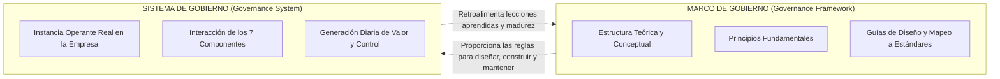

> [!definition] Sistema de Gobierno (*Governance System*)
> Es el **mecanismo operante real** que una organización particular implementa y ejecuta en el día a día para dirigir y controlar sus tecnologías e información. Está compuesto por la interacción viva y coordinada de los **7 componentes de gobierno** (procesos, estructuras, políticas, cultura, personas, información y servicios/infraestructura). Ninguna empresa tiene el mismo sistema de gobierno que otra.

> [!definition] Marco de Gobierno (*Governance Framework*)
> Es la **estructura teórica, metodológica y conceptual** (la biblioteca de guías, principios, relaciones lógicas y taxonomías universales) que define *las reglas del juego* para estructurar, diseñar y mantener un sistema de gobierno. COBIT 2019 es un marco de gobierno; lo que implementa el Banco Pichincha o la EPN es su propio sistema de gobierno.

| Dimensión de Análisis | Marco de Gobierno (*Governance Framework*) | Sistema de Gobierno (*Governance System*) |
| :--- | :--- | :--- |
| **Naturaleza** | Estructura conceptual, teórica y prescriptiva universal. | Realidad empírica, operativa y socio-técnica institucional. |
| **Propósito** | Proveer el modelo de referencia, lineamientos y guías. | Dirigir, controlar y crear valor con I&T en una empresa real. |
| **Instanciación** | Documentos, publicaciones de ISACA, toolkits y esquemas. | Comités de TI, políticas firmadas, flujos de procesos ejecutándose. |
| **Variabilidad** | Estándar globalmente aceptado (permanente por versión). | Altamente dinámico; cambia según el contexto y factores de diseño. |
| **Relación con la Empresa**| Se toma como insumo o plantilla maestra de ingeniería. | Se construye a la medida (*tailored*) de la organización. |

---

### 5.1.2 Factores de Diseño (*Design Factors*)

COBIT 2019 reconoce que **no existe un sistema de gobierno universalmente válido** ("una talla no sirve para todos" / *one size does not fit all*). Para resolver la rigidez de versiones anteriores, introduce **11 Factores de Diseño (DF)** que permiten contextualizar y calibrar el sistema de gobierno antes de implementar un solo proceso:

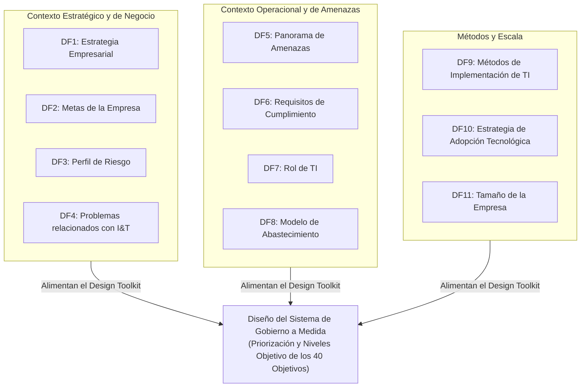

1. **DF1: Estrategia Empresarial (*Enterprise Strategy*):** Arquetipo estratégico dominante de la empresa según el modelo de Treacy y Wiersema:
   - *Liderazgo en costos:* Requiere extrema optimización operativa (APO06, DSS01).
   - *Liderazgo de producto / Innovación:* Demanda agilidad y adopción acelerada (APO04, BAI03).
   - *Orientación al cliente:* Prioriza personalización y experiencia (APO08, DSS02).
   - *Crecimiento / Adquisición:* Exige escalabilidad e integración rápida de arquitecturas (APO03, BAI01).
2. **DF2: Metas de la Empresa (*Enterprise Goals*):** Las 13 metas del Balanced Scorecard corporativo que la organización prioriza.
3. **DF3: Perfil de Riesgo (*Risk Profile*):** Tipo, probabilidad e impacto de riesgos cibernéticos, de continuidad, cumplimiento e inversión que la empresa enfrenta y su apetito al riesgo.
4. **DF4: Problemas Relacionados con I&T (*I&T-Related Issues / Pain Points*):** Puntos de dolor históricos reales (ej. presupuestos excedidos, auditorías reprobadas, fugas de datos, fallas recurrentes de software).
5. **DF5: Panorama de Amenazas (*Threat Landscape*):** Nivel de hostilidad del entorno externo (amenazas cibernéticas geopolíticas, espionaje industrial, cibercrimen financiero).
6. **DF6: Requisitos de Cumplimiento (*Compliance Requirements*):** Rigor del marco legal y regulatorio al que está sujeta la organización (ej. GDPR, Ley Orgánica de Protección de Datos Personales del Ecuador - LOPDP, Basilea III, regulaciones de la Superintendencia de Bancos).
7. **DF7: Rol de TI (*Role of IT*):** Clasificación según la Matriz Estratégica de McFarlan:
   - *Soporte:* TI no es crítica para el día a día ni para la estrategia futura.
   - *Fábrica:* TI es crítica para las operaciones diarias actuales, pero no define la estrategia futura.
   - *Transición / Alto Potencial:* TI es el motor de nuevos proyectos que transformarán la empresa a futuro.
   - *Estratégico:* Las operaciones de hoy y la estrategia del mañana dependen 100% de TI (ej. banca digital, fintech).
8. **DF8: Modelo de Abastecimiento de TI (*Sourcing Model*):** Uso de recursos propios (*insourced*), tercerización masiva (*outsourced*), modelos en la nube (SaaS, PaaS, IaaS) o arquitecturas híbridas.
9. **DF9: Métodos de Implementación de TI (*IT Implementation Methods*):** Adopción de metodologías tradicionales (Cascada/Waterfall), enfoques ágiles (Scrum, SAFe), cultura **DevOps** o entornos bimodales.
10. **DF10: Estrategia de Adopción Tecnológica (*Technology Adoption Strategy*):**
    - *Primeros en adoptar (First Mover):* Buscan ventaja competitiva asumiendo riesgos de madurez tecnológica.
    - *Seguidores rápidos (Fast Follower):* Esperan que la tecnología se pruebe antes de adoptarla masivamente.
    - *Adoptantes tardíos (Slow Adopter):* Solo adoptan cuando la tecnología es un estándar plenamente establecido y maduro.
11. **DF11: Tamaño de la Empresa (*Enterprise Size*):** Gran corporación multinacional frente a Pequeñas y Medianas Empresas (PyMEs / microempresas), impactando directamente en la capacidad de segregar funciones (*segregation of duties*).

---

### 5.1.3 Los 6 Principios del Sistema de Gobierno de COBIT 2019

ISACA establece 6 principios no negociables que **todo sistema de gobierno operante** debe satisfacer:

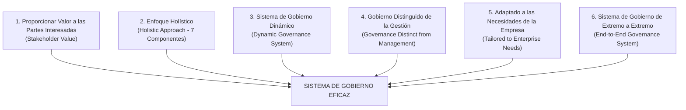

1. **Proporcionar valor a las partes interesadas (*Provide Stakeholder Value*):**  
   El sistema de gobierno debe equilibrar las tres ramas del "Trípode del Valor":
   - **Realización de Beneficios:** Crear nuevos productos, mejorar servicios y abrir canales digitales.
   - **Optimización del Riesgo:** Mantener la exposición tecnológica dentro del apetito institucional de riesgo.
   - **Optimización de Recursos:** Asignar capital humano, tecnológico y financiero con la máxima eficiencia.
2. **Enfoque holístico (*Holistic Approach*):**  
   El gobierno no se compone únicamente de procesos. Requiere la articulación integrada de los 7 componentes del sistema. Un proceso perfecto documentado en papel fracasa si no cuenta con personas capacitadas, infraestructura adecuada o una cultura que premie la rendición de cuentas.
3. **Sistema de gobierno dinámico (*Dynamic Governance System*):**  
   Cada vez que cambia un factor de diseño (ej. una nueva ley de privacidad, una fusión empresarial o la decisión de migrar a la nube pública), el sistema de gobierno debe recalibrarse. No es un proyecto con fecha final; es una capacidad organizacional permanente y adaptativa.
4. **Gobierno distinguido de la gestión (*Governance Distinct from Management*):**  
   Establece una frontera clara de autoridad, responsabilidad y rendición de cuentas entre el Directorio (quien gobierna) y la Administración Ejecutiva (quien gestiona).
5. **Adaptado a las necesidades de la empresa (*Tailored to Enterprise Needs*):**  
   El sistema debe personalizarse utilizando los Factores de Diseño para alinear las prioridades de I&T con la realidad corporativa única.
6. **Sistema de gobierno de extremo a extremo (*End-to-End Governance System*):**  
   El gobierno de I&T no pertenece únicamente al departamento de tecnología ni termina en el centro de datos. Abarca toda la información y todas las tecnologías que la empresa procesa y utiliza para alcanzar sus objetivos misionales, desde el usuario de negocio que captura datos hasta la Junta Directiva.

---

### 5.1.4 Los 3 Principios del Marco de Gobierno de COBIT 2019

Estos principios rigen la **construcción interna del propio marco COBIT 2019**:

1. **Basado en un modelo conceptual (*Based on a Conceptual Model*):**  
   El marco se fundamenta en un modelo formal de relaciones lógicas que vincula necesidades de partes interesadas, metas de empresa, metas de alineación, componentes de gobierno y prácticas de gestión con absoluta coherencia estructural.
2. **Abierto y flexible (*Open and Flexible*):**  
   COBIT 2019 permite incorporar nuevas áreas de enfoque (*Focus Areas*) como Seguridad de la Información, Privacidad, DevOps, Cloud Computing o Inteligencia Artificial sin alterar la estructura fundamental del modelo base.
3. **Alineado con los principales estándares (*Aligned to Major Standards*):**  
   COBIT no reinventa la rueda. Se posiciona como el "paraguas integrador" que mapea y se alinea con estándares especializados del mercado: **ISO/IEC 27001** (seguridad), **ISO/IEC 38500** (gobierno corporativo de TI), **ITIL v4** (gestión de servicios), **TOGAF 10** (arquitectura empresarial), **CMMI** (madurez de software) y **PMBOK/PRINCE2** (proyectos).

---

### 5.1.5 COBIT en el Contexto de la Auditoría Informática

Para un futuro Ingeniero en Ciencias de la Computación de la EPN y aspirante a auditor de sistemas, COBIT 2019 no es solo una guía de diseño organizacional; es la **piedra angular metodológica de la Auditoría Informática y de Control Interno**.

#### El Marco ITAF (*Information Technology Assurance Framework*) de ISACA
ITAF es el estándar profesional global de ISACA que define las directrices y normas de conducta para auditorías de sistemas de información:

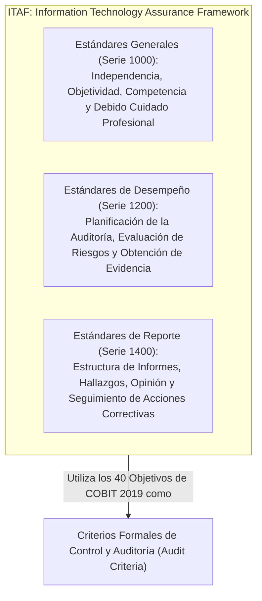

#### La Certificación CISA (*Certified Information Systems Auditor*)
CISA es la certificación más prestigiosa y reconocida a nivel mundial para auditores de sistemas y consultores de aseguramiento tecnológico. El examen oficial de CISA evalúa 5 dominios del ejercicio profesional (*Job Practice*), los cuales se respaldan metodológicamente en COBIT:
1. **Dominio 1: Proceso de Auditoría de Sistemas de Información (21%):** Ejecución de auditorías según estándares ITAF y COBIT MEA04.
2. **Dominio 2: Gobierno y Gestión de TI (17%):** Basado directamente en COBIT EDM01-EDM05 y APO01-APO14.
3. **Dominio 3: Adquisición, Desarrollo e Implementación de SI (12%):** Mapeado a COBIT BAI01-BAI11.
4. **Dominio 4: Operaciones de SI y Resiliencia del Negocio (23%):** Sustentado en COBIT DSS01-DSS06.
5. **Dominio 5: Protección de Activos de Información (27%):** Mapeado a COBIT APO12, APO13 y DSS05.

> [!important] ¿Cómo utiliza el Auditor Líder a COBIT en la práctica?
> En una auditoría de sistemas, el auditor no puede opinar con base en criterios subjetivos. Debe contrastar la evidencia obtenida contra **criterios de auditoría reconocidos**.  
> **Ejemplo:** Si el auditor evalúa el proceso de gestión de cambios en el sistema bancario, toma como criterio la práctica **BAI06.01** (*Evaluar, priorizar y autorizar peticiones de cambio*). Si encuentra que los programadores despliegan cambios directamente a producción sin autorización del Comité de Cambios (CAB), reporta un **hallazgo de no conformidad de control interno**, categorizando la deficiencia mediante la taxonomía oficial de COBIT.

---

## 5.2 Componentes y Catalizadores

### 5.2.1 Evolución Histórica: De Catalizadores (COBIT 5) a Componentes (COBIT 2019)

En COBIT 5 (publicado en 2012), ISACA introdujo el concepto de los **7 Catalizadores (*Enablers*)**. En COBIT 2019 (publicado a finales de 2018), la terminología evolucionó oficialmente hacia los **7 Componentes del Sistema de Gobierno (*Governance System Components*)**.

```mermaid
flowchart LR
    C5["COBIT 5: 7 Catalizadores (Enablers)<br/>• Concepto estático y facilitador<br/>• Aplicación uniforme y rígida"] 
    -->|"Evolución Epistemológica e Ingeniería de Gobierno"| 
    C19["COBIT 2019: 7 Componentes del Sistema<br/>• Partes modulares activas del sistema<br/>• Componentes Genéricos vs Específicos<br/>• Adaptables mediante Factores de Diseño"]
```

*¿Por qué cambió ISACA este concepto?*  
La palabra "catalizador" sugería un elemento facilitador pasivo que ayudaba a que las cosas ocurrieran. En contraste, el término **"componente"** enfatiza que son los **bloques de construcción tangibles, modulares y operantes** con los que los ingenieros de sistemas diseñan una arquitectura de gobierno. Además, COBIT 2019 clasifica los componentes en:
- **Componentes Genéricos:** Descritos en el *COBIT Core Model*, aplicables en principio a cualquier situación corporativa.
- **Componentes Variantes (Específicos):** Adaptados a un contexto o área de enfoque particular (ej. componentes específicos para ciberseguridad, banca, startups o gobierno electrónico).

---

### 5.2.2 Los 7 Componentes del Sistema de Gobierno en Detalle

Para que un objetivo de gobierno o gestión funcione, debe materializarse a través de los 7 componentes:

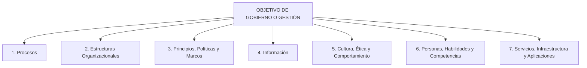

1. **Procesos (*Processes*):**  
   Conjunto organizado de prácticas y actividades diseñadas para lograr un propósito específico, que toman entradas (*inputs*), aplican transformaciones mediante flujos de trabajo sistemáticos y generan salidas (*outputs*). En COBIT 2019, cada proceso cuenta con declaraciones de actividades clasificadas por niveles de capacidad.
2. **Estructuras Organizacionales (*Organizational Structures*):**  
   Las entidades formales de toma de decisiones en la organización: Junta Directiva, Comités de Auditoría y Riesgos, Comité de Dirección de TI (*IT Steering Committee*), Comité de Aprobación de Cambios (*Change Advisory Board - CAB*), Dirección de Tecnologías de la Información (CIO) y Oficina de Seguridad (CISO). Definen niveles de autoridad y matrices de asignación de responsabilidad (**RACI**: Responsable, Aprobador, Consultado, Informado).
3. **Principios, Políticas y Marcos (*Principles, Policies and Frameworks*):**  
   El instrumento normativo mediante el cual la voluntad de la Junta Directiva se traduce en directrices operativas cotidianas. Incluye la Política General de Seguridad de la Información, Políticas de Desarrollo Seguro, Políticas de Respaldo y Planes de Continuidad.
4. **Información (*Information*):**  
   Abarca toda la información producida y utilizada por la empresa. COBIT 2019 evalúa la información a través de **15 Criterios de Calidad de la Información** agrupados en:
   - *Calidad Intrínseca:* Exactitud, objetividad, credibilidad y reputación.
   - *Calidad Contextual:* Relevancia, valor agregado, oportunidad (*timeliness*), completitud y cantidad apropiada.
   - *Calidad de Representación y Accesibilidad:* Facilidad de interpretación, claridad de representación, consistencia, accesibilidad y seguridad del acceso.
5. **Cultura, Ética y Comportamiento (*Culture, Ethics and Behavior*):**  
   A menudo el componente más subestimado por los ingenieros, pero el causante del 80% de los fracasos de gobernanza. Involucra el tono de la alta dirección (*Tone at the Top*), la aversión o tolerancia al riesgo, la transparencia ante los errores, la disciplina en el cumplimiento normativo y la resistencia al cambio cultural.
6. **Personas, Habilidades y Competencias (*People, Skills and Competencies*):**  
   El capital humano requerido para ejecutar las decisiones y los procesos de I&T. Se estructura bajo marcos internacionales de competencias técnicas como **SFIA** (*Skills Framework for the Information Age*) o **e-CF** (*European e-Competence Framework*), asegurando perfiles adecuados para arquitectos de software, ingenieros de seguridad y analistas de datos.
7. **Servicios, Infraestructura y Aplicaciones (*Services, Infrastructure and Applications*):**  
   La infraestructura tecnológica física y lógica que da soporte al sistema de gobierno: sistemas de monitorización (SIEM, APM), software de mesa de ayuda (ITSM tooling como Jira o ServiceNow), servidores, redes, bases de datos y arquitecturas de microservicios.

---

### 5.2.3 El Modelo Central de COBIT 2019 (*Core Model*)

El corazón operativo de COBIT 2019 se estructura en **40 Objetivos de Gobernanza y Gestión**, organizados lógicamente en **5 Dominios funcionales**. 
- Los objetivos del dominio de **Gobierno** son responsabilidad del Directorio y la Junta Directiva.
- Los objetivos de los dominios de **Gestión** son responsabilidad del equipo ejecutivo liderado por el CEO, el CIO y el CISO.

---

### 5.2.4 La Cascada de Metas de COBIT 2019 (*Goals Cascade*)

La Cascada de Metas es el algoritmo conceptual que permite **traducir las necesidades difusas de los accionistas en prácticas técnicas específicas de ingeniería de software y operaciones de TI**:

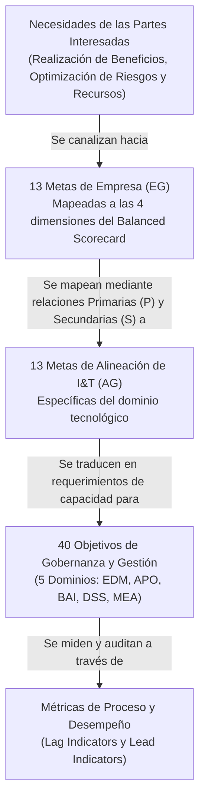

#### Paso 1: Necesidades de las Partes Interesadas $\to$ 13 Metas de Empresa (*Enterprise Goals - EG*)
Las necesidades de los accionistas (rentabilidad, crecimiento, sostenibilidad, reputación) se estructuran en 13 Metas de Empresa, distribuidas en las 4 perspectivas del **Balanced Scorecard (BSC)** de Kaplan y Norton:

| Perspectiva BSC | Código | Meta de Empresa (*Enterprise Goal*) |
| :--- | :--- | :--- |
| **Financiera** | **EG01** | Portafolio de productos y servicios competitivos. |
| | **EG02** | Gestión del riesgo de negocio financiero y cumplimiento. |
| | **EG03** | Cumplimiento con leyes y regulaciones externas. |
| | **EG04** | Calidad de la información financiera y de gestión. |
| | **EG05** | Cultura de servicio orientada al cliente. |
| **Cliente** | **EG06** | Continuidad y disponibilidad del servicio del negocio. |
| | **EG07** | Calidad de la información sobre la gestión del negocio. |
| **Interna** | **EG08** | Optimización de la funcionalidad de los procesos de negocio. |
| | **EG09** | Optimización de los costos de los procesos de negocio. |
| | **EG10** | Habilidades, motivación y productividad del personal. |
| | **EG11** | Cumplimiento con políticas internas corporativas. |
| **Aprendizaje y Crecimiento** | **EG12** | Gestión de programas de transformación digital y empresarial. |
| | **EG13** | Innovación de productos y negocios. |

#### Paso 2: 13 Metas de Empresa $\to$ 13 Metas de Alineación (*Alignment Goals - AG*)
Las tecnologías de la información no tienen un fin en sí mismas; existen para respaldar las metas de la empresa. Por ello, las 13 EG se mapean formalmente a **13 Metas de Alineación de I&T**:

| Perspectiva BSC | Código | Meta de Alineación de I&T (*Alignment Goal*) |
| :--- | :--- | :--- |
| **Financiera** | **AG01** | Cumplimiento y soporte de I&T al cumplimiento del negocio con leyes externas. |
| | **AG02** | Gestión de riesgos relacionados con I&T. |
| | **AG03** | Beneficios realizados del portafolio de inversiones y servicios facilitados por I&T. |
| | **AG04** | Calidad de la información sobre tecnología, financiera y de gestión. |
| **Cliente** | **AG05** | Prestación de servicios de I&T en consonancia con los requisitos del negocio. |
| | **AG06** | Agilidad para convertir requisitos de negocio en soluciones operativas. |
| **Interna** | **AG07** | Seguridad de la información, infraestructura de procesamiento y aplicaciones. |
| | **AG08** | Habilitación e integración de procesos de negocio mediante soluciones automatizadas. |
| | **AG09** | Entrega de programas y proyectos a tiempo, dentro del presupuesto y con calidad. |
| | **AG10** | Calidad de la información sobre I&T para la toma de decisiones gerenciales. |
| | **AG11** | Cumplimiento de I&T con las políticas internas institucionales. |
| **Aprendizaje y Crecimiento** | **AG12** | Personal competente y motivado con entendimiento mutuo de negocio y tecnología. |
| | **AG13** | Conocimiento, experiencia e iniciativas para la innovación empresarial. |

#### Paso 3: Metas de Alineación $\to$ 40 Objetivos de Gobernanza y Gestión
ISACA provee una matriz predefinida que califica la fuerza del vínculo entre cada Meta de Alineación y los 40 objetivos:
- **P (Primaria / *Primary*):** Existe una correlación causal directa y fuerte. Si la empresa desea alcanzar esa AG, el objetivo de gestión debe implementarse de forma obligatoria.
- **S (Secundaria / *Secondary*):** Existe un soporte indirecto pero relevante.
- *(Vacío):* No existe una correlación significativa.

#### Paso 4: Definición de Métricas de Proceso
Cada objetivo seleccionado despliega métricas operativas:
- **Indicadores de Retraso (*Lag Indicators* / Métricas de Resultado):** Miden si la meta se alcanzó (ej. porcentaje de tiempo de inactividad no planificado durante el mes).
- **Indicadores Guía (*Lead Indicators* / Métricas de Desempeño):** Miden si las actividades predictivas se están realizando (ej. porcentaje de empleados capacitados en detección de phishing antes de la campaña de auditoría).

---

## 5.3 Dominios y Procesos de COBIT (Los 40 Objetivos de Gobernanza y Gestión)

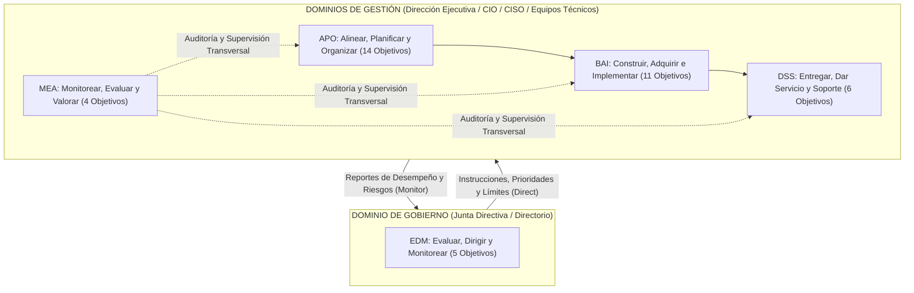

---

### 5.3.1 Dominio EDM: Evaluar, Dirigir y Monitorear (*Evaluate, Direct and Monitor*) — 5 Objetivos de Gobierno

El dominio EDM representa el nivel de gobierno corporativo. Es ejecutado por la Junta Directiva (*Board of Directors*). Sus prácticas consisten en **evaluar** opciones estratégicas, **dirigir** a la alta gerencia mediante directrices y límites de riesgo, y **monitorear** el desempeño institucional.

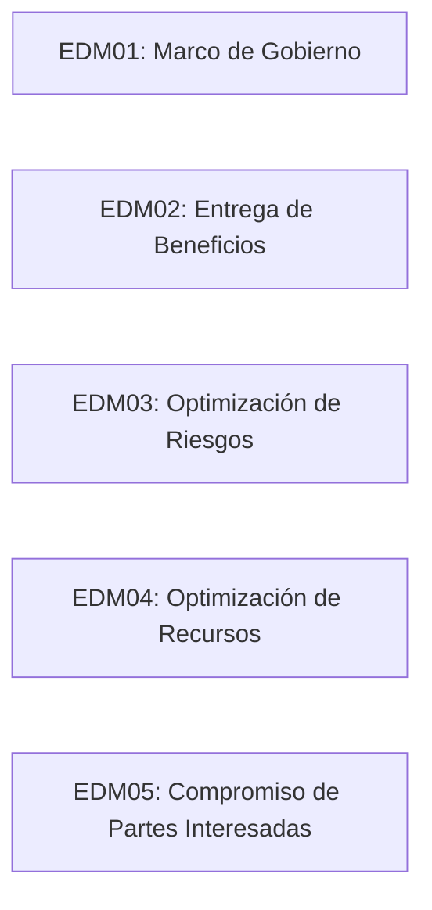

#### 1. EDM01: Marco de Gobierno Asegurado (*Ensured Governance Framework Setting and Maintenance*)
- **Propósito Oficial:** Analizar y articular los requisitos para el gobierno de I&T de la empresa, y poner en marcha y mantener estructuras, principios, procesos y prácticas de gobierno eficaces.
- **Alcance Operativo:** Define la estructura de toma de decisiones corporativa de TI, los comités directivos, la rendición de cuentas formal y la integración del gobierno de TI con el gobierno corporativo global de la organización.
- **Caso Práctico:** La Junta Directiva de una entidad bancaria conforma el *Comité de Gobierno Digital y Ciberseguridad*, aprobando su estatuto formal y definiendo los umbrales financieros para los proyectos que requieren aprobación del directorio frente a los que aprueba el CIO.

#### 2. EDM02: Entrega de Beneficios Asegurada (*Ensured Benefits Delivery*)
- **Propósito Oficial:** Asegurar el óptimo valor de las iniciativas, servicios y activos de I&T; entrega de valor rentable y alineación con los objetivos estratégicos de la empresa.
- **Alcance Operativo:** Supervisa que las inversiones en tecnología (Business Cases) realmente generen el retorno de inversión (ROI), valor económico agregado (EVA) o impacto social prometido, eliminando iniciativas que no aporten valor.
- **Caso Práctico:** Evaluación post-implementación de una plataforma de banca móvil; el directorio verifica si tras un gasto de 1.5 millones de dólares se logró la captación proyectada de 100,000 nuevos usuarios digitales y la reducción de costos operativos en ventanilla física.

#### 3. EDM03: Optimización de Riesgos Asegurada (*Ensured Risk Optimization*)
- **Propósito Oficial:** Asegurar que el apetito y la tolerancia al riesgo de la empresa sean entendidos, articulados y comunicados, y que el riesgo para el valor de la empresa relacionado con el uso de I&T sea identificado y gestionado.
- **Alcance Operativo:** El Directorio establece formalmente la declaración de apetito al riesgo de la empresa (ej. "Tolerancia cero a violaciones de privacidad que expongan datos financieros de clientes").
- **Caso Práctico:** Tras una oleada de ataques de ransomware en el sector industrial, el directorio instruye a la gerencia contratar una póliza de ciberseguro de cobertura internacional y fija un límite máximo tolerable de tiempo de recuperación (RTO corporativo) de 4 horas para procesos críticos.

#### 4. EDM04: Optimización de Recursos Asegurada (*Ensured Resource Optimization*)
- **Propósito Oficial:** Asegurar que las necesidades de recursos de la empresa sean satisfechas con capacidades óptimas de I&T (personas, información, infraestructura y aplicaciones) alineadas con las prioridades de negocio.
- **Alcance Operativo:** Asigna y equilibra estratégicamente el capital humano calificado y los presupuestos tecnológicos multianuales, evitando el sobredimensionamiento o la obsolescencia crítica.
- **Caso Práctico:** La alta dirección aprueba un plan quinquenal de modernización del talento humano en ciencias de la computación, financiando certificaciones internacionales en Cloud y DevOps para el personal interno en lugar de subcontratar indiscriminadamente.

#### 5. EDM05: Compromiso de las Partes Interesadas Asegurado (*Ensured Stakeholder Engagement*)
- **Propósito Oficial:** Asegurar que los informes de desempeño y conformidad de I&T a las partes interesadas sean transparentes, oportunos y precisos, y que se establezcan canales efectivos de comunicación.
- **Alcance Operativo:** Mecanismos formales de rendición de cuentas ante accionistas, reguladores gubernamentales, clientes y empleados sobre el estado de la tecnología y la ciberseguridad.
- **Caso Práctico:** Publicación del Informe Integrado Anual de Sostenibilidad y Transparencia Tecnológica para la Superintendencia de Compañías, detallando el grado de cumplimiento de los planes de ciberdefensa y resiliencia informática.

---

### 5.3.2 Dominio APO: Alinear, Planificar y Organizar (*Align, Plan and Organize*) — 14 Objetivos de Gestión

El dominio APO cubre el nivel táctico y estratégico de la gestión de TI. Proporciona la dirección para la arquitectura tecnológica, la planificación del portafolio, la seguridad de la información, la calidad y la gestión de recursos y riesgos.

```mermaid
flowchart TD
    APO01["APO01: Marco de Gestión"]
    APO02["APO02: Estrategia"]
    APO03["APO03: Arquitectura Empresarial"]
    APO04["APO04: Innovación"]
    APO05["APO05: Portafolio"]
    APO06["APO06: Presupuestos y Costos"]
    APO07["APO07: Recursos Humanos"]
    APO08["APO08: Relaciones"]
    APO09["APO09: Acuerdos de Servicio (SLA)"]
    APO10["APO10: Proveedores"]
    APO11["APO11: Calidad"]
    APO12["APO12: Riesgos"]
    APO13["APO13: Seguridad"]
    APO14["APO14: Datos"]
```

#### 1. APO01: Marco de Gestión de I&T Gestionado (*Managed I&T Management Framework*)
- **Propósito:** Diseñar, implementar y mantener un marco de gestión integral de I&T que esté alineado con la misión institucional y las directrices fijadas en EDM01.
- **Actividades Clave:** Diseñar la estructura organizativa de TI, definir roles y responsabilidades en matrices RACI, documentar procesos y establecer sistemas de control de documentación.
- **Ejemplo:** Creación del catálogo unificado de procesos de TI de la empresa y oficialización de las cartas de delegación de firmas de los gerentes de desarrollo e infraestructura.

#### 2. APO02: Estrategia Gestionada (*Managed Strategy*)
- **Propósito:** Proporcionar una visión holística del entorno actual del negocio y de TI, las futuras direcciones y las iniciativas necesarias para migrar al entorno deseado previsto.
- **Actividades Clave:** Formulación formal del **PETIC** (Plan Estratégico de Tecnologías de la Información y Comunicación), alineándolo con el Plan Estratégico Institucional (PEI) y evaluando la viabilidad de nuevas tecnologías.
- **Ejemplo:** La EPN elabora su Plan de Transformación Digital 2026-2030, estableciendo la hoja de ruta para la virtualización total de laboratorios y la adopción de inteligencia artificial educativa.

#### 3. APO03: Arquitectura Empresarial Gestionada (*Managed Enterprise Architecture*)
- **Propósito:** Establecer una arquitectura común coherente para toda la empresa que abarque capas de Negocio, Información, Aplicaciones y Tecnología (adoptando TOGAF).
- **Actividades Clave:** Modelar la línea base actual (arquitectura As-Is), definir la arquitectura objetivo (To-Be), identificar brechas (*gaps*) y mantener el repositorio de artefactos arquitectónicos.
- **Ejemplo:** Un conglomerado industrial modela en ArchiMate sus sistemas ERP, CRM y SCADA para planificar la integración de una planta de ensamblaje adquirida recientemente.

#### 4. APO04: Innovación Gestionada (*Managed Innovation*)
- **Propósito:** Lograr una ventaja competitiva, mayor efectividad en los negocios y una mejora operativa identificando y explotando oportunidades tecnológicas emergentes.
- **Actividades Clave:** Crear un comité o laboratorio de innovación (*Sandbox*), realizar pruebas de concepto (PoC) sobre tecnologías emergentes (Blockchain, IA generativa, Edge Computing) y monitorear tendencias de mercado.
- **Ejemplo:** Un banco ecuatoriano ejecuta un piloto controlado para evaluar el uso de modelos de lenguaje grande (LLMs locales) en la atención de reclamos normativos de clientes.

#### 5. APO05: Portafolio Gestionado (*Managed Portfolio*)
- **Propósito:** Optimizar el desempeño del portafolio global de programas, proyectos y servicios de I&T en respuesta a los cambios estratégicos de la empresa.
- **Actividades Clave:** Evaluar propuestas de inversión mediante criterios multicriterio (VAN, TIR, alineación estratégica, riesgo), priorizar presupuestos y balancear el portafolio (proyectos de mantenimiento vs proyectos transformacionales).
- **Ejemplo:** La PMO corporativa rechaza tres proyectos de software de baja prioridad para concentrar el 70% del presupuesto de inversión en el despliegue del nuevo ERP corporativo.

#### 6. APO06: Presupuesto y Costos Gestionados (*Managed Budget and Costs*)
- **Propósito:** Fomentar una alianza entre las partes interesadas de TI y del negocio para permitir el uso eficaz y eficiente de los recursos financieros de I&T.
- **Actividades Clave:** Elaborar el presupuesto operativo (OPEX) y de capital (CAPEX) de TI, modelar costos de servicios (costeo basado en actividades - ABC) y calcular el Costo Total de Propiedad (TCO).
- **Ejemplo:** Implementación de prácticas de **FinOps** para monitorear, atribuir y reducir el gasto variable mensual de instancias elásticas en Amazon Web Services (AWS).

#### 7. APO07: Recursos Humanos Gestionados (*Managed Human Resources*)
- **Propósito:** Proporcionar un enfoque estructurado para garantizar la dotación, adquisición, retención y desarrollo de capital humano competente en I&T.
- **Actividades Clave:** Definir perfiles de puesto basados en marcos como SFIA, diseñar planes de carrera y sucesión para puestos críticos (ej. Administrador de Base de Datos Principal) y evaluar el clima laboral.
- **Ejemplo:** Evaluación de brechas de habilidades del equipo de desarrollo, detectando la necesidad de recapacitar a ingenieros monolíticos en arquitecturas de eventos distribuidas (Kafka).

#### 8. APO08: Relaciones Gestionadas (*Managed Relationships*)
- **Propósito:** Facilitar la comunicación y colaboración de beneficio mutuo entre el área de I&T y los diferentes líderes y usuarios de las líneas de negocio.
- **Actividades Clave:** Asignar Gerentes de Relación de Negocio (*Business Relationship Managers - BRM*), medir la satisfacción del cliente interno y alinear expectativas funcionales.
- **Ejemplo:** Reuniones mensuales entre el CIO y el Vicepresidente Comercial para revisar el desempeño de las herramientas CRM y planificar nuevas funciones para el equipo de ventas.

#### 9. APO09: Acuerdos de Servicio Gestionados (*Managed Service Agreements*)
- **Propósito:** Alinear los servicios habilitados por I&T con las necesidades actuales y futuras de la empresa, definiendo, acordando y monitoreando niveles de servicio.
- **Actividades Clave:** Publicar el Catálogo de Servicios de TI, negociar y formalizar **SLAs** (Service Level Agreements) con el negocio, **OLAs** (Operational Level Agreements) internos y monitorear su cumplimiento.
- **Ejemplo:** Firma de un SLA que estipula formalmente que el sistema de facturación electrónica debe tener una disponibilidad del 99.95% en días laborables y un tiempo máximo de emisión de 1.5 segundos por comprobante.

#### 10. APO10: Proveedores Gestionados (*Managed Vendors*)
- **Propósito:** Gestionar todos los servicios de I&T provistos por terceros para satisfacer las necesidades de la empresa, asegurando calidad, precio y control contractual.
- **Actividades Clave:** Evaluar y seleccionar proveedores de tecnología, auditar contratos de soporte técnico, gestionar riesgos de la cadena de suministro de software y calificar el desempeño periódico de contratistas.
- **Ejemplo:** Auditoría de cumplimiento de las cláusulas de confidencialidad y planes de respuesta a incidentes del proveedor que hospeda la base de datos de nómina en su nube privada.

#### 11. APO11: Calidad Gestionada (*Managed Quality*)
- **Propósito:** Asegurar la entrega continua de soluciones y servicios de tecnología que cumplan con los estándares de calidad corporativos e internacionales.
- **Actividades Clave:** Establecer un Sistema de Gestión de la Calidad (SGC) alineado a ISO 9001 o CMMI, definir estándares de codificación limpia, pruebas de carga y revisiones por pares.
- **Ejemplo:** Implementación obligatoria de herramientas de análisis estático de código (SonarQube) en la tubería de integración continua (CI/CD) para rechazar commits con deuda técnica crítica.

#### 12. APO12: Riesgo Gestionado (*Managed Risk*)
- **Propósito:** Identificar, evaluar y reducir continuamente los riesgos relacionados con I&T dentro de los niveles de tolerancia fijados por la alta dirección corporativa (EDM03).
- **Actividades Clave:** Mantener el Registro de Riesgos de TI, realizar análisis cualitativos y cuantitativos de impacto (BIA), diseñar planes de tratamiento y monitorear Indicadores Clave de Riesgo (KRIs).
- **Ejemplo:** Identificación del riesgo de desactualización del sistema operativo del servidor de nómina; la gerencia decide mitigar el riesgo programando su migración a una distribución con soporte a largo plazo (LTS).

#### 13. APO13: Seguridad Gestionada (*Managed Security*)
- **Propósito:** Definir, operar y supervisar un sistema para la gestión de la seguridad de la información (SGSI), alineado a ISO/IEC 27001 y las necesidades del negocio.
- **Actividades Clave:** Diseñar políticas de ciberseguridad, implementar controles de acceso basados en roles (RBAC), gestionar cifrado y coordinar programas de concienciación contra ingeniería social.
- **Ejemplo:** Despliegue corporativo obligatorio de autenticación multifactor (MFA) para todos los accesos a la red privada virtual (VPN) y sistemas administrativos de la institución.

#### 14. APO14: Datos Gestionados (*Managed Data*)
- **Propósito:** Garantizar una gestión eficaz de los activos de datos críticos de la empresa para apoyar la toma de decisiones, la eficiencia operativa y el cumplimiento regulatorio.
- **Actividades Clave:** Establecer un marco de Gobernanza de Datos (DAMA-DMBOK), definir propiedad de datos (*Data Owners* y *Data Custodians*), estandarizar diccionarios de metadatos y asegurar calidad de datos.
- **Ejemplo:** Una universidad unifica los registros de estudiantes entre la base de datos de admisiones y la de tesorería, eliminando duplicados mediante un sistema maestro de gestión de datos (MDM).

---

### 5.3.3 Dominio BAI: Construir, Adquirir e Implementar (*Build, Acquire and Implement*) — 11 Objetivos de Gestión

El dominio BAI aborda la identificación de requisitos, la adquisición o desarrollo de software, la gestión de proyectos y la transición de nuevas tecnologías a las operaciones diarias.

```mermaid
flowchart TD
    BAI01["BAI01: Programas"]
    BAI02["BAI02: Definición de Requerimientos"]
    BAI03["BAI03: Construcción de Soluciones"]
    BAI04["BAI04: Disponibilidad y Capacidad"]
    BAI05["BAI05: Cambio Organizacional"]
    BAI06["BAI06: Cambios de TI"]
    BAI07["BAI07: Aceptación y Transición"]
    BAI08["BAI08: Conocimiento"]
    BAI09["BAI09: Activos"]
    BAI10["BAI10: Configuración"]
    BAI11["BAI11: Proyectos"]
```

#### 1. BAI01: Programas Gestionados (*Managed Programs*)
- **Propósito:** Gestionar todos los programas del portafolio de inversiones de forma coordinada y coherente para entregar los beneficios estratégicos previstos.
- **Actividades Clave:** Definir el plan de trabajo del programa, coordinar dependencias entre proyectos interrelacionados, gestionar recursos compartidos y supervisar hitos de entrega.
- **Ejemplo:** Dirección del Programa de "Banca Abierta (Open Banking)", que agrupa proyectos de desarrollo de APIs públicas, actualización del Core Bancario y adecuación legal de contratos.

#### 2. BAI02: Definición de Requerimientos Gestionada (*Managed Requirements Definition*)
- **Propósito:** Identificar soluciones de negocio alineadas con las necesidades operativas y traducirlas en requerimientos funcionales y técnicos precisos.
- **Actividades Clave:** Levantamiento de requerimientos con partes interesadas, especificación de requerimientos de software (SRS según IEEE 830 / ISO 29148), criterios de aceptación y análisis de factibilidad.
- **Ejemplo:** Especificación detallada de los requisitos de concurrencia y tiempos de respuesta para el nuevo sistema de matrículas en línea de la universidad para soportar 10,000 usuarios concurrentes.

#### 3. BAI03: Identificación y Construcción de Soluciones Gestionadas (*Managed Solutions Identification and Build*)
- **Propósito:** Establecer y mantener soluciones técnicas efectivas (desarrollo interno o compra de software paquetizado COTS) que satisfagan los requerimientos del negocio.
- **Actividades Clave:** Diseño de arquitectura de software, codificación bajo estándares, integración de componentes, pruebas unitarias, de integración y pruebas de penetración (SAST/DAST).
- **Ejemplo:** El equipo de desarrollo construye microservicios en Spring Boot para procesar pasarelas de pago, integrándolos mediante colas RabbitMQ bajo principios de diseño guiado por el dominio (DDD).

#### 4. BAI04: Disponibilidad y Capacidad Gestionadas (*Managed Availability and Capacity*)
- **Propósito:** Equilibrar las necesidades actuales y futuras de disponibilidad, rendimiento y capacidad de la infraestructura tecnológica con la provisión rentable de recursos.
- **Actividades Clave:** Modelado de capacidad (*Capacity Planning*), pruebas de estrés y rendimiento, análisis de tendencias de uso de CPU/RAM/Disco y diseño de alta disponibilidad (clústeres activo-activo).
- **Ejemplo:** Proyección del crecimiento del almacenamiento de base de datos para los próximos 3 años, programando la expansión anticipada de la red de área de almacenamiento (SAN).

#### 5. BAI05: Cambio Organizacional Habilitado (*Managed Organizational Change*)
- **Propósito:** Maximizar la probabilidad de implementar con éxito un cambio organizativo en toda la empresa de forma rápida y con el mínimo riesgo para las operaciones.
- **Actividades Clave:** Diseñar el plan de gestión del cambio (modelo de John Kotter o Prosci ADKAR), planes de comunicación, capacitación a usuarios finales y mitigación de la resistencia cultural.
- **Ejemplo:** Campaña integral de adopción cultural antes del despliegue del sistema de expediente digital sin papel, capacitando al personal administrativo de la universidad.

#### 6. BAI06: Cambios de TI Gestionados (*Managed IT Changes*)
- **Propósito:** Permitir una entrega rápida y fiable de cambios al negocio y mitigar el riesgo de impactos negativos en la estabilidad de los entornos de producción.
- **Actividades Clave:** Clasificación de cambios (Estándar, Normal, Emergencia), evaluación de impacto por el Comité Asesor de Cambios (CAB), planes de marcha atrás (*rollback*) y autorización formal.
- **Ejemplo:** El CAB evalúa una actualización crítica del esquema de base de datos de producción; exige un ensayo previo exitoso en el ambiente de Staging y un script de rollback validado antes de autorizar.

#### 7. BAI07: Aceptación y Transición de Cambios Gestionadas (*Managed IT Change Acceptance and Transitioning*)
- **Propósito:** Aceptar formalmente y poner en funcionamiento nuevas soluciones técnicas, asegurando que los sistemas satisfagan los criterios de aceptación y pasen a operaciones de forma controlada.
- **Actividades Clave:** Pruebas de aceptación del usuario (UAT), planes de paso a producción (*Go-Live*), migración de datos, capacitación a la mesa de ayuda de soporte y cierre de proyectos.
- **Ejemplo:** Firma del acta formal de entrega-recepción y satisfacción técnica por parte del Director Financiero tras la superación del 100% de los casos de prueba de aceptación de nómina.

#### 8. BAI08: Conocimiento Gestionado (*Managed Knowledge*)
- **Propósito:** Mantener la disponibilidad de información, datos, experiencia y lecciones aprendidas relevantes y actualizadas para respaldar a la organización.
- **Actividades Clave:** Mantener el Sistema de Gestión del Conocimiento del Servicio (SKMS), wikis técnicas, bases de datos de errores conocidos (KEDB) y manuales de procedimientos operacionales.
- **Ejemplo:** Documentación exhaustiva en Confluence de los diagramas de secuencia y procedimientos de resolución de fallas del middleware corporativo para facilitar la incorporación de nuevos ingenieros.

#### 9. BAI09: Activos Gestionados (*Managed Assets*)
- **Propósito:** Gestionar el ciclo de vida de todos los activos de I&T para asegurar que su valor sea aprovechado plenamente, su costo sea controlado y su obsolescencia sea mitigada.
- **Actividades Clave:** Inventario físico y lógico de hardware y software, gestión de licencias de software (SAM - Software Asset Management) para evitar multas de auditoría y disposición final segura de equipos.
- **Ejemplo:** Auditoría de licencias de bases de datos Oracle para evitar cobros retroactivos millonarios por uso indebido de procesadores virtuales (*vCPU compliance*).

#### 10. BAI10: Configuración Gestionada (*Managed Configuration*)
- **Propósito:** Proporcionar información precisa sobre los elementos de configuración (CIs) de I&T y sus relaciones complejas para apoyar a todos los demás procesos de gestión.
- **Actividades Clave:** Mantener la Base de Datos de Gestión de Configuración (CMDB), auditar la exactitud de los CIs (servidores, versiones de librerías, switches, dependencias de software) y controlar la deriva de configuración.
- **Ejemplo:** Un mapa de dependencias en la CMDB muestra que al reiniciar el servidor web `WEB-04` se afectará a la aplicación de pagos `APP-PAY` y a la pasarela de facturación del SRI.

#### 11. BAI11: Proyectos Gestionados (*Managed Projects*)
- **Propósito:** Lograr los resultados definidos del proyecto dentro de los límites de tiempo, costo y calidad acordados, aplicando metodologías de gestión estructuradas.
- **Actividades Clave:** Planificación de la estructura de desglose del trabajo (WBS/EDT), gestión de la ruta crítica, control de costos con la técnica del Valor Ganado (EVM) y gestión de riesgos del proyecto.
- **Ejemplo:** Un Project Manager certificado PMP aplica la metodología Scrum-Waterfall híbrida para entregar el módulo de logística a tiempo antes del Cyber Monday.

---

### 5.3.4 Dominio DSS: Entregar, Dar Servicio y Soporte (*Deliver, Service and Support*) — 6 Objetivos de Gestión

El dominio DSS representa la "sala de máquinas" del día a día operacional. Se enfoca en la ejecución estable de los servicios de TI, la gestión de incidentes, problemas, seguridad operativa y continuidad del negocio.

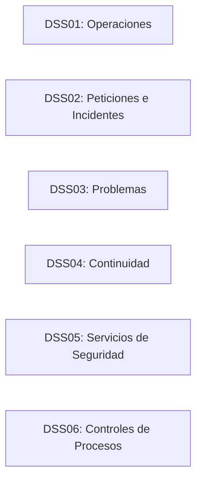

#### 1. DSS01: Operaciones Gestionadas (*Managed Operations*)
- **Propósito:** Coordinar y ejecutar las actividades y procedimientos operativos diarios de TI para entregar los servicios acordados de forma ininterrumpida y predecible.
- **Actividades Clave:** Ejecución y supervisión de tareas por lotes (*batch jobs*), mantenimiento preventivo de infraestructura, gestión de respaldos diarios (*backups*) y monitorización continua de servidores y redes.
- **Ejemplo:** El equipo de operaciones del NOC (Network Operations Center) ejecuta y valida la correcta terminación del proceso de cierre contable nocturno de la base de datos a las 03:00 AM.

#### 2. DSS02: Peticiones de Servicio e Incidentes Gestionados (*Managed Service Requests and Incidents*)
- **Propósito:** Lograr una mayor productividad y minimizar las interrupciones en el negocio mediante la resolución rápida de incidentes operativos y la atención oportuna de peticiones.
- **Actividades Clave:** Mesa de ayuda de TI (*Service Desk*), clasificación y priorización de incidentes según impacto y urgencia, escalamiento a niveles de soporte L1/L2/L3 y gestión de incidentes mayores (*War Room*).
- **Ejemplo:** Un usuario reporta que no puede ingresar al sistema de facturación; el Service Desk restablece sus credenciales en 5 minutos cumpliendo el SLA de 15 minutos establecido para incidentes de prioridad 3.

#### 3. DSS03: Problemas Gestionados (*Managed Problems*)
- **Propósito:** Aumentar la disponibilidad del servicio, reducir costos y mejorar el desempeño del negocio identificando las causas raíz de los incidentes y evitando su recurrencia.
- **Actividades Clave:** Análisis de causa raíz (RCA mediante diagramas de Ishikawa o los 5 Porqués), registro de soluciones temporales (*Workarounds*) en la base de datos de errores conocidos (KEDB) y generación de peticiones de cambio (RFC).
- **Ejemplo:** Tras experimentar caídas repetidas del portal web cada viernes a las 18:00, el equipo de problemas descubre una fuga de memoria (*memory leak*) en una librería de serialización JSON y solicita al equipo de desarrollo una corrección definitiva de software.

#### 4. DSS04: Continuidad Gestionada (*Managed Continuity*)
- **Propósito:** Adaptar rápidamente los servicios de I&T y los planes de recuperación ante desastres (DRP) para mantener la resiliencia operativa y la disponibilidad de los activos críticos.
- **Actividades Clave:** Análisis de Impacto en el Negocio (BIA), definición de métricas RTO (Recovery Time Objective) y RPO (Recovery Point Objective), mantenimiento del sitio alterno de contingencia y realización de simulacros anuales.
- **Ejemplo:** Ejecución de un simulacro de conmutación por error (*failover*) sin aviso previo, desconectando el centro de datos principal para comprobar que el sitio secundario asuma la operación en menos de 15 minutos sin pérdida transaccional.

#### 5. DSS05: Servicios de Seguridad Gestionados (*Managed Security Services*)
- **Propósito:** Proteger la información de la empresa y la infraestructura tecnológica para mantener la confidencialidad, integridad y disponibilidad contra amenazas operativas.
- **Actividades Clave:** Operación del Centro de Operaciones de Seguridad (SOC), monitorización de eventos en el SIEM, gestión de vulnerabilidades y parches, respuesta a incidentes de seguridad (CSIRT) y pruebas de penetración periódicas.
- **Ejemplo:** El SOC detecta una anomalía de tráfico que corresponde a un ataque de fuerza bruta contra el servidor SSH de la institución; bloquea automáticamente la dirección IP de origen en el Firewall perimetral y notifica al CISO.

#### 6. DSS06: Controles de Procesos de Negocio Gestionados (*Managed Business Process Controls*)
- **Propósito:** Mantener la integridad del procesamiento de la información en los procesos de negocio automatizados mediante la operación efectiva de controles de aplicación.
- **Actividades Clave:** Validación de controles automatizados de entrada, procesamiento y salida; segregación de funciones (*Segregation of Duties - SoD*); y conciliación de transacciones electrónicas.
- **Ejemplo:** Control automático en el software financiero que impide que el mismo usuario que registra una orden de compra sea quien autorice la transferencia de pago al proveedor.

---

### 5.3.5 Dominio MEA: Monitorear, Evaluar y Valorar (*Monitor, Evaluate and Assess*) — 4 Objetivos de Gestión

El dominio MEA es el mecanismo de retroalimentación y supervisión continua. Cierra el ciclo de gobierno verificando si la gestión de TI está cumpliendo con los objetivos de desempeño, el control interno y las obligaciones legales.

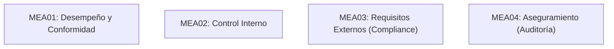

#### 1. MEA01: Monitoreo del Desempeño y Conformidad Gestionados (*Managed Performance and Conformance Monitoring*)
- **Propósito:** Recopilar, validar y evaluar las metas y métricas de los procesos de I&T para determinar si las operaciones cumplen con los objetivos de negocio acordados.
- **Actividades Clave:** Diseñar tableros de control balanceados (*Dashboards* con PowerBI o Grafana), recolectar telemetría de procesos, analizar tendencias de KPIs y reportar desviaciones a la gerencia.
- **Ejemplo:** El CIO revisa mensualmente un tablero ejecutivo que consolida el uptime de sistemas, el índice de satisfacción de usuarios y la tasa de resolución de incidentes en primer contacto.

#### 2. MEA02: Sistema de Control Interno Gestionado (*Managed System of Internal Control*)
- **Propósito:** Monitorear y evaluar continuamente el entorno de control de I&T de la empresa para asegurar que sea adecuado, efectivo y eficiente según marcos como COSO.
- **Actividades Clave:** Evaluaciones de autocontrol (CSA - Control Self-Assessment), revisión de pistas de auditoría (*audit trails*), identificación de deficiencias de control y planes de remediación.
- **Ejemplo:** Revisión trimestral de las cuentas de usuario con privilegios de administrador del sistema (*root/admin*), revocando automáticamente los accesos de empleados que renunciaron o fueron reasignados.

#### 3. MEA03: Cumplimiento de Requisitos Externos Gestionado (*Managed Compliance with External Requirements*)
- **Propósito:** Asegurar que la empresa cumpla con todas las leyes, regulaciones, contratos y estándares aplicables a las operaciones e infraestructura de I&T.
- **Actividades Clave:** Mapeo de obligaciones normativas externas, identificación de brechas de cumplimiento legal, interacción con entes reguladores y atención a requerimientos de inspección.
- **Ejemplo:** Auditoría de adecuación de la infraestructura informática a los mandatos de la Ley Orgánica de Protección de Datos Personales (LOPDP) de la República del Ecuador, designando al Oficial de Protección de Datos (DPO) y adecuando el consentimiento informado.

#### 4. MEA04: Aseguramiento Gestionado (*Managed Assurance*)
- **Propósito:** Planificar, facilitar y ejecutar iniciativas de aseguramiento independientes (auditorías internas y externas) para proporcionar confianza razonable sobre la eficacia del gobierno y la gestión de I&T.
- **Actividades Clave:** Coordinación con la Auditoría Interna y Auditores Externos independientes, facilitación de evidencias, formulación de planes de acción correctiva ante hallazgos de auditoría y seguimiento riguroso de su implementación.
- **Ejemplo:** El equipo de TI atiende la auditoría anual de certificación ISO/IEC 27001 ejecutada por una firma internacional certificadora, presentando las evidencias documentadas del SGSI y gestionando las observaciones sin recibir no-conformidades mayores.

---

## 5.4 Criterios de Evaluación y Niveles de Capacidad

### 5.4.1 Modelo de Capacidad del Proceso (PCM) y Modelo de Evaluación (PAM) alineados a ISO/IEC 33000

En COBIT 5, la evaluación de procesos se basaba en la norma internacional **ISO/IEC 15504** (*SPICE*). En COBIT 2019, ISACA actualizó el Modelo de Capacidad de Procesos (*Process Capability Model - PCM*) para alinearlo formalmente con la nueva familia de normas **ISO/IEC 33000** (*Information Technology — Process Assessment*) y la filosofía de **CMMI 2.0** (*Capability Maturity Model Integration*).

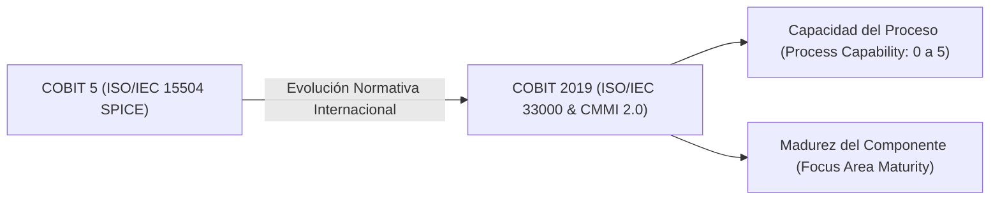

> [!definition] Modelo de Evaluación de Procesos (PAM - Process Assessment Model)
> Es el conjunto estandarizado de indicadores, criterios de verificación y procedimientos de medición que utiliza un evaluador o auditor para medir objetivamente la medida en que un proceso de I&T satisface sus atributos de proceso y alcanza sus resultados esperados.

---

### 5.4.2 Los 6 Niveles de Capacidad (0 a 5)

La escala de capacidad mide **qué tan estructurada, formal, predecible y optimizada** es la ejecución de las actividades de un proceso de COBIT:

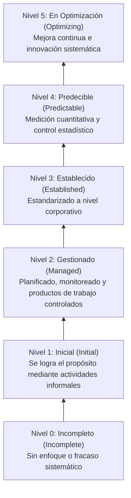

| Nivel de Capacidad | Denominación Oficial | Estado del Proceso | Criterios Observables en Auditoría |
| :---: | :--- | :--- | :--- |
| **0** | **Incompleto** (*Incomplete*) | No implementado o no logra su propósito. | Hay poco o ningún indicio de actividades estructuradas. No se generan los productos de trabajo requeridos. El proceso fracasa de forma caótica. |
| **1** | **Inicial** (*Initial*) | El proceso logra en gran medida su propósito básico. | Las actividades se ejecutan de manera intuitiva, individual y a menudo reactiva (depende del heroísmo de ingenieros individuales). No hay documentación estándar formal. |
| **2** | **Gestionado** (*Managed*) | El proceso se planifica, supervisa, ajusta y sus productos de trabajo se controlan. | Las actividades del proceso se planifican previamente; los entregables (*work products*) se revisan, versionan y aprueban formalmente; se asignan recursos y responsabilidades. |
| **3** | **Establecido** (*Established*) | El proceso se ejecuta según un proceso estándar definido para toda la empresa. | La organización posee un procedimiento documentado oficial que es desplegado y adoptado institucionalmente por todas las áreas; no depende de individuos específicos. |
| **4** | **Predecible** (*Predictable*) | El proceso se mide y gestiona cuantitativamente dentro de límites definidos. | Se aplican métricas estadísticas objetivas para monitorear la variación del proceso. Se conoce con certeza matemática la probabilidad de falla o el rendimiento esperado. |
| **5** | **En Optimización** (*Optimizing*) | El proceso se mejora continuamente mediante innovación tecnológica. | El proceso recopila telemetría automatizada para retroalimentación continua; se analiza la causa raíz de pequeñas variaciones y se implementan tecnologías emergentes disruptivas proactivamente. |

---

### 5.4.3 Los 9 Atributos de Proceso (*Process Attributes - PA*)

De conformidad con **ISO/IEC 33020** (el estándar de medición de procesos), cada nivel de capacidad se valida mediante la consecución de **Atributos de Proceso (PA)** específicos:

```mermaid
flowchart LR
    subgraph N1["Nivel 1"]
        PA11["PA 1.1: Desempeño del Proceso"]
    end
    subgraph N2["Nivel 2"]
        PA21["PA 2.1: Gestión del Desempeño"]
        PA22["PA 2.2: Gestión de Productos de Trabajo"]
    end
    subgraph N3["Nivel 3"]
        PA31["PA 3.1: Definición del Proceso"]
        PA32["PA 3.2: Despliegue del Proceso"]
    end
    subgraph N4["Nivel 4"]
        PA41["PA 4.1: Medición Cuantitativa"]
        PA42["PA 4.2: Control del Proceso"]
    end
    subgraph N5["Nivel 5"]
        PA51["PA 5.1: Innovación del Proceso"]
        PA52["PA 5.2: Optimización del Proceso"]
    end
    N1 --> N2 --> N3 --> N4 --> N5
```

1. **PA 1.1: Desempeño del Proceso (*Process Performance Attribute*):**  
   Mide la medida en que el proceso alcanza los resultados previstos transformando insumos identificables en productos definidos.
2. **PA 2.1: Gestión del Desempeño (*Performance Management Attribute*):**  
   Mide la medida en que la ejecución del proceso se planifica, monitorea y ajusta para cumplir con los objetivos fijados en términos de tiempos y recursos.
3. **PA 2.2: Gestión de Productos de Trabajo (*Work Product Management Attribute*):**  
   Mide la medida en que los productos de trabajo generados por el proceso (código fuente, documentos de arquitectura, registros de cambios) son debidamente identificados, evaluados, controlados y mantenidos.
4. **PA 3.1: Definición del Proceso (*Process Definition Attribute*):**  
   Mide la medida en que se mantiene y documenta formalmente un proceso estándar que describe las actividades, roles, competencias e interfaces aplicables a toda la empresa.
5. **PA 3.2: Despliegue del Proceso (*Process Deployment Attribute*):**  
   Mide la medida en que el proceso estándar documentado se implementa efectivamente como un proceso definido en todos los proyectos y áreas de la organización.
6. **PA 4.1: Medición Cuantitativa (*Process Measurement Attribute*):**  
   Mide la medida en que los resultados de la medición se utilizan para identificar y gestionar cuantitativamente el comportamiento del proceso respecto a objetivos de negocio.
7. **PA 4.2: Control del Proceso (*Process Control Attribute*):**  
   Mide la medida en que el proceso se controla cuantitativamente utilizando técnicas estadísticas para producir un desempeño predecible y dentro de límites de control.
8. **PA 5.1: Innovación del Proceso (*Process Innovation Attribute*):**  
   Mide la medida en que se identifican cambios estructurales e innovaciones en el proceso a partir del análisis de nuevas tecnologías y mejores prácticas de la industria.
9. **PA 5.2: Optimización del Proceso (*Process Optimization Attribute*):**  
   Mide la medida en que la implementación del proceso se refina continuamente para eliminar causas comunes de variación y mejorar la efectividad general.

---

### 5.4.4 Diferenciación Crucial: Capacidad del Proceso vs. Desempeño Técnico

Esta distinción es esencial para evitar conclusiones erróneas en auditorías de sistemas y comités directivos:

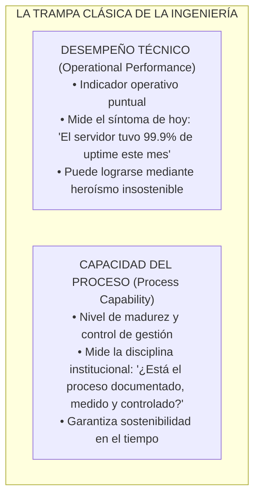

> [!warning] La Trampa del "Heroísmo Técnico"
> Una empresa puede tener un **desempeño técnico sobresaliente** (cero incidentes de producción durante un mes y 99.99% de disponibilidad) pero una **capacidad del proceso en Nivel 1 (Inicial)**.  
> *¿Cómo es posible?* Porque todo funciona gracias a dos ingenieros brillantes que no duermen, no documentan nada y atienden alertas manualmente a las 3 de la mañana. Si esos dos ingenieros renuncian, el sistema de TI colapsa al día siguiente.  
> Por el contrario, un proceso en **Nivel 3 (Establecido)** garantiza que cualquier ingeniero calificado puede ejecutar los procedimientos estandarizados con la misma calidad, garantizando la continuidad del negocio con independencia del personal.

| Dimensión | Capacidad del Proceso (*Process Capability*) | Desempeño Técnico (*Technical Performance*) |
| :--- | :--- | :--- |
| **¿Qué mide?** | La madurez estructural, control, estandarización y predictibilidad del proceso de gestión. | El resultado operativo tangible y puntual de la tecnología en un período de tiempo. |
| **Escala de Medición** | Niveles del 0 al 5 (ISO/IEC 33000 / CMMI). | Métricas numéricas operativas (KPIs: porcentaje de uptime, milisegundos de latencia, MTTR). |
| **Perspectiva Temporal** | Sostenibilidad a mediano y largo plazo; resiliencia ante rotación de personal. | Foto instantánea del momento presente (desempeño histórico inmediato). |
| **Interesado Principal** | Auditores de Sistemas (CISA), Directorio, Comité de Riesgos, CIO. | Administradores de Sistemas, Operadores de Red (NOC/SOC), Usuarios Finales. |
| **Ejemplo Concreto** | El proceso **BAI06 (Gestión de Cambios)** cuenta con procedimientos estandarizados, pruebas automatizadas en CI/CD y aprobación del CAB (**Nivel 3**). | El tiempo de compilación y despliegue del microservicio es de 4 minutos con una tasa de éxito del 98% (**KPI Técnico**). |

---

## 5.5 Matrices de Evaluación y Diseño

### 5.5.1 Matrices de Alineamiento y Cascada de Metas

En la guía de diseño de COBIT 2019, la cascada de metas se instrumentaliza a través de tablas matriciales formales que vinculan los tres niveles mediante un sistema de ponderación matemática:

```
[Metas de Empresa - EG] ──(Matriz EG-AG)──> [Metas de Alineación - AG] ──(Matriz AG-Obj)──> [40 Objetivos COBIT]
```

Para cada intersección en las matrices oficiales de ISACA:
- **Relación Primaria ($P$):** Representa un peso de $P = 3$. Indica que la meta superior depende de manera crítica de la meta o proceso inferior.
- **Relación Secundaria ($S$):** Representa un peso de $S = 1$. Aporta al cumplimiento pero no es un factor determinante exclusivo.
- **Sin Relación:** Peso de $0$.

El valor acumulado de importancia para cada uno de los 40 objetivos se calcula mediante la sumatoria del producto matricial ponderado de las prioridades estratégicas asignadas por la empresa:

$$\text{Puntuación Base del Objetivo}_j = \sum_{k=1}^{13} \left( \text{Importancia AG}_k \times \text{Peso Matriz}(AG_k, Obj_j) \right)$$

---

### 5.5.2 Metodología y Matrices de Diseño (ISACA Design Toolkit)

El diseño de un sistema de gobierno a medida sigue un procedimiento metódico de 4 etapas soportado por la herramienta oficial *COBIT 2019 Design Toolkit* (hoja de cálculo analítica avanzada de ISACA):

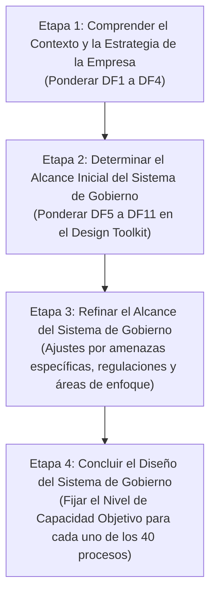

1. **Etapa 1: Entender el contexto y la estrategia de la empresa:**  
   Se entrevista al Directorio y a la Alta Gerencia para calificar en una escala de 1 a 5 la relevancia de los arquetipos de estrategia empresarial (DF1), las 13 metas de la empresa (DF2), los 19 escenarios de riesgo de TI (DF3) y los puntos de dolor actuales (DF4).
2. **Etapa 2: Determinar el alcance inicial del sistema:**  
   La herramienta de diseño procesa los algoritmos de ponderación matricial y genera un gráfico radar con las **puntuaciones de importancia relativa (de 0 a 100)** para cada uno de los 40 objetivos, sugiriendo un **Nivel de Capacidad Objetivo inicial (Target Capability Level: típicamente entre 2 y 4)**.
3. **Etapa 3: Refinar el alcance del sistema de gobierno:**  
   Se introducen los Factores de Diseño del entorno operativo: severidad del panorama de amenazas (DF5), exigencias regulatorias (DF6), rol de TI según McFarlan (DF7), modelos de abastecimiento en la nube (DF8), métodos ágiles o DevOps (DF9), ritmo de adopción tecnológica (DF10) y tamaño empresarial (DF11). Si la empresa opera en un entorno altamente hostil (DF5 alto), la herramienta eleva de forma automática los niveles objetivo de **APO12 (Riesgos)**, **APO13 (Seguridad)** y **DSS05 (Servicios de Seguridad)**.
4. **Etapa 4: Concluir el diseño del sistema de gobierno:**  
   Se consolida la **Matriz de Niveles de Capacidad Objetivo Definitiva**. Esta matriz establece qué procesos requieren un Nivel 4 (ej. banca transaccional), cuáles un Nivel 2 o 3 (procesos de soporte) y cuáles pueden permanecer en Nivel 1.

---

### 5.5.3 Escala de Calificación de Atributos de Capacidad: N-P-L-F

De conformidad con **ISO/IEC 33000**, el grado de cumplimiento de cada atributo de proceso se califica mediante la escala estándar **N-P-L-F**:

| Calificación | Denominación en Español | Denominación Oficial | Rango Porcentual de Consecución | Criterio de Auditoría |
| :---: | :--- | :--- | :---: | :--- |
| **N** | **No Alcanzado** | *Not Achieved* | **0% a 15%** | Hay poca o ninguna evidencia de consecución del atributo en el proceso evaluado. |
| **P** | **Parcialmente Alcanzado** | *Partially Achieved* | **> 15% a 50%** | Hay alguna evidencia de consecución y ciertos resultados se logran, pero el desempeño es impredecible. |
| **L** | **Ampliamente Alcanzado** | *Largely Achieved* | **> 50% a 85%** | Hay evidencia de un enfoque sistemático y consecución significativa del atributo; existen pequeñas deficiencias no sistemáticas. |
| **F** | **Totalmente Alcanzado** | *Fully Achieved* | **> 85% a 100%** | Hay evidencia completa y sistemática de consecución del atributo en toda la unidad evaluada sin deficiencias significativas. |

---

### 5.5.4 Reglas de Calificación Acumulativa y Avance de Nivel de Capacidad

Para certificar formalmente que un proceso ha alcanzado un Nivel de Capacidad $k$, **debe cumplirse una regla estricta de orden acumulativo e irreversible**. No es posible saltarse niveles:

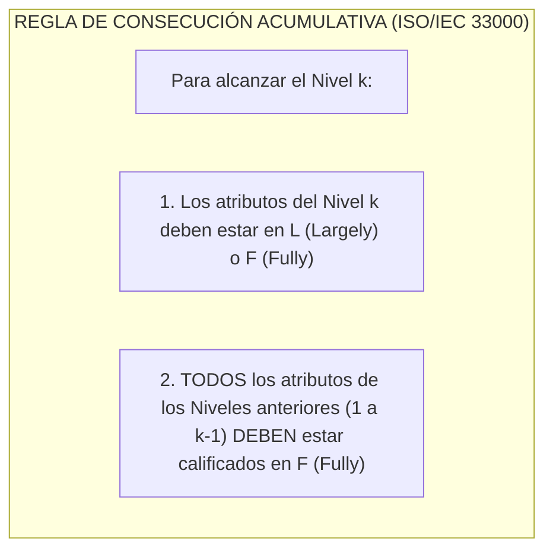

| Nivel Evaluado | PA 1.1 | PA 2.1 | PA 2.2 | PA 3.1 | PA 3.2 | PA 4.1 | PA 4.2 | PA 5.1 | PA 5.2 | Nivel de Capacidad Certificado |
| :---: | :---: | :---: | :---: | :---: | :---: | :---: | :---: | :---: | :---: | :---: |
| Caso A | **F** | **F** | **F** | **L** | **L** | N | N | N | N | **Nivel 3 (Establecido)** |
| Caso B | **F** | **L** | **F** | **F** | **F** | N | N | N | N | **Nivel 1 (Inicial)** *(Fallo en PA 2.1 impide Nivel 2 y 3)* |
| Caso C | **F** | **F** | **F** | **F** | **F** | **L** | **F** | N | N | **Nivel 4 (Predecible)** |
| Caso D | **P** | N | N | N | N | N | N | N | N | **Nivel 0 (Incompleto)** |

> [!important] Análisis del Caso B: El "Efecto Cuello de Botella"
> En el Caso B de la tabla anterior, los evaluadores observan que los ingenieros tienen manuales excelentes y estandarizados (PA 3.1 y 3.2 calificados en **F**), pero el atributo PA 2.1 (gestión de tiempos y recursos del día a día) fue calificado en **L (Largely)**.  
> Bajo las reglas matemáticas de ISO/IEC 33000 y COBIT 2019, **el proceso NO alcanza el Nivel 2 ni el Nivel 3**. Se queda bloqueado en **Nivel 1**, porque no se puede construir un proceso corporativo estándar sobre una gestión operativa deficiente en sus fundamentos.

---

## 5.6 Guía de Implementación de COBIT 2019

### 5.6.1 El Ciclo de Vida de Mejora Continua de 7 Fases

La implementación de un sistema de gobierno no debe gestionarse como un proyecto lineal con fin preestablecido, sino como un **ciclo de vida de mejora continua de 7 fases**. Cada fase responde a una pregunta estratégica fundamental para la empresa:

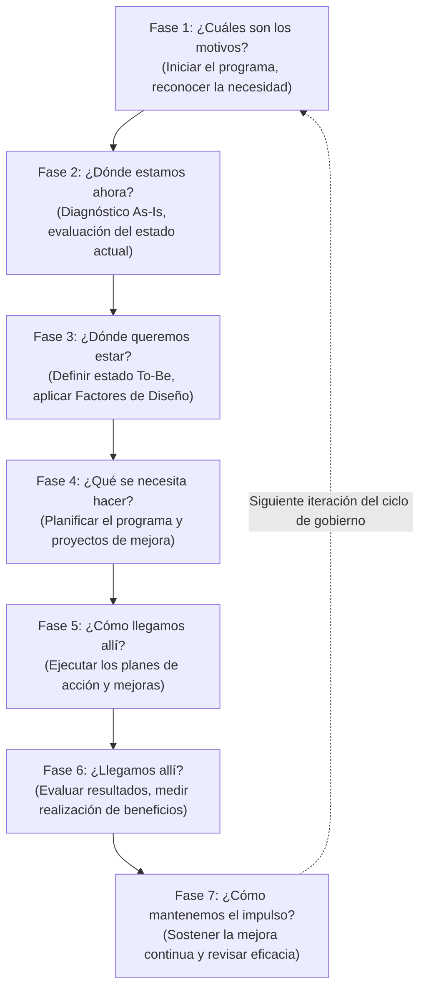

1. **Fase 1: ¿Cuáles son los motivos? (*What are the drivers?*)**  
   - *Objetivo:* Identificar y documentar los factores detonantes de negocio (auditorías reprobadas, fusiones empresariales, multas normativas, nuevas estrategias) que justifican iniciar el programa de gobierno de TI.
   - *Entregable:* Caso de Negocio Inicial (*Initial Business Case*) y mandato formal de patrocinio por parte de la Junta Directiva.
2. **Fase 2: ¿Dónde estamos ahora? (*Where are we now?*)**  
   - *Objetivo:* Diagnosticar el estado actual (*As-Is*) del sistema de gobierno y evaluar el nivel de capacidad actual de los procesos de I&T mediante un ejercicio formal de evaluación de procesos.
   - *Entregable:* Informe de Evaluación de Madurez y Capacidad As-Is.
3. **Fase 3: ¿Dónde queremos estar? (*Where do we want to be?*)**  
   - *Objetivo:* Definir el estado objetivo (*To-Be*). Utilizando los 11 Factores de Diseño y el *Design Toolkit*, la empresa determina qué procesos priorizar y qué niveles de capacidad objetivo deben alcanzarse.
   - *Entregable:* Definición del Alcance y Niveles de Capacidad Objetivo (*Target State*).
4. **Fase 4: ¿Qué se necesita hacer? (*What needs to be done?*)**  
   - *Objetivo:* Realizar un Análisis de Brechas (*Gap Analysis*) contrastando el estado actual (*As-Is*) contra el estado deseado (*To-Be*), traduciendo esas brechas en proyectos concretos de mejora.
   - *Entregable:* Plan del Programa de Mejora y Hoja de Ruta de Implementación (*Roadmap*).
5. **Fase 5: ¿Cómo llegamos allí? (*How do we get there?*)**  
   - *Objetivo:* Ejecutar los proyectos de mejora definidos en la hoja de ruta: redactar nuevas políticas, rediseñar flujos de procesos en BPMN, adquirir herramientas de automatización y capacitar al personal.
   - *Entregable:* Nuevos procesos, estructuras y componentes desplegados operativamente.
6. **Fase 6: ¿Llegamos allí? (*Did we get there?*)**  
   - *Objetivo:* Verificar si los proyectos implementados alcanzaron las metas previstas y entregaron los beneficios esperados, contrastando mediante una reevaluación de capacidad de procesos.
   - *Entregable:* Informe de Realización de Beneficios y Evaluación Post-Implementación.
7. **Fase 7: ¿Cómo mantenemos el impulso? (*How do we keep the momentum going?*)**  
   - *Objetivo:* Integrar los nuevos procesos en las operaciones cotidianas de la organización, monitorear continuamente el desempeño y ajustar el sistema ante nuevos cambios en el entorno de negocio.
   - *Entregable:* Planes de mantenimiento del sistema de gobierno y agenda de mejora continua.

---

### 5.6.2 Los 3 Anillos Concurrentes de Implementación

Una de las grandes fortalezas pedagógicas y prácticas de COBIT 2019 es que las 7 fases no se ejecutan de manera aislada. Se desarrollan a lo largo de **3 anillos concurrentes e integrados**:

```mermaid
flowchart TD
    subgraph ANILLO_EXTERNO["ANILLO EXTERNO: GESTIÓN DEL PROGRAMA (Program Management)"]
        direction TB
        PM1["Fase 1: Iniciar programa"] --> PM2["Fase 2: Definir objetivos"]
        PM2 --> PM3["Fase 3: Planificar programa"]
        PM3 --> PM4["Fase 4: Ejecutar proyectos"]
        PM4 --> PM5["Fase 5: Controlar entregables"]
        PM5 --> PM6["Fase 6: Realizar beneficios"]
        PM6 --> PM7["Fase 7: Mantener programa"]
    end

    subgraph ANILLO_MEDIO["ANILLO INTERMEDIO: HABILITACIÓN DEL CAMBIO CULTURAL (Change Enablement)"]
        direction TB
        CE1["1. Crear urgencia"] --> CE2["2. Formar coalición guía"]
        CE2 --> CE3["3. Comunicar visión"]
        CE3 --> CE4["4. Empoderar acción"]
        CE4 --> CE5["5. Victorias tempranas"]
        CE5 --> CE6["6. Consolidar ganancias"]
        CE6 --> CE7["7. Anclar en la cultura"]
    end

    subgraph ANILLO_INTERNO["ANILLO INTERNO: CICLO DE MEJORA CONTINUA (Continuous Improvement Tasks)"]
        direction TB
        CI1["¿Cuáles son los motivos?"] --> CI2["¿Dónde estamos ahora?"]
        CI2 --> CI3["¿Dónde queremos estar?"]
        CI3 --> CI4["¿Qué se necesita hacer?"]
        CI4 --> CI5["¿Cómo llegamos allí?"]
        CI5 --> CI6["¿Llegamos allí?"]
        CI6 --> CI7["¿Cómo mantenemos el impulso?"]
    end

    ANILLO_EXTERNO --- ANILLO_MEDIO --- ANILLO_INTERNO
```

1. **Anillo Externo: Gestión del Programa (*Program Management*):**  
   Aplica buenas prácticas de gestión de programas y proyectos (PMBOK/PRINCE2) para asegurar que la implementación del gobierno se maneje con rigurosidad financiera, cronogramas formales, gestión de riesgos, hitos claros y gobierno del propio programa.
2. **Anillo Intermedio: Habilitación del Cambio Organizacional (*Change Enablement*):**  
   Reconoce que gobernar TI implica cambiar hábitos, redistribuir poder y exigir transparencia. Adopta el **Modelo de Gestión del Cambio de 8 Pasos de John Kotter**:
   - *Paso 1: Establecer sentido de urgencia:* Mostrar los costos reales de no tener gobierno de TI (riesgo de quiebra, multas, fraudes).
   - *Paso 2: Formar una coalición guía poderosa:* Comprometer a líderes clave de TI, finanzas y operaciones.
   - *Paso 3: Crear una visión clara del cambio:* Explicar cómo el gobierno mejorará el trabajo diario.
   - *Paso 4: Comunicar la visión ampliamente:* Usar múltiples canales para sensibilizar al personal.
   - *Paso 5: Empoderar a los empleados para actuar:* Eliminar trabas burocráticas y capacitar a los equipos.
   - *Paso 6: Asegurar triunfos tempranos (*Quick Wins*):* Implementar mejoras visibles en 60 días (ej. resolver el desorden de accesos o estabilizar respaldos críticos).
   - *Paso 7: Consolidar ganancias y construir más cambios:* Evitar cantar victoria prematuramente.
   - *Paso 8: Anclar los nuevos enfoques en la cultura:* Institucionalizar las nuevas prácticas en las descripciones de puestos e inducciones de personal.
3. **Anillo Interno: Ciclo de Mejora Continua (*Continuous Improvement Tasks*):**  
   Las tareas técnicas específicas de diseño, diagnóstico As-Is, definición To-Be y remediación de brechas de capacidad de los procesos de COBIT.

---

### 5.6.3 Catálogo de Puntos de Dolor (*Pain Points*) y Eventos Detonantes (*Trigger Events*)

En el ámbito profesional de la consultoría y la auditoría, las empresas casi nunca deciden adoptar COBIT por curiosidad teórica. Lo hacen motivadas por un **punto de dolor agudo** o por un **evento detonante imprevisto**:

```mermaid
flowchart TD
    subgraph DOLORES["PUNTOS DE DOLOR (Pain Points)"]
        D1["Gastos de TI descontrolados sin valor visible"]
        D2["Incidentes cibernéticos recurrentes y fugas de datos"]
        D3["Proyectos de software con retrasos y sobrecostos crónicos"]
        D4["Hallazgos graves y repetidos en auditorías externas"]
    end

    subgraph EVENTOS["EVENTOS DETONANTES (Trigger Events)"]
        E1["Aparición de nueva legislación estricta (ej. LOPDP)"]
        E2["Fusión corporativa o adquisición internacional"]
        E3["Nombramiento de un nuevo Directorio, CEO o CIO"]
        E4["Disrupción de mercado por competidores fintech"]
    end

    DOLORES & EVENTOS -->|"Justifican la necesidad ante la Junta Directiva de"| ADOPCION["Implementar un Programa de Gobierno de I&T con COBIT 2019"]
```

| Tipo | Situación / Problema Observado | Impacto en el Negocio | Procesos COBIT 2019 Prioritarios para Remediación |
| :--- | :--- | :--- | :--- |
| **Punto de Dolor** | Fallas continuas en la entrega de proyectos de desarrollo de software; presupuestos triplicados y retrasos de años. | Pérdida de oportunidades de mercado, frustración de la gerencia comercial y pérdida financiera. | **APO05** (Portafolio), **BAI02** (Requerimientos), **BAI03** (Construcción) y **BAI11** (Proyectos). |
| **Punto de Dolor** | La empresa sufre incidentes de seguridad recurrentes, infecciones de ransomware o fuga de credenciales. | Daño reputacional severo, pérdidas por extorsión y posible paralización de operaciones. | **APO12** (Riesgos), **APO13** (Seguridad) y **DSS05** (Servicios de Seguridad). |
| **Punto de Dolor** | La Junta Directiva percibe que el presupuesto de TI es un "agujero negro" de dinero que no entrega valor al negocio. | Recortes arbitrarios de presupuesto de TI y desalineación estratégica. | **EDM02** (Beneficios), **APO02** (Estrategia) y **APO06** (Costos y Presupuestos). |
| **Punto de Dolor** | Caídas frecuentes de servicios en producción tras la realización de pases a producción en fines de semana. | Interrupción en la atención a clientes, multas de servicio y horas extra no planificadas. | **BAI06** (Cambios de TI), **BAI07** (Transición) y **BAI10** (Configuración). |
| **Evento Detonante**| Entrada en vigor de una regulación gubernamental estricta con sanciones económicas graves (ej. LOPDP en Ecuador). | Riesgo inminente de multas millonarias (hasta el 1% de la facturación) y clausura de operaciones. | **EDM01** (Marco de Gobierno), **APO14** (Datos) y **MEA03** (Cumplimiento de Requisitos Externos). |
| **Evento Detonante**| La empresa compra o absorbe a un competidor comercial y debe fusionar dos arquitecturas tecnológicas dispares. | Incompatibilidad de sistemas, duplicidad de costos y silos de información no integrados. | **EDM04** (Recursos), **APO03** (Arquitectura Empresarial) y **BAI01** (Programas). |
| **Evento Detonante**| Llegada de un nuevo CEO o CIO con el mandato expreso de modernizar institucionalmente la empresa. | Necesidad de establecer una línea base de diagnóstico objetiva en los primeros 100 días de gestión. | Diagnóstico integral con el **Design Toolkit** de COBIT y autoevaluación **MEA01**. |

---

## 5.7 Síntesis y Conclusiones para el Estudiante de la EPN

Como estudiante del 9.º Semestre de Ingeniería en Ciencias de la Computación de la Escuela Politécnica Nacional y futuro líder tecnológico:

1. **La tecnología no es un fin, es un habilitador de valor:**  
   El mejor algoritmo o la arquitectura de microservicios más sofisticada carecen de relevancia si no optimizan los procesos misionales de la organización, no mitigan riesgos cibernéticos o no respetan el apetito al riesgo de la empresa.
2. **El gobierno crea las reglas para que la gestión funcione:**  
   El gobierno (*EDM*) fija el rumbo, las políticas y los límites; la gestión (*APO, BAI, DSS, MEA*) diseña, construye, opera y supervisa las soluciones técnicas dentro de esos límites. Confundir ambos planos genera caos institucional o microgestión paralizante por parte de los directores.
3. **COBIT 2019 es un traje a la medida:**  
   No cometas el error de novato de intentar implementar los 40 objetivos con nivel de capacidad 5 en una empresa que recién comienza. Utiliza los **11 Factores de Diseño** para identificar los 8 o 10 procesos verdaderamente críticos para el modelo de negocio particular de tu organización.
4. **La auditoría informática es una disciplina científica:**  
   Con el marco **ITAF** y **COBIT 2019**, el auditor de sistemas no emite opiniones subjetivas; evalúa evidencias documentadas, analiza la capacidad de procesos bajo **ISO/IEC 33000** y ayuda a las empresas a construir sistemas de control interno resilientes, confiables y transparentes.

---

## 📚 Referencias Bibliográficas y Normativas

1. **ISACA.** (2018). *COBIT 2019 Framework: Introduction and Methodology*. Schaumburg, IL: Information Systems Audit and Control Association.
2. **ISACA.** (2018). *COBIT 2019 Framework: Governance and Management Objectives*. Schaumburg, IL: ISACA.
3. **ISACA.** (2018). *Designing an Information and Technology Governance Solution: COBIT 2019 Design Guide*. Schaumburg, IL: ISACA.
4. **ISACA.** (2018). *Implementing and Continually Improving an Information and Technology Governance Solution: COBIT 2019 Implementation Guide*. Schaumburg, IL: ISACA.
5. **ISACA.** (2020). *ITAF: A Professional Practices Framework for Information Technology Assurance (4th Edition)*. Schaumburg, IL: ISACA.
6. **ISO/IEC.** (2015). *ISO/IEC 33000:2015 Information technology — Process assessment — Concepts and terminology*. Ginebra: International Organization for Standardization.
7. **ISO/IEC.** (2015). *ISO/IEC 38500:2015 Information technology — Governance of IT for the organization*. Ginebra: ISO/IEC.
8. **Kotter, J. P.** (2012). *Leading Change*. Boston, MA: Harvard Business Review Press.
9. **Kaplan, R. S., & Norton, D. P.** (1996). *The Balanced Scorecard: Translating Strategy into Action*. Boston, MA: Harvard Business School Press.
