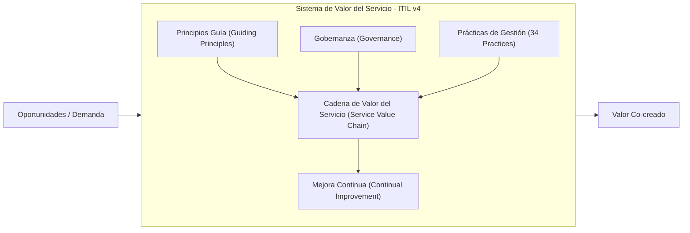
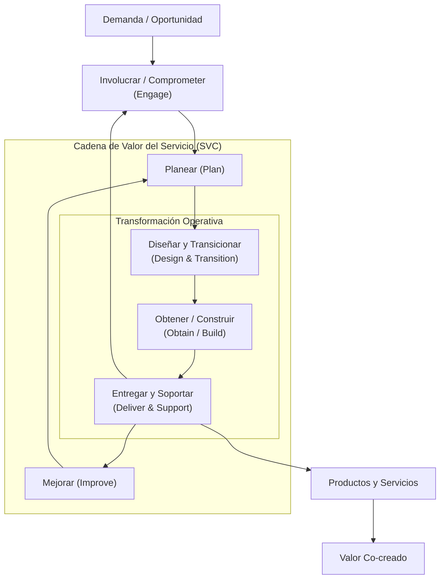
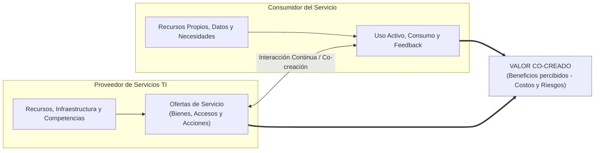
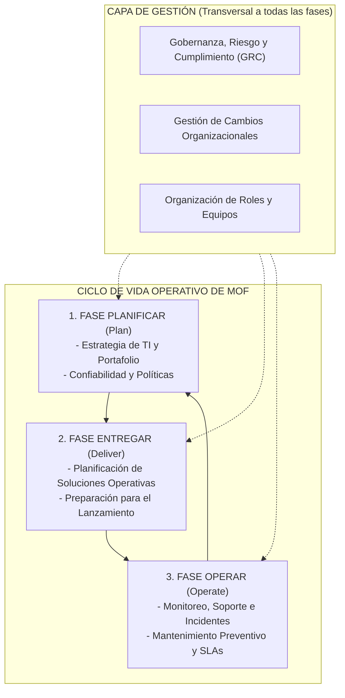
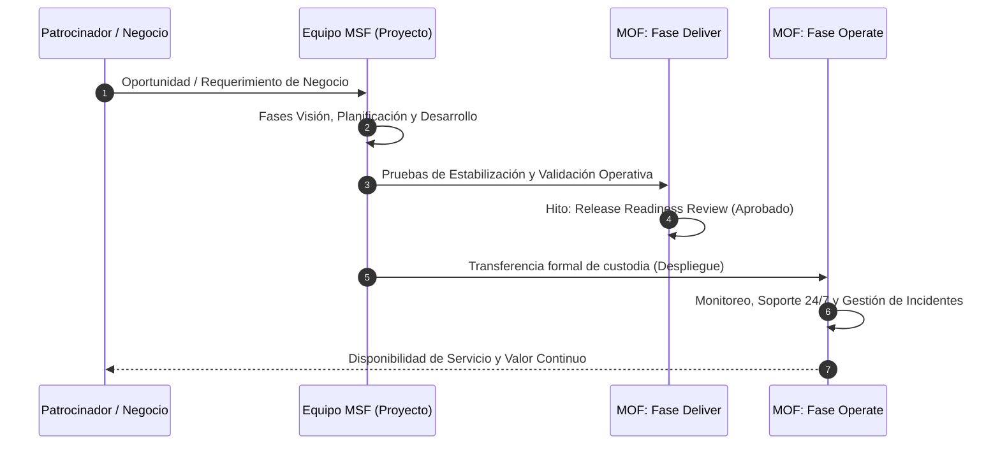
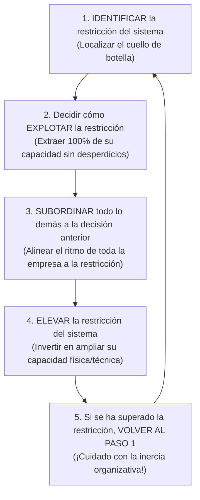
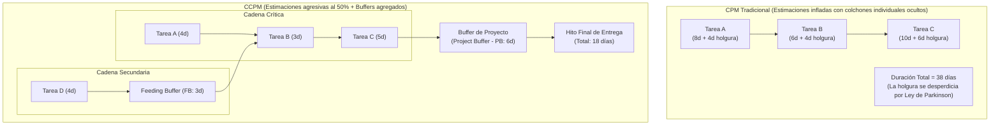
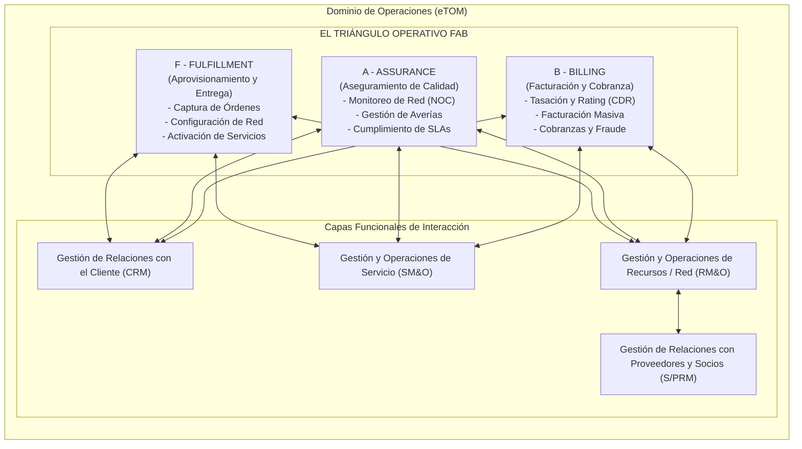

# Capítulo 6: Otros Modelos y Marcos de Gestión de TICs

> [!info] 💡 ¿Cómo entender esto desde cero? (Guía para novatos de pregrado)
> Imagina que una organización moderna es como una metrópoli de alta tecnología. 
> - **ITIL v4** es el manual de convivencia, logística y servicios de la ciudad: define cómo los ciudadanos (clientes) y las empresas colaboran para generar valor mutuo, evitando que los servicios se diseñen en torres de marfil aisladas.
> - **ISO/IEC 20000-1** es el código legal auditable e internacional: establece las leyes estrictas y verificables por inspectores externos para certificar que el sistema de servicios opera con calidad garantizada.
> - **MSF (Microsoft Solutions Framework)** es el equipo de arquitectos e ingenieros constructores: organiza a grupos multidisciplinarios en igualdad de condiciones para planificar, diseñar y construir soluciones tecnológicas sin morir en el intento.
> - **MOF (Microsoft Operations Framework)** es el cuerpo de mantenimiento de la infraestructura urbana: garantiza que, una vez inaugurado un rascacielos o un puente (sistema en producción), este funcione 24/7 sin colapsos, con costos controlados y mantenimiento predictivo.
> - **TOC-CCPM (Teoría de Restricciones y Cadena Crítica)** es el controlador de tráfico aéreo y de autopistas: demuestra matemáticamente que la velocidad de toda la ciudad está limitada por un solo cuello de botella y enseña a proteger el tiempo global eliminando las trampas psicológicas que causan retrasos en los proyectos.
> - **eTOM** es el mapa maestro específico para los operadores de telecomunicaciones: detalla cada tubería de fibra óptica, cada antena 5G, cada factura de abonado y cada orden de aprovisionamiento con precisión quirúrgica.
> 
> En este capítulo aprenderás que **no existe un marco único universal**, sino que el verdadero Ingeniero en TICs sabe orquestar y combinar estas disciplinas para crear ecosistemas tecnológicos resilientes, eficientes y alineados a la estrategia de negocio.

---

## 6.1 ITIL v4 (Information Technology Infrastructure Library)

### 6.1.1 Fundamentos y Evolución de ITIL v4
La **Biblioteca de Infraestructura de Tecnologías de la Información (ITIL)**, administrada globalmente por AXELOS (actualmente parte de PeopleCert), representa el marco de referencia de facto más adoptado a nivel mundial para la **Gestión de Servicios de TI (ITSM - IT Service Management)**.

```
┌─────────────────────────────────────────────────────────────────────────────┐
│                            EVOLUCIÓN HISTÓRICA DE ITIL                      │
├─────────────────┬──────────────────┬──────────────────┬─────────────────────┤
│ ITIL v1 (1989)  │ ITIL v2 (2000)   │ ITIL v3 (2007/11)│ ITIL v4 (2019+)     │
├─────────────────┼──────────────────┼──────────────────┼─────────────────────┤
│ Enfoque en      │ Orientación a    │ Ciclo de Vida    │ Sistema Integral    │
│ Infraestructura │ Procesos         │ del Servicio     │ de Valor del        │
│ de Hardware y   │ Operativos       │ (5 Fases         │ Servicio (SVS),     │
│ Operaciones     │ (Soporte y       │ Lineales y       │ Co-creación de      │
│ gubernamentales │ Entrega de       │ Silos            │ Valor, Ágil, DevOps │
│ (CCTA Reino U.) │ Servicios)       │ Estancos)        │ y Lean              │
└─────────────────┴──────────────────┴──────────────────┴─────────────────────┘
```

#### Del Paradigma de Procesos Aislados (ITIL v3) al Paradigma de Valor (ITIL v4)
Durante más de una década, **ITIL v3** estructuró la gestión de TI en torno al **Ciclo de Vida del Servicio (Service Lifecycle)**, segmentado en cinco etapas rígidas y secuenciales:
1. *Estrategia del Servicio (Service Strategy)*
2. *Diseño del Servicio (Service Design)*
3. *Transición del Servicio (Service Transition)*
4. *Operación del Servicio (Service Operation)*
5. *Mejora Continua del Servicio (Continual Service Improvement - CSI)*

Si bien ITIL v3 profesionalizó la industria de TI, introdujo patologías organizacionales severas en la era de la computación en la nube y el desarrollo rápido de software:
- **Efecto Silo Organizacional:** Los equipos de operación, desarrollo y soporte se convirtieron en compartimentos estancos con objetivos contradictorios (Desarrollo buscando velocidad de cambio vs. Operaciones buscando inmutabilidad y estabilidad).
- **Inflexibilidad en cascada (Waterfall bias):** La noción de transicionar un servicio secuencialmente desde el diseño hasta la operación chocaba frontalmente con los paradigmas modernos de entrega continua ([[Software 2/Integración continua y despliegue continuo (CI-CD)|CI/CD]]), microservicios y despliegues múltiples diarios.
- **Obsesión por el cumplimiento de procesos antes que por el valor:** Se priorizaba completar tickets y formularios sobre el impacto real en el negocio del cliente.

**ITIL v4** redefine por completo la disciplina: abandona el ciclo de vida estanco y adopta el **Sistema de Valor del Servicio (SVS)**. En este nuevo enfoque, TI deja de verse como un proveedor pasivo de soporte y se transforma en un socio estratégico que participa activamente en la **co-creación de valor** mediante la agilidad organizacional, la integración con marcos como [[Software 2/scrum|Scrum]], [[Software 2/kanban|Kanban]], Lean IT y DevOps.

---

### 6.1.2 El Sistema de Valor del Servicio (SVS - Service Value System)

> [!definition] Sistema de Valor del Servicio (SVS)
> El **SVS de ITIL v4** es un modelo holístico que describe cómo todos los componentes y actividades de una organización trabajan coordinadamente como un sistema dinámico e integrado para habilitar la creación de valor a partir de demandas y oportunidades del entorno.

El SVS representa la arquitectura macro de ITIL v4 y consta de cinco componentes fundamentales que envuelven el flujo de transformación:



#### Componentes del SVS:
1. **Oportunidades y Demanda (Inputs del Sistema):**
   - *Demanda:* La necesidad expresa o latente de clientes internos o externos por servicios o productos específicos.
   - *Oportunidades:* Opciones de mercado, innovaciones tecnológicas o mejoras internas que pueden generar ventajas competitivas o eficiencias.
2. **Los Principios Guía (Guiding Principles):** Recomendaciones universales y atemporales que guían las decisiones y el comportamiento de la organización en cualquier circunstancia.
3. **Gobernanza (Governance):** El sistema mediante el cual la organización es dirigida y controlada (alineado con la norma [[Capitulo 4 - Marcos de Referencia, Gobernanza y Operaciones de TICs|ISO/IEC 38500]]). Comprende tres actividades clave: *Evaluar (Evaluate)* la estrategia, *Dirigir (Direct)* la asignación de recursos y *Monitorear (Monitor)* el desempeño y cumplimiento.
4. **La Cadena de Valor del Servicio (Service Value Chain - SVC):** El núcleo operativo; una matriz flexible de actividades que construyen y operan los servicios.
5. **Prácticas de Gestión (Practices):** Conjuntos de recursos organizacionales (habilidades, herramientas, información, procesos) diseñados para desempeñar un tipo de trabajo específico.
6. **Mejora Continua (Continual Improvement):** Un modelo iterativo aplicado transversalmente a todos los elementos del sistema para asegurar la evolución constante del rendimiento.
7. **Valor (Output del Sistema):** El beneficio percibido, utilidad e importancia que el cliente y las partes interesadas experimentan como resultado directo de los servicios.

---

### 6.1.3 Las Cuatro Dimensiones de la Gestión de Servicios

Para garantizar un enfoque equilibrado y holístico que impida que una organización falle por descuidar áreas críticas, ITIL v4 establece las **Cuatro Dimensiones**. Cada servicio, práctica o flujo de valor debe contemplar obligatoriamente estas dimensiones:

```
                      ┌────────────────────────────────────────┐
                      │        FACTORES EXTERNOS (PESTLE)      │
                      │  Político · Económico · Social         │
                      │  Tecnológico · Legal · Ecológico       │
                      └──────────────────┬─────────────────────┘
                                         ▼
         ┌─────────────────────────────────────────────────────────────┐
         │                  LAS 4 DIMENSIONES DE ITIL v4               │
         ├──────────────────────────────┬──────────────────────────────┤
         │ 1. Organizaciones y Personas │ 2. Información y Tecnología  │
         │    - Cultura organizacional  │    - Sistemas de información │
         │    - Estructuras y roles     │    - Bases de conocimiento   │
         │    - Competencias y liderazgo│    - Nube, IA, observabilidad│
         ├──────────────────────────────┼──────────────────────────────┤
         │ 3. Socios y Proveedores      │ 4. Flujos de Valor y         │
         │    - Contratos y acuerdos    │    Procesos                  │
         │    - Ecosistema de vendors   │    - Value Stream Mapping    │
         │    - SIAM (Service Integrat.)│    - Eliminación de desperd. │
         └──────────────────────────────┴──────────────────────────────┘
```

1. **Organizaciones y Personas:**
   - Examina la estructura formal de la empresa, las líneas de autoridad, las habilidades técnicas y blandas del personal, y de manera crucial, la **cultura organizacional**.
   - Reconoce que un proceso técnicamente perfecto fracasará si la cultura promueve la aversión al riesgo, el aislamiento o la falta de empatía hacia el usuario.
2. **Información y Tecnología:**
   - Abarca el conocimiento, los datos y la infraestructura técnica necesaria para habilitar y gestionar servicios.
   - Incluye arquitecturas de microservicios, bases de datos relacionales y NoSQL, plataformas de observabilidad y monitoreo (Prometheus, Grafana), herramientas de gestión de servicios (Jira Service Management, ServiceNow), así como la gestión de seguridad de la información y soberanía de datos.
3. **Socios y Proveedores:**
   - Define las relaciones comerciales y estratégicas con terceros involucrados en el diseño, desarrollo, despliegue, entrega y soporte continuo de los servicios.
   - Gestiona el espectro desde la adquisición estándar de bienes hasta alianzas complejas de integración de servicios mediante marcos como **SIAM (Service Integration and Management)** en entornos multinube o proveedores externos múltiples.
4. **Flujos de Valor y Procesos:**
   - Se centra en cómo las diferentes partes de la organización cooperan de forma integrada para habilitar la creación de valor.
   - Utiliza conceptos de **Lean Manufacturing**: identifica el *Value Stream* (la secuencia completa de pasos que toma una organización para entregar un producto o servicio) y optimiza las actividades que agregan valor mientras erradica los desperdicios (*Muda*), cuellos de botella e ineficiencias operacionales.

#### El Contexto PESTLE
Las cuatro dimensiones no operan en un vacío. Están permanentemente influenciadas y condicionadas por seis vectores del macroentorno:
- **Político (P):** Políticas de soberanía de datos estatales, incentivos a la digitalización.
- **Económico (E):** Fluctuación cambiaria, inflación, costos de financiamiento en infraestructura.
- **Social (S):** Hábitos digitales de la población, expectativas de inmediatez en aplicaciones móviles.
- **Tecnológico (T):** Adopción de inteligencia artificial generativa, redes 5G, computación cuántica.
- **Legal (L):** Ley Orgánica de Protección de Datos Personales (LOPDP en Ecuador), RGPD/GDPR europeo, normativas sectoriales bancarias o de telecomunicaciones.
- **Ecológico/Ambiental (E):** Políticas de reducción de huella de carbono, eficiencia energética en Centros de Datos (PUE - Power Usage Effectiveness), reciclaje de chatarra electrónica (WEEE).

---

### 6.1.4 La Cadena de Valor del Servicio (SVC - Service Value Chain)

> [!important] SVC: El Modelo Operativo Central
> La **Cadena de Valor del Servicio** es una estructura de seis actividades interconectadas que una organización combina flexiblemente para configurar **Flujos de Valor (Value Streams)** específicos. No es un proceso lineal de pasos fijos; es una red dinámica de actividades combinables según la necesidad operativa.



#### Las Seis Actividades de la Cadena de Valor:
1. **Planear (Plan):** Garantiza una comprensión compartida de la visión, el estado actual, las limitaciones y la dirección de mejora para todos los cuatro pilares de productos y servicios en la organización.
2. **Mejorar (Improve):** Asegura la mejora continua y sistemática de productos, servicios, prácticas y las actividades de la propia cadena de valor en todos los niveles.
3. **Involucrar / Comprometer (Engage):** Proporciona un entendimiento profundo y empático de las necesidades de las partes interesadas, asegurando transparencia, colaboración activa y relaciones fluidas con clientes, usuarios y proveedores.
4. **Diseñar y Transicionar (Design & Transition):** Asegura que los productos y servicios satisfagan continuamente las expectativas de las partes interesadas en cuanto a costo, calidad, cumplimiento y tiempo de lanzamiento al mercado (*time-to-market*).
5. **Obtener / Construir (Obtain / Build):** Garantiza que los componentes del servicio estén disponibles cuando y donde se necesiten (adquiriendo infraestructura cloud, escribiendo código de software, comprando licencias de terceros).
6. **Entregar y Soportar (Deliver & Support):** Garantiza que los servicios se entreguen, operen y soporten de acuerdo con las especificaciones acordadas y los niveles de servicio contractuales con el usuario final.

---

### 6.1.5 Las 34 Prácticas de Gestión de ITIL v4

En ITIL v4, el concepto tradicional de "proceso" fue reemplazado y ampliado por el de **Práctica**. Una práctica no es solo un diagrama de flujo procedimental, sino un conjunto holístico de recursos organizacionales diseñados para realizar un trabajo o cumplir un objetivo estratégico. Se dividen en tres grandes bloques:

```
┌─────────────────────────────────────────────────────────────────────────────┐
│                       LAS 34 PRÁCTICAS DE ITIL v4                           │
├───────────────────────────────┬───────────────────────────────┬─────────────┤
│ Gestión General (14)          │ Gestión de Servicios (17)     │Técnicas (3) │
├───────────────────────────────┼───────────────────────────────┼─────────────┤
│ Estrategia, Portafolio,       │ Service Desk, Incidentes,     │ Despliegue  │
│ Riesgos, Finanzas, Seguridad, │ Problemas, Cambios,           │ Plataformas │
│ Arquitectura, Talento, Mejora,│ Solicitudes, SLAs, CMDB,      │ Software    │
│ Proveedores, Relaciones, etc. │ Continuidad, Capacidad, etc.  │             │
└───────────────────────────────┴───────────────────────────────┴─────────────┘
```

#### 1. Prácticas de Gestión General (14 Prácticas)
Son capacidades transversales adoptadas y adaptadas de la administración corporativa general para el contexto de TI:
1. *Gestión de la Estrategia (Strategy Management)*: Define metas organizacionales y asignación de capital.
2. *Gestión del Portafolio (Portfolio Management)*: Evalúa y balancea inversiones en servicios activos, en desarrollo y retirados.
3. *Gestión de Arquitectura (Architecture Management)*: Modela las interrelaciones entre modelos de negocio, aplicaciones, datos e infraestructura técnica (usando marcos como TOGAF).
4. *Gestión Financiera de Servicios (Service Financial Management)*: Modelado de costos, presupuesto, tarificación y retorno de inversión de servicios.
5. *Gestión de la Seguridad de la Información (Information Security Management)*: Protección de la confidencialidad, integridad y disponibilidad (Triada CID) de activos de información.
6. *Gestión del Talento y la Fuerza Laboral (Workforce & Talent Management)*: Reclutamiento, retención, formación y planes de carrera técnica.
7. *Mejora Continua (Continual Improvement)*: Práctica institucional de optimización basada en ciclos iterativos de retroalimentación.
8. *Medición y Reporte (Measurement & Reporting)*: Definición de KPIs, OKRs y paneles ejecutivos.
9. *Gestión del Cambio Organizacional (Organizational Change Management)*: Mitigación de la resistencia cultural humana al adoptar nuevas tecnologías o procesos.
10. *Gestión de Proyectos (Project Management)*: Coordinación temporal para la entrega de entregables (PMBOK, PRINCE2, Agile).
11. *Gestión de Relaciones (Relationship Management)*: Establecimiento y mantenimiento de vínculos empáticos y estratégicos entre la organización de TI y los clientes.
12. *Gestión de Riesgos (Risk Management)*: Identificación, evaluación y mitigación de incertidumbres que puedan afectar los objetivos.
13. *Gestión de Proveedores (Supplier Management)*: Gestión del desempeño contractual y gobernanza de vendors y terceros.
14. *Gestión del Conocimiento (Knowledge Management)*: Captura, estructuración y reutilización de activos intelectuales para acelerar la resolución de problemas.

#### 2. Prácticas de Gestión de Servicios (17 Prácticas)
Constituyen el corazón técnico e interaccional de ITSM:
1. **Centro de Servicios (Service Desk):** Punto único de contacto (SPOC) entre el proveedor de servicios y los usuarios para reportar incidentes, consultas y solicitudes. Puede ser centralizado, virtual o asistido por IA (chatbots conversacionales).
2. **Gestión de Incidentes (Incident Management):** Su meta exclusiva es **restaurar la operación normal del servicio lo más rápido posible** y minimizar el impacto adverso en el negocio. Aplica técnicas modernas como el *Swarming* (reunión colaborativa de expertos en lugar de escalamiento jerárquico lento) y gestión diferenciada para Incidentes Mayores (*Major Incidents*).
3. **Gestión de Problemas (Problem Management):** Su objetivo es **reducir la probabilidad y el impacto de los incidentes identificando sus causas raíces (Root Cause Analysis - RCA)** e identificando soluciones temporales (*Workarounds*) y errores conocidos (*Known Errors*) almacenados en la KEDB (*Known Error Database*).
4. **Habilitación del Cambio (Change Enablement):** Anteriormente llamada "Gestión de Cambios". Su objetivo es maximizar la cantidad de cambios exitosos de servicio y productos asegurando que los riesgos hayan sido evaluados adecuadamente. Clasifica los cambios en:
   - *Cambios Estándar:* Pre-autorizados, de bajo riesgo, repetitivos y procedimentados.
   - *Cambios Normales:* Requieren evaluación, programación y autorización (descentralizada en equipos autónomos o por el CAB - Change Advisory Board).
   - *Cambios de Emergencia:* Implementados con urgencia crítica para mitigar un incidente mayor; la documentación y revisión formal se posterga post-despliegue.
5. **Gestión de Solicitudes de Servicio (Service Request Management):** Atiende peticiones rutinarias de usuarios predefinidas en un catálogo (ej. acceso a carpetas compartidas, provisión de laptops, reseteo de contraseñas).
6. **Gestión de Niveles de Servicio (Service Level Management):** Establece objetivos de servicio claros basados en el negocio mediante Acuerdos de Nivel de Servicio (**SLA - Service Level Agreement**), Acuerdos de Nivel Operacional (**OLA - Operational Level Agreement**) y Contratos de Soporte (**UC - Underpinning Contract**). Combate el peligroso *"Efecto Sandía"* (*Watermelon Effect*, donde los reportes de TI marcan verde al 99.9%, pero el usuario final está en rojo de insatisfacción).
7. **Gestión de la Configuración del Servicio (Service Configuration Management):** Mantiene información precisa y confiable sobre los Elementos de Configuración (**CIs - Configuration Items**) y sus relaciones complejas a través de una base de datos o sistema de gestión de configuración (**CMDB / CMS**).
8. *Gestión de la Disponibilidad (Availability Management)*: Optimización de métricas MTBF (Mean Time Between Failures) y MTTR (Mean Time to Repair).
9. *Gestión de la Capacidad y el Rendimiento (Capacity & Performance Management)*: Garantía de escalabilidad computacional frente a picos de demanda.
10. *Gestión de la Continuidad del Servicio (Service Continuity Management)*: Planes de recuperación ante desastres (DRP) y continuidad operativa (BCP) con métricas RTO (Recovery Time Objective) y RPO (Recovery Point Objective).
11. *Diseño del Servicio (Service Design)*: Especificación integral de nuevos servicios antes de su codificación o aprovisionamiento.
12. *Gestión del Catálogo de Servicios (Service Catalogue Management)*: Ventana visible que expone las ofertas y opciones disponibles a los consumidores.
13. *Validación y Pruebas del Servicio (Service Validation & Testing)*: Verificación de que los servicios cumplen los requerimientos de utilidad y garantía.
14. *Gestión de Activos de TI (IT Asset Management - ITAM)*: Seguimiento financiero y contractual del ciclo de vida de hardware, licencias y suscripciones cloud.
15. *Monitoreo y Gestión de Eventos (Monitoring & Event Management)*: Detección y filtrado de eventos (informativos, advertencias y excepciones) en la infraestructura mediante telemetría.
16. *Gestión de Liberaciones (Release Management)*: Puesta a disposición de versiones nuevas o modificadas de funciones para los usuarios (separada conceptualmente del despliegue técnico).
17. *Análisis de Negocio (Business Analysis)*: Traducción de problemas y metas del negocio en requerimientos funcionales y técnicos.

#### 3. Prácticas de Gestión Técnica (3 Prácticas)
Enfocadas en la ingeniería profunda de hardware, software y plataformas:
1. **Gestión del Despliegue (Deployment Management):** Movimiento físico o lógico de componentes de hardware, software o configuraciones hacia entornos operativos reales. En entornos modernos, se automatiza completamente mediante tuberías de [[Software 2/Integración continua y despliegue continuo (CI-CD)|CI/CD]] utilizando patrones como *Blue/Green Deployment*, *Canary Releases* o *Feature Flags*.
2. **Gestión de Infraestructura y Plataformas (Infrastructure & Platform Management):** Aprovisionamiento, configuración, optimización y desmantelamiento de servidores físicos, máquinas virtuales, clústeres de contenedores (Kubernetes), redes definidas por software (SDN) y servicios serverless.
3. **Desarrollo y Gestión de Software (Software Development & Management):** Aplicación de estándares de ingeniería de software, patrones de diseño, pruebas unitarias y automatizadas, refactorización y control de deuda técnica para crear aplicaciones de negocio robustas.

---

### 6.1.6 Los 7 Principios Guía de ITIL v4

Los **Principios Guía** son la brújula ética y operativa de ITIL v4. No son reglas dogmáticas; son axiomas universales que deben consultarse ante cualquier decisión de arquitectura, diseño de procesos o resolución de incidentes:

```
┌─────────────────────────────────────────────────────────────────────────────┐
│                     LOS 7 PRINCIPIOS GUÍA DE ITIL v4                        │
├─────────────────────────────────────────────────────────────────────────────┤
│ 1. Enfocarse en el valor (Focus on value)                                   │
│ 2. Comenzar donde se esté (Start where you are)                             │
│ 3. Progresar iterativamente con retroalimentación (Progress iteratively)   │
│ 4. Colaborar y promover la visibilidad (Collaborate & promote visibility)   │
│ 5. Pensar y trabajar holísticamente (Think and work holistically)          │
│ 6. Mantenerlo simple y práctico (Keep it simple and practical)              │
│ 7. Optimizar y automatizar (Optimize and automate)                          │
└─────────────────────────────────────────────────────────────────────────────┘
```

1. **Enfocarse en el valor (Focus on value):**
   - *Mandato:* Toda acción, informe o inversión tecnológica debe vincularse directamente con un valor tangible para los clientes o partes interesadas.
   - *Aplicación práctica:* Si una tarea de auditoría interna de TI insume 40 horas al mes y nadie lee el reporte resultante, esa tarea destruye valor y debe ser eliminada o automatizada.
2. **Comenzar donde se esté (Start where you are):**
   - *Mandato:* No destruyas todo para empezar de cero (*no reinventar la rueda*). Mide objetivamente el estado actual, rescata los activos y procesos que funcionan y utilízalos como línea base.
   - *Aplicación práctica:* Si la empresa ya cuenta con scripts de Bash estables para respaldos, no los borres impulsivamente; evalúa cómo integrarlos a un orquestador moderno como Ansible o Terraform.
3. **Progresar iterativamente con retroalimentación (Progress iteratively with feedback):**
   - *Mandato:* No intentes implementar transformaciones gigantescas en megaproyectos de 18 meses. Divide el trabajo en incrementos pequeños y manejables, ejecutándolos en ciclos cortos (*sprints*) que recopilen retroalimentación constante.
   - *Aplicación práctica:* Adopción de filosofías de desarrollo ágil; entregar una versión mínima viable (MVP) del portal de autoservicio en tres semanas antes de diseñar el catálogo completo de 200 servicios.
4. **Colaborar y promover la visibilidad (Collaborate and promote visibility):**
   - *Mandato:* Derriba los silos departamentales involucrando a los actores correctos en las decisiones. Haz que el flujo de trabajo sea visible para todos mediante tableros e indicadores públicos.
   - *Aplicación práctica:* Utilización de tableros Kanban visibles donde desarrollo, operaciones y negocio puedan observar los cuellos de botella en tiempo real sin ocultar incidentes.
5. **Pensar y trabajar holísticamente (Think and work holistically):**
   - *Mandato:* Ningún servicio, práctica, departamento o proveedor opera de forma aislada. La organización debe gestionarse como un sistema vivo interconectado.
   - *Aplicación práctica:* Un cambio en la política de contraseñas de seguridad de TI debe coordinarse con el Service Desk (para prever un aluvión de llamadas) y con Recursos Humanos.
6. **Mantenerlo simple y práctico (Keep it simple and practical):**
   - *Mandato:* Utiliza la menor cantidad de pasos posible para alcanzar un objetivo. Si un proceso, métrica o documento no agrega valor ni asegura cumplimiento legal, descártalo.
   - *Aplicación práctica:* El principio de la *Navaja de Ockham*: un flujo de aprobación de cambios con seis firmas gerenciales retrasa el negocio sin reducir el riesgo; redúcelo a una sola validación automatizada por pruebas de integración continua.
7. **Optimizar y automatizar (Optimize and automate):**
   - *Mandato:* Primero simplifica y optimiza el flujo de trabajo humano para eliminar pasos innecesarios; solo entonces, automatiza el proceso utilizando herramientas tecnológicas.
   - *Aplicación práctica:* Automatizar un proceso roto o redundante solo produce ineficiencias a la velocidad de la luz. Primero optimiza el aprovisionamiento de una máquina virtual y luego impleméntalo mediante infraestructura como código (Terraform/Puppet).

---

### 6.1.7 El Paradigma de la Co-creación de Valor

Históricamente, los modelos tradicionales consideraban a TI como una fábrica que "empacaba" servicios y los "arrojaba sobre la cerca" hacia el cliente, quien actuaba como un receptor pasivo. 

ITIL v4 rechaza este modelo unidireccional y adopta la teoría moderna de la **Lógica Dominante del Servicio (Service-Dominant Logic)**: el valor no es un objeto físico transferible, sino que **se co-crea activamente mediante una colaboración constante y bidireccional entre el proveedor de servicios y el consumidor.**



#### Ecuación Conceptual del Valor: Utilidad y Garantía
Para que un servicio co-cree valor real en el negocio, debe cumplir dos condiciones no negociables:

$$\text{Valor} = \text{Utilidad (Aptitud para el Propósito)} + \text{Garantía (Aptitud para el Uso)}$$

- **Utilidad (*Fitness for Purpose*):** Lo que el servicio **hace**. Representa la funcionalidad ofrecida para satisfacer una necesidad de negocio o remover restricciones del cliente.
  - *Ejemplo:* Una plataforma de banca móvil permite realizar transferencias interbancarias inmediatas.
- **Garantía (*Fitness for Use*):** Cómo el servicio **se desempeña**. Representa las características de confiabilidad requeridas para que la utilidad sea aprovechada de forma continua y segura:
  - *Disponibilidad:* ¿El sistema está accesible cuando se necesita (ej. 99.99% uptime)?
  - *Capacidad:* ¿Soporta la concurrencia de transacciones en quincena sin degradarse?
  - *Continuidad:* ¿Puede recuperarse en minutos ante un terremoto en el Centro de Datos principal?
  - *Seguridad:* ¿Protege los datos bancarios contra accesos no autorizados y fraude?

> [!warning] La Trampa de la Utilidad sin Garantía
> Un sistema con funciones espectaculares (alta utilidad) que colapsa dos días por semana (cero garantía) no genera valor; destruye reputación y dinero. A la inversa, un servidor con 100% de disponibilidad que corre una aplicación obsoleta que nadie usa tampoco genera valor. **Ambos factores son indispensables y multiplicativos.**

#### Diferencia Crítica: Outputs vs. Outcomes
- **Salida (*Output*):** Un entregable tangible o intangible generado por una actividad técnica.
  - *Ejemplo:* La instalación y configuración de un nuevo firewall perimetral corporativo de última generación.
- **Resultado (*Outcome*):** El efecto medible o cambio deseado por una parte interesada en el mundo real, facilitado por uno o más outputs.
  - *Ejemplo:* La reducción en un 95% del riesgo de fugas de datos confidenciales y la habilitación segura del trabajo remoto para 2,000 empleados de la empresa.

---

## 6.2 ISO/IEC 20000-1:2018 (El Estándar Internacional Certificable)

### 6.2.1 Origen, Propósito y Relevancia Corporativa
Publicada conjuntamente por la Organización Internacional de Normalización (**ISO**) y la Comisión Electrotécnica Internacional (**IEC**), la norma **ISO/IEC 20000-1:2018** es el estándar de referencia global que especifica los requisitos formales para establecer, implementar, mantener y mejorar continuamente un **Sistema de Gestión de Servicios (SGS o SMS - Service Management System)**.

A diferencia de ITIL, que es una biblioteca de buenas prácticas no certificable a nivel de empresa (solo las personas físicas obtienen certificaciones individuales de ITIL), **ISO/IEC 20000-1 es una norma auditable contra la cual las organizaciones obtienen certificados oficiales emitidos por organismos acreditados independientes (como BSI, AENOR, SGS, TÜV).**

Tener la certificación ISO/IEC 20000-1 constituye un requisito mandatorio en licitaciones públicas de infraestructura crítica (ej. Ministerios, Banco Central, Operadores de Telecomunicaciones como CNT EP) para demostrar contractualmente madurez, gobernanza y calidad en la entrega de servicios de TIC.

---

### 6.2.2 Estructura de Alto Nivel (Anexo SL / Harmonized Structure)

La revisión 2018 adoptó la **Estructura Armonizada (Anexo SL)**, permitiendo a las organizaciones integrar el SGS de forma nativa con otros sistemas de gestión empresarial comunes en TI, tales como **ISO 9001** (Calidad), **ISO/IEC 27001** (Seguridad de la Información) e **ISO 22301** (Continuidad del Negocio).

```
┌─────────────────────────────────────────────────────────────────────────────┐
│               ESTRUCTURA DE CLÁUSULAS ISO/IEC 20000-1:2018                  │
├─────────────┬───────────────────────────────────────────────────────────────┤
│ Cláusula 4  │ Contexto de la Organización (Alcance, partes interesadas, SGS)│
│ Cláusula 5  │ Liderazgo (Compromiso de la alta dirección, política de serv.)│
│ Cláusula 6  │ Planificación (Gestión de riesgos, oportunidades y objetivos) │
│ Cláusula 7  │ Soporte del SGS (Recursos, competencia, concientización, docs)│
│ Cláusula 8  │ Operación del SGS (El núcleo técnico de entrega y control)    │
│ Cláusula 9  │ Evaluación del Desempeño (Auditorías internas, métricas)      │
│ Cláusula 10 │ Mejora (No conformidades, acciones correctivas, mejora cont.) │
└─────────────┴───────────────────────────────────────────────────────────────┘
```

- **Cláusula 4: Contexto de la Organización:** Obliga a mapear los factores internos/externos que impactan el servicio, definir taxativamente el alcance geográfico y lógico del SGS e identificar los requerimientos legales y contractuales de las partes interesadas.
- **Cláusula 5: Liderazgo:** Demanda el involucramiento activo y visible de la Alta Dirección. La dirección no puede delegar la responsabilidad: debe firmar la Política de Servicios, garantizar la provisión de recursos y alinear la estrategia de TI con la corporativa.
- **Cláusula 6: Planificación:** Exige un enfoque preventivo basado en riesgos. La organización debe planificar acciones para tratar amenazas y aprovechar oportunidades, estableciendo objetivos de servicio medibles con planes de acción que definan *quién, cómo, cuándo y con qué presupuesto*.
- **Cláusula 7: Soporte del SGS:** Regula los recursos de soporte esenciales: asignación de personal competente y capacitado, concienciación del impacto de sus actividades, comunicación interna/externa y el estricto control de la **información documentada** (políticas, procedimientos, registros de evidencia).
- **Cláusula 8: Operación del SGS:** El capítulo medular que contiene los requisitos específicos de gestión de servicios.
- **Cláusula 9: Evaluación del Desempeño:** Exige a la organización monitorear, medir, analizar y evaluar el desempeño del servicio y la eficacia del SGS mediante indicadores clave, auditorías internas periódicas y la Revisión por la Dirección (*Management Review*).
- **Cláusula 10: Mejora:** Establece la sistemática para tratar las no conformidades detectadas en auditorías, ejecutar acciones correctivas que eliminen la causa raíz del hallazgo y promover la mejora continua en todo el ciclo de vida.

---

### 6.2.3 Requisitos Operativos Clave de la Cláusula 8 (Operación)

La Cláusula 8 estructura las exigencias operativas en sub-cláusulas técnicas de estricto cumplimiento:

```
                                  CLÁUSULA 8
                              OPERACIÓN DEL SGS
                                      │
         ┌────────────────────────────┼───────────────────────────┐
         ▼                            ▼                           ▼
   8.2 Planificación y         8.4 Relación y             8.6 Resolución y
       Control Operativo           Acuerdos                   Cumplimiento
   8.3 Cartera de Servicios    8.5 Provisión y            8.7 Control de Cambios
       (Diseño y Transición)       Entrega (SLA, Cap.)        y Configuración
```

1. **8.2 Planificación y Control Operacional:** La organización debe determinar los criterios para los procesos y controlar que la ejecución siga lo planificado, controlando cambios no intencionales.
2. **8.3 Cartera de Servicios (Service Portfolio):**
   - Regula el ciclo de vida de los servicios desde su concepción.
   - Exige procedimientos rigurosos para el **diseño, desarrollo y transición de servicios nuevos o modificados**, garantizando que ningún servicio entre a producción sin pruebas formales de aceptación operacional.
3. **8.4 Relación y Acuerdos:**
   - *Gestión de Relaciones con el Negocio (BRM):* Comunicación periódica con clientes para medir la satisfacción y comprender requerimientos futuros.
   - *Gestión de Acuerdos de Nivel de Servicio (SLAs):* Documentos legalmente vinculantes o formales que fijan metas cuantificables de desempeño.
   - *Gestión de Suministradores (Vendors):* Evaluación estricta y supervisión de terceros para asegurar que no rompan la cadena de calidad del servicio principal.
4. **8.5 Provisión y Entrega del Servicio:**
   - *Presupuesto y Contabilización de Servicios:* Costeo transparente del costo real de operar cada servicio de TI.
   - *Gestión de la Demanda y la Capacidad:* Planificación proactiva de recursos computacionales, red y almacenamiento para satisfacer picos de tráfico.
   - *Gestión de la Disponibilidad y Continuidad:* Análisis de impacto al negocio (BIA), pruebas periódicas de conmutación por falla (*failover*) de Centros de Datos secundarios.
5. **8.6 Resolución y Cumplimiento:**
   - *Gestión de Incidentes:* Clasificación por prioridad (Impacto x Urgencia), resolución oportuna y comunicación al usuario.
   - *Gestión de Solicitudes de Servicio:* Catálogo procedimentado de peticiones de usuario.
   - *Gestión de Problemas:* Investigación metodológica de la causa de incidentes recurrentes mediante técnicas formales (Diagrama de Ishikawa, 5 Porqués) y registro en la KEDB.
6. **8.7 Control de Cambios y Configuración:**
   - *Gestión de Cambios del Servicio:* Nadie puede modificar software o hardware en producción sin una Solicitud de Cambio (RFC) evaluada por riesgo, aprobada formalmente y respaldada por un Plan de Retirada (*Backout/Rollback Plan*).
   - *Gestión de la Configuración:* Registro actualizado de todos los CIs, garantizando integridad física y lógica contra la realidad operativa mediante auditorías de configuración.
   - *Gestión de Entregas y Despliegues (Release & Deployment):* Empaquetado controlado de versiones probadas para su puesta en producción.

---

### 6.2.4 Comparativa Profunda: ITIL v4 vs. ISO/IEC 20000-1:2018

Una confusión habitual entre estudiantes de pregrado de ingeniería es asumir que ITIL e ISO 20000 son marcos rivales o mutuamente excluyentes. En la industria profesional, son **estrictamente simbióticos y complementarios**:

| Criterio de Comparación | ITIL v4 | ISO/IEC 20000-1:2018 |
| :--- | :--- | :--- |
| **Naturaleza Jurídica** | Marco de **Mejores Prácticas** recomendadas (Propiedad intelectual de AXELOS). | **Norma Internacional Auditable y Certificable** (Publicada por ISO e IEC). |
| **Sujeto de Certificación** | **Individuos / Profesionales**. Una organización NO puede "certificarse ITIL". | **Organizaciones**. Una empresa completa certifica su SGS tras una auditoría externa formal. |
| **Lenguaje Prescriptivo** | Lenguaje orientativo y consultivo: *"Debería"* (*Should*), sugerencias tácticas. | Lenguaje mandatorio y contractual: *"Debe"* (*Shall*). No permite omisiones sin justificación. |
| **Flexibilidad de Adopción** | Máxima: Filosofía de **"Adoptar y Adaptar"** (*Adopt and adapt*). Puedes usar solo 3 de las 34 prácticas. | Estricta: Todas las cláusulas auditables (4 a 10) deben cumplirse taxativamente para obtener el sello. |
| **Enfoque Principal** | **CÓMO** estructurar flujos de valor, cultura ágil, colaboración y co-creación de valor. | **QUÉ** requisitos mínimos, controles y evidencias documentales deben demostrarse a un auditor. |
| **Mecanismo de Evaluación** | Evaluaciones de madurez internas (Maturity Models) o consultorías de diagnóstico. | Auditorías externas formales de Fase 1 (Revisión documental) y Fase 2 (Auditoría de campo in situ). |
| **Frecuencia de Auditoría** | No aplica formalmente (las certificaciones de personal no expiran o tienen esquemas CPD). | Ciclo trienal: Auditoría de certificación inicial, auditorías de vigilancia anuales y recertificación al año 3. |

### 6.2.5 Sinergia Estratégica: ITIL como Vehículo hacia la Certificación ISO 20000
ISO/IEC 20000 le dice al CIO de una organización qué debe tener implementado:
> *"La organización DEBE registrar, clasificar, priorizar y resolver todos los incidentes según criterios definidos documentados." (Cláusula 8.6.1)*

Sin embargo, la norma **no te dice cómo diseñar el proceso**, ni qué herramientas usar, ni cómo entrenar al equipo. Aquí es donde entra **ITIL v4**: proporciona las guías operativas, los modelos de swarming, la interacción de la práctica de *Incident Management* con la cadena de valor y el Service Desk. 

En síntesis: **ITIL v4 es el "CÓMO", mientras que ISO/IEC 20000-1 es el "QUÉ" auditable.**

---

## 6.3 MSF (Microsoft Solutions Framework)

### 6.3.1 Fundamentos y Filosofía de MSF
**Microsoft Solutions Framework (MSF)** es un compendio de principios, modelos y disciplinas de ingeniería y gestión creado originalmente por Microsoft para optimizar el ciclo de vida del desarrollo de software y la implementación de infraestructura tecnológica compleja. 

Surgido de la experiencia interna de Microsoft al desarrollar sistemas operativos masivos como Windows y plataformas corporativas, MSF combina el rigor de la ingeniería tradicional con la flexibilidad, agilidad y descentralización de los métodos ágiles modernos.

MSF reconoce una realidad fundamental de los proyectos tecnológicos: **el software y la infraestructura son construcciones humanas altamente dinámicas sujetas a incertidumbre constante.** Por ello, rechaza los cronogramas rígidos que fingen predecir el futuro a doce meses y adopta un enfoque iterativo basado en hitos sincronizados.

---

### 6.3.2 Los 8 Principios Fundamentales de MSF

Los ocho principios guían la conducta de los equipos y la toma de decisiones técnicas en MSF:

1. **Fomentar la comunicación abierta (Foster open communications):** La información no debe acapararse por jerarquías; los problemas técnicos y los riesgos deben visibilizarse de inmediato para resolverlos colectivamente.
2. **Trabajar hacia una visión compartida (Work toward a shared vision):** Todo el equipo (desde el tester junior hasta el sponsor financiero) debe entender con claridad el propósito final y el valor de negocio de lo que se está construyendo.
3. **Empoderar a los miembros del equipo (Empower team members):** Quienes están más cerca del trabajo técnico deben tener la autoridad para tomar decisiones sobre su especialidad sin burocracia paralizante.
4. **Establecer una responsabilidad clara y compartida (Establish clear accountability and shared responsibility):** Cada rol tiene metas individuales específicas por las que rinde cuentas, pero el éxito o fracaso del proyecto es asumido colectivamente por todo el equipo.
5. **Enfocarse en entregar valor de negocio (Focus on delivering business value):** El código elegante o la arquitectura compleja no valen nada si no resuelven un problema real del negocio o incrementan la rentabilidad del cliente.
6. **Mantenerse ágil y adaptarse al cambio (Stay agile, adapt to change):** El cambio de requerimientos no es una tragedia; es una oportunidad de entregar una mejor solución si se gestiona mediante control disciplinado.
7. **Invertir en la calidad (Invest in quality):** La calidad no se "inyecta" al final en la fase de pruebas; es una disciplina incorporada desde la primera línea de código y el diseño de arquitectura.
8. **Aprender de todas las experiencias (Learn from all experiences):** Cada ciclo, hito o incidente debe analizarse formalmente en retrospectivas (*post-mortems*) para alimentar el aprendizaje institucional.

---

### 6.3.3 El Modelo de Equipo de MSF (Team Model)

> [!important] Estructura de Pares (Peer-to-Peer Team Model)
> El modelo de equipo de MSF rompe con el tradicional organigrama piramidal autocrático donde un Project Manager manda sobre un grupo de subordinados. MSF propone un **equipo de pares** donde coexisten seis roles fundamentales; **ningún rol es superior a otro y todos tienen poder de veto en su dominio específico.**

```
                        ┌───────────────────────────────┐
                        │      PRODUCT MANAGEMENT       │
                        │ (Satisfacción del Cliente y   │
                        │       Valor de Negocio)       │
                        └───────────────┬───────────────┘
                                        │
           ┌────────────────────────────┼────────────────────────────┐
           ▼                            ▼                            ▼
┌─────────────────────┐      ┌─────────────────────┐      ┌─────────────────────┐
│ PROGRAM MANAGEMENT  │      │     DEVELOPMENT     │      │       TESTING       │
│(Entrega a Tiempo y  │◄────►│ (Construcción según │◄────►│  (Aprobación de la  │
│  Límites de Costo)  │      │ Especificaciones)   │      │ Calidad no Negociab)│
└─────────────────────┘      └─────────────────────┘      └─────────────────────┘
           ▲                            ▲                            ▲
           └────────────────────────────┼────────────────────────────┘
                                        │
           ┌────────────────────────────┴────────────────────────────┐
           ▼                                                         ▼
┌───────────────────────────────┐         ┌─────────────────────────────────────┐
│    USER EXPERIENCE (UX)       │         │         RELEASE MANAGEMENT          │
│(Eficacia y Usabilidad Usuario)│         │(Despliegue Operativo Fluido y Sopor)│
└───────────────────────────────┘         └─────────────────────────────────────┘
```

#### Los 6 Roles Clave y sus Metas Contrapuestas:
El diseño de MSF busca deliberadamente un balance de fuerzas y tensiones constructivas entre los roles:

1. **Gestión de Producto (Product Management):**
   - *Meta:* **Satisfacción del Cliente y del Negocio.**
   - *Responsabilidad:* Define la visión, los requerimientos de alto nivel, asegura el financiamiento y defiende las expectativas de los patrocinadores.
2. **Gestión de Programa (Program Management):**
   - *Meta:* **Entrega del Proyecto dentro de las Restricciones.**
   - *Responsabilidad:* Actúa como el orquestador del proyecto. Maneja la arquitectura global del sistema, la gestión de cronogramas, la asignación de recursos y la mitigación de bloqueos técnicos.
3. **Desarrollo (Development):**
   - *Meta:* **Construcción de la Solución según Especificaciones.**
   - *Responsabilidad:* Escribe el código fuente, diseña los esquemas de base de datos, ensambla componentes de infraestructura y garantiza que la solución técnica sea mantenible.
4. **Pruebas (Testing):**
   - *Meta:* **Aprobación de la Calidad.**
   - *Responsabilidad:* Busca proactivamente defectos (*bugs*), evalúa el rendimiento bajo carga y defiende el criterio de que ningún artefacto defectuoso llegue a producción, actuando como un contrapeso implacable de *Development*.
5. **Experiencia de Usuario (User Experience - UX):**
   - *Meta:* **Eficacia del Usuario Final.**
   - *Responsabilidad:* Garantiza la accesibilidad, diseño de interfaz (UI), ergonomía cognitiva, documentación de usuario y facilidad de aprendizaje del sistema.
6. **Gestión de Liberaciones (Release Management):**
   - *Meta:* **Despliegue Operativo Fluido y Soporte.**
   - *Responsabilidad:* Anticipa las necesidades de operaciones e infraestructura. Evalúa empaquetado, scripts de migración de datos, compatibilidad con la red corporativa y capacitación al personal de soporte (MOF/ITIL).

---

### 6.3.4 El Modelo de Proceso de MSF (Process Model)

El modelo de procesos de MSF estructura el ciclo de vida del proyecto en **cinco fases**, cada una delimitada por un **Hito Mayor (Major Milestone)**. Los hitos no son simples fechas en el calendario; representan momentos formales de sincronización donde los seis roles deben consensuar la aprobación del estado del proyecto para avanzar.

```mermaid
flowchart LR
    Fase1["1. Fase de Visión\n(Envisioning)"] -->|Hito: Visión y Alcance\nAprobados| Fase2["2. Fase de Planificación\n(Planning)"]
    Fase2 -->|Hito: Plan de Proyecto\nAprobado| Fase3["3. Fase de Desarrollo\n(Developing)"]
    Fase3 -->|Hito: Alcance Completo\n(Feature Complete)| Fase4["4. Fase de Estabilización\n(Stabilizing)"]
    Fase4 -->|Hito: Candidato a Release\n(Release Candidate)| Fase5["5. Fase de Despliegue\n(Deploying)"]
    Fase5 -->|Hito: Despliegue Completo y\nOperación Estable| Produccion[("Operación en Producción\n(Paso a MOF)")]
```

1. **Fase de Visión (Envisioning):**
   - *Objetivo:* Definir qué se quiere lograr y cuáles son los límites del proyecto.
   - *Actividades:* Identificación del problema de negocio, análisis de viabilidad, formación del equipo y definición del alcance preliminar.
   - *Hito Clave:* **Visión y Alcance Aprobados (Vision/Scope Approved).**
2. **Fase de Planificación (Planning):**
   - *Objetivo:* Determinar cómo se construirá la solución.
   - *Actividades:* Diseño arquitectónico, especificaciones funcionales detalladas, estimación de costos, cronograma de trabajo y planes de gestión de riesgos.
   - *Hito Clave:* **Plan de Proyecto Aprobado (Project Plan Approved).**
3. **Fase de Desarrollo (Developing):**
   - *Objetivo:* Construir los componentes de la solución y la infraestructura asociada.
   - *Actividades:* Codificación intensiva, integración continua, pruebas unitarias y generación de builds sucesivos.
   - *Hito Clave:* **Alcance Completo (Feature Complete / Code Freeze).** Todas las funcionalidades planificadas han sido programadas; no se admiten nuevos requerimientos en este ciclo.
4. **Fase de Estabilización (Stabilizing):**
   - *Objetivo:* Someter la solución a pruebas rigurosas bajo condiciones reales.
   - *Actividades:* Pruebas de integración, de estrés, de seguridad y pruebas de aceptación de usuario (UAT). Corrección exclusiva de defectos críticos.
   - *Hito Clave:* **Candidato a Release (Release Candidate - RC).** La solución es lo suficientemente estable para ser instalada en producción.
5. **Fase de Despliegue (Deploying):**
   - *Objetivo:* Poner la solución en manos de los usuarios y transferir la custodia a los equipos operativos.
   - *Actividades:* Despliegue de componentes, migración de bases de datos, capacitación operativa y estabilización inicial post-lanzamiento.
   - *Hito Clave:* **Despliegue Completo (Deployment Complete).** La solución pasa formalmente al régimen de mantenimiento y soporte continuo (MOF).

---

## 6.4 MOF (Microsoft Operations Framework)

### 6.4.1 Naturaleza y Propósito Operacional de MOF
Mientras MSF gobierna la creación y construcción de soluciones, **Microsoft Operations Framework (MOF)** es la guía metodológica de Microsoft creada para **operar, gestionar y optimizar servicios de TI de forma confiable, costo-eficiente y segura.**

Aunque MOF está profundamente alineado con ITIL (adoptando muchos de sus conceptos clave como incidentes, problemas y cambios), fue diseñado específicamente para brindar directrices prácticas y prescriptivas para entornos que utilizan tecnologías Microsoft (Windows Server, SQL Server, Active Directory, Azure, Exchange, Hyper-V) y arquitecturas híbridas.

---

### 6.4.2 El Ciclo de Vida de MOF (v4.0)

El ciclo de vida de MOF se estructura en **tres fases secuenciales iterativas**, unificadas transversalmente por una **Capa de Gestión (Management Layer)**:



#### Las 3 Fases del Ciclo de Vida:
1. **Fase Planificar (Plan):**
   - *Objetivo:* Alinear la estrategia y capacidades de TI con las prioridades de negocio de la organización.
   - *Enfoque:* Define cómo los servicios deben operar para ser confiables, conformes con la ley y económicamente sostenibles.
   - *Hito de Revisión Clave:* **Revisión de Alineación del Servicio (Service Alignment Review).** Evalúa si los servicios de TI existentes y planificados continúan respaldando las metas del negocio.
2. **Fase Entregar (Deliver):**
   - *Objetivo:* Asegurar que los servicios tecnológicos y las nuevas versiones de software se conciban, construyan y desplieguen cumpliendo estrictos criterios de **operabilidad operativa**.
   - *Enfoque:* Evita el típico síndrome donde desarrollo entrega un software excelente que "no se puede monitorear, no tiene manual de soporte y rompe los servidores de producción".
   - *Hito de Revisión Clave:* **Revisión de Preparación para el Lanzamiento (Release Readiness Review).** Actúa como compuerta de calidad antes de autorizar el paso a producción.
3. **Fase Operar (Operate):**
   - *Objetivo:* Ejecutar el trabajo diario de TI con excelencia: soporte al usuario, monitoreo de infraestructura, respuesta a incidentes y mantenimiento preventivo.
   - *Enfoque:* Mantener los niveles de servicio acordados (SLAs) optimizando los recursos humanos y computacionales.
   - *Hito de Revisión Clave:* **Revisión de Salud Operacional (Operational Health Review - OHR).** Evalúa periódicamente el estado de la infraestructura, tendencias de incidentes y problemas crónicos para corregirlos antes de que causen caídas mayores.

#### La Capa de Gestión (Management Layer)
Es la disciplina paraguas que opera continuamente sobre las tres fases:
- **Gobernanza, Riesgo y Cumplimiento (GRC):** Garantiza que las operaciones respeten los límites normativos, las directrices de seguridad de la información y la gestión prudente del riesgo.
- **Gestión de Cambios:** Estandariza la evaluación y aplicación de modificaciones para evitar caídas autoinducidas.
- **Roles y Responsabilidades:** Mapea funciones operativas claras (administradores de base de datos, ingenieros de red, analistas de Service Desk) asegurando capacitación continua.

---

### 6.4.3 Sinergia e Integración MSF vs. MOF

La unión entre MSF y MOF representa el ciclo completo de la ingeniería de TI corporativa:

| Criterio | Microsoft Solutions Framework (MSF) | Microsoft Operations Framework (MOF) |
| :--- | :--- | :--- |
| **Dominio de Aplicación** | **Proyectos e Iniciativas de Desarrollo/Migración**. | **Operación Continua y Mantenimiento de Servicios**. |
| **Lema Fundamental** | *"Hacer la solución correcta de la manera correcta"*. | *"Hacer que la solución funcione de manera confiable en producción"*. |
| **Naturaleza Temporal** | **Finita**: Tiene un inicio y fin claramente delimitados por hitos. | **Perpetua / Continua**: Opera 24/7/365 durante toda la vida útil del servicio. |
| **Rol Clave de Transición** | **Release Management** (Empaqueta y entrega). | **Operations Team** (Recibe, opera y mantiene). |



La transición entre ambos se logra mediante la entrega formal de **Runbooks operativos**, esquemas de alertas automatizadas, scripts de recuperación ante desastres y la transferencia de conocimiento entre el rol de *Release Management* de MSF y el equipo de soporte de MOF.

---

## 6.5 TOC-CCPM (Teoría de Restricciones y Cadena Crítica)

### 6.5.1 La Teoría de Restricciones (TOC - Theory of Constraints)
Desarrollada por el físico israelí **Eliyahu M. Goldratt** en su célebre obra *"La Meta"* (1984), la **Teoría de Restricciones (TOC)** es una filosofía de gestión basada en la premisa científica de que **cualquier sistema gestionable complejo está limitado en el logro de sus objetivos globales por un número extremadamente pequeño de restricciones (típicamente solo una a la vez: el cuello de botella).**

Goldratt postuló que optimizar componentes aislados que no son el cuello de botella no genera ninguna mejora global y, de hecho, destruye valor al generar inventario inútil y costos operativos ocultos.

```
                  ┌──────────────────────────────────────────────┐
                  │            MÉTRICAS FUNDAMENTALES DE TOC     │
                  ├──────────────────────────────────────────────┤
                  │ 1. Throughput (T): Ritmo de generación de    │
                  │    dinero/valor mediante ventas o entregas.  │
                  │ 2. Investment / Inventory (I): Dinero        │
                  │    atrapado en el sistema (WIP, licencias).  │
                  │ 3. Operating Expense (OE): Costos necesarios │
                  │    para convertir el inventario en T.        │
                  └──────────────────────────────────────────────┘
```

El objetivo supremo de cualquier organización bajo TOC es:
$$\text{Maximizar } T \quad \text{mientras se minimizan } I \text{ y } OE$$

---

### 6.5.2 Los Cinco Pasos de Enfoque de TOC
Para gestionar cualquier sistema de TIC mediante TOC, se aplica rigurosamente un ciclo de cinco pasos:



1. **Identificar la restricción:** Encontrar qué recurso, proceso o política impone el límite superior al rendimiento de la empresa (ej. el arquitecto de software sénior que debe validar todo diseño, o el canal de subida de la red WAN).
2. **Explotar la restricción:** Asegurar que el cuello de botella trabaje al 100% de su capacidad útil sin perder un solo minuto en tareas secundarias o pausas innecesarias (ej. que el arquitecto no pierda tiempo llenando hojas de asistencia y solo revise diseños de alto impacto).
3. **Subordinar todo lo demás a la restricción:** Ajustar la velocidad de entrada de trabajo de todos los demás departamentos al ritmo que el cuello de botella puede procesar. *Producir más rápido que el cuello de botella solo acumula trabajo en progreso (WIP) y causa retrasos masivos.*
4. **Elevar la restricción:** Si tras explotarla al máximo se requiere más rendimiento, se invierte capital para ampliar su capacidad (ej. contratar un segundo arquitecto de software o ampliar el enlace de fibra óptica a 10 Gbps).
5. **Volver al Paso 1 (Evitar la inercia):** Cuando la capacidad del cuello de botella aumenta, la restricción física se desplaza inmediatamente a otro eslabón de la cadena (por ejemplo, a la fase de pruebas de QA o a ventas). La organización debe reiniciar el ciclo y no permitir que las políticas del viejo cuello de botella gobiernen el nuevo sistema.

---

### 6.5.3 Patologías Humanas en Proyectos Tradicionales (Fallas del CPM)

El método tradicional de planificación de proyectos, el **Método de la Ruta Crítica (CPM - Critical Path Method)** y la creación de cronogramas con Diagramas de Gantt, sufre de desviaciones crónicas de tiempo y presupuesto. Goldratt demostró que esto se debe a tres **patologías psicológicas y de comportamiento humano**:

```
                              PATOLOGÍAS DE CPM
                                      │
         ┌────────────────────────────┼───────────────────────────┐
         ▼                            ▼                           ▼
   Ley de Parkinson         Síndrome del Estudiante     Multitarea Ineficiente
(El trabajo se expande)      (Postergar hasta el fin)       (Bad Multitasking)
```

1. **La Ley de Parkinson:**
   - *"El trabajo se expande hasta llenar todo el tiempo asignado a su realización."*
   - Si un programador estima que una tarea le tomará 3 días pero pide 7 días para "tener un margen de seguridad", invariablemente tardará los 7 días completos, consumiendo la holgura sin aportar ventaja temporal al proyecto.
2. **El Síndrome del Estudiante:**
   - La tendencia humana natural a postergar el esfuerzo máximo y el inicio real de una tarea hasta el último instante previo a la fecha límite.
   - Si la tarea de 3 días tiene un plazo de 7 días, el ingeniero no empieza a trabajar con rigor sino hasta el día 5. Si surge cualquier problema técnico imprevisto el día 6, la tarea se retrasa inexorablemente, **anulando por completo el colchón de seguridad individual.**
3. **Multitarea Ineficiente (*Bad Multitasking*):**
   - Cuando un recurso técnico clave trabaja simultáneamente en tres proyectos para complacer a múltiples gerentes, divide su atención fragmentando su tiempo.
   - El costo cognitivo del cambio de contexto (*context switching*) y la espera forzada provoca que las tres tareas terminen mucho más tarde que si se hubieran procesado de forma estrictamente secuencial:

```
Procesamiento Secuencial (Sin Bad Multitasking):
[-- Tarea A (3d) --][-- Tarea B (3d) --][-- Tarea C (3d) --]
A termina en día 3 | B termina en día 6 | C termina en día 9.

Multitarea Ineficiente (Fragmentación destructiva):
[-A1-][-B1-][-C1-][-A2-][-B2-][-C2-][-A3-][-B3-][-C3-]
A termina en día 7 | B termina en día 8 | C termina en día 9.
(¡Todas las tareas entregan valor mucho más tarde!)
```

---

### 6.5.4 Concepto de Cadena Crítica (CCPM)

> [!definition] Cadena Crítica
> La **Cadena Crítica** es la secuencia más larga de tareas dependientes en un proyecto que considera simultáneamente **tanto las dependencias técnicas y lógicas (precedencia de tareas) como la disponibilidad y restricciones de recursos humanos y computacionales compartidos.**

A diferencia del CPM tradicional, que asume falsamente que los recursos tienen capacidad infinita y solo mapea dependencias lógicas, CCPM detecta cuando dos actividades paralelas compiten por el mismo recurso crítico (ej. el mismo especialista en ciberseguridad) y resuelve la nivelación de recursos antes de trazar la cadena principal.

---

### 6.5.5 Arquitectura de Buffers en CCPM

La genialidad metodológica de CCPM radica en **eliminar la holgura oculta individual en cada tarea y concentrarla en amortiguadores estratégicos globales (Buffers)**:

1. **Estimaciones Agresivas al 50% de Probabilidad:**
   - En lugar de pedir a los ingenieros una estimación conservadora con 90% de certeza de cumplimiento (que infla las tareas con colchones ocultos que luego se evaporan por la Ley de Parkinson), se solicita la duración esperada promedio al **50% de probabilidad** (la duración neta de trabajo si no hay interrupciones).
   - Típicamente, esto reduce la duración estimada de cada tarea individual aproximadamente a la mitad.
2. **Buffer de Proyecto (Project Buffer - PB):**
   - Se coloca un único gran amortiguador de tiempo **al final de la Cadena Crítica**, antes de la fecha de entrega comprometida con el cliente.
   - Su tamaño se calcula comúnmente usando el método **C&PM (Cut and Paste Method)** asignando el 50% de la suma de tiempos recortados, o el método más riguroso de la **Raíz Cuadrada de la Suma de Cuadrados (RSEM)**:
     $$PB = \sqrt{\sum_{i=1}^n \left(\frac{t_{90} - t_{50}}{2}\right)^2}$$
   - Absorbe las variaciones normales de las tareas de la cadena crítica.
3. **Buffers de Alimentación (Feeding Buffers - FB):**
   - Se colocan en los puntos exactos donde una cadena de tareas secundarias (no críticas) desemboca en la Cadena Crítica.
   - Impiden que un retraso en una tarea secundaria arrastre y bloquee el avance de la Cadena Crítica.
4. **Buffers de Recursos (Resource Buffers):**
   - No consumen tiempo en el cronograma; son alertas de calendario o banderas de preaviso que notifican a los recursos críticos unos días antes de que llegue la tarea crítica para asegurar su disponibilidad inmediata.



---

### 6.5.6 Monitoreo y Control Visual: El Gráfico de Fiebre (Fever Chart)

En CCPM, el avance del proyecto no se mide comparando cronogramas estáticos con líneas base ficticias. Se controla dinámicamente monitoreando **cuánto porcentaje del Buffer de Proyecto se ha consumido en relación con el porcentaje de avance de la Cadena Crítica**, utilizando el **Gráfico de Fiebre (Fever Chart)**:

```
  % Buffer de Proyecto Consumido
 100% ┌────────────────────────────────────────────────────────┐
      │                      ZONA ROJA                         │
      │              (Ejecutar Acciones Correctivas)           │
      │                           ▲                            │
      │ ─ ─ ─ ─ ─ ─ ─ ─ ─ ─ ─ ─ ─ ┼ ─ ─ ─ ─ ─ ─ ─ ─ ─ ─ ─ ─ ─ ─│
      │                     ZONA AMARILLA                      │
      │                 (Planificar Contingencias)             │
      │                           ▲                            │
      │ ─ ─ ─ ─ ─ ─ ─ ─ ─ ─ ─ ─ ─ ┼ ─ ─ ─ ─ ─ ─ ─ ─ ─ ─ ─ ─ ─ ─│
      │                      ZONA VERDE                        │
      │                    (Estado Seguro)                     │
   0% └───────────────────────────┴────────────────────────────┘
      0%                        50%                         100%
                % Longitud de Cadena Crítica Completada
```

- **Zona Verde (Seguro):** La tasa de avance de las tareas es superior a la tasa de consumo del buffer. No se requiere intervención gerencial.
- **Zona Amarilla (Alerta):** El consumo del buffer supera el ritmo previsto. Se convoca al equipo para identificar los bloqueos y preparar planes de contingencia, pero sin interferir destructivamente todavía.
- **Zona Roja (Crítico):** El proyecto ha consumido una porción peligrosa del buffer. Se aplican de inmediato medidas correctivas drásticas (ej. reasignar expertos, remover obstáculos administrativos) para recuperar la estabilidad antes de comprometer la fecha final.

---

## 6.6 eTOM (enhanced Telecom Operations Map)

### 6.6.1 Contexto Industrial: El TM Forum y el Ecosistema Frameworx
El **enhanced Telecom Operations Map (eTOM)** es el estándar internacional de arquitectura de procesos de negocio diseñado específicamente para la industria de telecomunicaciones y los Proveedores de Servicios Digitales (DSP - Digital Service Providers).

Mantenido por el **TM Forum** (un consorcio global de más de 850 empresas líderes que incluye operadores como AT&T, Telefónica, América Móvil, Vodafone y fabricantes como Ericsson, Huawei y Nokia), eTOM forma parte integral del marco de arquitectura empresarial **Frameworx**, el cual se compone de cuatro pilares:
1. **eTOM (Business Process Framework):** Define los procesos de negocio (*¿Qué se hace?*).
2. **SID (Shared Information/Data Model):** Define el modelo unificado de datos e información semántica (*¿Sobre qué datos se opera?*).
3. **TAM (Telecom Application Map):** Mapea los sistemas de software comercial (BSS/OSS) con los procesos (*¿Con qué sistemas se hace?*).
4. **Integration Framework / Open APIs:** Especifica interfaces REST estandarizadas para la interoperabilidad entre plataformas.

---

### 6.6.2 Estructura General y Dominios de Procesos de eTOM

eTOM organiza los procesos de una empresa de telecomunicaciones en una matriz tridimensional compuesta por **tres grandes Dominios de Negocio (Horizontales)** y **siete Capas Funcionales (Verticales)**:

```
┌─────────────────────────────────────────────────────────────────────────────┐
│                 ARQUITECTURA DE PROCESOS eTOM (NIVEL 0)                     │
├─────────────────────────────────────────────────────────────────────────────┤
│ 1. ESTRATEGIA, INFRAESTRUCTURA Y PRODUCTO (SIP)                             │
│    Planificación a largo plazo, ciclo de vida de redes y productos          │
├─────────────────────────────────────────────────────────────────────────────┤
│ 2. OPERACIONES (OPS) - El Núcleo del Servicio Diario                        │
│    Aprovisionamiento, aseguramiento y facturación en tiempo real            │
├─────────────────────────────────────────────────────────────────────────────┤
│ 3. GESTIÓN EMPRESARIAL (ENTERPRISE MANAGEMENT)                              │
│    Gobierno corporativo, finanzas, RRHH, legal y gestión del conocimiento   │
└─────────────────────────────────────────────────────────────────────────────┘
```

#### Los 3 Grandes Dominios de Negocio:
1. **Estrategia, Infraestructura y Producto (SIP - Strategy, Infrastructure & Product):**
   - Comprende la planificación estratégica, el diseño e ingeniería de nuevas tecnologías de red (ej. despliegue de cobertura 5G o redes de fibra óptica FTTH), y el desarrollo y lanzamiento de nuevos productos y planes tarifarios al mercado.
2. **Operaciones (Operations):**
   - El corazón latiente de la telco. Abarca todos los procesos diarios de atención al cliente, entrega de servicios, monitoreo y mantenimiento de la red en tiempo real, y cobro de tarifas.
3. **Gestión Empresarial (Enterprise Management):**
   - Gestiona las funciones corporativas indispensables para el funcionamiento de la compañía: contabilidad financiera, auditoría interna, relaciones laborales, compras y gestión de riesgos corporativos.

---

### 6.6.3 El Triángulo de Operaciones FAB

Dentro del Dominio de Operaciones de eTOM, el núcleo operativo se estructura en torno a tres procesos de extremo a extremo conocidos mundialmente como el **Trío FAB (Fulfillment, Assurance, Billing)**:



1. **Fulfillment (Aprovisionamiento y Entrega):**
   - *Misión:* Traducir la solicitud de compra de un cliente en un servicio operativo activo en la red en el menor tiempo posible (*Zero-Touch Provisioning*).
   - *Actividades:* Verificación de factibilidad técnica (ej. cobertura de fibra en la caja NAP del abonado), asignación de recursos lógicos (direcciones IP, VLAN, perfiles de ancho de banda OLT/ONT), aprovisionamiento en la red central (*Core*) y confirmación de activación exitosa al cliente.
2. **Assurance (Aseguramiento y Gestión del Servicio):**
   - *Misión:* Monitorear continuamente la red y los servicios para garantizar la calidad, disponibilidad y cumplimiento estricto de los SLAs acordados.
   - *Actividades:* Recepción y correlación de alarmas en el Centro de Operaciones de Red (**NOC**), gestión proactiva de averías masivas (ej. corte de fibra óptica troncal), seguimiento de tickets de falla, cálculo de métricas de calidad de servicio (**QoS**) y calidad de experiencia (**QoE**).
3. **Billing & Revenue Management (Facturación y Gestión de Ingresos):**
   - *Misión:* Cobrar de manera exacta, oportuna y legal cada segundo de llamada, gigabyte de datos o suscripción digital consumida por los abonados.
   - *Actividades:* Recolección y mediación de registros de detalle de llamadas y sesiones de datos (**CDR / UDR**), tasación (*rating*) en tiempo real para usuarios prepago (mediante sistemas OCS - *Online Charging System*), generación de facturación electrónica masiva (*billing* ciclo postpago), gestión de cobranzas, detección de fraudes y **Aseguramiento de Ingresos (*Revenue Assurance*)** para prevenir fugas financieras por discrepancias entre tráfico cursado y facturado.

---

### 6.6.4 Jerarquía de Procesos de eTOM

eTOM adopta una estructura de descomposición jerárquica que permite descender desde la visión estratégica del directorio hasta el código ejecutable de los sistemas de automatización:

```
Nivel 0: Dominios de Negocio (SIP, Operaciones, Gestión Empresarial)
   │
   └── Nivel 1: Agrupaciones Funcionales de Procesos (ej. Gestión de Clientes, 
       │         Configuración de Servicios, Aprovisionamiento de Recursos)
       │
       └── Nivel 2: Procesos de Negocio Específicos (ej. Emitir Factura al Cliente, 
           │         Monitorear Alarma de Enlace de Fibra)
           │
           └── Nivel 3: Flujos de Tareas y Pasos Detallados (Descomposición 
                         algorítmica y procedimental lista para diagramarse en BPMN)
```

- **Nivel 0:** Define las tres áreas conceptuales de alto nivel (Estrategia, Operaciones y Empresa).
- **Nivel 1:** Mapea las agrupaciones de procesos mayores resultantes del cruce entre los dominios y las capas funcionales (por ejemplo, *Service Configuration & Activation* o *Customer Problem Handling*).
- **Nivel 2:** Identifica los procesos de negocio discretos que tienen entradas, salidas, eventos disparadores y responsabilidades organizacionales claramente identificadas.
- **Nivel 3:** Detalla los pasos individuales, tareas lógicas, bifurcaciones de decisión y reglas de negocio. En este nivel, los procesos pueden programarse directamente en motores de orquestación de flujos de trabajo (*Workflow Engines* como Camunda) o especificarse en lenguaje BPMN 2.0.

---

### 6.6.5 Matriz de Integración Tripartita: eTOM + ITIL v4 + ISO/IEC 20000

En las grandes empresas operadoras de telecomunicaciones (como Claro, Movistar o CNT EP en el Ecuador), estos tres marcos coexisten en una arquitectura integrada de gobernanza y gestión:

```
┌─────────────────────────────────────────────────────────────────────────────┐
│                 MATRIZ TRIPARTITA DE GESTIÓN EN TELECOMUNICACIONES          │
├───────────────────┬─────────────────────────────────────────────────────────┤
│ Marco / Estándar  │ Rol Específico en el Ecosistema                         │
├───────────────────┼─────────────────────────────────────────────────────────┤
│ **eTOM**          │ El **QUÉ HACER ESPECÍFICO DE TELECOMUNICACIONES**.      │
│ (TM Forum)        │ Modela la complejidad de redes celulares, activación    │
│                   │ de abonados, tasación de datos y aprovisionamiento.     │
├───────────────────┼─────────────────────────────────────────────────────────┤
│ **ITIL v4**       │ El **CÓMO GESTIONAR SERVICIOS Y TECNOLOGÍAS**.          │
│ (AXELOS)          │ Aporta las prácticas de mesa de ayuda, gestión de       │
│                   │ incidentes TI corporativos, cambios y entrega de valor. │
├───────────────────┼─────────────────────────────────────────────────────────┤
│ **ISO/IEC 20000** │ El **MARCO FORMAL DE AUDITORÍA Y CERTIFICACIÓN**.       │
│ (ISO / IEC)       │ Establece los requisitos legales y de control auditable │
│                   │ ante los reguladores estatales (ARCOTEL) y clientes.    │
└───────────────────┴─────────────────────────────────────────────────────────┘
```

#### Caso Práctico de Integración en una Telco:
Cuando un usuario reporta que su enlace corporativo de fibra óptica se ha caído:
1. **eTOM (Assurance - Customer Problem Handling):** Gobierna el flujo específico de la industria de telecomunicaciones: recibe la alarma del sistema de gestión de red (NMS), ejecuta pruebas de bucle de retorno (*loopback test*) en el router de borde del abonado y despacha al equipo técnico de campo con una orden de trabajo.
2. **ITIL v4 (Práctica de Incident Management):** Coordina la mesa de ayuda unificada (*Service Desk*), registra el ticket, gestiona la comunicación oportuna al cliente según el impacto de negocio y, si la caída es masiva, activa un equipo de colaboración multidisciplinaria (*Swarming*).
3. **ISO/IEC 20000-1 (Cláusula 8.6.1):** Asegura que el incidente quede registrado con marcas de tiempo inmutables, que la causa sea documentada rigurosamente para una auditoría externa de calidad y que se evidencie formalmente que la resolución se realizó dentro del tiempo contractualmente comprometido en el SLA.

---

## 6.7 Síntesis y Matriz de Decisión para la Gobernanza de TICs

Para un Ingeniero en TICs, dominar estos modelos significa saber seleccionar la herramienta adecuada para el desafío correcto. A continuación, se presenta la matriz de síntesis comparativa:

| Dimensión | ITIL v4 | ISO/IEC 20000-1 | MSF | MOF | TOC-CCPM | eTOM |
| :--- | :--- | :--- | :--- | :--- | :--- | :--- |
| **Objetivo Primario** | Co-creación holística de valor y gestión de servicios. | Demostración formal y certificable de calidad en SGS. | Gestión ágil y disciplinada de proyectos y soluciones. | Confiabilidad operativa y costo-eficiencia de TI. | Eliminación de cuellos de botella y protección de plazos. | Estandarización de procesos de negocio en telecomunicaciones. |
| **Alcance Típico** | Servicios de TI de cualquier industria. | Sistema de gestión de servicios corporativo. | Equipos de proyectos de software e infraestructura. | Operaciones y mantenimiento de sistemas (enfoque Microsoft/Cloud). | Gestión de proyectos complejos con recursos compartidos. | Proveedores de Telecomunicaciones y Servicios Digitales (DSP). |
| **Organismo Rector** | AXELOS / PeopleCert. | ISO / IEC. | Microsoft Corporation. | Microsoft Corporation. | Goldratt Institute / TOC-ICO. | TM Forum. |
| **Elemento Diferenciador** | Las 4 dimensiones, el SVS y los 7 Principios Guía. | Cláusulas contractuales auditables ("debe"). | Modelo de equipo de pares (6 roles sin jerarquía rígida). | Enfoque prescriptivo para operación de plataformas. | Buffers agregados (PB, FB) y Gráfico de Fiebre. | Trío FAB (Fulfillment, Assurance, Billing) y modelo SID. |

### Conclusión Pedagógica
Los modelos de gestión no son dogmas religiosos aislados; son **lenguajes estandarizados de ingeniería**. Una organización de clase mundial utiliza **eTOM** para modelar sus flujos de telecomunicaciones, implementa **ITIL v4** para orquestar sus prácticas de servicio y co-crear valor, ejecuta sus proyectos de software bajo **MSF**, administra la fiabilidad operativa mediante **MOF**, controla sus cronogramas críticos sin retrasos mediante **CCPM**, y finalmente corona su excelencia corporativa certificando su operación bajo la norma internacional **ISO/IEC 20000-1**.

---

## Referencias Bibliográficas y Normativas
1. **AXELOS.** (2019). *ITIL Foundation: ITIL 4 Edition*. TSO (The Stationery Office), London.
2. **International Organization for Standardization.** (2018). *ISO/IEC 20000-1:2018 Information technology — Service management — Part 1: Service management system requirements*. Geneva: ISO.
3. **Microsoft Corporation.** (2008). *Microsoft Solutions Framework (MSF) 4.0: Team Model and Process Model Whitepapers*. Microsoft Press.
4. **Microsoft Corporation.** (2009). *Microsoft Operations Framework (MOF) 4.0: Core Lifecycle Guide*. Microsoft Press.
5. **Goldratt, E. M.** (1984). *The Goal: A Process of Ongoing Improvement*. North River Press.
6. **Goldratt, E. M.** (1997). *Critical Chain*. North River Press.
7. **TM Forum.** (2020). *Frameworx: Business Process Framework (eTOM) Release 20.0*. TeleManagement Forum.
8. **Leach, L. P.** (2014). *Critical Chain Project Management* (3rd ed.). Artech House.
