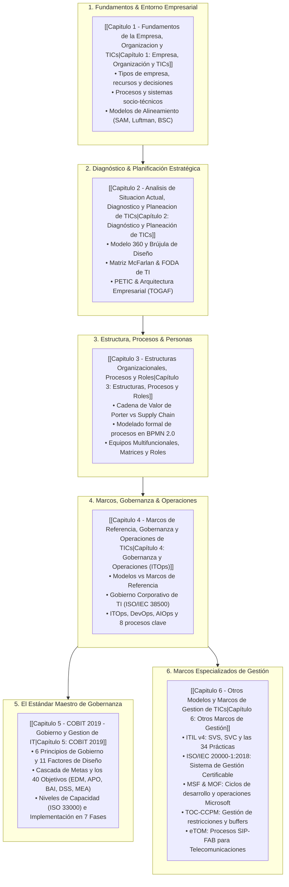

# Gestión de Tecnologías de la Información y Comunicación (ICCD943)

La asignatura **Gestión de Tecnologías de la Información y Comunicación (ICCD943)** se ubica en el **9.º Semestre** de la carrera de **Ingeniería en Ciencias de la Computación** de la **Escuela Politécnica Nacional (EPN)**, contando con 3 créditos (144 horas de dedicación académica). 

Representa la cúspide integradora donde las habilidades técnicas profundas de ingeniería de software, arquitectura de sistemas, bases de datos, redes y ciberseguridad convergen con la **dirección estratégica, la gobernanza corporativa (EGIT), la gestión de servicios (ITSM) y la creación sistemática de valor empresarial**.

> [!info] 💡 ¿Por qué esta materia es crucial para un Ingeniero en Ciencias de la Computación? (Guía para novatos de pregrado)
> - **El error del ingeniero novato:** Creer que el mejor software o la arquitectura de microservicios más elegante automáticamente garantiza el éxito de una empresa. En el mundo real, miles de proyectos técnicamente impecables fracasan porque no resuelven un problema real del negocio o no están alineados con los objetivos de la organización.
> - **El salto de programador a líder de tecnología:** Esta materia te enseña a hablar el idioma de los directores generales (CEO), financieros (CFO) y miembros del directorio. Te prepara para roles de liderazgo como **CIO (Chief Information Officer)**, **CTO (Chief Technology Officer)**, **Auditor Líder de Sistemas (CISA)** o **Consultor de Transformación Digital**.
> - **¿Qué aprenderás aquí?** Cómo se estructura una empresa moderna; cómo diagnosticar si los sistemas de información están creando valor o consumiendo dinero inútilmente; cómo gobernar y auditar la tecnología con estándares mundiales como **COBIT 2019**, **ITIL v4** e **ISO/IEC 38500**; y cómo gestionar operaciones de TI con confiabilidad industrial.

---

## 🗺️ Mapa de Ruta del Conocimiento (Roadmap de la Asignatura)

---

## 📚 Índice Detallado por Capítulos

### 🔹 [Capítulo 1: Fundamentos de la Empresa, Organización y TICs](file:///Users/alech/Documents/notes/Obsidian/pregrado/Documentos/Gestion%20de%20TICs/Capitulo%201%20-%20Fundamentos%20de%20la%20Empresa,%20Organizacion%20y%20TICs.md)
1. **La Empresa y su Estructura Fundamental:** Definición formal; tipología por actividad (primario a cuaternario), tamaño y capital; objetivos económicos, sociales y tecnológicos; los 4 recursos empresariales; y niveles de decisión (Estratégico, Táctico, Operativo).
2. **Organización y Procesos de la Empresa:** Proceso de organización y departamentalización; estructura funcional tradicional y trampas de silos; concepto formal de proceso (entradas, actividades, salidas, retroalimentación); características (irreversibilidad, criticidad del tiempo, intencionalidad); jerarquía de descomposición y clasificación (Estratégicos, Misionales/Core y de Apoyo).
3. **El Área de TICs:** Definición Comisión Europea; propósito institucional; ventajas competitivas vs riesgos de ciberseguridad y privacidad; funciones operativas, de gestión de datos y estratégicas; niveles jerárquicos (CIO, CTO, CISO, gerencias y niveles de soporte L1/L2/L3).
4. **Organización y Procesos del Área de TICs:** El sistema socio-técnico en sistemas de información; teoría de sistemas interdependientes; áreas funcionales de la empresa; evolución histórica desde mainframes hasta la Industria 4.0 (IoT, Big Data, IA, Sistemas Ciberfísicos).
5. **Alineamiento TICs y Empresa:** TICs en sentido estricto vs ampliado; diálogo continuo negocio-tecnología; modelos de alineamiento: **SAM de Henderson & Venkatraman**, **Modelo de Madurez de Luftman**, enfoque de **Chan & Reich**, y el **IT Balanced Scorecard**.

---

### 🔹 [Capítulo 2: Análisis de Situación Actual, Diagnóstico y Planeación de TICs](file:///Users/alech/Documents/notes/Obsidian/pregrado/Documentos/Gestion%20de%20TICs/Capitulo%202%20-%20Analisis%20de%20Situacion%20Actual,%20Diagnostico%20y%20Planeacion%20de%20TICs.md)
1. **Estudio de Reconocimiento Organizacional (Modelo 360):** Diseño organizacional y ejecución estratégica; la **Brújula del Diseño Organizacional** (Trabajo a realizar, Estructura, Facilitadores y Normas/Comportamientos); y el enfoque colaborativo **OPTIMAL**.
2. **Diagnóstico de TICs dentro de la Empresa:** Evaluación sistemática; FODA de TICs y matrices cruzadas; la **Matriz Estratégica de McFarlan** (Soporte, Fábrica, Transición/Alto Potencial y Estratégico); diagnóstico con COBIT 2019, la Brújula y el Balanced Scorecard.
3. **Planeación Estratégica de TICs (PETIC):** Fases de la administración estratégica (Formulación, Implementación, Evaluación); derivación sistemática desde el Plan Estratégico Institucional (PEI); **Arquitectura Empresarial** (TOGAF ADM: Negocio, Datos, Aplicaciones, Tecnología; brechas As-Is vs To-Be); articulación de la planeación entre Gobierno (EDM) y Gestión (APO) en COBIT 2019.
4. **Gaps de Alineamiento y Planificación:** Gaps de Alineamiento (Estratégico, de Prioridades, de Recursos); Gaps de Planificación (Ejecución, Coordinación, Seguimiento, Capacidad); herramientas de realineamiento: SAM, Luftman, **Val IT + COBIT 2019** (Gobernanza de Valor, Portafolio, Inversiones) y Balanced Scorecard en cascada.

---

### 🔹 [Capítulo 3: Estructuras Organizacionales, Procesos y Roles](file:///Users/alech/Documents/notes/Obsidian/pregrado/Documentos/Gestion%20de%20TICs/Capitulo%203%20-%20Estructuras%20Organizacionales,%20Procesos%20y%20Roles.md)
1. **Procesos Empresariales, Cadena de Valor y TICs:** Procesos en la organización funcional; la **Cadena de Valor de Michael Porter** (actividades primarias, de soporte, margen e impacto transversal de TICs); cadenas de valor de desarrollo de software; diferencias conceptuales entre Cadena de Valor (margen estratégico) y Cadena de Suministro (flujo logístico/materiales).
2. **Organización basada en Procesos:** Gestión por Procesos (BPM); mapas de procesos; notación estándar **BPMN 2.0** (Eventos, Tareas, Compuertas XOR/AND/OR, Pools, Lanes, Objetos de datos y flujos); metodología de diseño desde cero (Greenfield) vs rediseño (BPR); niveles de granularidad (descriptivo, analítico, ejecutable).
3. **Organización basada en Departamentos:** Criterios de departamentalización (funcional, geográfica, por clientes, por productos, matricial); **Unidades Estratégicas de Negocio (UEN / SBU)**: autonomía, recursos y gobierno de TI corporativo.
4. **Organización basada en Servicios:** Definición formal de Servicio según ITIL v4; empresas de productos vs servicios; productos, servicios y ofertas en ITIL v4; co-creación de valor.
5. **Organizaciones Multifuncionales, Matriciales y Multidisciplinarias:** Función vs Disciplina; Equipos Multifuncionales (cross-functional) vs Equipos Multidisciplinarios; Estructuras Matriciales de TI (variantes Débil, Balanceada y Fuerte según la autoridad del Project Manager).
6. **Roles y Responsabilidades:** Rol vs Cargo/Puesto vs Responsabilidad; descripción y análisis de puestos (Job Description); comparativa de roles en metodologías de desarrollo de software (Tradicional/Cascada, **ISO/IEC 12207**, **Extreme Programming - XP**, y **Scrum**).

---

### 🔹 [Capítulo 4: Marcos de Referencia, Gobernanza y Operaciones de TICs](file:///Users/alech/Documents/notes/Obsidian/pregrado/Documentos/Gestion%20de%20TICs/Capitulo%204%20-%20Marcos%20de%20Referencia,%20Gobernanza%20y%20Operaciones%20de%20TICs.md)
1. **Introducción a Modelos y Marcos de Referencia:** Modelo (conceptual, descriptivo, escalas de madurez) vs Marco de Referencia (prescriptivo, práctico, guías de implementación); clasificación en Marcos de Gobernanza (COBIT, ISO 38500) vs Gestión (ISO 27001, ISO 20000, ITIL, CMMI, PMBOK); tabla de certificabilidad organizacional vs profesional.
2. **Gobierno de TICs (EGIT):** Fundamentos y justificación; los 5 componentes estratégicos (Alineación, Entrega de Valor, Gestión de Riesgos, Recursos, Medición del Desempeño); relación entre Gobernanza (EDM: Directorio) y Gestión (PBRM/ITSM: CIO); familia de normas **ISO/IEC 38500** (los 6 principios rectores y modelo EDM; guías complementarias ISO/IEC TR 38501 y 38502).
3. **Operaciones de TICs (ITOps):** Misión de estabilidad y disponibilidad; ITOps vs ITOM; cultura y colaboración **DevOps** (integración Dev-Ops, CI/CD, IaC); **AIOps** (Machine Learning para correlación de telemetría y autorecuperación); los **8 procesos operacionales clave** (Mantenimiento, CMDB, Vulnerabilidades y Parches, Respaldos y DRP 3-2-1/RPO/RTO, Programación de Lotes, Capacidad, Logs/SIEM, y Disposición Segura de Medios/Borrado DoD/NIST).

---

### 🔹 [Capítulo 5: COBIT 2019 - Gobierno y Gestión de I&T](file:///Users/alech/Documents/notes/Obsidian/pregrado/Documentos/Gestion%20de%20TICs/Capitulo%205%20-%20COBIT%202019%20-%20Gobierno%20y%20Gestion%20de%20IT.md)
1. **Principios de COBIT 2019:** Sistema de Gobierno vs Marco de Gobierno; los **11 Factores de Diseño**; los 6 principios del sistema de gobierno; los 3 principios del marco; COBIT en auditoría informática: marco ITAF y certificación **CISA** de ISACA.
2. **Componentes y Catalizadores:** De los catalizadores de COBIT 5 a los **7 Componentes del Sistema de Gobierno** en COBIT 2019; los **40 Objetivos de Gobernanza y Gestión**; la **Cascada de Metas** (Necesidades de partes interesadas $\to$ 13 Metas de Empresa $\to$ 13 Metas de Alineación $\to$ 40 Objetivos I&T).
3. **Dominios y Procesos de COBIT:** Detalle exhaustivo de los 40 objetivos en los 5 dominios:
   - **EDM (Evaluate, Direct and Monitor):** 5 objetivos de Gobierno.
   - **APO (Align, Plan and Organize):** 14 objetivos de Gestión.
   - **BAI (Build, Acquire and Implement):** 11 objetivos de Gestión.
   - **DSS (Deliver, Service and Support):** 6 objetivos de Gestión.
   - **MEA (Monitor, Evaluate and Assess):** 4 objetivos de Gestión.
4. **Criterios de Evaluación y Niveles de Capacidad:** Modelo de Capacidad (PCM) y Evaluación (PAM) alineados a **ISO/IEC 33000**; los 6 niveles de capacidad (Nivel 0 al Nivel 5); los 9 Atributos de Proceso (PA 1.1 a PA 5.2); distinción entre Capacidad del Proceso (gestión) vs Desempeño Técnico (resultados operativos).
5. **Matrices de Evaluación y Diseño:** Matrices de alineamiento y diseño para calcular niveles objetivo; escala de calificación de atributos **N-P-L-F** (Not Achieved, Partially, Largely, Fully Achieved) y reglas de transición de nivel.
6. **Guía de Implementación de COBIT:** Ciclo de vida de 7 fases de mejora continua; los 3 anillos concéntricos (Gestión de Programa, Habilitación del Cambio Cultural según Kotter, Ciclo de Mejora); puntos de dolor (*pain points*) y eventos detonantes (*trigger events*).

---

### 🔹 [Capítulo 6: Otros Modelos y Marcos de Gestión de TICs](file:///Users/alech/Documents/notes/Obsidian/pregrado/Documentos/Gestion%20de%20TICs/Capitulo%206%20-%20Otros%20Modelos%20y%20Marcos%20de%20Gestion%20de%20TICs.md)
1. **ITIL v4:** Gestión de Servicios de TI (ITSM); Sistema de Valor del Servicio (SVS); las 4 dimensiones; Cadena de Valor del Servicio (SVC: 6 actividades); las **34 prácticas de gestión** (14 generales, 17 de servicios, 3 técnicas); los **7 principios guía**; y la co-creación de valor.
2. **ISO/IEC 20000-1:2018:** Estándar internacional certificable de Sistema de Gestión de Servicios (SGS); estructura Anexo SL; requisitos operacionales de la Cláusula 8; comparativa rigurosa y sinergia ITIL v4 vs ISO 20000.
3. **MSF (Microsoft Solutions Framework):** Marco ágil para proyectos de desarrollo e infraestructura; principios rectores; el Modelo de Equipo de pares (6 roles: Product Management, Program Management, Dev, Test, UX, Release); y Modelo de Proceso por hitos (Visión, Planificación, Desarrollo, Estabilización, Despliegue).
4. **MOF (Microsoft Operations Framework):** Gestión operativa en plataformas tecnológicas; ciclo de 3 fases (Planificar, Entregar, Operar) y Capa de Gestión transversal; sinergia e integración MSF (hacer la solución) vs MOF (operar la solución).
5. **TOC-CCPM (Teoría de Restricciones y Cadena Crítica):** Los 5 pasos de enfoque de Goldratt (Identificar, Explotar, Subordinar, Elevar, Repetir); limitaciones de la Ruta Crítica clásica (Parkinson, Estudiante, multitarea ineficiente); principios de Cadena Crítica; buffers de protección (**Buffer de Proyecto**, **Buffers de Alimentación**, **Buffers de Recursos**) y gráfico de control de consumo (Verde, Amarillo, Rojo).
6. **eTOM (enhanced Telecom Operations Map):** Marco de procesos TM Forum Frameworx para telecomunicaciones; áreas SIP (Strategy, Infrastructure, Product); operaciones **FAB** (Fulfillment, Assurance, Billing); jerarquía de descomposición y mapeo sinérgico con ITIL e ISO 20000.

---

## 🔗 Vinculación con otras materias de la carrera en la EPN

- **[[Gestion Organizacional]] (ADMD511):** Fundamentos de teoría administrativa, estructuras de poder y comportamiento humano en las organizaciones.
- **[[Gestion de Procesos y Calidad]] (ADMD611):** Metodologías Lean, Six Sigma, aseguramiento de la calidad y control estadístico de procesos.
- **[[Auditoria Informatica]] (ICCD833):** Técnicas forenses, pruebas de control interno, marcos ITAF/COBIT y evidencias digitales.
- **[[seguridad informatica]] & [[sgsi]] (ICCD733 / ICCD643):** Familia ISO/IEC 27001, gestión del riesgo según ISO 27005 y controles de la Tríada CIA.
- **[[Cloud Computing AWS]] (ICCD823):** Arquitectura de nube empresarial, modelo de responsabilidad compartida, finops y resiliencia de infraestructura.
- **[[Ing software]] & [[Software 2]]:** Metodologías ágiles (Scrum, Kanban, XP), ciclo de vida del software, TDD y principios SOLID.
