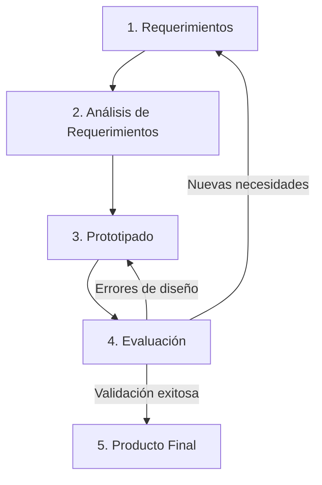

El ciclo de vida en la Interacción Humano-Computadora (HCI) describe las etapas iterativas que se deben seguir para diseñar e implementar interfaces que satisfagan adecuadamente a los usuarios finales.

1. **Requerimientos (Requirements Analysis):** Es la etapa inicial donde se recopilan y definen las necesidades y expectativas de los usuarios respecto al sistema.
2. **Análisis de Requerimientos (Design Analysis):** Se procesa la información recopilada. Aquí se utilizan técnicas como HTA (Hierarchical Task Analysis) para descomponer un problema grande o tarea compleja en subtareas más pequeñas y manejables.
3. **Prototipado (Prototyping):** Se construyen versiones preliminares de la interfaz. Se suele avanzar desde prototipos de baja fidelidad (Low-Fidelity, como bocetos en papel) hacia prototipos de alta fidelidad (High-Fidelity, interfaces interactivas en software).
4. **Evaluación (Evaluating):** Se realizan pruebas de usabilidad con los usuarios utilizando los prototipos para encontrar errores y obtener retroalimentación antes de programar la versión final.
5. **Producto Final (Final Product):** Se desarrolla y lanza el sistema definitivo, aunque en HCI el proceso suele ser iterativo y puede volver a empezar para futuras versiones.

> [!info] Explicación
> **Iteración es la clave:** A diferencia de la ingeniería de software tradicional (modelo en cascada), en HCI se asume que no le atinarás al diseño perfecto en el primer intento. La evaluación te devuelve a la fase de prototipado o incluso a la de requerimientos repetidas veces.

**Regla de usabilidad:** En la barra de navegación (o menús en general) se recomienda tener 7 ± 2 elementos para no sobrecargar la memoria a corto plazo del usuario (basado en la ley de Miller).

## Notas relacionadas
- [[design thinking]]
- [[Marcos de trabajo cognitivos(model human procesor)]]
- [[tdr terminos de refencia]]
- [[pruebas de usabilidad]]
