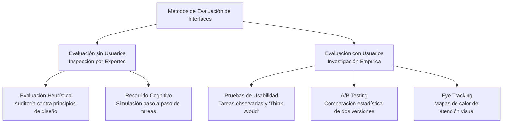

La **Evaluación de Interfaces** es la etapa crítica dentro del [[Ciclo de vida de hci]] donde se verifica si el diseño interactivo propuesto cumple con los requisitos del usuario y los estándares de usabilidad, antes o después de la implementación.

## Métodos de Evaluación

Existen dos categorías principales para evaluar una interfaz: aquellas donde se involucra directamente a los usuarios (empíricas) y aquellas realizadas por expertos de diseño (de inspección).

### Evaluación sin Usuarios (Inspección)
Estas evaluaciones son llevadas a cabo por especialistas en usabilidad que analizan críticamente la interfaz. Son más económicas y rápidas de ejecutar.
- **Evaluación Heurística:** Un grupo de expertos examina la interfaz y la juzga con base en principios de diseño reconocidos (generalmente, las 10 heurísticas de Jakob Nielsen). Los problemas detectados se califican por su nivel de severidad.
- **Recorrido Cognitivo (Cognitive Walkthrough):** Los evaluadores "caminan" paso a paso a través de una tarea típica simulando el modelo mental de un usuario novato, preguntándose en cada etapa si la interfaz guía claramente hacia la siguiente acción correcta.

### Evaluación con Usuarios (Empírica)
Implica la observación y el análisis de usuarios finales reales intentando interactuar con el sistema.
- **Pruebas de Usabilidad Clásicas:** Se le pide al usuario que complete tareas específicas en un laboratorio o remotamente, pidiéndole que "piense en voz alta" (Think Aloud). Se mide el tiempo de finalización, la tasa de éxito y los errores cometidos.
- **A/B Testing:** Se lanzan dos versiones ligeramente distintas de un componente (por ejemplo, un botón verde versus un botón rojo) a grupos diferentes de usuarios activos. Se analizan métricas cuantitativas reales (clics, conversiones) para determinar objetivamente cuál versión funciona mejor.
- **Eye Tracking (Seguimiento ocular):** Uso de hardware especializado que rastrea hacia dónde mira exactamente el usuario en la pantalla. Permite crear "mapas de calor" (Heatmaps) para descubrir si los usuarios están prestando atención a la información importante o si el diseño visual está siendo ignorado.

## Métricas de Evaluación
- **Eficacia:** Porcentaje de tareas que los usuarios completan con éxito (Tasa de éxito o Success Rate).
- **Eficiencia:** El tiempo que tardan los usuarios en completar dichas tareas (Time-on-Task).
- **Satisfacción:** La comodidad y agrado experimentados. Suele medirse con encuestas estandarizadas post-prueba, como el cuestionario **SUS (System Usability Scale)**, que da una puntuación del 0 al 100 basada en 10 preguntas.

## Notas relacionadas
- [[Principios de usabilidad]]
- [[Ciclo de vida de hci]]
- [[design thinking]]
