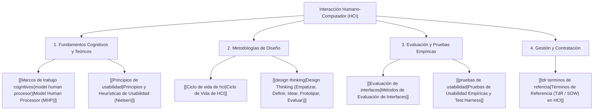

# Interacción Humano-Computador (HCI - Human-Computer Interaction)

> [!info] 💡 ¿Qué es HCI y por qué es fundamental en Ciencias de la Computación?
> La **Interacción Humano-Computador (HCI)** es la disciplina científica y tecnológica dedicada al diseño, evaluación e implementación de sistemas informáticos interactivos para su uso por seres humanos, así como al estudio de los fenómenos psicológicos, cognitivos, ergonómicos y sociales que rodean esta interacción.
> Un sistema computacional carece de valor práctico si la complejidad de su interfaz impide que los usuarios finales alcancen sus objetivos con eficiencia, eficacia y satisfacción.

---

## 🗺️ Mapa de Contenidos de la Materia (MOC)

---

## 📚 Estructura Temática

### 1. Fundamentos Cognitivos y Principios de Usabilidad
- **[[Marcos de trabajo cognitivos(model human procesor)]]:** Modelo cognitivo de Card, Moran y Newell (sistemas perceptual, motor y cognitivo), ley de Fitts y ley de Hick-Hyman.
- **[[Principios de usabilidad]]:** Las 10 heurísticas fundamentales de Jakob Nielsen, reglas de oro de Ben Shneiderman, visibilidad del estado del sistema y prevención de errores.

### 2. Proceso y Metodologías de Diseño
- **[[Ciclo de vida de hci]]:** Modelos iterativos centrados en el usuario (UCD / HCD), análisis contextual, diseño de requerimientos y prototipado rápido de baja y alta fidelidad.
- **[[design thinking]]:** Enfoque centrado en las personas compuesto por 5 fases iterativas para resolver problemas complejos de experiencia de usuario.

### 3. Técnicas de Evaluación
- **[[Evaluación de interfaces]]:** Inspección experta (revisión heurística, recorridos cognitivos) y evaluación analítica sin usuarios directos.
- **[[pruebas de usabilidad]]:** Protocolo formal con usuarios reales, técnica *Think-Aloud*, métricas cuantitativas (SUS - System Usability Scale, tiempo en tarea, tasa de error) y análisis de laboratorio.

### 4. Especificación y Gestión de Proyectos
- **[[tdr terminos de refencia]]:** Formulación rigurosa del Statement of Work (SOW), especificación de entregables UX/UI y blindaje contractual contra el *Scope Creep*.

---

## 🔗 Conexión con otras disciplinas
- **[[Software e Ingeniería  de Software]] & [[software 2]]:** Integración de HCI en el desarrollo ágil (Dual-Track Scrum).
- **[[Desarollo web|Desarrollo Web]]:** Implementación responsiva en HTML/CSS, semántica y accesibilidad web WCAG.
- **[[Arquitectura Android Moderna (Clean Architecture, MVVM y Ciclo de Vida)|Aplicaciones Móviles]]:** Guías de diseño Material Design 3 (Android) y Human Interface Guidelines (iOS).
