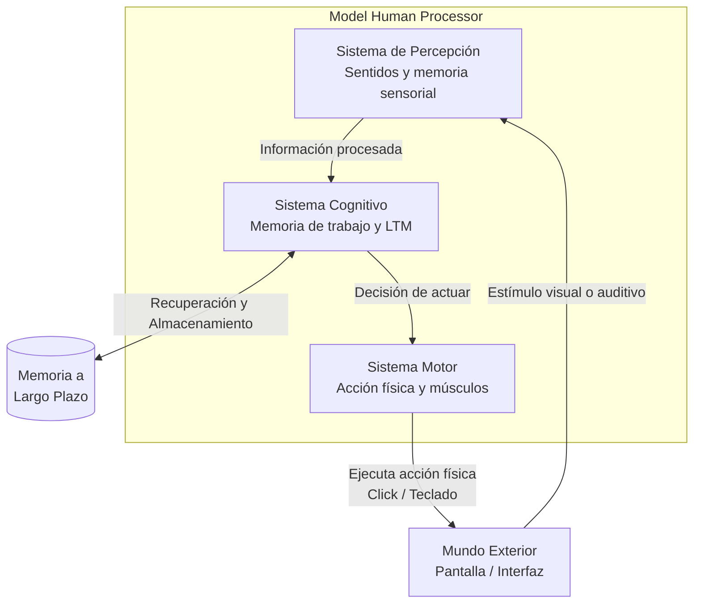

El Model Human Processor (MHP) es un marco de trabajo cognitivo utilizado en HCI para modelar y predecir cómo los humanos interactúan con las computadoras. Divide el procesamiento de información humana en tres subsistemas interactivos:

## Sistema de Percepción 
Es el encargado de recibir los estímulos del mundo exterior (como la luz de una pantalla o el sonido de una alerta) a través de los sentidos, procesando esta información en memorias sensoriales temporales.

## Sistema Cognitivo 
Es el "cerebro" central que procesa la información recibida de la percepción. Conecta la memoria a corto plazo (memoria de trabajo) con la memoria a largo plazo (Long Term Memory), donde los conocimientos y experiencias se quedan almacenados de forma permanente. Toma las decisiones sobre qué acciones realizar.

## Sistema Motor 
Ejecuta las respuestas físicas dictadas por el sistema cognitivo, controlando los músculos para realizar acciones (por ejemplo, mover el ratón o presionar una tecla).
La percepción de facilidad de una tarea hace que el esfuerzo percibido crezca o decrezca, lo que afecta directamente el rendimiento motor.

> [!info] Explicación
> **¿Para qué sirve el MHP?** Sirve para calcular matemáticamente cuánto tiempo le tomará a un usuario experto realizar una tarea en tu interfaz. Se suman los tiempos de percepción (ver el botón), cognición (decidir presionarlo) y motor (mover el dedo). Esto fundamenta leyes importantes como la **Ley de Fitts** (tiempo de apuntado).

### Tareas y Modelos GOMS de interacción 
El modelo GOMS (Goals, Operators, Methods, and Selection rules) es una técnica que se apoya en los principios del MHP para describir detalladamente cómo un usuario realiza tareas en un sistema informático, paso por paso.

## Principios de diseño
### Heurísticas de Nielsen 
Son un conjunto de 10 principios generales para el diseño de interacción, utilizados ampliamente para evaluar la usabilidad de una interfaz (ver [[Principios de usabilidad]]).

### UX Laws (Leyes de UX)
Son un conjunto de máximas psicológicas que predicen el comportamiento humano. Ejemplos incluyen la Ley de Fitts, la Ley de Hick (a más opciones, más tiempo de decisión) y la Ley de Miller (la capacidad de la memoria de trabajo es de 7 ± 2 elementos).

## Notas relacionadas
- [[Ciclo de vida de hci]]
- [[design thinking]]
- [[pruebas de usabilidad]]
