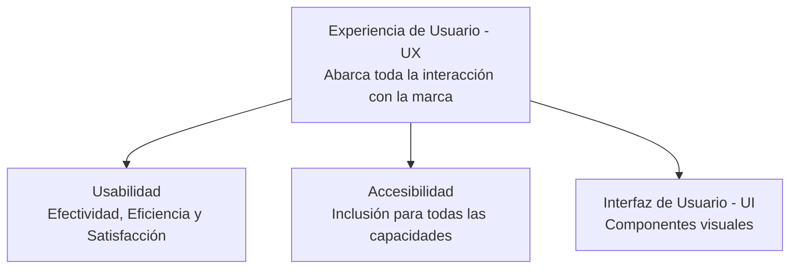

La **Usabilidad** se refiere al grado en que un producto o interfaz puede ser utilizado por usuarios específicos para alcanzar objetivos específicos con efectividad, eficiencia y satisfacción en un contexto de uso dado.

> [!info] Explicación
> **¿Por qué es importante?** Una interfaz hermosa pero inusable es un fracaso. Si el usuario no puede encontrar el botón de "Comprar" o no entiende qué hace un menú, abandonará la aplicación. La usabilidad puentea la brecha entre la tecnología compleja y las necesidades humanas.

## Heurísticas de Jakob Nielsen
Son 10 principios generales para el diseño de interfaces de usuario creados por Jakob Nielsen. Se llaman "heurísticas" porque son reglas prácticas más que directrices estrictas:

1. **Visibilidad del estado del sistema:** El sistema debe mantener siempre informados a los usuarios sobre lo que está ocurriendo, a través de retroalimentación apropiada (ej. barras de progreso, *spinners* de carga).
2. **Coincidencia entre el sistema y el mundo real:** El sistema debe hablar el lenguaje de los usuarios, con palabras, frases y conceptos familiares (ej. el icono de una papelera para borrar archivos).
3. **Control y libertad del usuario:** Los usuarios a menudo eligen funciones por error y necesitan una "salida de emergencia" claramente marcada para dejar el estado no deseado (ej. botones de "Deshacer" o "Cancelar").
4. **Consistencia y estándares:** Los usuarios no deben tener que preguntarse si diferentes palabras, situaciones o acciones significan lo mismo. Sigue las convenciones de la plataforma.
5. **Prevención de errores:** Mucho mejor que buenos mensajes de error es un diseño cuidadoso que evite que el problema ocurra en primer lugar.
6. **Reconocer en lugar de recordar:** Minimiza la carga de memoria del usuario haciendo que los objetos, acciones y opciones sean visibles (ej. un menú desplegable en lugar de hacer que el usuario escriba un comando).
7. **Flexibilidad y eficiencia de uso:** Los atajos pueden acelerar la interacción para el usuario experto de tal manera que el diseño puede atender tanto a usuarios inexpertos como experimentados (ej. `Ctrl+C` para copiar).
8. **Diseño estético y minimalista:** Los diálogos no deben contener información que sea irrelevante o que rara vez se necesite.
9. **Ayudar a los usuarios a reconocer, diagnosticar y recuperarse de errores:** Los mensajes de error deben expresarse en lenguaje sencillo (sin códigos, por favor), indicar exactamente el problema y sugerir constructivamente una solución.
10. **Ayuda y documentación:** Aunque es mejor que el sistema se pueda usar sin documentación, puede ser necesario proporcionar ayuda fácil de buscar y enfocada en la tarea del usuario.

## Accesibilidad
La accesibilidad consiste en garantizar que los productos digitales puedan ser utilizados por la mayor cantidad de personas posible, incluyendo aquellas con discapacidades físicas, visuales, auditivas o cognitivas.

> [!info] Explicación
> **Accesibilidad (a11y):** No es un extra, es un derecho. Ejemplos incluyen asegurar un contraste de color adecuado para personas con daltonismo, o usar el etiquetado semántico adecuado en HTML para que los lectores de pantalla puedan leerle la página a una persona con ceguera.

## Experiencia de Usuario (UX)
Mientras que la usabilidad se enfoca en que una interfaz sea *fácil de usar*, la **UX (User Experience)** es un paraguas mucho más grande. Abarca todos los aspectos de la interacción del usuario con la empresa, sus servicios y sus productos. Una interfaz puede ser usable (fácil) pero tener una UX terrible (por ejemplo, si te obliga a ver un anuncio de 30 segundos cada vez que haces clic).

## Notas relacionadas
- [[Ciclo de vida de hci]]
- [[Evaluación de interfaces]]
- [[design thinking]]
