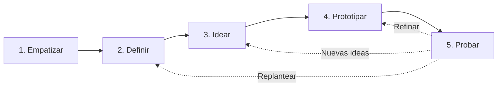

**Design Thinking** (Pensamiento de Diseño) es una metodología iterativa y centrada en el ser humano que se utiliza para diseñar productos, innovar y solucionar problemas o necesidades complejas de los usuarios.

El proceso consta de 5 fases principales:

1. **Empatizar con el usuario:** Consiste en ponerse en el lugar del usuario para comprender profundamente su contexto. Para ello se deben realizar reuniones, entrevistas locales, *focus groups* y observar activamente para analizar sus problemas y necesidades reales.
2. **Definir el problema:** Se procesa la información obtenida en la fase de empatía para definir y enunciar claramente cuál es el problema o la necesidad central que se debe resolver.
3. **Idear alternativas (Ideación):** Se realiza una lluvia de ideas para plantear múltiples alternativas de solución al problema o necesidad definida, y posteriormente se selecciona la más adecuada o viable.
4. **Prototipar la idea:** Se construye un modelo o prototipo rápido de la solución seleccionada. Esto ayuda a definir claramente si el producto, servicio o innovación propuesto realmente resuelve el problema o necesidad de forma tangible.
5. **Probar y evaluar (Test):** Se prueba el prototipo directamente con el cliente para obtener retroalimentación (*feedback*) sobre la solución planteada, permitiendo realizar mejoras antes del desarrollo final.

> [!info] Explicación
> **¿Por qué Design Thinking?** Muchas empresas fracasan porque construyen productos excelentes que nadie necesita. Design Thinking te obliga a salir de la oficina, hablar con la gente (Empatizar) y hacer prototipos baratos de cartón o alambre (Prototipar) antes de gastar millones de dólares en programación.

## Diagrama de Ishikawa (Espina de Pescado)
Es una herramienta visual de calidad muy utilizada en la fase de definición para analizar problemas complejos. 
En este diagrama, se colocan las causas principales y secundarias en las "espinas" al principio, las cuales confluyen hacia la "cabeza" del pescado, donde se anota el problema o efecto central que se está estudiando.

> [!info] Explicación
> El Diagrama de Ishikawa te ayuda a no confundir los "síntomas" con la "enfermedad". Si los usuarios se quejan de que una app es lenta, la lentitud es la cabeza del pescado. Las espinas te obligan a investigar si la causa es el servidor, el código, la conexión de internet del usuario o el diseño pesado.

## Notas relacionadas
- [[Ciclo de vida de hci]]
- [[pruebas de usabilidad]]
- [[emprendimiento]]
- [[producto minimo viable]]
