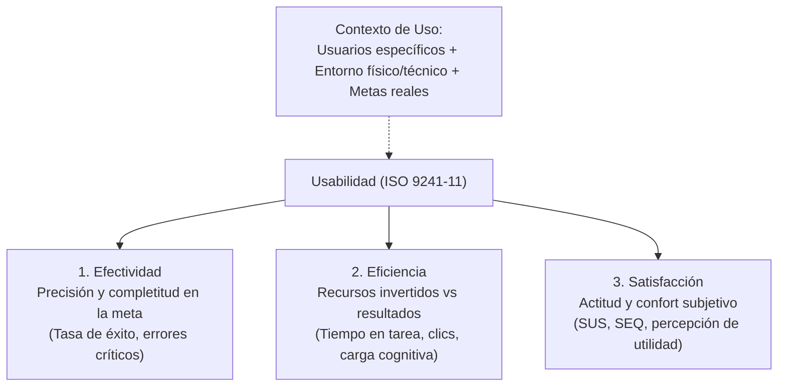
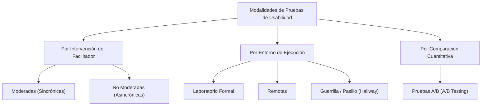
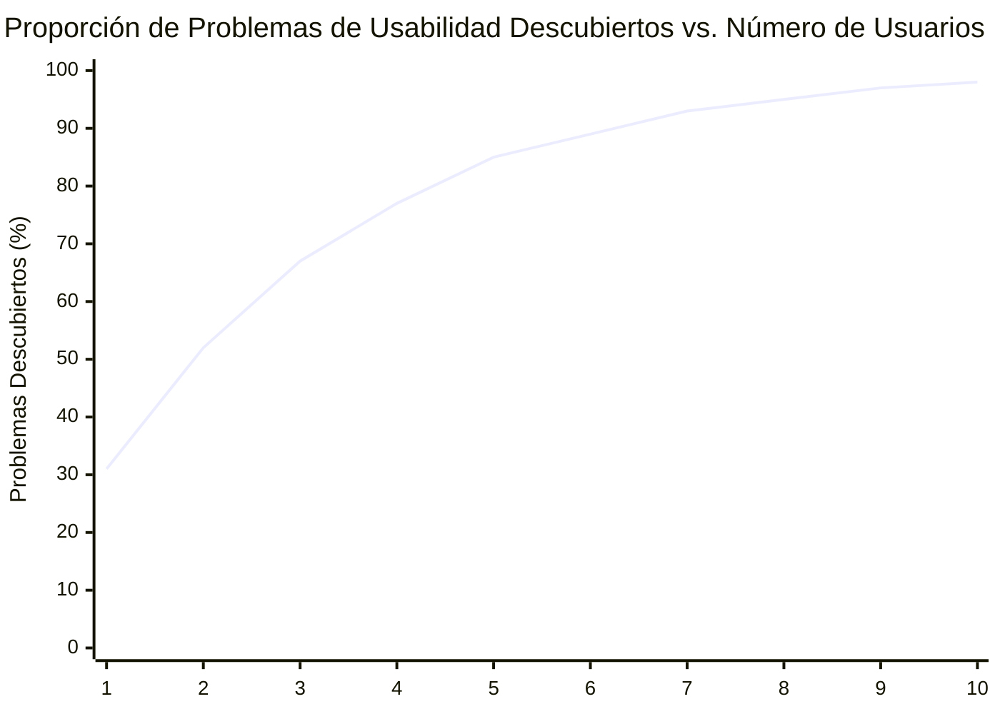
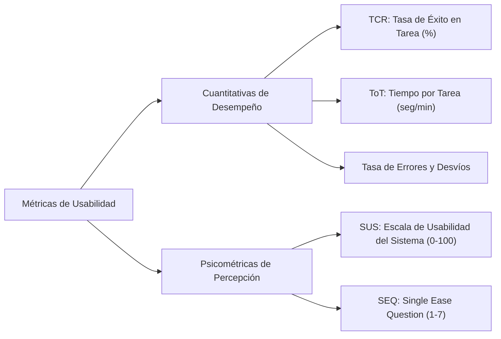
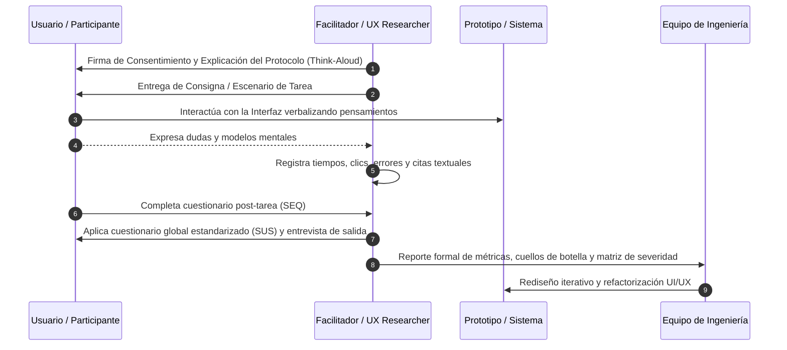

# Pruebas de Usabilidad en Interacción Humano-Computador (HCI) y Software

Las **Pruebas de Usabilidad** (*Usability Testing*) constituyen una metodología de evaluación empírica orientada a medir en qué grado una interfaz o sistema interactivo permite a personas reales alcanzar sus metas de forma intuitiva, eficiente y satisfactoria.

---

## 1. Marco Normativo y Definición Formal: ISO 9241-11

El estándar internacional **ISO 9241-11** (*Ergonomía de la interacción humano-sistema*) define formalmente la **Usabilidad** como:
> *"El grado en que un producto puede ser utilizado por usuarios específicos para lograr objetivos específicos con **efectividad**, **eficiencia** y **satisfacción** en un contexto de uso especificado."*

- **Efectividad:** Mide si el usuario logra completar la tarea exitosamente y sin errores irrecuperables.
- **Eficiencia:** Mide el esfuerzo y los recursos temporales, cognitivos o físicos requeridos para alcanzar el objetivo.
- **Satisfacción:** Mide la respuesta afectiva, nivel de confort, confianza y agrado del usuario hacia el sistema.

---

## 2. Métodos y Modalidades de Pruebas de Usabilidad

Las evaluaciones de usabilidad se adaptan a la fase de desarrollo, presupuesto y fidelidad del prototipo:

### 2.1. Moderadas vs. No Moderadas
- **Pruebas Moderadas (Sincrónicas):** Un facilitador o investigador interactúa en tiempo real con el participante. Permite guiar la sesión, aclarar consignas, indagar ante comportamientos inesperados y capturar matices cualitativos profundos.
- **Pruebas No Moderadas (Asincrónicas):** El participante realiza las tareas de forma autónoma en su propio entorno mediante plataformas automatizadas (ej. Maze, UserTesting). Proporciona mayor volumen de datos cuantitativos a menor costo y sin sesgo del observador.

### 2.2. Laboratorio vs. Remotas vs. Guerrilla Testing
- **Laboratorio Formal de Usabilidad:** Entorno estrictamente controlado con cámaras bidireccionales, espejos unidireccionales, micrófonos ambientales y sistemas de seguimiento ocular (*eye-tracking*). Alta precisión técnica, pero costo elevado y riesgo de sesgo artificial (*efecto Hawthorne*).
- **Pruebas Remotas:** Ejecutadas en el hardware y entorno real del usuario mediante herramientas de videoconferencia y captura de pantalla. Refleja fielmente el contexto operativo diario.
- **Guerrilla Testing / Test de Pasillo (*Hallway Testing*):** Técnica ágil de bajo costo consistente en abordar a personas en pasillos, cafeterías o espacios públicos para que interactúen durante 5 a 10 minutos con un prototipo en fases tempranas. Permite detectar rápidamente problemas obvios de navegación y jerarquía visual.

### 2.3. Pruebas A/B (*A/B Testing*)
Técnica experimental cuantitativa en la que dos versiones de una interfaz (Versión $A$ de control vs. Versión $B$ con una variación específica) se despliegan simultáneamente a dos segmentos aleatorios de usuarios reales para medir estadísticamente cuál maximiza una métrica de conversión o interacción.

---

## 3. Protocolo de Pensamiento en Voz Alta (*Think-Aloud Protocol*)

Introducido por **Clayton Lewis** y ampliamente adaptado por **Jakob Nielsen**, es la técnica cualitativa más valiosa en HCI:
- **Metodología:** Se instruye al participante para que verbalice de manera continua y espontánea todo lo que piensa, siente, busca, duda o asume mientras navega por la interfaz: *"Estoy buscando el carrito pero no lo veo... creí que este icono era para guardar... ahora me pregunto si ya cobraron mi tarjeta..."*.
- **Valor Diagnóstico:** Permite al equipo de diseño contrastar el **modelo mental del usuario** (cómo cree el usuario que funciona el sistema) frente al **modelo conceptual del diseñador** (cómo fue programado el sistema), revelando las discrepancias cognitivas (*gulf of execution* y *gulf of evaluation* de Donald Norman).

> [!warning] Regla de Oro del Facilitador
> En una prueba de usabilidad con *Think-Aloud*, el evaluador debe **observar y escuchar sin intervenir ni justificar el diseño**. Nunca se debe responder preguntas operativas como "¿Hago clic aquí?"; se debe contrapreguntar de forma neutra: "¿Qué esperarías que ocurra si haces clic allí?". **Se evalúa al sistema, jamás al usuario.**

---

## 4. Planificación y la Regla de los 5 Usuarios de Jakob Nielsen

### 4.1. Fundamentación Matemática: El Modelo Nielsen-Landauer (1993)
Jakob Nielsen y Thomas Landauer demostraron matemáticamente que el número de problemas de usabilidad encontrados en una prueba sigue una distribución acumulativa de rendimientos decrecientes:

$$\text{Problemas Detectados}(n) = N \left(1 - (1 - L)^n\right)$$

Donde:
- $n$: Número de usuarios participantes en la prueba.
- $N$: Número total de problemas de usabilidad reales existentes en la interfaz.
- $L$: Proporción de problemas descubiertos por un solo usuario promedio (valor empírico típico: $L \approx 0.31$ o 31%).

#### Demostración con $n = 5$ usuarios:
$$\text{Proporción}(5) = 1 - (1 - 0.31)^5 = 1 - (0.69)^5 = 1 - 0.1564 = 0.8436 \approx \mathbf{84.5\% \sim 85\%}$$

> [!important] Conclusión de Ingeniería de Software
> **5 usuarios descubren aproximadamente el 85% de los problemas de usabilidad.**
> Añadir participantes adicionales incrementa marginalmente la detección a un costo desproporcionado (el usuario 6 solo descubre problemas redundantes). Por tanto, la estrategia más costo-eficiente es:
> **Realizar múltiples pruebas iterativas con 5 usuarios cada una (evaluar $\rightarrow$ corregir $\rightarrow$ re-evaluar con 5 usuarios nuevos)**, en lugar de realizar una única macro-evaluación con 20 usuarios al final del proyecto.

### 4.2. Pasos Metodológicos de la Planificación
1. **Definir Objetivos e Hipótesis:** Determinar qué flujos críticos se evaluarán (ej. embudo de checkout, registro de usuarios).
2. **Reclutar Participantes Representativos:** Seleccionar usuarios que coincidan con las características demográficas y niveles de alfabetización digital de los *User Personas* del proyecto.
3. **Diseñar Escenarios y Tareas Realistas:** Redactar tareas orientadas a metas reales sin dar pistas directas del camino:
   - *Consigna incorrecta:* "Haz clic en el botón azul de la esquina superior para filtrar zapatos rojos".
   - *Consigna correcta:* "Estás buscando un par de zapatos deportivos rojos para correr de tu talla habitual por menos de $80. Encuentra una opción que te convenza y prepárala para la compra".
4. **Preparar Entorno y Artefactos:** Prototipos interactivos de baja, media o alta fidelidad (en herramientas como Figma) o compilaciones de prueba funcionales (*staging*).

---

## 5. Métricas Cuantitativas y Cualitativas de Usabilidad

### 5.1. Métricas Cuantitativas de Desempeño
1. **Tasa de Éxito en la Tarea (Task Completion Rate - TCR):**
   Porcentaje de participantes que completan satisfactoriamente una tarea sin asistencia técnica del facilitador:
   $$\text{TCR} = \left(\frac{\text{Tareas Completadas Exitosamente}}{\text{Total de Tareas Intentadas}}\right) \times 100\%$$
   *Estándar de calidad aceptable en tareas críticas: $\ge 80\% - 90\%$.*

2. **Tiempo en la Tarea (Time on Task - ToT):**
   Duración temporal media (en segundos o minutos) consumida por los usuarios para concluir una tarea con éxito. Permite comparar la eficiencia antes y después de un rediseño.

3. **Tasa de Errores por Tarea (Error Rate):**
   Número medio de acciones incorrectas (selección de menús erróneos, ingresos inválidos, clics fallidos) cometidas por el usuario antes de completar la tarea o abandonar.

### 5.2. Escala de Usabilidad del Sistema (SUS - System Usability Scale)
Creada por **John Brooke** en 1986, es el estándar psicométrico más utilizado a nivel global para medir la usabilidad percibida.
- Consta de **10 afirmaciones** evaluadas en una escala Likert de 1 (*Totalmente en desacuerdo*) a 5 (*Totalmente de acuerdo*).
- Las preguntas impares son formuladas positivamente y las pares negativamente para evitar sesgos de respuesta automática.

#### Algoritmo de Cálculo del Puntaje SUS (0 a 100):
Para cada participante, se normalizan las puntuaciones individuales ($x_i$):
- Para ítems impares ($1, 3, 5, 7, 9$): $\text{Puntaje} = x_i - 1$
- Para ítems pares ($2, 4, 6, 8, 10$): $\text{Puntaje} = 5 - x_i$
- Se suman todos los valores ajustados (rango de 0 a 40) y se multiplican por el factor **$2.5$**:

$$\text{Puntaje SUS} = 2.5 \times \left( \sum_{i \in \text{impares}} (x_i - 1) + \sum_{j \in \text{pares}} (5 - x_j) \right)$$

#### Interpretación Percentilar del Puntaje SUS:
- **Puntaje Medio Estándar de la Industria:** **68 puntos**.
- **$\ge 80.3$ puntos:** Excelente usabilidad (Calificación Grado A; usuarios recomiendan el producto).
- **$68 - 80$ puntos:** Aceptable / Buena (Calificación Grado C a B).
- **$50 - 67$ puntos:** Marginal / Pobre; presenta fricciones graves de UX (Grado D).
- **$< 50$ puntos:** Inaceptable; falla crítica de diseño interactivo (Grado F).

### 5.3. Pregunta Única de Facilidad (SEQ - Single Ease Question)
Pregunta psicométrica de un solo ítem aplicada inmediatamente tras concluir una tarea individual:
> *"En general, ¿qué tan fácil o difícil fue completar esta tarea?"*
> *(Escala de 1: Muy difícil a 7: Muy fácil).*
- *Promedio de referencia global:* $\approx 5.5$. Puntajes inferiores a 5 indican tareas con sobrecarga cognitiva que requieren simplificación urgente.

---

## 6. Proceso Metodológico Integral de la Prueba

---

## Notas relacionadas
- [[Ciclo de vida de hci]]
- [[tdr terminos de refencia]]
- [[producto minimo viable]]
- [[design thinking]]
- [[CARACTERÍSTICAS DE CALIDAD DE UN PRODUCTO DE SOFTWARE]]
- [[tecnicas pruebas]]
- [[proyectos]]
