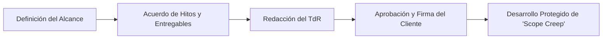

Los **Términos de Referencia (TdR)** son el documento formal que describe el propósito, alcance, objetivos y estructura de un proyecto (como el desarrollo de una interfaz).

Para asegurar el control y el compromiso, cuando el proyecto es aceptado por el cliente o los *stakeholders*, se deben establecer y hacer firmar "hitos" (entregables clave) correspondientes a cada fase del [[Ciclo de vida de hci]]. Una vez definidos y acordados estos puntos de control, se genera y aprueba el documento TdR final.

> [!info] Explicación
> **¿Por qué son importantes en HCI?** El desarrollo de interfaces puede ser un proceso iterativo interminable (siempre hay algo que mejorar). Los Términos de Referencia establecen "hasta dónde" llega el trabajo contratado. Al firmar los hitos (como la entrega de wireframes o las pruebas de usabilidad superadas), tanto el equipo de diseño como el cliente se protegen de malentendidos y de la "corrupción del alcance" (scope creep).

## Notas relacionadas
- [[Ciclo de vida de hci]]
- [[proyectos]]
- [[linea base]]
