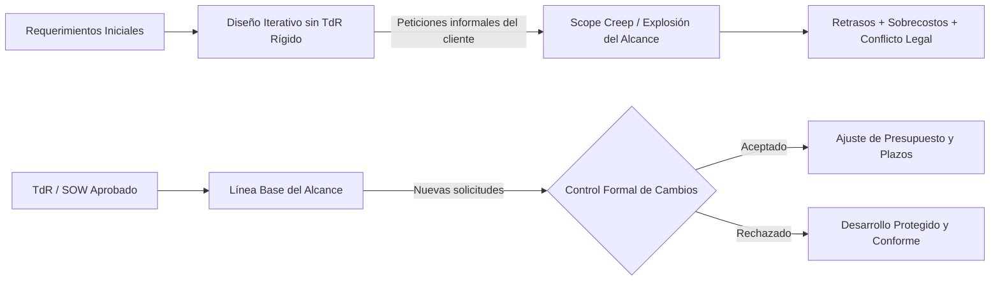
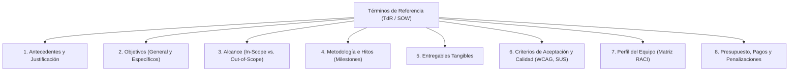

# Términos de Referencia (TdR / SOW) en Proyectos de Software y HCI

Los **Términos de Referencia (TdR)**, conocidos internacionalmente en la industria del software como **Statement of Work (SOW)**, constituyen el documento formal, contractual, técnico y vinculante que delimita con precisión el alcance, los objetivos, la metodología, el cronograma de entregables tangibles, los criterios de aceptación y las obligaciones financieras en proyectos de desarrollo de software, diseño de experiencia de usuario (UX) e interacción humano-computador (HCI).

---

## 1. El Rol Estratégico del TdR en HCI: Blindaje contra el *Scope Creep*

El diseño de interacción y experiencia de usuario es un proceso **esencialmente iterativo** (el [[Ciclo de vida de hci]] implica ciclos continuos de investigación, prototipado y evaluación empírica). Sin un marco contractual estricto, existe una tendencia recurrente a la **corrupción del alcance (*Scope Creep*)**: la adición paulatina e informal de nuevos requerimientos, pantallas o ajustes estéticos que alargan indefinidamente los plazos y agotan el presupuesto del equipo ejecutor.

```mermaid
flowchart LR
    A[Requerimientos Iniciales] --> B[Diseño Iterativo sin TdR Rígido]
    B -->|Peticiones informales del cliente| C[Scope Creep / Explosión del Alcance]
    C --> D[Retrasos + Sobrecostos + Conflicto Legal]

    E[TdR / SOW Aprobado] --> F[Línea Base del Alcance]
    F -->|Nuevas solicitudes| G{Control Formal de Cambios}
    G -->|Aceptado| H[Ajuste de Presupuesto y Plazos]
    G -->|Rechazado| I[Desarrollo Protegido y Conforme]
```

El TdR transforma un proceso iterativo de diseño en un **acuerdo medible por hitos contractuales (*Milestones*)**, donde cada avance requiere la aprobación formal y el visto bueno (*Sign-off*) del cliente antes de habilitar la fase subsiguiente.

---

## 2. Estructura Estándar y Secciones Mandatorias de un TdR Profesional

Un documento de Términos de Referencia de nivel de ingeniería para sistemas interactivos y software debe estructurarse obligatoriamente en las siguientes ocho secciones:

```mermaid
graph TD
    TDR["Términos de Referencia (TdR / SOW)"]
    TDR --> S1["1. Antecedentes y Justificación"]
    TDR --> S2["2. Objetivos (General y Específicos)"]
    TDR --> S3["3. Alcance (In-Scope vs. Out-of-Scope)"]
    TDR --> S4["4. Metodología e Hitos (Milestones)"]
    TDR --> S5["5. Entregables Tangibles"]
    TDR --> S6["6. Criterios de Aceptación y Calidad (WCAG, SUS)"]
    TDR --> S7["7. Perfil del Equipo (Matriz RACI)"]
    TDR --> S8["8. Presupuesto, Pagos y Penalizaciones"]
```

### 2.1. Antecedentes y Justificación
Contextualiza la problemática de negocio de la organización contratante, describe las deficiencias del sistema actual o la oportunidad tecnológica identificada, y justifica la viabilidad técnica y operativa de la contratación.

### 2.2. Objetivos del Proyecto
- **Objetivo General:** Declaración precisa y de alto nivel del resultado final esperado (ej. *"Diseñar e implementar el sistema de diseño y la interfaz web transaccional accesible para la plataforma de banca en línea"*).
- **Objetivos Específicos:** Metas cuantificables, verificables y temporalmente acotadas asociadas a las fases de investigación, arquitectura de información, prototipado interactivo, evaluación heurística y pruebas de usuario.

### 2.3. Delimitación Estricta del Alcance: *In-Scope* vs. *Out-of-Scope*
Esta es la cláusula crítica que previene discrepancias y demandas:

| Dimensión | En el Alcance (*In-Scope*) | Fuera del Alcance (*Out-of-Scope*) |
| :--- | :--- | :--- |
| **Vistas / Pantallas** | Diseño responsivo de 12 vistas transaccionales principales en Desktop y Mobile. | Módulos de analítica interna, reportes contables o vistas administrativas auxiliares. |
| **Plataformas** | Navegadores web modernos basados en Chromium (Chrome, Edge), Firefox y Safari. | Soporte para versiones obsoletas de navegadores (ej. Internet Explorer 11). |
| **Integración Técnica** | Maquetación de componentes frontend (HTML5/CSS3/React) consumiendo API mock. | Migración de bases de datos heredadas (*legacy*) o programación del backend bancario. |
| **Contenido** | Arquitectura de información, wireflows y microcopy de interacción UX. | Redacción de políticas legales completas, términos de servicio o marketing de producto. |

### 2.4. Metodología de Trabajo y Cronograma de Hitos (*Milestones*)
Articulación con el [[Ciclo de vida de hci]] en fases secuenciales de entrega y aprobación:
1. **Hito 1 (Semana 2):** Reporte de Investigación de Usuarios y Arquitectura de Información.
2. **Hito 2 (Semana 5):** Wireframes de Mediana Fidelidad y Flujos de Tarea Validados.
3. **Hito 3 (Semana 8):** Prototipo Interactivo de Alta Fidelidad y *Design System*.
4. **Hito 4 (Semana 10):** Reporte de [[pruebas de usabilidad|Pruebas de Usabilidad]] con Usuarios Reales.
5. **Hito 5 (Semana 12):** Componentes Frontend Funcionales y Transferencia Técnica (*Handoff*).

### 2.5. Especificación de Entregables Tangibles
No se aceptan descripciones abstractas; cada entregable debe especificarse con su formato de archivo y repositorio:
- **Artefactos UX:** Fichas de *User Persona*, mapas de experiencia (*Customer Journey Maps*), árboles de navegación (*Sitemaps*).
- **Diseño de Interfaz:** Archivo de Figma centralizado con componentes tipificados, variantes interactivas, modo claro/oscuro y *tokens* de diseño (color, espaciado, tipografía).
- **Software Frontend:** Repositorio en GitHub/GitLab con código modular documentado en React/Vue/Tailwind CSS con cobertura de pruebas unitarias superior al 80%.

### 2.6. Criterios de Aceptación y Estándares de Calidad
Condiciones objetivas y no negociables que deben cumplirse para dar por aprobado un hito:
1. **Conformidad de Accesibilidad Web (WCAG):** Cumplimiento estricto del estándar **WCAG 2.1 / 2.2 Nivel AA** (relación de contraste de color $\ge 4.5:1$ en texto estándar, navegación completa mediante teclado y compatibilidad con lectores de pantalla como NVDA y VoiceOver).
2. **Umbral en [[pruebas de usabilidad|Pruebas de Usabilidad]]:**
   - Tasa de Éxito en Tareas Críticas ($\text{TCR}$): $\ge 85\%$.
   - Puntaje medio en la Escala de Usabilidad del Sistema ($\text{SUS}$): $\ge 75 \text{ puntos}$.
3. **Rendimiento Frontend:** Puntuación en Google Lighthouse $\ge 90$ en Rendimiento, Accesibilidad y Mejores Prácticas.

### 2.7. Perfil del Equipo y Matriz de Responsabilidades (RACI)
Define las competencias técnicas exigidas para los roles del equipo ejecutor (ej. *UX Researcher Senior*, *UI/Design System Specialist*, *Frontend Software Engineer*) y los puntos focales del cliente:

| Entregable / Actividad | UX Lead | UI Designer | Frontend Dev | PM Contratista | Sponsor Cliente |
| :--- | :---: | :---: | :---: | :---: | :---: |
| Investigación de Usuarios | **R / A** | C | I | I | C |
| Prototipos de Alta Fidelidad | C | **R / A** | C | I | I |
| [[pruebas de usabilidad|Pruebas de Usabilidad]] | **R / A** | C | I | I | C |
| Aprobación Formal de Hito | I | I | I | C | **A** |

*(Donde: **R** = Responsable de ejecutar, **A** = Aprobador último / *Accountable*, **C** = Consultado, **I** = Informado).*

### 2.8. Presupuesto, Esquema de Pagos por Hitos y Penalizaciones
- **Vinculación Contractual de Desembolsos (*Milestone-Based Payments*):**
  - **Anticipo / Inicio:** 20% a la firma del TdR y aprobación del plan de trabajo.
  - **Pago 2:** 20% contra aprobación y acta formal del Hito 2 (Wireframes).
  - **Pago 3:** 30% contra aprobación formal del Hito 3 y 4 (Prototipo validado y Pruebas SUS).
  - **Liquidación Final:** 30% contra entrega definitiva del código frontend y acta de entrega-recepción.
- **Garantías y Penalizaciones por Mora:** Multas porcentuales diarias (ej. $1 \text{ por mil}$ del valor contractual) por retrasos atribuibles al ejecutor, o compensaciones al contratista por demoras del cliente en las revisiones oficiales (más de 5 días hábiles de estancamiento).
- **Propiedad Intelectual y Confidencialidad:** Cesión total y exclusiva de derechos patrimoniales sobre los diseños y el código fuente al cliente tras el pago íntegro, amparado por un Acuerdo de No Divulgación (NDA).

---

## 3. Procedimiento Formal de Control y Gestión de Cambios (*Change Request*)

Si durante el ciclo iterativo surgen requerimientos adicionales que no constaban en la cláusula *In-Scope*, se prohíbe su desarrollo informal y se activa el flujo formal de **Solicitud de Cambio (*Change Request*)**:

```mermaid
sequenceDiagram
    autonumber
    participant C as Cliente / Stakeholder
    participant PM as Director de Proyecto (PM)
    participant E as Equipo de Ingeniería & HCI
    participant CCB as Comité de Control de Cambios

    C->>PM: Solicita nueva funcionalidad fuera de alcance (Scope Addition)
    PM->>PM: Registra la Solicitud de Cambio (RFC - Request for Change)
    PM->>E: Solicita evaluación de impacto técnico
    E-->>PM: Emite dictamen: Impacto en Cronograma (+2 semanas) y Costo (+$3,500)
    PM->>CCB: Presenta Formato de Solicitud de Cambio formal
    alt Solicitud Aprobada
        CCB->>PM: Firma Adenda Contractual al TdR
        PM->>E: Actualiza Línea Base del Alcance, Cronograma y Presupuesto
        E->>C: Desarrolla el nuevo requerimiento acordado
    else Solicitud Rechazada
        CCB->>C: Notifica rechazo fundamentado; se preserva el TdR original
    end
```

---

## Notas relacionadas
- [[Ciclo de vida de hci]]
- [[pruebas de usabilidad]]
- [[proyectos]]
- [[linea base]]
- [[producto minimo viable]]
- [[software 2]]
