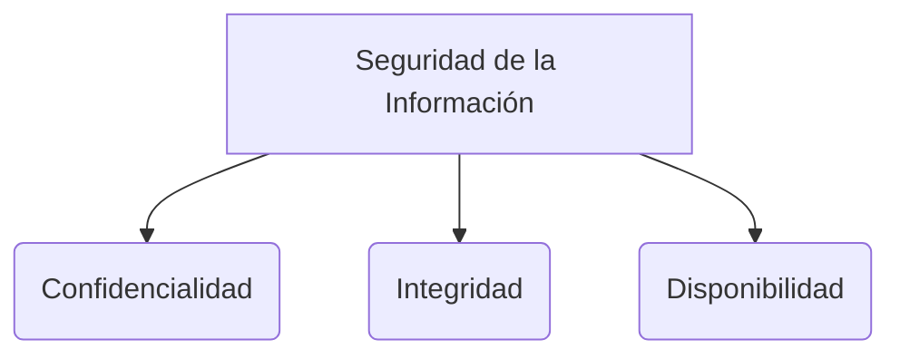

# Actividades del Proceso de Software

El proceso de software está compuesto por secuencias entrelazadas de actividades técnicas, colaborativas y administrativas, con la meta general de especificar, diseñar, implementar y probar un sistema de software.

Estas actividades son útiles particularmente para dar apoyo a la edición de distintos tipos de documentos y para manejar el inmenso volumen de información detallada que se produce en un gran proyecto de software.

Las cuatro actividades básicas del proceso de software son: 
1. **Especificación**
2. **Desarrollo**
3. **Validación**
4. **Evolución**

Estas se organizan de diversa manera dependiendo del modelo de desarrollo utilizado.
Por ejemplo, en el modelo en cascada se organizan en secuencia estricta, mientras que se entrelazan de forma iterativa en el desarrollo incremental. La forma en que se llevan a cabo estas actividades depende del tipo de software a construir, del personal involucrado y de las estructuras organizativas de la empresa.

> [!info] Explicación: Validación y Pruebas
> La validación y la evolución son puntos centrales en la Ingeniería de Software actual. Validar no es solo probar al final, sino que implica un testing continuo a distintos niveles (pruebas unitarias, de integración, end-to-end) para asegurar que el software no solo "funciona" (verificación técnica), sino que resuelve la verdadera necesidad del cliente (validación de negocio).

## Notas relacionadas
- [[El proceso de software]]
- [[Software e Ingeniería  de Software]]
- [[Apuntes de clase]]
- [[técnicas pruebas]]
- [[Ciclo de vida de hci]]

## Especificación del Software
Consiste en el proceso de comprender y definir qué servicios se requieren del sistema, así como la identificación de las restricciones sobre su operación y desarrollo.

Es una etapa particularmente crítica del proceso de software, ya que los errores en esta fase conducen de manera inevitable a problemas severos y costosos durante el diseño y la implementación.
Se enfoca en producir un documento de requerimientos convenido que especifique lo que los interesados (stakeholders) necesitan que cumpla el sistema.

* **Los usuarios finales y clientes:** Necesitan un informe de requerimientos de alto nivel (lenguaje de negocio).
* **Los desarrolladores de sistemas:** Precisan una descripción mucho más detallada del sistema (lenguaje técnico).

![[Pasted image 20240104071108.png]]

> [!info] Explicación: Especificación en Ágil vs Tradicional
> Tradicionalmente, la especificación se hace al inicio produciendo un documento largo (como un SRS o Especificación de Requerimientos de Software). En metodologías ágiles, la especificación es un proceso continuo que se captura mediante **Historias de Usuario**. En lugar de tener todo definido desde el primer día, se priorizan los requerimientos en un "Product Backlog" y se refinan justo antes de implementarlos.

1. **Estudio de factibilidad:** Es el primer paso para determinar si vale la pena o no continuar con la especificación y desarrollo del sistema.

## Diagrama de Referencia

