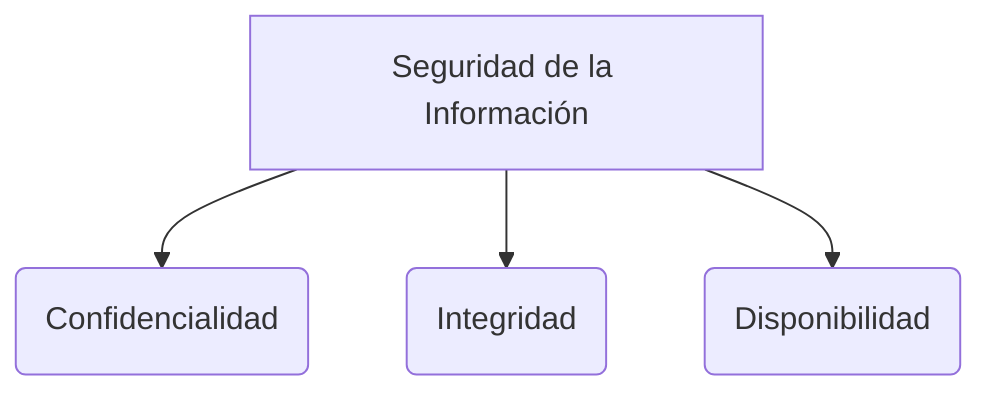

# Apuntes de Clase: Ingeniería de Software

## Abstracción y Enfoques de Desarrollo
La **abstracción** consiste en preocuparse por la característica más relevante de un objeto o problema en la vida real, lo que permite visualizar los métodos y metodologías adecuados para resolverlo.
Existen diferentes enfoques históricos de abstracción:
1. **Abstracción de procesos (Enfoque procedural):** Fue el primero en aparecer, basándose totalmente en modelar los procesos del sistema.
2. **Abstracción de datos:** Surgió después, enfocándose en las estructuras de la información.
Las herramientas CASE (Computer-Aided Software Engineering) apoyan estos enfoques automatizando partes del desarrollo.

La solución de software siempre tiene su origen en los **requerimientos**. Estos requerimientos se pueden resolver mediante hardware, software, o creando un listado formal de ambos. Es importante considerar redes (protocolos), bases de datos y la capacidad de las máquinas para conectarse.

## Fases y Modelos Tradicionales
En la ingeniería de software clásica (como el modelo de Cascada, estructurado por Pressman), existen fases claras:
* **Planificación:** Organizarse en el tiempo.
* **Seguimiento:** Verificar que las tareas se hayan realizado según el plan.
* **Modelado y Diseño:** Analizar las necesidades del cliente (análisis del sistema) para modelar los requerimientos y luego diseñar la solución.

El software moderno requiere conectarse mediante **interfaces**, que generalmente se dividen en 5 tipos:
1. Usuario (UI)
2. Hardware
3. Comunicación (Redes)
4. Software interno (APIs locales)
5. Sistemas externos (cuando el sistema se conecta con software de terceros).

El **Modelo en Cascada** solo se recomienda para sistemas altamente complejos y predecibles; para sistemas simples y dinámicos, no es adecuado.

## Modelo de Proceso Incremental y Evolutivo
El modelo incremental consiste en hacer **entregas funcionales poco a poco**.
* Se usa cuando hay una necesidad imperiosa de dar rápidamente cierta funcionalidad limitada a los usuarios, la cual se aumenta en entregas posteriores.
* Puede funcionar en paralelo, con varios equipos trabajando en distintos incrementos. Cada entrega es independiente.
* A diferencia del modelo en cascada (que tiene solo 1 entrega final), el modelo evolutivo incremental tiene "N entregas funcionales" que el cliente instala y usa inmediatamente.
* Los planes son cortos. Frecuentemente, el primer incremento es el que más falla porque es donde se descubre la mayor incertidumbre (y tiene impacto en costo y tiempo). Se debe hacer todo el esfuerzo posible en asegurar el éxito de este primer paso.
* Si el incremento es bien recibido, se puede agregar más personal para el siguiente y avanzar más rápido.
* Este modelo ayuda a la competitividad de las empresas e innova sobre lo que ya existe.

> [!info] Explicación: Agilidad y Entregas Frecuentes
> El modelo de entregas funcionales y rápidas es la base de metodologías como Scrum y Kanban. Entregar de "poco en poco" disminuye el riesgo de construir un producto que el cliente no quiere. Las empresas modernas logran hacer estas entregas incluso varias veces al día utilizando pipelines de Integración y Entrega Continua (CI/CD) junto con pruebas automatizadas robustas.

## Gestión de Riesgos
Un riesgo es cualquier acontecimiento que afecte el éxito del proyecto (su costo, tiempo o calidad). El proceso de gestión incluye:
1. Identificar los riesgos.
2. Cuantificar el impacto del riesgo y su probabilidad de ocurrencia.
3. Ordenar los riesgos por probabilidad y luego por impacto.
4. Aplicar la **Regla de Pareto (80/20)**: mitigando el 20% de los riesgos más críticos, se cubre el 80% del peligro total.

## Especificación y Modelado
* **LSRS (Especificación de Requerimientos de Software):** Es un documento esencial escrito de forma colaborativa que detalla qué hará el sistema.
* Los requerimientos deben ser **no ambiguos y consistentes**. Generalmente, los establece un "Analista de Negocios" o Product Owner, no necesariamente el ingeniero de software. El diseño e implementación sí es tarea exclusiva de los técnicos.
* **Casos de Uso:** Es una secuencia de acciones que permite obtener un resultado observable y de valor para un "Actor". Los actores siempre son externos al sistema (pueden ser hardware, otro software, o un usuario humano). Se identifican conversando directamente con los usuarios. El sistema no funcionará bien si no se especifican correctamente los casos de uso.

## Testing y Calidad (Costo, Tiempo, Calidad)
La satisfacción del cliente, la usabilidad (tiempo que le toma al usuario volverse experto en la app) y la portabilidad son fundamentales.
Para asegurar esto, existen varios niveles de pruebas:
* **Pruebas de Unidad (Unit Testing):** Prueban componentes aislados.
* **Pruebas de Integración:** Verifican qué sucede cuando se unen todos los componentes.
* **Pruebas Alfa y Beta:** Se usa el software liberado (como prototipo o primera versión) para que el cliente lo use y ayude a verificar errores en entornos casi reales.

## Arquitectura de Componentes
Un **componente** es un encapsulado de funcionalidad que se conecta por interfaces bien definidas. Si se quiere reutilizar software de forma efectiva, se debe usar una arquitectura basada en componentes. 

> [!info] Explicación: Reutilización y Pruebas Unitarias
> El uso de componentes aislados facilita enormemente el **Testing**. Al tener interfaces bien definidas, podemos aplicar "Pruebas Unitarias" sobre el componente aislando sus dependencias mediante "mocks" o dobles de prueba. Además, metodologías ágiles como XP promueven prácticas como TDD (Test-Driven Development), donde la prueba se escribe antes que el componente mismo.

## Notas relacionadas
- [[El proceso de software]]
- [[Actividades del proceso de software]]
- [[Software e Ingeniería  de Software]]
- [[proyectos]]
- [[metodologias de analisis y evaluacion de riesgo]]

## Diagrama de Referencia

