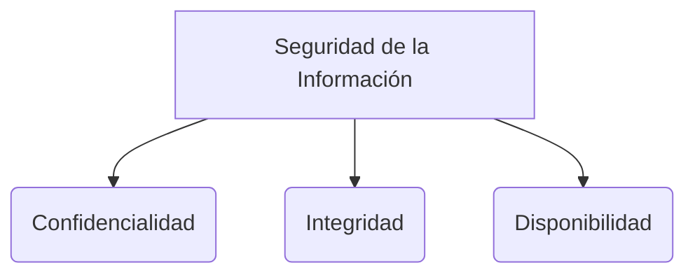

# Arquitectura de Software

La arquitectura de software se refiere a las estructuras fundamentales de un sistema de software y la disciplina de crear tales estructuras y sistemas. Cada estructura comprende elementos de software, las relaciones entre ellos y las propiedades de ambos.

La arquitectura dicta cómo se satisfacen los [[CARACTERÍSTICAS DE CALIDAD DE UN PRODUCTO DE SOFTWARE]] (requerimientos no funcionales) como el desempeño, la seguridad y la escalabilidad.

## Estilos y Patrones Arquitectónicos Comunes

### 1. Cliente-Servidor
Separa el sistema en dos aplicaciones donde un programa cliente solicita servicios a un programa servidor centralizado. Es la base de casi toda la web actual.

### 2. Arquitectura de Tres Capas (N-Tier)
Divide el sistema lógicamente (y a menudo físicamente) en capas específicas:
* **Capa de Presentación:** Interfaz de usuario o API.
* **Capa de Lógica de Negocio:** Contiene las reglas y cálculos del dominio.
* **Capa de Datos:** Se encarga de la persistencia y recuperación de información en la base de datos.

### 3. MVC (Model-View-Controller)
Patrón arquitectónico fundamental para el desarrollo de interfaces de usuario y aplicaciones web:
* **Modelo:** Gestiona los datos, la lógica y las reglas del dominio.
* **Vista:** Es la presentación de los datos (la interfaz).
* **Controlador:** Recibe las entradas del usuario, las procesa y actualiza el Modelo y la Vista.

### 4. Microservicios
Un enfoque donde la aplicación se construye como un conjunto de servicios pequeños e independientes. Cada servicio se ejecuta en su propio proceso y se comunica con otros mediante protocolos ligeros (normalmente HTTP o colas de mensajería).
* *Ventajas:* Despliegue independiente, escalabilidad modular, cada equipo puede usar diferentes tecnologías.
* *Desventajas:* Complejidad operativa, problemas de latencia de red, difícil rastreo de errores.

### 5. Monolito
El enfoque opuesto a los microservicios. Todo el sistema (interfaz, lógica de negocio, acceso a datos) está acoplado en una sola base de código y se despliega como una sola unidad. Es más fácil de empezar y testear al inicio, pero difícil de escalar si crece demasiado.

> [!info] Explicación: Arquitectura Evolutiva y Agilidad
> En el pasado, se hacía un diseño de arquitectura completo antes de programar (Big Design Up Front). En metodologías modernas como [[scrum]], la arquitectura es "emergente" y "evolutiva" (ver principios ágiles en [[software 2]]). Se empieza con una arquitectura sencilla y se va refinando (o migrando de monolito a microservicios) a medida que aumentan las exigencias y el conocimiento del negocio.

## Notas relacionadas
- [[CARACTERÍSTICAS DE CALIDAD DE UN PRODUCTO DE SOFTWARE]]
- [[Patrones de diseño]]
- [[Diagramas UML]]

## Diagrama de Referencia

