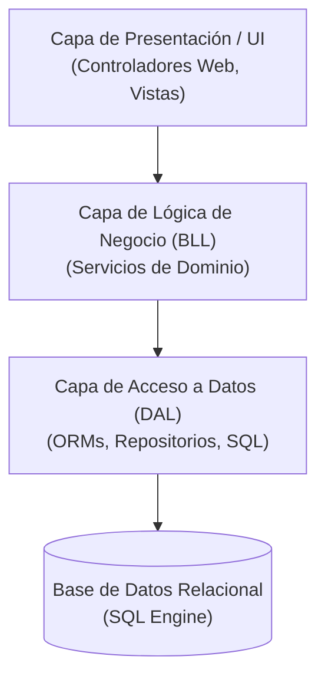
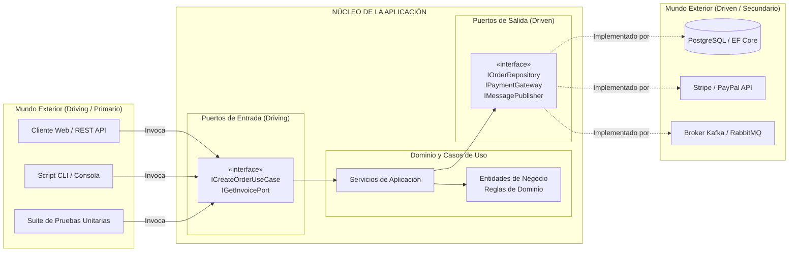
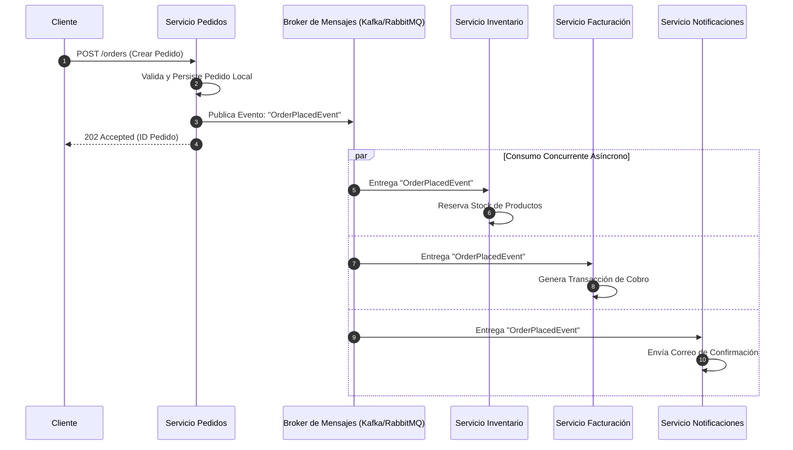
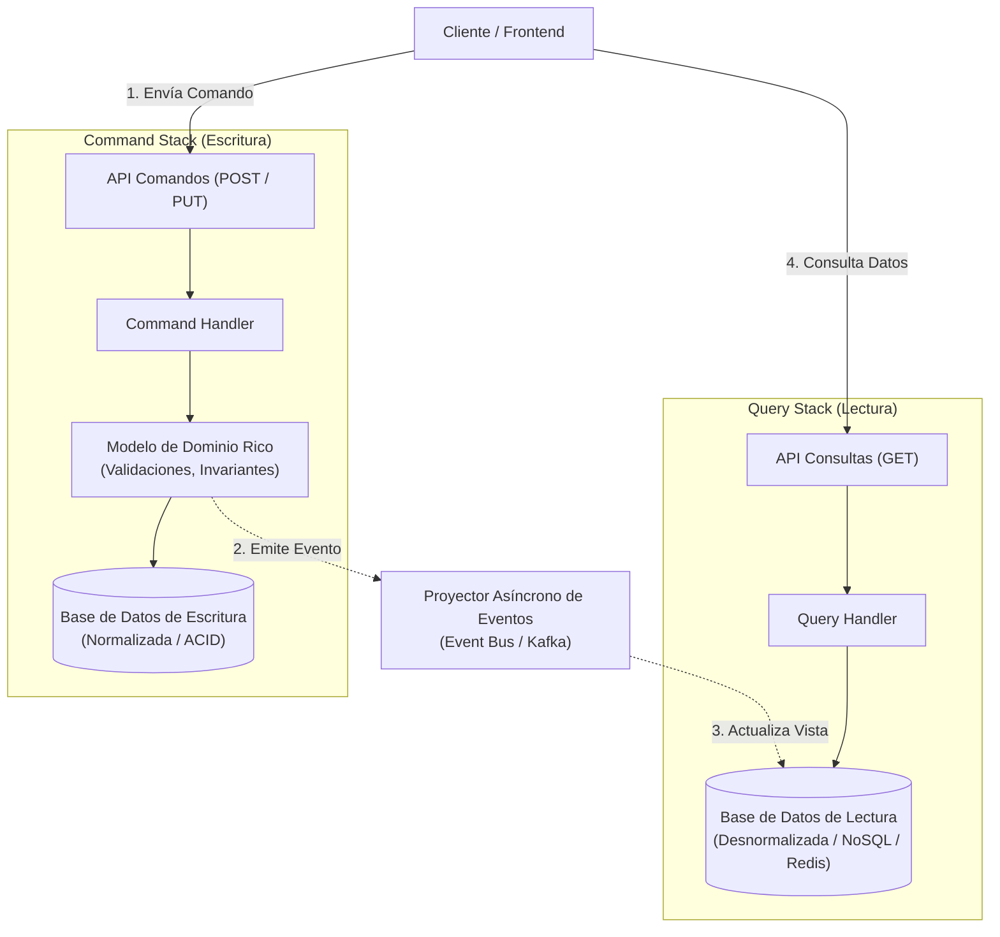
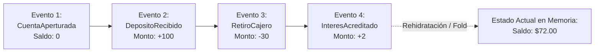

# Arquitecturas Modernas de Software: Limpia, Hexagonal y Dirigida por Eventos

La arquitectura de software representa el conjunto de decisiones fundamentales sobre la organización de un sistema: la selección de sus elementos estructurales y las interfaces a través de las cuales interactúan (extendiendo lo explorado en [[Arquitectura de software]]). 

A medida que los sistemas empresariales crecen en volumen y dinamismo, las arquitecturas monolíticas tradicionales colapsan bajo el peso de su propio acoplamiento. Esta nota analiza a fondo la superación de las limitaciones de la arquitectura en capas tradicional mediante el desacoplamiento tecnológico de la **Arquitectura Hexagonal**, el rigor concéntrico de la **Clean Architecture** y la reactividad distribuida de la **Arquitectura Dirigida por Eventos (EDA)** con patrones avanzados como **CQRS** y **Event Sourcing**.

> [!info] 💡 ¿Cómo entender esto desde cero? (Guía para novatos de pregrado)
> - **El error del novato:** Escribir consultas SQL directamente dentro del botón de la pantalla o dentro del controlador web. Si mañana cambias de MySQL a MongoDB, o de Web a una App Móvil, tienes que tirar a la basura todo el sistema.
> - **El principio sagrado del Dominio Independiente:** Las reglas de tu negocio (ej. "cómo se calcula el interés de un préstamo bancario") son sagradas e inmutables. No deben saber ni importarles si se guardan en Oracle, si la pantalla usa React o si la orden llegó por mensaje de texto.
> - **Arquitectura Hexagonal (Puertos y Adaptadores):** Tu lógica de negocio es una isla pura. Para hablar con el mundo exterior tiene "Puertos" (enchufes estándar). Un adaptador conecta la base de datos Postgres al enchufe; otro adaptador conecta una API REST. ¡Puedes cambiar la base de datos por un archivo JSON sin tocar una sola línea de tu lógica de negocio!
> - **Arquitectura por Eventos (EDA):** En vez de llamar a alguien y quedarte esperando colgado al teléfono ("¡Oye, procesa este pago!"), publicas un altavoz al viento: "Evento: ¡ClientePagó!". Quien necesite enterarse (el sistema de facturación, el almacén, el correo) lo escucha y reacciona a su propio ritmo.

---

## 1. Limitaciones de la Arquitectura en Capas Tradicional (N-Tier)

Durante décadas, el modelo dominante fue la **Arquitectura en 3 Capas (N-Tier)**:



A pesar de su aparente simplicidad, esta estructura adolece de problemas estructurales críticos en proyectos de mediana y gran envergadura:

1. **Diseño Guiado por la Base de Datos (*Database-Driven Design*):**
   La flecha de dependencia apunta directamente hacia abajo. La lógica de negocio depende contractualmente de la capa de datos. En la práctica, esto conduce a diseñar las tablas de la base de datos primero y luego mapear modelos anémicos (*Anemic Domain Model*) que simplemente trasladan tuplas de SQL hacia la UI.
2. **Fuga de Modelos de Base de Datos e Invasión de Frameworks:**
   Las anotaciones de los ORMs (como Hibernate o Entity Framework) infectan las entidades de negocio. Si la estructura relacional cambia, la lógica de negocio se ve forzada a mutar, violando el principio de responsabilidad única ([[Principios SOLID y Clean Code#S — Single Responsibility Principle (SRP)|SRP]]).
3. **Imposibilidad de Testeo Aislado:**
   Probar un servicio de negocio requiere instanciar o emular la base de datos real, resultando en pruebas lentas, frágiles y difíciles de mantener, alejándose del ciclo ideal de desarrollo guiado por pruebas (ver [[Metodologia TDD (Test-Driven Development)]]).

---

## 2. Arquitectura Hexagonal (*Ports and Adapters*)

Propuesta por **Alistair Cockburn en 2005**, la Arquitectura Hexagonal surge con una premisa clara:
> *"Permitir que una aplicación sea operada de igual forma por usuarios, programas, pruebas automatizadas o scripts de consola, y que sea desarrollada y probada de forma aislada de sus dispositivos eventuales de tiempo de ejecución y bases de datos."*

El término "hexágono" es meramente ilustrativo para denotar que el núcleo del sistema posee múltiples puntos de conexión hacia el mundo exterior a través de **Puertos** y **Adaptadores**.



### Componentes Clave:
* **El Núcleo (Inside):** Contiene la lógica del negocio pura. No tiene dependencias de librerías externas, frameworks web ni motores de persistencia.
* **Puertos (*Ports*):** Son interfaces en el lenguaje de programación que definen contratos abstractos.
  * **Puertos Primarios o Conducidos (*Driving / Inbound Ports*):** Representan lo que el núcleo ofrece al mundo exterior (los Casos de Uso de la aplicación).
  * **Puertos Secundarios o Conductores (*Driven / Outbound Ports*):** Representan lo que el núcleo necesita del exterior para cumplir su cometido (persistencia, notificación, mensajería).
* **Adaptadores (*Adapters*):** Componentes concretos que convierten las solicitudes del mundo exterior hacia el formato del núcleo, o viceversa.
  * **Adaptadores Primarios:** Controladores REST (`OrderRestController`), manejadores de mensajes (`KafkaConsumer`).
  * **Adaptadores Secundarios:** Implementaciones de repositorios (`PostgresOrderRepository`), clientes de pasarela de pago (`StripePaymentAdapter`).

> [!tip] La Gran Ventaja Hexagonal
> Para sustituir una base de datos Oracle por MongoDB o DynamoDB (ver [[Bases de Datos NoSQL y Poliglota]]), no se toca ni una sola línea del núcleo de la aplicación; únicamente se construye un nuevo adaptador que implemente el puerto de salida existente.

---

## 3. Arquitectura Limpia (*Clean Architecture*)

Formalizada por **Robert C. Martin en 2012**, Clean Architecture integra los conceptos de Hexagonal (*Ports & Adapters*), Onion Architecture (Jeffrey Palermo) y DCI (*Data, Context, and Interaction*), organizándolos en un conjunto de **círculos concéntricos**.

```mermaid
flowchart TD
    subgraph Circulo4["Frameworks and Drivers (Infraestructura Externa)"]
        direction TB
        F1["Web Framework / UI"]
        F2["Base de Datos / ORM"]
        F3["Dispositivos / Sensores"]

        subgraph Circulo3["Interface Adapters (Adaptadores de Interfaz)"]
            direction TB
            A1["Controllers (REST, GraphQL)"]
            A2["Gateways / Repositories Impl"]
            A3["Presenters / ViewModels"]

            subgraph Circulo2["Application Business Rules (Casos de Uso)"]
                direction TB
                U1["Casos de Uso de la Aplicación"]
                U2["DTOs de Entrada / Salida"]

                subgraph Circulo1["Enterprise Business Rules (Entidades)"]
                    direction TB
                    E1["Entidades de Negocio"]
                    E2["Objetos de Valor (Value Objects)"]
                    E3["Políticas Globales"]
                end
            end
        end
    end

    Circulo4 ==>|Depende de| Circulo3
    Circulo3 ==>|Depende de| Circulo2
    Circulo2 ==>|Depende de| Circulo1
```



### La Regla de Oro de Dependencia (*The Dependency Rule*)
> *"Las dependencias del código fuente SOLO pueden apuntar hacia adentro, hacia el centro del círculo (hacia el mayor nivel de abstracción y reglas de negocio)."*

* **Nada en un círculo interno puede saber absolutamente nada sobre un círculo externo.** Ni el nombre de una base de datos, ni el framework web, ni la estructura de un JSON HTTP.
* **Entidades (Centro):** Modelan los objetos del negocio con sus invariantes y lógica intrínseca. Son las menos propensas a cambiar ante modificaciones operativas.
* **Casos de Uso:** Orquestan el flujo hacia y desde las entidades. Si cambia el flujo de registro de un usuario, esta capa cambia.
* **Adaptadores de Interfaz:** Convierten los datos desde la forma más conveniente para los casos de uso a la forma más conveniente para agentes externos (bases de datos, web). Aquí habitan los controladores y presentadores.
* **Frameworks y Drivers:** Herramientas y detalles técnicos (ASP.NET Core, Spring Boot, PostgreSQL, AWS SDK). Son detalles intercambiables.

### Cruce de Límites (*Boundary Crossing*):
Para que un caso de uso guarde una entidad en la base de datos sin violar la Regla de Dependencia, se aplica el principio de inversión de dependencias ([[Principios SOLID y Clean Code#D — Dependency Inversion Principle (DIP)|DIP]]):
1. El Caso de Uso define y consume una interfaz `IUserGateway` (dentro de su propio círculo).
2. El repositorio concreto `SqlUserGateway` (en el círculo exterior) implementa dicha interfaz.
3. El flujo de control viaja hacia afuera, pero la dependencia estática de código fuente apunta estrictamente hacia adentro.

---

## 4. Arquitectura Dirigida por Eventos (*Event-Driven Architecture - EDA*)

En sistemas distribuidos y [[Microservicios]], la comunicación sincrónica HTTP/REST genera cadenas de dependencias frágiles (*cascading failures*). La **Arquitectura Dirigida por Eventos (EDA)** desacopla completamente los componentes en el tiempo y el espacio mediante la producción, detección y consumo de **Eventos de Dominio**.

* **Evento de Dominio:** Notificación inmutable de un hecho relevante que ya sucedió en el pasado del negocio (ej. `PedidoCreado`, `PagoRechazado`, `InventarioAgotado`).
* **Desacoplamiento Espacial:** El productor desconoce la identidad, ubicación física y cantidad de consumidores.
* **Desacoplamiento Temporal:** El emisor puede emitir el evento sin que los consumidores estén online en ese instante; el broker retiene el mensaje hasta su consumo (ver [[Sistemas de mensajeria]]).



---

## 5. Patrones Avanzados en EDA: CQRS y Event Sourcing

### A. CQRS (Command Query Responsibility Segregation)
Propuesto por **Greg Young**, CQRS plantea la separación formal y física entre los modelos que modifican el estado (**Commands**) y los modelos que leen la información (**Queries**), llevando el principio CQS de Clean Code al plano de la arquitectura de sistemas.



* **Comandos:** Expresan intención de mutación (`CreateUserCommand`). No retornan datos de dominio (a lo sumo un ID o estado de aceptación).
* **Consultas:** Expresan petición de lectura (`GetUserDashboardQuery`). No mutan ningún estado. Leen directamente de vistas materializadas ultra-rápidas optimizadas para la UI.
* **Consistencia:** Introduce **Consistencia Eventual** (ver [[Consistencia y replicacion]]) entre el modelo de escritura y los almacenes de lectura.

---

### B. Event Sourcing (Almacenamiento de Eventos)
En lugar de almacenar el estado mutable actual de un registro en una fila de base de datos (donde cada `UPDATE` destruye el estado anterior), **Event Sourcing** persiste el ciclo de vida completo de un agregado como una secuencia cronológica inmutable de eventos en un **Event Store** (*Append-Only*).

```
Estado Actual de Cuenta Bancaria = ∑ (Eventos Históricos)
CuentaCreada($0) + DepositoRealizado($100) + RetiroRealizado($30) = Saldo: $70
```



#### Ventajas Cruciales de Event Sourcing:
1. **Auditoría e Historial Perfecto:** Nunca se pierde información; permite reconstruir el estado exacto del negocio en cualquier punto específico del tiempo (*Time Travel Debugging*).
2. **Eliminación de Conflictos de Bloqueos:** El Event Store solo ejecuta operaciones `INSERT` secuenciales, eliminando contenciones de bloqueo por filas (`UPDATE locks`).
3. **Sinergia Total con CQRS:** Los eventos persistidos en el Event Store se publican directamente en el bus de mensajería para proyectar lecturas hacia múltiples bases de datos heterogéneas (políglotas).

---

## 6. Cuadro Comparativo de Enfoques Arquitectónicos

| Criterio | Arquitectura en Capas (N-Tier) | Arquitectura Hexagonal | Clean Architecture | Arquitectura Dirigida por Eventos |
| :--- | :--- | :--- | :--- | :--- |
| **Punto Central** | Base de Datos Relacional | Núcleo de Aplicación y Puertos | Dominio y Regla de Dependencia Concéntrica | Flujo y Difusión de Eventos Asíncronos |
| **Acoplamiento** | Alto (Dependencia directa hacia la base de datos) | Muy Bajo (Aislado mediante puertos abstractos) | Mínimo (Todo detalle técnico reside en la periferia) | Extremadamente Bajo (Desacoplado temporal y espacialmente) |
| **Testeabilidad** | Regular (Requiere mocks complejos o BD en memoria) | Excelente (Los adaptadores son fácilmente emulables) | Óptima (El dominio se prueba con objetos puros) | Requiere pruebas de integración asíncronas y contratos |
| **Complejidad Inicial** | Mínima (Rápido para prototipos sencillos) | Media (Requiere interfaces y adaptadores bien definidos) | Alta (Múltiples capas de mapeo de DTOs y abstracciones) | Alta (Gestión de brokers, eventual consistency, ordenamiento) |
| **Escalabilidad** | Limitada verticalmente | Buena a nivel modular | Excelente a nivel de mantenibilidad | Masiva y distribuida horizontalmente |

---

## Notas relacionadas
- [[Arquitectura de software]]
- [[Principios SOLID y Clean Code]]
- [[Patrones de diseño]]
- [[Microservicios]]
- [[Sistemas de mensajeria]]
- [[Consistencia y replicacion]]
- [[Bases de Datos NoSQL y Poliglota]]
- [[Metodologia TDD (Test-Driven Development)]]
- [[Deuda técnica]]
