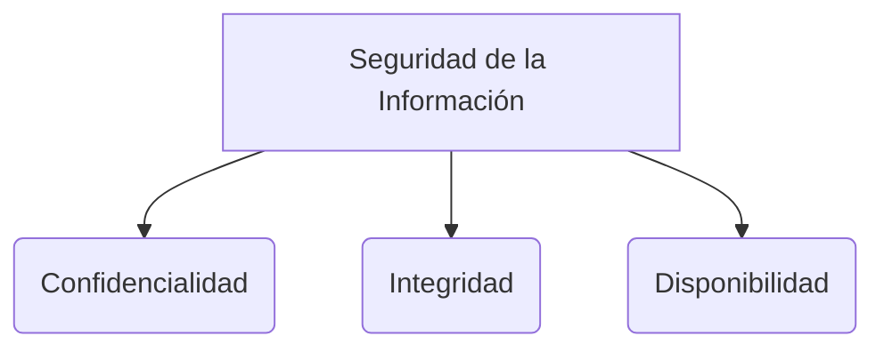

# Características de Calidad de un Producto de Software

1. **seguridad:** Capacidad del sistema para enfrentar y resistir ataques maliciosos, protegiendo la información y los datos de usuarios no autorizados.
2. **Escalabilidad:** Capacidad del sistema de crecer para soportar mayor carga de trabajo. Puede ser horizontal (agregando más servidores o nodos) o vertical (aumentando la capacidad de un servidor, como más RAM o CPU).
3. **Desempeño (Rendimiento):** Mide el tiempo de respuesta, la velocidad de procesamiento y la eficiencia en el uso de los recursos del sistema (memoria, disco, CPU, red, etc.).
4. **Usabilidad:** Facilidad con la que los usuarios pueden comprender, aprender y utilizar el sistema de software.
5. **Disponibilidad:** Porcentaje de tiempo que un sistema de software está operativo, accesible y listo para ser usado por los usuarios.
6. **Portabilidad:** Capacidad del software para ser transferido y funcionar adecuadamente en cualquier otra plataforma o entorno (sistemas operativos, hardware distinto).
7. **Confiabilidad:** Capacidad del sistema para mantener su nivel de rendimiento bajo condiciones específicas durante un periodo determinado, enfrentando fallas, errores, defectos y bugs sin colapsar.
8. **Eficacia:** Grado en el que el software cumple con su propósito y satisface las verdaderas necesidades del usuario, cliente o *stakeholder*.
9. **Rentabilidad:** El software debe ser construido con eficiencia financiera y debe permitir generar valor o ganar rentabilidad para sus creadores o dueños del negocio.
10. **Eficiencia:** Capacidad de optimizar el consumo de recursos de cómputo y tiempo para realizar sus funciones.
11. **Reutilización / Reúso:** Capacidad que permite reutilizar el software entero o partes de él (componentes) en otros productos sin requerir cambios estructurales mayores.
12. **Mantenibilidad:** Facilidad con la que el software puede ser modificado. Incluye mantenimientos de distintos tipos: preventivo, correctivo, adaptativo, perfectivo y proactivo.
13. **Accesibilidad:** Capacidad del software para ser utilizado de manera efectiva por personas con diferentes capacidades o discapacidades especiales (visuales, auditivas, motrices).
14. **Efectividad:** Es la suma de alcanzar el objetivo (eficacia) haciéndolo de la mejor manera (eficiencia).
15. **Flexibilidad:** Capacidad de ser modificado, adaptado o extendido con facilidad ante nuevos requerimientos.
16. **Interoperabilidad:** Capacidad del sistema para comunicarse, intercambiar datos y trabajar de manera conjunta con otros sistemas o componentes de software externos sin problemas.

> [!info] Explicación: Atributos de Calidad y Arquitectura
> Estas características también se conocen como **Requerimientos No Funcionales** o **Atributos de Calidad**. A diferencia de los requerimientos funcionales (lo que el sistema *hace*), estos definen *cómo* lo hace el sistema. Son el factor principal que dicta la **Arquitectura de Software**; por ejemplo, si la disponibilidad y escalabilidad son críticas, un arquitecto probablemente elegirá una arquitectura de microservicios en la nube en lugar de una arquitectura monolítica tradicional. Las pruebas de carga y estrés son vitales para validar características como el desempeño y la confiabilidad.

## Notas relacionadas
- [[El proceso de software]]
- [[Software e Ingeniería  de Software]]
- [[pruebas de usabilidad]]
- [[técnicas pruebas]]

## Diagrama de Referencia

