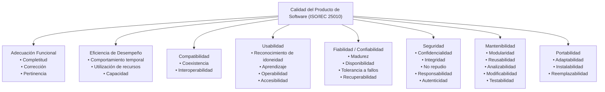

# Características de Calidad de un Producto de Software (ISO/IEC 25010)

Las características de calidad de un producto de software definen el grado en el que el sistema satisface las necesidades declaradas e implícitas de sus distintas partes interesadas (*stakeholders*).

1. **Seguridad:** Capacidad del sistema para enfrentar y resistir ataques maliciosos, protegiendo la información y los datos de accesos no autorizados (autenticación, autorización, no repudio, confidencialidad e integridad).
2. **Escalabilidad:** Capacidad del sistema de adaptarse para soportar mayor carga de trabajo sin degradar el servicio. Puede ser horizontal (agregando más nodos en clúster) o vertical (aumentando recursos de CPU/RAM).
3. **Desempeño / Eficiencia de Desempeño:** Mide el comportamiento temporal (latencia, rendimiento/throughput) y la eficiencia en la utilización de recursos de cómputo (memoria, procesador, ancho de banda).
4. **Usabilidad:** Facilidad con la que los usuarios pueden comprender, aprender, operar y sentirse atraídos por el sistema en un contexto de uso determinado (ver [[pruebas de usabilidad]]).
5. **Disponibilidad:** Fracción o porcentaje de tiempo en el que un sistema de software se encuentra en estado operativo y accesible cuando se requiere su uso (medido comúnmente en "nueves", ej. 99.9% o 99.99%).
6. **Portabilidad:** Facilidad con la que el software puede ser transferido y ejecutado de manera efectiva desde un entorno operativo o de hardware hacia otro (adaptabilidad, instalabilidad, reemplazabilidad).
7. **Confiabilidad:** Capacidad del sistema para mantener un nivel especificado de rendimiento bajo condiciones operativas normales durante un período de tiempo determinado (tolerancia a fallos, recuperabilidad y madurez).
8. **Eficacia:** Grado de exactitud e integridad con el que los usuarios logran objetivos específicos mediante el uso del software.
9. **Eficiencia:** Razón entre los resultados alcanzados y los recursos (tiempo, memoria, cómputo) empleados para lograrlos.
10. **Mantenibilidad:** Eficacia y eficiencia con la que los desarrolladores pueden modificar el producto (modularidad, reusabilidad, analizabilidad, modificabilidad y testabilidad).
11. **Reutilización / Reúso:** Capacidad de emplear componentes o módulos de software en más de un sistema o en la construcción de nuevas aplicaciones.
12. **Accesibilidad:** Capacidad del software para ser utilizado con la misma efectividad por personas con el rango más amplio posible de capacidades o discapacidades (visuales, motoras, auditivas o cognitivas).
13. **Flexibilidad:** Capacidad de adaptarse dinámicamente o con mínimo costo a cambios en los requerimientos o en el entorno de negocio.
14. **Interoperabilidad:** Capacidad de dos o más sistemas o componentes para intercambiar información y utilizar de forma transparente la información que ha sido intercambiada (APIs RESTful, RPC, protocolos estándar).

---

> [!info] Explicación: Atributos de Calidad y Arquitectura de Software
> Estas características constituyen los **Requerimientos No Funcionales (RNF)** o **Atributos de Calidad**. Mientras que los requerimientos funcionales definen *qué* debe hacer el sistema, los atributos de calidad gobiernan *cómo* debe comportarse. Son los principales *drivers* arquitectónicos: determinan decisiones fundamentales como el particionamiento de módulos, estilos arquitectónicos (monolito vs microservicios vs serverless) y estrategias de redundancia y resiliencia.

---

## Modelo de Calidad del Producto (ISO/IEC 25010)

```mermaid
graph TD
    ISO["Calidad del Producto de Software (ISO/IEC 25010)"]
    
    ISO --> FUNC["Adecuación Funcional<br>• Completitud<br>• Corrección<br>• Pertinencia"]
    ISO --> PERF["Eficiencia de Desempeño<br>• Comportamiento temporal<br>• Utilización de recursos<br>• Capacidad"]
    ISO --> COMP["Compatibilidad<br>• Coexistencia<br>• Interoperabilidad"]
    ISO --> USAB["Usabilidad<br>• Reconocimiento de idoneidad<br>• Aprendizaje<br>• Operabilidad<br>• Accesibilidad"]
    ISO --> RELI["Fiabilidad / Confiabilidad<br>• Madurez<br>• Disponibilidad<br>• Tolerancia a fallos<br>• Recuperabilidad"]
    ISO --> SECU["Seguridad<br>• Confidencialidad<br>• Integridad<br>• No repudio<br>• Responsabilidad<br>• Autenticidad"]
    ISO --> MAIN["Mantenibilidad<br>• Modularidad<br>• Reusabilidad<br>• Analizabilidad<br>• Modificabilidad<br>• Testabilidad"]
    ISO --> PORT["Portabilidad<br>• Adaptabilidad<br>• Instalabilidad<br>• Reemplazabilidad"]
```

---

## Notas relacionadas
- [[El proceso de software]]
- [[Software e Ingeniería  de Software]]
- [[pruebas de usabilidad]]
- [[tecnicas pruebas|técnicas de pruebas]]
