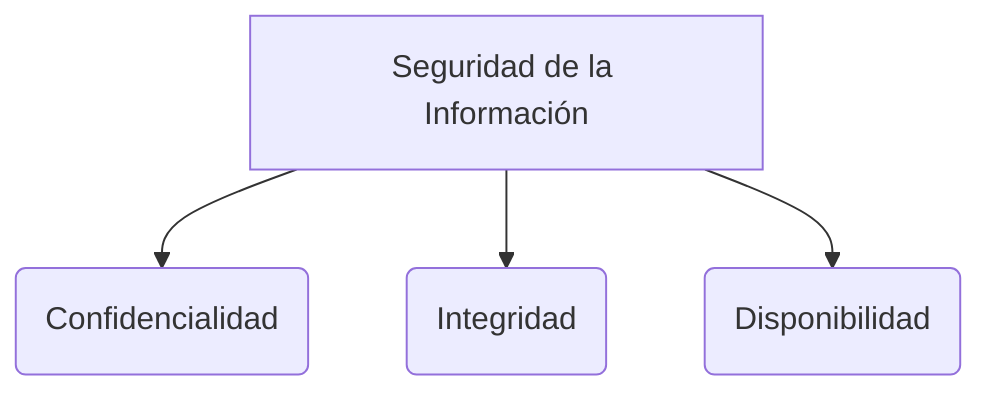

# Ciencias en las que se basa la Ingeniería de Software

La Ingeniería de Software es una disciplina integradora que se apoya en múltiples campos del conocimiento humano:

1. **Ciencias Exactas:** Proporcionan la base cuantitativa para la toma de decisiones mediante Probabilidad y Estadística, Matemáticas y Física.
2. **Ciencias de la Computación:** Forman el núcleo técnico fundamental a través de Matemáticas Discretas, Algoritmia, Estructuras de Datos y Lógica Matemática.
3. **Ciencias Administrativas:** Permiten gestionar los recursos y el esfuerzo humano a través de la Gestión de Proyectos, Gestión de Personal, Gestión de Tiempo y Gestión de Recursos Materiales.
4. **Ciencias Gramaticales:** Son cruciales para la comunicación clara de requerimientos, involucrando Lenguaje y Comunicación, Semántica, Sintaxis, Ortografía, Redacción y Lectura comprensiva.
5. **Ciencias Sociales:** Ayudan a entender el impacto de los sistemas en la sociedad e involucran la Sociología, Ciudadanía, Ética Profesional y Técnicas de Negociación.
6. **Ciencias Económicas y Financieras:** Determinan la viabilidad comercial de los proyectos mediante Economía, Finanzas y Contabilidad.
7. **Ciencias Jurídicas:** Regulan el marco legal a través de Leyes de propiedad intelectual, Contratación de personal, Licenciamiento de software, Patentes y normativas de Comercio Electrónico.
8. **Ciencias Psicológicas:** Apoyan el diseño centrado en el usuario y la gestión de equipos de alto rendimiento, incluyendo la Psicología general e incluso la Psiquiatría para el entendimiento profundo del comportamiento humano.
9. **Ciencias Ambientales:** Cobran importancia para el desarrollo sustentable ("Green IT"), abarcando la Ecología, Manejo de Agua, Manejo de Residuos electrónicos y eficiencia energética.
10. **Ciencias de la Comunicación:** Son esenciales para el lanzamiento de productos y la relación con el usuario a través de Publicidad, Marketing y Comunicación Social.
11. **Ciencias Políticas:** Intervienen en grandes proyectos gubernamentales y en la gobernanza de las organizaciones, considerando la Teoría de las Ciencias Políticas, Políticas Públicas, Políticas Empresariales y Educativas.

> [!info] Explicación: La Multidisciplinariedad del Software
> Esta lista refleja por qué la creación de software no es un trabajo exclusivamente técnico ("tirar código"). Un proyecto de software moderno requiere habilidades interdisciplinarias ("Soft Skills"). Por ejemplo, comprender Leyes es vital para no infringir licencias Open Source; entender Psicología y Ciencias de la Comunicación es clave para el Diseño de Experiencia de Usuario (UX); y las Ciencias Administrativas son la base de las metodologías de gestión como Scrum o Kanban.

## Notas Relacionadas
- [[Software e Ingeniería  de Software]]
- [[El proceso de software]]

## Diagrama de Referencia

