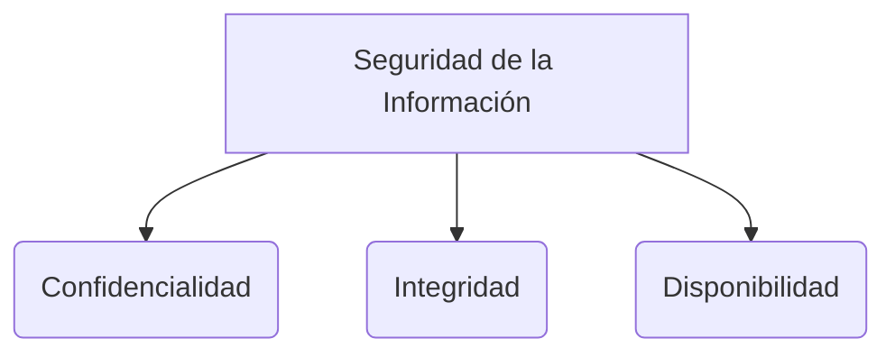

# Diagramas UML

UML (Unified Modeling Language o Lenguaje Unificado de Modelado) es un estándar para visualizar, especificar, construir y documentar los artefactos de un sistema de software, proporcionando un vocabulario estándar.

## Tipos de Diagramas
UML define diferentes diagramas que se agrupan en dos categorías principales: **Diagramas Estructurales** (parte estática del sistema) y **Diagramas de Comportamiento** (parte dinámica).

### Diagramas Estructurales
1. **Diagrama de Clases:** Muestra la estructura estática del sistema a través de las clases, sus atributos, métodos y las relaciones (asociación, herencia, agregación, composición) entre ellas. Es el diagrama más común en el desarrollo orientado a objetos.
2. **Diagrama de Componentes:** Muestra la organización y las dependencias entre un conjunto de componentes de software. Es clave para entender la [[Arquitectura de software]].
3. **Diagrama de Despliegue:** Muestra la arquitectura física del hardware y cómo el software se despliega en ese hardware.

### Diagramas de Comportamiento
1. **Diagrama de Casos de Uso:** Muestra las funcionalidades que el sistema provee y qué actores (usuarios u otros sistemas) interactúan con ellas. Ayuda mucho en la fase de [[Requisitos de software]].
2. **Diagrama de Secuencia:** Muestra la interacción entre objetos a lo largo del tiempo. Es muy útil para modelar la lógica de un método o un proceso específico, mostrando qué mensajes se envían los objetos entre sí.
3. **Diagrama de Actividad:** Similar a un diagrama de flujo, muestra el flujo de control de una actividad a otra dentro de un sistema.
4. **Diagrama de Estado:** Muestra los diferentes estados en los que puede estar un objeto a lo largo de su ciclo de vida y las transiciones entre esos estados debido a eventos.

> [!info] Explicación: UML y Agilidad
> En el desarrollo tradicional (Modelo en Cascada), UML se usa de manera extensa y formal al principio del proyecto. En las metodologías ágiles (como [[scrum]] o [[XP (eXtremme programming)]]), UML a menudo se usa de forma informal en pizarras (Agile Modeling) para entender un problema rápido, y no como documentación exhaustiva que debe ser mantenida perpetuamente.

## Notas relacionadas
- [[Requisitos de software]]
- [[Arquitectura de software]]
- [[Apuntes de clase]]

## Diagrama de Referencia

