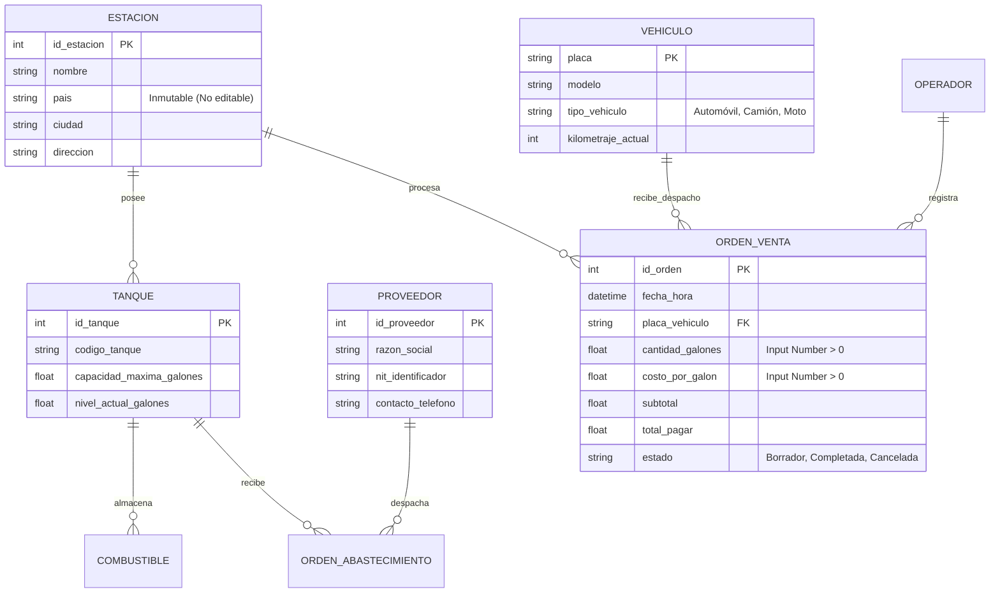
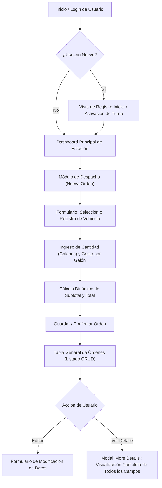

# Especificación de Requerimientos de Software (SRS): Módulo de Estación de Servicio de Combustible (*Fuel Station Management*)

## Notas relacionadas
- [[proyectos|Gestión de Proyectos]]
- [[software 2|Ingeniería de Software II]]
- [[pruebas de usabilidad|Pruebas de Usabilidad e Interfaz]]
- [[crisp-dm|Ciclo de Vida de Datos y CRISP-DM]]

---

## 1. Introducción y Propósito del Sistema

El presente documento formaliza la **Especificación de Requerimientos de Software (SRS)** para el sistema de control transaccional, despacho de combustible, administración de inventarios en tanques y auditoría contable en estaciones de servicio (*Fuel Station*), conforme a las buenas prácticas de la norma **IEEE 830 / ISO/IEC/IEEE 29148**.

### 1.1 Objetivos Generales
1. Automatizar el registro de órdenes de despacho de combustible asociadas a vehículos específicos.
2. Garantizar la integridad financiera y el control de inventario de galones en tanques subterráneos en tiempo real.
3. Proveer interfaces CRUD amigables, robustas y validadas contra entradas numéricas erróneas, evitando discrepancias de caja o mermas de combustible no contabilizadas.

---

## 2. Actores del Sistema

```mermaid
flowchart TD
    Admin["Administrador de Estación"]
    Op["Operador de Pista / Despachador"]
    Auditor["Auditor Contable / Proveedor"]

    Sys((Sistema Fuel Station))

    Admin -->|Configuración de estación, tanques, proveedores y precios base| Sys
    Op -->|Registro de vehículos, despacho de combustible y emisión de órdenes| Sys
    Auditor -->|Consulta exhaustiva de auditoría (Ver / More Details)| Sys
```

* **Operador de Pista / Despachador:** Responsable del ingreso de turnos, registro de ventas, ingreso de galones despachados y asignación de vehículo.
* **Administrador de Estación:** Administra los catálogos de combustibles, tanques de almacenamiento, proveedores y parametriza tarifas.
* **Auditor / Sistema Contable:** Accede a las vistas de solo lectura detallada (*More Details*) para conciliar inventario físico vs ventas.

---

## 3. Modelo de Entidades y Diccionario de Datos



### 3.1 Diccionario de Campos de la Orden de Venta

| Campo / Atributo | Tipo de Dato UI / DB | Restricciones y Reglas de Validación | Descripción Funcional |
| :--- | :--- | :--- | :--- |
| **`id_orden` (Order ID)** | Entero Autoincremental | Clave primaria única. No editable por ningún usuario. | Identificador unívoco de la transacción de combustible. |
| **`placa_vehiculo`** | Cadena alfanumérica | Formato estándar de placa (ej. `[A-Z]{3}-[0-9]{3}`). Requerido. | Identifica el automotor que recibe la carga. Puede seleccionarse de lista o crearse nuevo. |
| **`quantity` (Cantidad)** | Numérico Flotante (`input type="number"`) | `min=0.01`, `step=0.001`. Obligatorio. Mayor a cero. No puede superar el stock del tanque. | Volumen de combustible despachado en galones. |
| **`cost_gallon` (Costo Galón)** | Numérico Moneda (`input type="number"`) | `min=0.01`, `step=0.01`. Obligatorio. Mayor a cero. Precargado con tarifa vigente. | Precio unitario por cada galón despachado. |
| **`subtotal`** | Numérico Moneda (Calculado) | Campo calculado en tiempo real: $\text{subtotal} = \text{quantity} \times \text{cost\_gallon}$. Solo lectura. | Monto bruto antes de sobretasas e impuestos. |
| **`total_pagar`** | Numérico Moneda (Calculado) | Calculado automáticamente: $\text{total} = \text{subtotal} + \text{impuestos}$. | Total neto a pagar por el cliente. |
| **`pais` (Country)** | Cadena de Texto | **ESTRICTAMENTE INMUTABLE:** Se inicializa en el despliegue del sistema y **nunca es editable** desde la interfaz. | País de operación de la estación; rige regulaciones fiscales y unidades legales. |
| **`supplier` (Proveedor)** | Selector de Relación (FK) | Válido en recepciones y visible en la trazabilidad de la mezcla en tanque. | Empresa mayorista proveedora del combustible. |

---

## 4. Reglas y Validaciones de Negocio

> [!important] Matriz de Restricciones del Sistema
> 1. **Inmutabilidad del País:**
>    - *Regla:* Una vez configurada la estación, el campo `País` se bloquea permanentemente contra edición en cualquier formulario administrativo.
>    - *Justificación:* Evita fraudes tributarios, inconsistencias de moneda base y normativas de metrología legal de hidrocarburos.
> 2. **Validación Estricta de Campos Numéricos:**
>    - Los campos de volumen (`quantity`) y tarifa (`cost_gallon`) deben forzarse en la interfaz web como `input type="number"` con atributos `step="any"` y validadores de límite inferior ($> 0$).
>    - Se prohíbe la inserción de valores negativos, caracteres no numéricos o cadenas vacías.
> 3. **Visibilidad Exhaustiva en la Vista de Detalle ("Ver / More Details"):**
>    - En la vista modal o página de detalle de una orden, **absolutamente todos los campos del registro deben mostrarse** (ID de orden, vehículo, galones, costo unitario, total, operador, tanque, proveedor, fecha exacta y país). Ningún metadato puede ser truncado ni omitido.
> 4. **Manejo de Estados de Registro (Permisos de Edición y Agregación):**
>    - Todos los datos de la orden, tanques y vehículos son agregables y editables mientras el registro se encuentre en estado `Borrador` o en proceso de despacho.
>    - Una vez finalizada la orden y emitida la factura fiscal, el registro pasa a estado `Cerrado / Auditado` (solo lectura para garantizar la inmutabilidad contable).
> 5. **Comprobación de Inventario en Tanque:**
>    - Ninguna orden puede confirmarse si $\text{quantity} > \text{Stock\_Disponible\_Tanque}$.

---

## 5. Arquitectura de Interfaces CRUD y Flujo de Usuario



### 5.1 Especificación de Vistas Principales

#### Vista 1: Ingreso de Usuario / Activación de Turno
* **Comportamiento:** Si el usuario ingresa por primera vez, el sistema despliega un asistente (*Wizard*) para inicializar sus credenciales, asignar la isla de bombeo y validar el estado operativo de los surtidores asignados.

#### Vista 2: Formulario de Nueva Orden de Despacho
* **Controles de Interfaz:**
  - Selector de Vehículo con función de autocompletado por placa. Si la placa no existe en la base de datos, se habilita en línea un formulario modal emergente para registrar el nuevo vehículo (placa, modelo, tipo).
  - Campo `quantity`: `input type="number"` con indicador visual del nivel del tanque en galones.
  - Campo `cost_gallon`: `input type="number"` con valor sugerido por defecto, habilitado para edición según política de precios.
  - Resumen de liquidación con cálculo reactivo en frontend mediante JavaScript/TypeScript:
    ```javascript
    const totalPagar = (Number(quantity) * Number(costGallon)).toFixed(2);
    ```

#### Vista 3: Módulo de Detalle Integral ("Ver / More Details")
* **Requisito Crucial de Diseño:** La vista de auditoría debe estructurarse mediante una tarjeta de resumen o modal donde se muestren de forma desglosada y legible todos los atributos del sistema:
  - Número de Orden y Timbre de Tiempo.
  - Placa y Datos Completos del Vehículo.
  - Galones despachados con 3 cifras decimales de precisión.
  - Costo exacto por galón con 2 decimales de moneda.
  - Subtotal, Impuestos aplicables y Total liquidado.
  - Nombre del Proveedor del lote de combustible activo.
  - Identificador del Tanque de almacenamiento origen.
  - País y Sede de la estación (de solo lectura).
