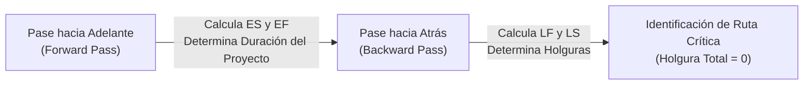
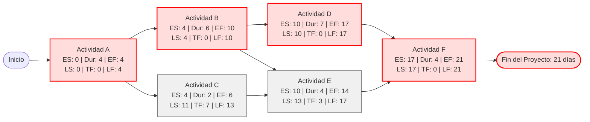

# Gestión de Proyectos: Método de la Ruta Crítica (CPM) y Técnica PERT

## Notas relacionadas
- [[proyectos]]
- [[software 2]]
- [[Algoritmo Dijkstra]]

---

## 1. Fundamentos y Marco Teórico (PMI / PMBOK)

En el ámbito de la ingeniería de software y la gestión de proyectos según los estándares del **PMI (Project Management Institute)** y la guía del **PMBOK (Project Management Body of Knowledge)**, la gestión del cronograma es una de las áreas de conocimiento más críticas para asegurar el éxito del proyecto dentro de las restricciones de tiempo y costo.

Históricamente, surgieron dos metodologías matriciales para la planificación y control de redes de proyectos:

| Criterio | CPM (Critical Path Method) | PERT (Program Evaluation and Review Technique) |
| :--- | :--- | :--- |
| **Origen** | Desarrollado en 1957 por DuPont y Remington Rand para plantas químicas. | Desarrollado en 1958 por la Marina de EE. UU. (Oficina de Proyectos Especiales) para el programa de misiles Polaris. |
| **Naturaleza del Tiempo** | **Determinista:** Asume que la duración de las actividades se conoce con precisión razonable a partir de datos históricos. | **Probabilístico:** Modela la duración de las actividades como variables aleatorias bajo incertidumbre (I+D, desarrollo de software). |
| **Enfoque Principal** | Optimización de la relación tiempo-costo (*Crashing* / Compresión de cronograma). | Estimación de la probabilidad de cumplir con una fecha límite de entrega establecida. |
| **Modelo de Estimación** | Duración única por tarea. | Estimación de tres puntos con función de densidad **Beta**. |

Ambos métodos convergen en la actualidad: en la práctica moderna de ingeniería, se utiliza la **estimación PERT** para parametrizar las duraciones esperadas y el **algoritmo CPM de doble pase** para identificar la ruta crítica y las holguras en la red.

---

## 2. Redes de Actividades: Modelos AOA vs AON

La lógica secuencial y las dependencias entre actividades se modelan mediante un grafo dirigido acíclico (DAG):

1. **AOA (Activity-on-Arrow):** 
   - Las **flechas** representan las actividades que consumen tiempo y recursos.
   - Los **nodos** representan eventos o hitos de inicio y fin (sin duración).
   - *Desventaja:* Requiere introducir frecuentemente "actividades ficticias" (*dummy activities*) de duración cero para representar dependencias lógicas complejas sin ambigüedades.
2. **AON (Activity-on-Node) / PDM (Precedence Diagramming Method):**
   - Los **nodos** representan las actividades de trabajo con su duración y fechas.
   - Las **flechas** representan exclusivamente las relaciones de precedencia lógica (ej. Fin a Inicio - FS, Inicio a Inicio - SS).
   - Es el estándar universal utilizado por herramientas de software contemporáneas (Jira, MS Project, Primavera).

### 2.1 Anatomía Estándar de un Nodo AON

Cada nodo de actividad se subdivide en 6 celdas esenciales para el cálculo analítico:

$$\begin{array}{|c|c|c|}
\hline
\text{ES (Early Start)} & \text{Duración } (D_i) & \text{EF (Early Finish)} \\
\hline
\multicolumn{3}{|c|}{\textbf{Nombre de la Actividad } (A_i)} \\
\hline
\text{LS (Late Start)} & \text{Holgura Total } (TF_i) & \text{LF (Late Finish)} \\
\hline
\end{array}$$

---

## 3. Identificación y Cálculo de la Ruta Crítica (CPM)

> [!important] Definición de Ruta Crítica
> La **Ruta Crítica** (*Critical Path*) es la secuencia ininterrumpida de actividades dependientes desde el nodo de inicio hasta el nodo de finalización que posee la **mayor duración acumulada total**. Dicha secuencia determina la **duración mínima inamovible** en la que es físicamente posible culminar el proyecto.
> 
> Cualquier retraso en cualquiera de las actividades que forman parte de la ruta crítica impactará de manera directa, día por día, la fecha de entrega final del proyecto.

### 3.1 Algoritmo de Doble Pase (*Two-Pass Method*)

Para resolver la red y determinar la ruta crítica se ejecuta un algoritmo de dos fases:

#### 1. Pase hacia Adelante (*Forward Pass*): Cálculo de Fechas Tempranas
Avanza desde el inicio del proyecto hacia el final para determinar las fechas más tempranas posibles en las que puede comenzar y concluir cada tarea.

* **Inicio temprano de la primera actividad:** 
  $$ES_{\text{inicio}} = 0$$
* **Terminación temprana:**
  $$EF_i = ES_i + D_i$$
* **Condición de convergencia (Múltiples predecesores):** Para una actividad $j$ que depende de varios predecesores $P$, su inicio temprano está condicionado por el predecesor que termine más tarde:
  $$ES_j = \max_{p \in \text{Predecesores}(j)} \{ EF_p \}$$

#### 2. Pase hacia Atrás (*Backward Pass*): Cálculo de Fechas Tardías
Retrocede desde el fin del proyecto hacia el inicio para determinar lo más tarde que puede arrancar o finalizar una actividad sin demorar la fecha final comprometida.

* **Terminación tardía del proyecto:** Para el nodo final:
  $$LF_{\text{final}} = EF_{\text{final}}$$
* **Inicio tardío:**
  $$LS_i = LF_i - D_i$$
* **Condición de convergencia (Múltiples sucesores):** Para una actividad $i$ que precede a múltiples sucesores $S$, su terminación tardía no puede superar el inicio más tardío permitido para cualquiera de sus sucesores inmediatos:
  $$LF_i = \min_{s \in \text{Sucesores}(i)} \{ LS_s \}$$

#### 3. Cálculo de Holguras (*Float / Slack*)
* **Holgura Total (*Total Float - TF*):** Tiempo que una actividad se puede demorar sin retrasar la fecha de finalización del proyecto:
  $$TF_i = LS_i - ES_i = LF_i - EF_i$$
* **Holgura Libre (*Free Float - FF*):** Tiempo que una actividad se puede demorar sin retrasar el inicio temprano de ningún sucesor inmediato:
  $$FF_i = \min_{s \in \text{Sucesores}(i)} \{ ES_s \} - EF_i$$

> [!tip] Criterio Fundamental de Criticidad
> Una actividad $i$ es **crítica** si y solo si su holgura total es nula:
> $$TF_i = 0$$
> La ruta crítica estará conformada por todas las actividades consecutivas donde $TF = 0$.

---

## 4. Estimación Probabilística de Tres Puntos (Técnica PERT)

En entornos de ingeniería con alta volatilidad, no se puede asumir una duración fija y exacta. PERT modela la duración de cada tarea como una distribución de probabilidad continua **Beta generalizada**, delimitada por tres estimaciones heurísticas:

1. **Estimación Optimista ($O$):** Duración mínima asumiendo que todo transcurre excepcionalmente bien y sin tropiezo alguno ($p \approx 1\%$).
2. **Estimación Más Probable ($M$ / Moda):** Duración más realista en condiciones habituales de trabajo.
3. **Estimación Pesimista ($P$):** Duración máxima asumiendo la ocurrencia de contratiempos, fallas de proveedores y bloqueos técnicos ($p \approx 1\%$).

### 4.1 Fórmulas Matemáticas de PERT

#### 1. Tiempo Esperado ($T_e$ o Media Ponderada $\mu$)
Otorga un peso cuádruple a la estimación más probable para reflejar la distribución asimétrica típica en proyectos de ingeniería:
$$T_e = \frac{O + 4M + P}{6}$$

#### 2. Varianza ($\sigma^2$) y Desviación Estándar ($\sigma$) de la Actividad
Asumiendo que el rango $(P - O)$ abarca aproximadamente $6\sigma$ (el $99.7\%$ del área bajo la curva normal):
$$\sigma_i = \frac{P_i - O_i}{6}, \qquad \sigma_i^2 = \left( \frac{P_i - O_i}{6} \right)^2$$

### 4.2 Análisis Estadístico del Proyecto y Teorema del Límite Central

En virtud del **Teorema del Límite Central (TLC)**, dado que la duración total de la ruta crítica es la suma de múltiples variables aleatorias independientes, la distribución del tiempo total de finalización del proyecto $T_{\text{proyecto}}$ converge hacia una **Distribución Normal**:

$$T_{\text{proyecto}} \sim \mathcal{N}\left( T_E, \sigma_{\text{proyecto}}^2 \right)$$

Donde:
* **Duración Esperada del Proyecto:**
  $$T_E = \sum_{i \in \text{Ruta Crítica}} T_{e, i}$$
* **Varianza Acumulada de la Ruta Crítica:**
  $$\sigma_{\text{proyecto}}^2 = \sum_{i \in \text{Ruta Crítica}} \sigma_i^2$$
* **Desviación Estándar del Proyecto:**
  $$\sigma_{\text{proyecto}} = \sqrt{\sum_{i \in \text{Ruta Crítica}} \sigma_i^2}$$

> [!warning] Error Común: ¡Nunca se suman las desviaciones estándar!
> Siempre se suman las varianzas ($\sigma^2$) de las actividades de la ruta crítica y luego se extrae la raíz cuadrada del total. Sumar directamente $\sigma_i$ sobreestima de forma errónea el riesgo.

### 4.3 Cálculo de la Probabilidad de Finalización en una Fecha Límite ($T_d$)

Si la gerencia o el cliente exige entregar el proyecto en una fecha meta o pactada $T_d$, se estandariza la variable mediante el puntaje $Z$:

$$Z = \frac{T_d - T_E}{\sigma_{\text{proyecto}}}$$

La probabilidad acumulada de éxito se obtiene evaluando la función de distribución acumulativa normal estándar:
$$P(T \le T_d) = \Phi(Z)$$

---

## 5. Caso de Estudio Práctico Resuelto Paso a Paso

Supóngase un proyecto de software para una plataforma de servicios distribuidos con las siguientes actividades:

### 5.1 Tabla de Actividades y Estimaciones PERT

| ID | Descripción de la Actividad | Predecesores | $O$ (días) | $M$ (días) | $P$ (días) | $T_e = \frac{O+4M+P}{6}$ | $\sigma^2 = \left(\frac{P-O}{6}\right)^2$ |
| :-: | :--- | :-: | :-: | :-: | :-: | :-: | :-: |
| **A** | Requerimientos y Arquitectura | — | 2 | 4 | 6 | **4.0** | $(4/6)^2 = 0.44$ |
| **B** | Diseño de Base de Datos y API | A | 3 | 5 | 13 | **6.0** | $(10/6)^2 = 2.78$ |
| **C** | Configuración de Infraestructura | A | 1 | 2 | 3 | **2.0** | $(2/6)^2 = 0.11$ |
| **D** | Desarrollo del Backend | B | 4 | 7 | 10 | **7.0** | $(6/6)^2 = 1.00$ |
| **E** | Desarrollo del Frontend | B, C | 2 | 3 | 10 | **4.0** | $(8/6)^2 = 1.78$ |
| **F** | Pruebas de Integración y Despliegue | D, E | 2 | 4 | 6 | **4.0** | $(4/6)^2 = 0.44$ |

### 5.2 Red de Actividades y Diagrama Mermaid

### 5.3 Resolución del Doble Pase

1. **Pase hacia Adelante:**
   - $ES_A = 0 \implies EF_A = 0 + 4 = 4$.
   - $ES_B = EF_A = 4 \implies EF_B = 4 + 6 = 10$.
   - $ES_C = EF_A = 4 \implies EF_C = 4 + 2 = 6$.
   - $ES_D = EF_B = 10 \implies EF_D = 10 + 7 = 17$.
   - $ES_E = \max(EF_B, EF_C) = \max(10, 6) = 10 \implies EF_E = 10 + 4 = 14$.
   - $ES_F = \max(EF_D, EF_E) = \max(17, 14) = 17 \implies EF_F = 17 + 4 = 21$.
   - **Duración esperada total del proyecto ($T_E$) = 21 días.**

2. **Pase hacia Atrás:**
   - $LF_F = 21 \implies LS_F = 21 - 4 = 17$.
   - $LF_D = LS_F = 17 \implies LS_D = 17 - 7 = 10$.
   - $LF_E = LS_F = 17 \implies LS_E = 17 - 4 = 13$.
   - $LF_C = LS_E = 13 \implies LS_C = 13 - 2 = 11$.
   - $LF_B = \min(LS_D, LS_E) = \min(10, 13) = 10 \implies LS_B = 10 - 6 = 4$.
   - $LF_A = \min(LS_B, LS_C) = \min(4, 11) = 4 \implies LS_A = 4 - 4 = 0$.

3. **Cálculo de Holguras y Determinación de la Ruta Crítica:**
   - $TF_A = 0 - 0 = 0 \implies \textbf{Crítica}$
   - $TF_B = 4 - 4 = 0 \implies \textbf{Crítica}$
   - $TF_C = 11 - 4 = 7 \implies \text{No crítica (Holgura de 7 días)}$
   - $TF_D = 10 - 10 = 0 \implies \textbf{Crítica}$
   - $TF_E = 13 - 10 = 3 \implies \text{No crítica (Holgura de 3 días)}$
   - $TF_F = 17 - 17 = 0 \implies \textbf{Crítica}$

$$\textbf{Ruta Crítica:} \quad A \longrightarrow B \longrightarrow D \longrightarrow F$$

### 5.4 Evaluación Probabilística del Caso de Estudio

1. **Varianza y Desviación Estándar de la Ruta Crítica:**
   $$\sigma_{\text{proyecto}}^2 = \sigma_A^2 + \sigma_B^2 + \sigma_D^2 + \sigma_F^2 = 0.44 + 2.78 + 1.00 + 0.44 = 4.66 \text{ días}^2$$
   $$\sigma_{\text{proyecto}} = \sqrt{4.66} \approx 2.16 \text{ días}$$

2. **Pregunta de Negocio:** ¿Cuál es la probabilidad de entregar el proyecto en un plazo máximo de $T_d = 23$ días?
   $$Z = \frac{T_d - T_E}{\sigma_{\text{proyecto}}} = \frac{23 - 21}{2.16} = \frac{2}{2.16} \approx +0.93$$
   Consultando la tabla de la distribución Normal Estándar:
   $$\Phi(0.93) \approx 0.8238 \implies \mathbf{82.38\% \text{ de probabilidad}}$$
