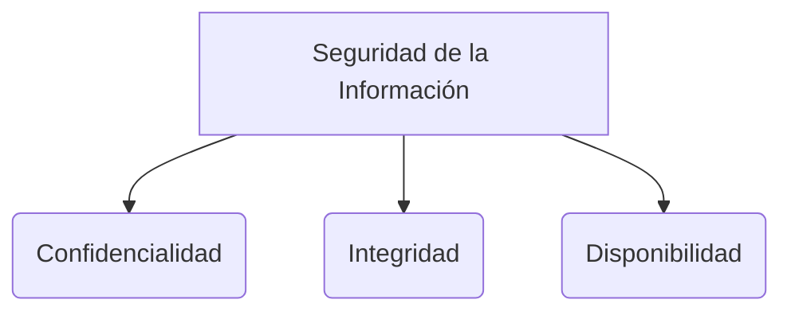

# Patrones de Diseño

Los patrones de diseño son soluciones habituales a problemas comunes en el diseño de software. Funcionan como plantillas prefabricadas que se pueden personalizar para resolver un problema de diseño recurrente en el código. A diferencia del código, un patrón es un concepto y una estructura arquitectónica.

## Categorías de Patrones (Gof - Gang of Four)

Los patrones clásicos se dividen en tres grandes grupos:

### 1. Patrones Creacionales
Proporcionan mecanismos de creación de objetos que incrementan la flexibilidad y la reutilización del código existente, desacoplando el sistema de cómo sus objetos son creados.
* **Singleton:** Garantiza que una clase tenga una única instancia y proporciona un punto de acceso global a ella. (Útil para logs, conexiones a bases de datos).
* **Factory Method:** Define una interfaz para crear un objeto, pero deja que las subclases decidan qué clase instanciar.
* **Builder:** Permite construir objetos complejos paso a paso. Útil cuando un objeto debe tener muchas posibles configuraciones.

### 2. Patrones Estructurales
Explican cómo ensamblar objetos y clases en estructuras más grandes y complejas, manteniendo la flexibilidad y la eficiencia.
* **Adapter (Adaptador):** Permite que objetos con interfaces incompatibles colaboren entre sí (funciona igual que un adaptador de enchufe).
* **Decorator (Decorador):** Permite añadir nuevos comportamientos a objetos de forma dinámica, colocándolos dentro de objetos envoltorio especiales.
* **Facade (Fachada):** Proporciona una interfaz simplificada a un grupo de clases, una biblioteca o un *framework* complejo.

### 3. Patrones de Comportamiento
Se encargan de la comunicación efectiva y la asignación de responsabilidades entre los objetos.
* **Observer (Observador):** Permite definir un mecanismo de suscripción para notificar a múltiples objetos sobre cualquier evento que le suceda al objeto que están observando. Muy común en el desarrollo de interfaces (UI) y arquitecturas reactivas.
* **Strategy (Estrategia):** Permite definir una familia de algoritmos, colocar cada uno de ellos en una clase separada y hacer que sus objetos sean intercambiables.
* **Command (Comando):** Convierte una solicitud en un objeto independiente que contiene toda la información sobre la solicitud.

> [!info] Explicación: Calidad del Código y Patrones
> Conocer patrones de diseño mejora significativamente la comunicación en un equipo ("Usemos un Singleton aquí" en vez de explicar toda la lógica). Además, la aplicación correcta de patrones previene la acumulación de [[Deuda técnica]] y facilita la aplicación de principios como SOLID, haciendo el software más fácilmente escalable y mantenible.

## Notas relacionadas
- [[Arquitectura de software]]
- [[Diagramas UML]]
- [[Deuda técnica]]

## Diagrama de Referencia

