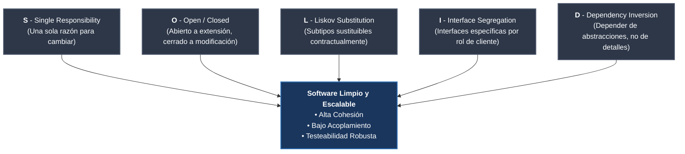
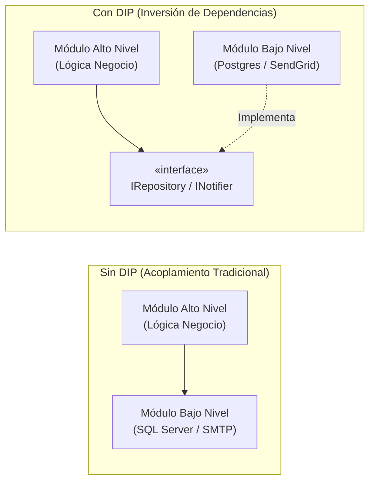
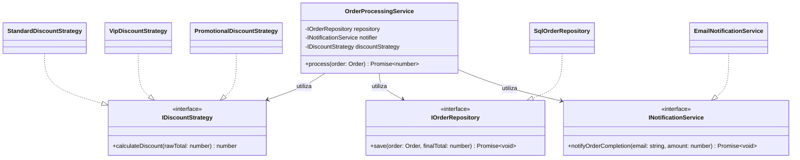

# Principios SOLID y Filosofía Clean Code

Los **Principios SOLID** y la filosofía de **Clean Code** constituyen la base teórica y práctica fundamental para la construcción de sistemas de software mantenibles, comprensibles y evolutivos en el paradigma de Orientación a Objetos. Formalizados y popularizados por Robert C. Martin ("*Uncle Bob*") a principios de la década de 2000, estos principios atacan directamente los cuatro síntomas de la degradación arquitectónica del software:
1. **Rigidez:** Dificultad para modificar el sistema porque un cambio en un módulo desencadena cambios en cascada en dependencias ajenas.
2. **Fragilidad:** Tendencia del software a romperse en lugares inesperados cada vez que se introduce una modificación menor.
3. **Inmovilidad:** Imposibilidad de reutilizar componentes de software en otros proyectos o contextos debido a su estrecho acoplamiento.
4. **Viscosidad:** Resistencia del diseño a ser extendido de forma limpia, tentando al desarrollador a recurrir a "parches" rápidos que empeoran la [[Deuda técnica]].

> [!info] 💡 ¿Cómo entender esto desde cero? (Guía para novatos de pregrado)
> - **El software no se escribe una vez y se olvida:** El 80% de la vida de un sistema de software se gasta leyéndolo y modificándolo para nuevos requerimientos del cliente. Escribir código "que solo funcione para la entrega de mañana" pero que nadie entienda es crear una bomba de tiempo.
> - **La navaja suiza de SOLID:**
>   - **S (Responsabilidad Única):** Un empleado no puede ser al mismo tiempo el cocinero, el cajero, el contador y el chofer del restaurante. Cada clase debe tener un solo trabajo bien hecho.
>   - **O (Abierto/Cerrado):** Tu celular viene con un puerto USB para conectarle audífonos o cargador (abierto a extensión) sin tener que abrir el celular con un destornillador y resoldar la placa madre (cerrado a modificación).
>   - **L (Sustitución de Liskov):** Si parece un pato y hace "cuac", pero necesita baterías... probablemente no deberías heredar de la clase `PatoReal` o el programa se romperá cuando intente nadar en el lago.
>   - **I (Segregación de Interfaces):** No obligues a una impresora básica a implementar una interfaz monstruosa con botones de "Escanear en 4K" o "Enviar Fax".
>   - **D (Inversión de Dependencias):** Tu lámpara no se suelda directamente a los cables de alta tensión de la pared; se conecta a un enchufe estándar (una abstracción).

---

## 1. Los 5 Principios SOLID



---

### S — Single Responsibility Principle (SRP)
> *"Una clase debe tener una, y solo una, razón para cambiar."* — Robert C. Martin.

El SRP no afirma que una clase deba realizar únicamente una sola función elemental, sino que debe responder a un único **actor** o **stakeholder** del negocio. Cuando una clase aglutina responsabilidades que interesan a diferentes departamentos (por ejemplo, lógica contable, renderizado en UI y persistencia en base de datos), cualquier cambio solicitado por un actor puede introducir regresiones involuntarias en las funciones que consume otro.

* **Cohesión Funcional vs. Acoplamiento:** El SRP maximiza la **alta cohesión** (todos los métodos y atributos de una clase colaboran estrechamente para un mismo propósito) y minimiza el **acoplamiento** con módulos externos.
* **Antipatrón God Object (Clase Dios):** Una clase monolítica que centraliza la mayor parte de la lógica operativa de la aplicación (e.g., `OrderManager` con 4,000 líneas que valida pagos, envía correos, calcula impuestos y escribe en SQL).

> [!warning] Violación Típica de SRP
> Una clase `Employee` que contiene métodos como `CalculatePay()` (solicitado por Finanzas/Contabilidad), `ReportHours()` (solicitado por Recursos Humanos) y `SaveToDatabase()` (solicitado por Operaciones/DBAs). Tres razones distintas para cambiar concentradas en una sola unidad.

---

### O — Open/Closed Principle (OCP)
> *"Las entidades de software (clases, módulos, funciones) deben estar abiertas para la extensión, pero cerradas para la modificación."* — Bertrand Meyer (1988) / Robert C. Martin.

Un componente de software debe ser capaz de extender su comportamiento ante nuevos requerimientos de negocio sin requerir la edición ni recompilación del código fuente original que ya se encuentra probado y en producción.

* **Mecanismos de Implementación:** Polimorfismo en tiempo de ejecución, clases base abstractas, interfaces bien delineadas y patrones como el patrón **Strategy** o el patrón **Decorator** (ver [[Patrones de diseño]]).
* **Antipatrón *Switch Hell*:** El uso excesivo de sentencias `switch` o cadenas infinitas de `if-else` que evalúan tipos de objetos concretos para aplicar comportamientos dispares (e.g., procesar pagos evaluando `'PAYPAL'`, `'STRIPE'`, `'CRYPTO'`). Cada nuevo medio de pago obliga a abrir y modificar el método original.

---

### L — Liskov Substitution Principle (LSP)
> *"Si por cada objeto $o_1$ de tipo $S$ existe un objeto $o_2$ de tipo $T$ tal que para todos los programas $P$ definidos en términos de $T$, el comportamiento de $P$ permanece invariante cuando $o_1$ es sustituido por $o_2$, entonces $S$ es un subtipo de $T$."* — Barbara Liskov (1987), Jeannette Wing (1994).

LSP establece que los subtipos deben satisfacer los contratos semánticos y de comportamiento de sus tipos base, no solo su compatibilidad sintáctica de tipos.

#### Reglas Formales del Subtipado por Comportamiento (*Behavioral Subtyping*):
1. **Contravarianza / Regla de Precondiciones:** Una subclase no puede imponer precondiciones más estrictas que las de su superclase.
2. **Covarianza / Regla de Poscondiciones:** Una subclase no puede prometer menos ni debilitar las poscondiciones aseguradas por la superclase.
3. **Preservación de Invariantes:** Todas las invariantes de estado de la superclase deben mantenerse inviolables en la subclase.
4. **Regla Histórica (Constraint de Mutabilidad):** La subclase no puede introducir mutaciones en estados que la superclase definió como inmutables.

#### El Dilema Clásico del Cuadrado y el Rectángulo:
Geométricamente, un cuadrado *es un* rectángulo. Sin embargo, en la modelación orientada a objetos mutable:
```csharp
public class Rectangle
{
    public virtual int Width { get; set; }
    public virtual int Height { get; set; }
    public int Area() => Width * Height;
}

public class Square : Rectangle
{
    public override int Width 
    { 
        set { base.Width = value; base.Height = value; } 
    }
    public override int Height 
    { 
        set { base.Width = value; base.Height = value; } 
    }
}
```
Si un cliente recibe un `Rectangle` y ejecuta:
```csharp
void Resize(Rectangle r)
{
    r.Width = 10;
    r.Height = 5;
    // Postcondición esperada para cualquier Rectangle: r.Area() == 50
    Assert.AreEqual(50, r.Area()); // ¡Falla si r es Square! (dará 25)
}
```
La sustitución falla porque `Square` altera el comportamiento invariante del rectángulo: la independencia dimensional de sus ejes.

---

### I — Interface Segregation Principle (ISP)
> *"Ningún cliente debe ser forzado a depender de métodos que no utiliza."* — Robert C. Martin.

Cuando las interfaces crecen de forma desmedida (*Fat Interfaces* o interfaces monolíticas), los clientes que solo necesitan una pequeña fracción de los métodos quedan expuestos a cambios colaterales que ocurren en operaciones con las que no tienen relación alguna.

* **Interfaces orientadas al rol del cliente:** Las interfaces deben diseñarse desde la perspectiva del consumidor, no desde la perspectiva del proveedor de servicios.
* **Cohesión de interfaces:** Es preferible componer múltiples interfaces pequeñas y altamente cohesivas (e.g., `IReader`, `IWriter`, `ICloseable`) que una única interfaz universal (`IStreamManager`).

---

### D — Dependency Inversion Principle (DIP)
> *"1. Los módulos de alto nivel no deben depender de los módulos de bajo nivel. Ambos deben depender de abstracciones.*
> *2. Las abstracciones no deben depender de los detalles. Los detalles deben depender de las abstracciones."* — Robert C. Martin.

Tradicionalmente, en la arquitectura en capas, los módulos de alto nivel (la lógica de negocio pura) importaban y dependían directamente de las capas inferiores (mecanismos de persistencia SQL, servicios de red, llamadas a APIs). DIP invierte radicalmente esa dirección de acoplamiento mediante polimorfismo.



* **Inversión de Control (IoC):** Principio arquitectónico según el cual el flujo de control tradicional es delegado a un marco de trabajo (*framework*) o componente orquestador externo.
* **Inyección de Dependencias (DI):** Patrón que materializa IoC pasando las dependencias ya resueltas a una clase (preferiblemente vía constructor, *Constructor Injection*) en lugar de permitir que la propia clase instancie sus dependencias mediante el operador `new`.
* **Antipatrón Service Locator:** Centralizar un catálogo global o estático (`ServiceLocator.Get<T>()`) dentro de las clases de negocio oculta dependencias reales y complica las pruebas unitarias aisladas.

---

## 2. Filosofía y Reglas Fundamentales de Clean Code

El concepto de **Clean Code**, desarrollado por Robert C. Martin, postula que *"la lectura de código ocurre en una proporción de 10 a 1 respecto a la escritura de código nuevo"*. La elegancia y claridad son imperativos de ingeniería para mitigar la complejidad accidental del software.

### A. Nombres Descriptivos que Revelan Intención
Los nombres de variables, funciones y clases deben responder tres preguntas esenciales: *¿por qué existe?*, *¿qué hace?* y *¿cómo se usa?*.
* **Evitar desinformación y abreviaturas arbitrarias:** Reemplazar nombres como `d` o `listData` por `elapsedTimeInDays` o `activeUserAccounts`.
* **Nombres pronunciables y buscables:** `MAX_RETRY_ATTEMPTS` en lugar de literales mágicos dispersos (`3` o `7`).

### B. Funciones Pequeñas y SLAP
* **Tamaño reducido:** Una función ideal rara vez debe superar las 15 o 20 líneas.
* **Hacer una sola cosa:** Una función debe realizar una única tarea y ejecutarla a cabalidad. Si una función incluye secciones identificadas con comentarios internos como `// 1. Validar`, `// 2. Transformar`, `// 3. Persistir`, es evidencia de que debe extraerse en tres funciones independientes.
* **SLAP (Single Level of Abstraction Principle):** Todas las sentencias dentro de un método deben residir en el mismo nivel de abstracción. Mezclar conceptos conceptuales de negocio (`processInvoice()`) con manipulación de bajo nivel (`buffer[i++] = 0x0A`) destruye la legibilidad.

### C. Eliminación de Efectos Secundarios y Principio CQS
* **Command-Query Separation (CQS):** Formulada por Bertrand Meyer, establece que un método debe ser un **Comando** (ejecuta una acción que altera el estado del sistema, retornando `void`) o una **Consulta** (computa y retorna un valor sin mutar ningún estado observable del sistema), pero jamás ambos simultáneamente.
* Los efectos secundarios ocultos (e.g., una función `CheckPassword(user, pass)` que silenciosamente reinicia el contador de sesiones o muta variables globales) provocan fallos catastróficos y difíciles de depurar en entornos concurrentes.

### D. Ley de Demeter (Principio del Menor Conocimiento)
Una unidad debe tener un conocimiento limitado sobre las otras unidades: solo debe comunicarse con sus "amigos inmediatos". Formalmente, un método $M$ de un objeto $O$ solo debe invocar métodos de:
1. El propio objeto $O$.
2. Los parámetros pasados a $M$.
3. Cualquier objeto instanciado o creado dentro de $M$.
4. Las variables de instancia directas de $O$.

> [!important] Antipatrón Train Wreck (Accidente de Tren)
> Cadenas de llamadas como `order.GetCustomer().GetAddress().GetCity().GetZipCode()` violan la Ley de Demeter. El objeto llamador conoce la topología interna completa del grafo de objetos. La solución consiste en delegar el comportamiento: `order.GetDeliveryZipCode()`.

### E. Manejo Limpio de Excepciones vs. Retorno de Errores o Nulos
* **No retornar `null` ni códigos de error (`-1`, `ErrorCode.FAIL`):** Obliga al consumidor a plagiar su código con chequeos defensivos `if (result == null)`.
* **Uso de Excepciones de Dominio Tipadas:** Lanzar excepciones semánticas enriquecidas (`OrderAlreadyDispatchedException`).
* **Patrón Result / Option / Either:** Para flujos de negocio donde la falla es un resultado esperado del dominio (e.g., `Result<PaymentReceipt, PaymentError>`), evitando el uso de excepciones como mecanismo de control de flujo.

---

## 3. Ejemplo Práctico: Violación y Refactorización SOLID

A continuación se presenta un caso de estudio completo en **TypeScript** que demuestra la transición de código sucio y acoplado a una arquitectura limpia y respetuosa de SOLID.

### Caso: Procesamiento y Facturación de Pedidos (E-Commerce)

#### Código Sucio (Violaciones Múltiples de SOLID y Clean Code)
```typescript
// ❌ CÓDIGO SUCIO: Viola SRP, OCP, DIP y la Ley de Demeter
class OrderProcessor {
    // Viola DIP: Dependencia concreta instanciada directamente con 'new'
    private dbConnection: any = new (require("mysql").createConnection({ host: "localhost" }));
    private mailer: any = new (require("nodemailer")());

    public processOrder(orderData: any): void {
        // Viola SLAP y Clean Code: Nivel bajo mezclado con lógica de negocio
        let subtotal = 0;
        for (let i = 0; i < orderData.items.length; i++) {
            subtotal += orderData.items[i].price * orderData.items[i].qty;
        }

        // Viola OCP: 'Switch' hardcodeado para calcular descuentos
        let discount = 0;
        if (orderData.paymentType === "VIP_CLIENT") {
            discount = subtotal * 0.15;
        } else if (orderData.paymentType === "BLACK_FRIDAY") {
            discount = subtotal * 0.30;
        } else if (orderData.paymentType === "STANDARD") {
            discount = 0;
        }

        const total = subtotal - discount;

        // Viola SRP: Manejo de persistencia SQL dentro del servicio de pedidos
        this.dbConnection.query(
            "INSERT INTO orders (id, total, status) VALUES (?, ?, ?)",
            [orderData.id, total, "COMPLETED"],
            (err: any) => {
                if (err) console.log("DB Error: " + err);
            }
        );

        // Viola SRP y Demeter: Notificación acoplada e invasiva
        const emailBody = "Estimado " + orderData.customer.profile.name + ", su total fue: " + total;
        this.mailer.sendMail({
            to: orderData.customer.profile.contact.email, // Violación Demeter (Train Wreck)
            subject: "Confirmación de Pedido",
            text: emailBody
        });
    }
}
```

---

#### Código Limpio Refactorizado (SOLID y Clean Code)
```typescript
// ✅ CÓDIGO LIMPIO: Refactorizado aplicando SOLID, SLAP e Inyección de Dependencias

// 1. Dominio Puro y Encapsulamiento (SRP)
export class OrderItem {
    constructor(
        public readonly productId: string,
        public readonly unitPrice: number,
        public readonly quantity: number
    ) {
        if (quantity <= 0) throw new Error("La cantidad debe ser mayor a cero.");
        if (unitPrice < 0) throw new Error("El precio unitario no puede ser negativo.");
    }

    public calculateSubtotal(): number {
        return this.unitPrice * this.quantity;
    }
}

export class Order {
    constructor(
        public readonly id: string,
        public readonly customerEmail: string,
        private readonly items: ReadonlyArray<OrderItem>
    ) {}

    public calculateRawSubtotal(): number {
        return this.items.reduce((acc, item) => acc + item.calculateSubtotal(), 0);
    }
}

// 2. Abstracciones para cumplir OCP y DIP (Estrategias de Descuento)
export interface IDiscountStrategy {
    calculateDiscount(rawTotal: number): number;
}

export class StandardDiscountStrategy implements IDiscountStrategy {
    public calculateDiscount(rawTotal: number): number {
        return 0; // Sin descuento
    }
}

export class VipDiscountStrategy implements IDiscountStrategy {
    public calculateDiscount(rawTotal: number): number {
        return rawTotal * 0.15;
    }
}

export class PromotionalDiscountStrategy implements IDiscountStrategy {
    constructor(private readonly discountPercentage: number) {}

    public calculateDiscount(rawTotal: number): number {
        return rawTotal * (this.discountPercentage / 100);
    }
}

// 3. Segregación de Interfaces (ISP) e Inversión de Dependencias (DIP)
export interface IOrderRepository {
    save(order: Order, finalTotal: number): Promise<void>;
}

export interface INotificationService {
    notifyOrderCompletion(customerEmail: string, totalAmount: number): Promise<void>;
}

// 4. Servicio de Aplicación de Alto Nivel (SRP, OCP, DIP, Demeter respetado)
export class OrderProcessingService {
    constructor(
        private readonly repository: IOrderRepository,
        private readonly notifier: INotificationService,
        private readonly discountStrategy: IDiscountStrategy
    ) {}

    public async process(order: Order): Promise<number> {
        // Nivel de abstracción coherente (SLAP)
        const subtotal = order.calculateRawSubtotal();
        const discount = this.discountStrategy.calculateDiscount(subtotal);
        const finalAmount = Math.max(0, subtotal - discount);

        // Orquestación limpia sin acoplamiento a detalles
        await this.repository.save(order, finalAmount);
        await this.notifier.notifyOrderCompletion(order.customerEmail, finalAmount);

        return finalAmount;
    }
}
```



---

## 4. Matriz Comparativa de Principios

| Principio | Síntoma Principal que Previene | Herramienta Clave de Diseño |
| :--- | :--- | :--- |
| **SRP** | Clases "Dios", cambios colaterales imprevistos. | Alta cohesión funcional, división por roles de negocio. |
| **OCP** | Sentencias `switch`/`if` anidadas, rotura de código probado. | Polimorfismo, interfaces, patrón Strategy / Decorator. |
| **LSP** | Fallos en tiempo de ejecución al usar polimorfismo. | Contratos formales, preservación de pre/poscondiciones. |
| **ISP** | Clientes forzados a implementar métodos vacíos (`throw NotSupportedException`). | Interfaces delgadas segregadas por rol de consumidor. |
| **DIP** | Dependencia rígida de librerías, bases de datos o frameworks. | Inversión de Control (IoC), Inyección de Dependencias. |

---

## Notas relacionadas
- [[Patrones de diseño]]
- [[Arquitectura de software]]
- [[Deuda técnica]]
- [[Arquitecturas de Software (Limpia, Hexagonal, Event-Driven)]]
- [[Metodologia TDD (Test-Driven Development)]]
- [[Testing automatizado]]
