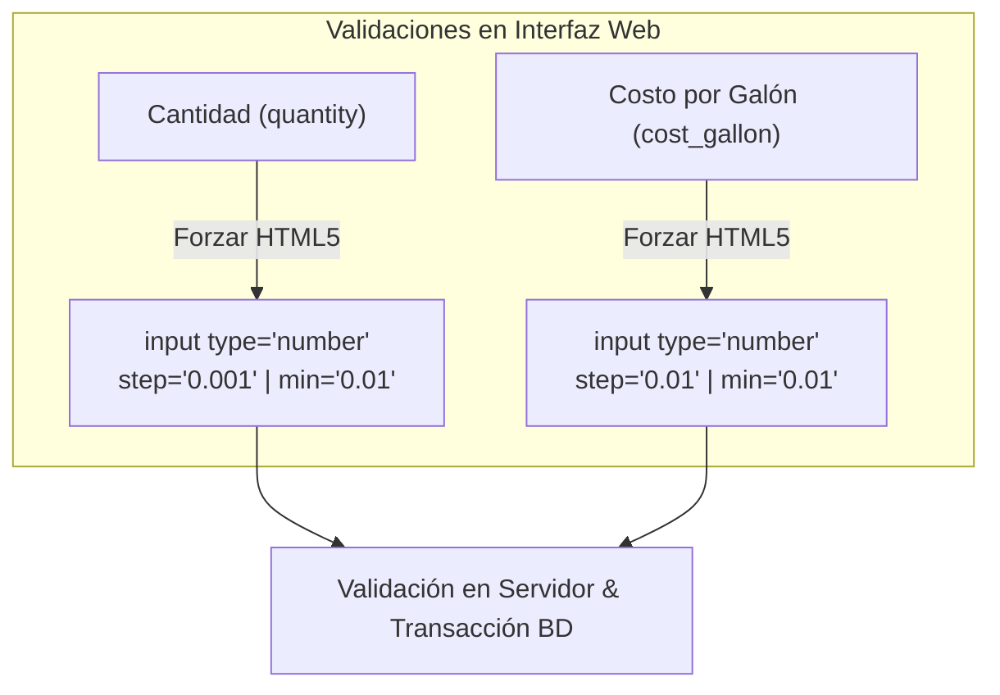
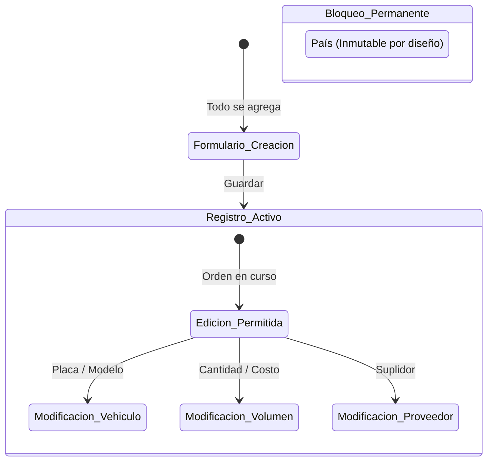

# Reglas de Negocio, Entradas y Operaciones CRUD en Estaciones de Combustible (*Fuel Station*)

> [!info] Documento Maestro de Referencia
> Para consultar el modelo entidad-relación formal y los diagramas de arquitectura del sistema, referirse a:
> 👉 **[[Especificacion del sistema de estacion de combustible|Especificación Formal del Sistema de Estación de Combustible (SRS)]]**

## Notas relacionadas
- [[Especificacion del sistema de estacion de combustible|Documento Maestro SRS - Estación de Combustible]]
- [[Requerimientos de Interfaz y Datos (Modulo de Combustible)|Requerimientos de Interfaz y Módulo de Órdenes]]
- [[software 2|Ingeniería de Software II]]
- [[pruebas de usabilidad|Pruebas de Usabilidad e Interfaz]]

---

## 1. Reglas de Validación de Entrada de Datos (*Data Inputs*)

1. **Tipado Estricto de Cantidad y Costo de Galón:**
   - Tanto la variable de volumen (`quantity`) como la tarifa monetaria (`cost_gallon`) deben forzarse en la interfaz como controles numéricos (`input type="number"`).
   - Se debe prevenir activamente el ingreso de texto, caracteres especiales o números negativos.
2. **Cálculo Reactivo del Total:**
   - La interfaz debe actualizar dinámicamente el valor total a liquidar en pantalla tan pronto como el operador modifique la cantidad o el costo:
     $$\text{Total} = \text{Cantidad} \times \text{Costo por Galón}$$

---

## 2. Flujo de Activación y Asociación de Vehículos

### 2.1 Flujo de Ingreso de Usuario Nuevo
* Cuando un operador o despachador ingresa al sistema por primera vez (*usuario nuevo*), el sistema debe presentar una vista de bienvenida y configuración de turno donde se valida su identidad y se asignan los surtidores e islas autorizadas antes de habilitar el ingreso de órdenes de combustible.

### 2.2 Requerimiento de Asociación de Vehículo
* **Aparición y Selección del Vehículo:**
  - En la interfaz de despacho es obligatorio que el vehículo receptor del combustible aparezca explícitamente en pantalla.
  - El sistema debe implementar un selector con búsqueda en tiempo real por número de placa.
  - Si el vehículo no se encuentra registrado en el sistema, la interfaz debe desplegar un flujo rápido para registrar el nuevo automotor (placa, marca, modelo y tipo de vehículo) sin abandonar el formulario de la orden en curso.

---

## 3. Matriz de Permisos de Edición y Regla de Inmutabilidad (*CRUD*)

> [!warning] Regla Fundamental de Inmutabilidad del País
> **"Todo se agrega y todo se edita; pero NO se edita el país."**
> 
> * **Justificación de Arquitectura:** 
>   - La sede de la estación y su jurisdicción nacional determinan las reglas fiscales de liquidación de impuestos sobre combustibles (sobretasa a la gasolina, IVA, regulaciones de hidrocarburos) y las unidades volumétricas oficiales (galones vs litros).
>   - Modificar arbitrariamente el país en un registro provocaría inconsistencias irreversibles en la base de datos contable y tributaria.
> * **Regla de Operación:** 
>   - Los campos de cantidades, costos, proveedores, tanques y datos vehiculares pueden agregarse y editarse libremente según los privilegios del rol.
>   - El campo `País` se mantiene en estado de solo lectura (*read-only / disabled*) y nunca admite edición desde ningún formulario de la aplicación.