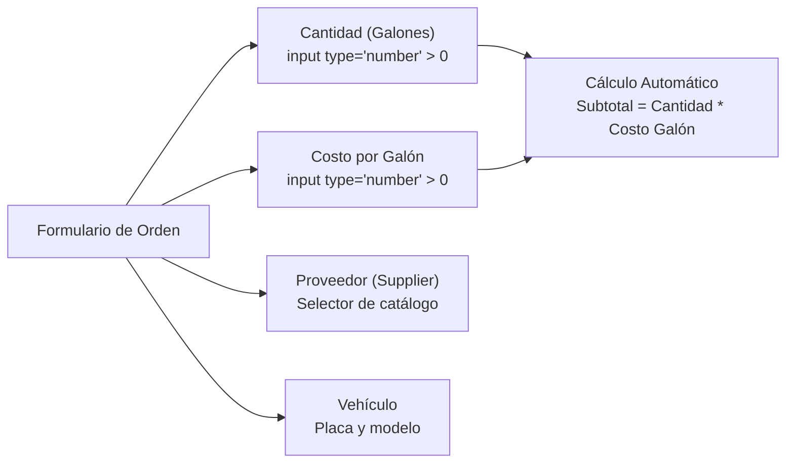

# Requerimientos de Interfaz y Datos: Módulo de Órdenes y Despacho (*Fuel Station*)

> [!info] Documento Consolidado Maestro
> La especificación técnica completa y formal conforme al estándar IEEE 830 se encuentra en:
> 👉 **[[Especificacion del sistema de estacion de combustible|Especificación Formal del Sistema de Estación de Combustible (SRS)]]**

## Notas relacionadas
- [[Especificacion del sistema de estacion de combustible|Documento Maestro SRS - Estación de Combustible]]
- [[Reglas de Negocio y Operaciones CRUD en Estaciones de Combustible|Reglas de Negocio y Operaciones CRUD en Estaciones de Combustible]]
- [[proyectos|Gestión de Proyectos]]
- [[software 2|Ingeniería de Software II]]
- [[pruebas de usabilidad|Pruebas de Usabilidad]]

---

## 1. Especificación de Campos del Formulario de Orden (*Order Form*)

El formulario principal de despacho y generación de pedidos (*Order*) captura los siguientes atributos con validación obligatoria:

1. **Cantidad (`quantity`):** 
   - Campo numérico obligatorio (`input type="number"` con `step="any"`).
   - Representa el volumen de combustible despachado en galones.
   - Restricción: Debe ser un valor estrictamente positivo mayor que cero y no puede superar la disponibilidad física del tanque subterráneo.
2. **Costo por Galón (`cost_gallon`):**
   - Campo numérico con formato monetario (`input type="number"` con `step="0.01"`).
   - Tarifa aplicable por galón; precargada automáticamente según la tarifa configurada para la estación.
3. **Orden (`order`):**
   - Identificador numérico correlativo autogenerado por el sistema para auditoría y facturación.
4. **Proveedor (`supplier`):**
   - Selector relacional vinculado al catálogo maestro de distribuidores mayoristas de combustible.
5. **Vehículo:**
   - Selección dinámica o creación en línea del vehículo receptor del despacho.

---

## 2. Requerimiento de Visualización Integral: Vista "Ver / Más Detalles" (*More Details*)

> [!important] Regla de Visualización Completa
> **En la vista de detalle ("Ver / More Details"), todos los campos del registro deben ser visibles sin truncamiento:**
> - Identificador unívoco de la orden.
> - Fecha y hora exacta de la transacción.
> - Placa y descripción del vehículo despachado.
> - Cantidad exacta de galones suministrados.
> - Costo unitario por galón.
> - Subtotal e importe total a cobrar.
> - Nombre y datos del proveedor mayorista (*supplier*).
> - Identificador del tanque y código del surtidor.
> - Operador de pista responsable del turno.
> - País y sede de la estación (inmutables).

Esta vista de detalle garantiza la trazabilidad contable y previene discrepancias entre los arqueos físicos de combustible y las ventas reportadas en caja.
