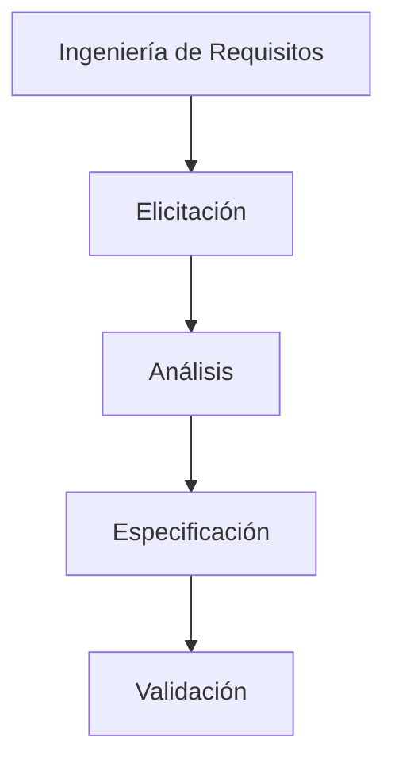

# Requisitos de Software

La Ingeniería de Requisitos es el proceso de descubrir, analizar, documentar y verificar los servicios que debe proporcionar el sistema y las restricciones bajo las cuales debe operar.

## Tipos de Requisitos

Existen principalmente tres niveles y tipos de requerimientos:

1. **Requerimientos de Negocio:** Declaraciones de alto nivel sobre las metas y objetivos de la organización que el sistema debe ayudar a alcanzar.
2. **Requerimientos Funcionales:** Describen lo que el sistema *debe hacer*. Detallan los servicios, reacciones a entradas específicas y el comportamiento del sistema en situaciones particulares.
3. **Requerimientos No Funcionales:** Describen *cómo* el sistema debe hacerlo. Son restricciones sobre los servicios ofrecidos, como los atributos de calidad (desempeño, seguridad, fiabilidad) detallados en [[CARACTERÍSTICAS DE CALIDAD DE UN PRODUCTO DE SOFTWARE]].

## Técnicas de Elicitación
La elicitación (extracción o descubrimiento) es la primera fase para obtener requerimientos. Algunas técnicas incluyen:
* **Entrevistas:** Conversaciones formales o informales con los *stakeholders* o usuarios finales.
* **Cuestionarios o Encuestas:** Útiles para recolectar información de una gran cantidad de usuarios.
* **Observación (Etnografía):** Observar cómo trabajan los usuarios en su entorno real.
* **Talleres (Workshops):** Sesiones de trabajo conjunto (ej. JAD - Joint Application Design).
* **Historias de Usuario:** Usadas en metodologías ágiles. Permiten capturar un requerimiento desde la perspectiva del valor que aporta al usuario (ver [[historias de usuario]]).

## Especificación y Validación
La especificación formal (como el documento SRS o Especificación de Requerimientos de Software) sirve como contrato. Estos requerimientos deben ser validados para comprobar que sean **completos, consistentes, verificables (testeables) y no ambiguos**.

> [!info] Explicación: Requisitos y Pruebas
> Los requisitos funcionales son la base de las **pruebas funcionales y de aceptación**, mientras que los requisitos no funcionales son la base de las **pruebas de carga, estrés y seguridad**. Si un requerimiento no se puede probar de manera objetiva, entonces está mal definido.

## Notas relacionadas
- [[El proceso de software]]
- [[Actividades del proceso de software]]
- [[CARACTERÍSTICAS DE CALIDAD DE UN PRODUCTO DE SOFTWARE]]
- [[historias de usuario]]

## Diagrama de Referencia

