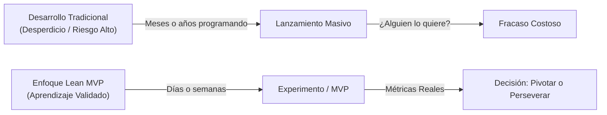
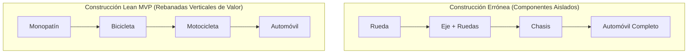
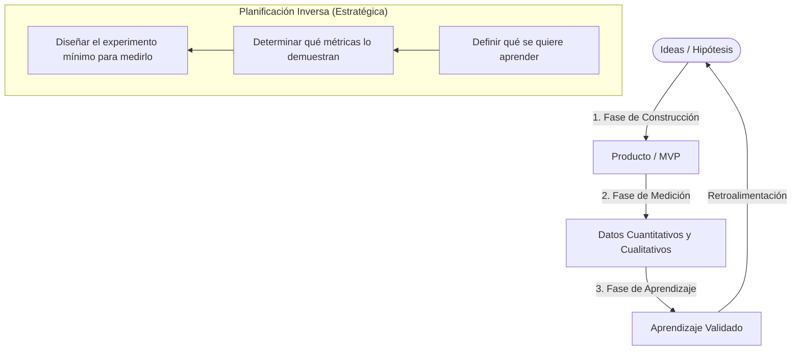
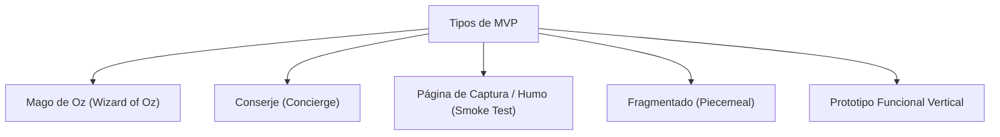
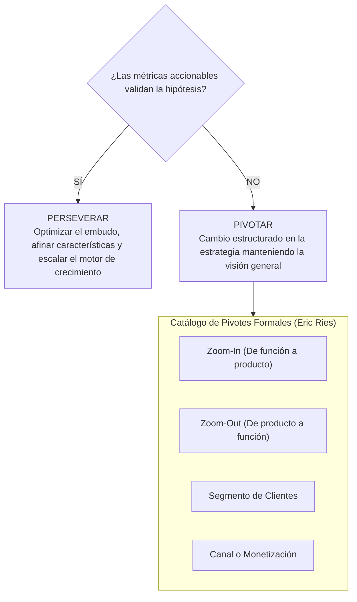

# Producto Mínimo Viable (MVP) y Metodología Lean Startup

El concepto de **Producto Mínimo Viable (MVP)** (*Minimum Viable Product*) fue acuñado originalmente por **Frank Robinson** en 2001 y popularizado masivamente como pilar metodológico del desarrollo ágil y emprendimiento por **Eric Ries** en *The Lean Startup* (2011) y **Steve Blank** en el marco de Desarrollo de Clientes (*Customer Development*).

---

## 1. Definición Formal y Propósito Central

Según **Eric Ries**, el Producto Mínimo Viable se define rigurosamente como:
> *"Aquella versión de un nuevo producto que permite a un equipo recolectar la máxima cantidad de aprendizaje validado sobre los clientes con la menor cantidad de esfuerzo y recursos invertidos."*

### 1.1. Principio Fundamental: Aprendizaje Validado
A diferencia del desarrollo de software tradicional, donde el éxito se evalúa por la entrega puntual dentro del presupuesto y alcance prefijados, en situaciones de **alta incertidumbre de mercado** (startups y nuevos productos digitales), el objetivo supremo no es construir software a ciegas, sino **aprender con rapidez científica si existe demanda real y un modelo de negocio sostenible**.

### 1.2. Desmitificación del MVP: Lo que es y lo que no es
- **NO es un producto roto o de mala calidad:** Un MVP deficiente que falle continuamente genera rechazo inmediato y distorsiona las métricas de aprendizaje.
- **NO es la primera fase de una arquitectura fragmentada:** Según el célebre modelo de **Henrik Kniberg**, no se debe entregar una rueda, luego dos ruedas y un chasis para llegar a un automóvil. Se entrega primero un monopatín (*skateboard*), luego una bicicleta, luego una motocicleta y finalmente un automóvil. Cada iteración es **un producto completo, funcional y usable** que satisface la necesidad de transporte.

> [!tip] La Rebanada Vertical (*Vertical Slice*)
> Un MVP equilibrado debe cortar transversalmente todas las capas del producto: debe ser **viable** (funcional básico), **confiable** (no falla), **usable** (experiencia intuitiva) y tener cierto **deleite/diseño** emocional, en lugar de ser 100% funcional pero 0% usable.

---

## 2. El Ciclo Fundamental: Construir - Medir - Aprender (*Build - Measure - Learn*)

El motor central del método Lean Startup es el bucle de retroalimentación de información:

### 2.3. La Paradoja de Planificación vs. Ejecución
- **En la ejecución:** Se transita secuencialmente: **Construir $\rightarrow$ Medir $\rightarrow$ Aprender**.
- **En la planificación estratégica:** Se planifica rigurosamente en orden inverso:
  1. **¿Qué necesitamos aprender?** (Formulación explícita de la hipótesis de valor o crecimiento).
  2. **¿Qué datos y métricas nos dirán si la hipótesis es cierta o falsa?**
  3. **¿Cuál es el artefacto mínimo (MVP) que necesitamos construir para capturar esos datos?**

---

## 3. Tipos y Técnicas Experimentales de MVP

No todos los MVPs requieren codificar software desde cero. Existen patrones diseñados para reducir al mínimo el costo de desarrollo:

### 3.1. MVP Mago de Oz (*Wizard of Oz / Flinstoning*)
El usuario experimenta una interfaz digital completamente verosímil y aparentemente automatizada, pero todas las operaciones lógicas, algoritmos o logísticas tras bambalinas son **ejecutadas manualmente por humanos**.
- **Caso Emblemático:** Nick Swinmurn fundó **Zappos** (comercio electrónico de calzado) yendo a zapaterías físicas locales, fotografiando los zapatos, publicándolos en una web simple y, cuando alguien compraba, iba a la tienda, compraba el par a precio minorista y lo enviaba por correo. Validó si la gente estaba dispuesta a comprar calzado por internet sin almacenes ni logística compleja.

### 3.2. MVP Conserje (*Concierge MVP*)
La propuesta de valor se entrega de forma 100% manual, personalizada y cara a cara al cliente, haciendo explícito que no existe software automatizado en esa fase.
- **Caso Emblemático:** Manuel Rosso con **Food on the Table** (planificación de menús y compras según ofertas de supermercados locales). Visitaba personalmente a las familias en sus hogares, revisaba sus gustos, buscaba manualmente las ofertas en periódicos locales y les entregaba las recetas impresas a cambio de una suscripción de $10/mes antes de contratar desarrolladores para codificar la plataforma.

### 3.3. MVP de Prueba de Humo / Página de Captura (*Smoke Test / Landing Page MVP*)
Consiste en una página web promocional (*landing page*) que presenta la propuesta de valor del producto inexistente con un botón de llamada a la acción (*Call to Action - CTA*), como "Pre-ordenar", "Comprar ahora" o "Acceso anticipado".
- **Objetivo:** Si el usuario hace clic, se le muestra un mensaje informándole que el producto está en fase de despliegue y se solicita su correo electrónico. Mide la **tasa de intención de compra real** y valida el interés antes de escribir una sola línea de código backend.
- **Caso Emblemático:** Joel Gascoigne validó la herramienta de programación de redes sociales **Buffer** con una landing page de dos páginas con botones de precios falsos antes de programar la integración con Twitter.

### 3.4. MVP Fragmentado (*Piecemeal MVP*)
Entrega el servicio combinando e integrando herramientas de software existentes de terceros (Google Sheets, Typeform, Zapier, Airtable, WordPress, WhatsApp Business, Stripe) sin desarrollar arquitectura propietaria.
- **Caso Emblemático:** En sus inicios, **Groupon** consistía en un blog simple de WordPress donde se publicaban ofertas diarias y se generaban cupones en formato PDF que los fundadores enviaban manualmente por correo electrónico usando AppleScript.

### 3.5. Prototipos Funcionales Verticales
Desarrollo de una versión operativa básica de software con alcance restringido a un único flujo de usuario principal (*happy path*), destinada a pruebas directas en entornos reales.

---

## 4. Métricas Vanidosas vs. Métricas Accionables

Eric Ries enfatiza la necesidad crítica de distinguir entre números que alimentan el ego y datos que orientan decisiones de ingeniería y negocio:

| Criterio | Métricas Vanidosas (*Vanity Metrics*) | Métricas Accionables (*Actionable Metrics*) |
| :--- | :--- | :--- |
| **Definición** | Datos cuantitativos acumulativos que siempre crecen y lucen impresionantes, pero no revelan comportamientos de valor ni causas de éxito. | Indicadores que vinculan directamente causas operativas con efectos reales en el cliente, permitiendo tomar decisiones claras. |
| **Ejemplos Comunes** | - Visitas totales a una página web. - Número acumulado de descargas de la app. - Cantidad de usuarios registrados (que nunca regresaron). - Seguidores y "Likes" en redes sociales. | - Costo de Adquisición de Clientes (**CAC**). - Valor de Vida del Cliente (**LTV**). - Tasa de Conversión (*Conversion Rate*). - Tasa de Retención por Cohortes. - Tasa de Abandono (*Churn Rate*). |
| **Utilidad** | Generan falsa seguridad y distraen de los problemas estructurales. | Permiten evaluar científicamente si un experimento de producto mejoró o empeoró el sistema. |

### 4.1. Fórmulas Económicas Clave en la Evaluación de un MVP
1. **Costo de Adquisición de Clientes (CAC):**
   $$\text{CAC} = \frac{\text{Gasto Total en Marketing y Ventas}}{\text{Número de Nuevos Clientes Adquiridos}}$$
2. **Valor del Tiempo de Vida del Cliente (LTV):**
   $$\text{LTV} = \frac{\text{Ingreso Promedio por Usuario (ARPU)} \times \text{Margen Bruto}}{\text{Tasa de Abandono (Churn Rate)}}$$
   > [!important] Regla de Sostenibilidad Económica
   > Para que un modelo de negocio de software sea escalable y viable:
   > $$\text{LTV} \ge 3 \times \text{CAC}$$
   > Y el tiempo de recuperación del CAC (*Payback Period*) debe ser inferior a 12 meses.

3. **Análisis de Cohortes (*Cohort Analysis*):**
   Agrupa a los usuarios que se registraron en la misma semana o mes y analiza su retención porcentual a lo largo del tiempo (Día 1, Día 7, Día 30, Día 90). Si la curva de retención se aplana en un porcentaje positivo constante, existe **Product-Market Fit** (Ajuste Producto-Mercado).

---

## 5. La Decisión Estratégica: Pivotar o Perseverar

Al concluir cada iteración del bucle Construir-Medir-Aprender, el equipo llega a una reunión de revisión estratégica para decidir entre dos caminos:

### 5.1. Perseverar
Ocurre cuando los datos empíricos corroboran que el producto genera valor y retención. El equipo mantiene la hipótesis central y se enfoca en optimizar el embudo de conversión, refinar la interfaz y escalar el motor de adquisición.

### 5.2. Pivotar
Un **Pivote** es una corrección estructurada diseñada para probar una nueva hipótesis fundamental sobre el producto, el modelo de negocio o el motor de crecimiento, **sin abandonar la visión general de la empresa**.

#### Tipos de Pivote Formales:
1. **Pivote Zoom-In:** Una única característica secundaria del producto original se convierte en la totalidad del nuevo producto (ej. Instagram nació como *Burbn*, una app compleja de check-ins con fotos; eliminaron todo excepto el filtro y compartir fotos).
2. **Pivote Zoom-Out:** Lo que antes era el producto completo pasa a ser solo un módulo o característica dentro de una plataforma más amplia.
3. **Pivote de Segmento de Clientes:** El producto resuelve una necesidad real, pero el cliente objetivo inicial no es quien está dispuesto a pagar; se reenfoca a otro grupo demográfico o a B2B en lugar de B2C.
4. **Pivote de Necesidad del Cliente:** Al conocer a fondo al usuario, se descubre que el problema original era trivial, pero existe otro problema adyacente mucho más grave y rentable de resolver.
5. **Pivote de Plataforma:** Transición de una aplicación cerrada a una plataforma abierta que permite a terceros crear sus propios servicios sobre ella.
6. **Pivote de Modelo de Negocio (Monetización):** Cambio entre modelos freemium, suscripción mensual (SaaS), comisión por transacción o licenciamiento empresarial.
7. **Pivote de Canal:** Modificación del mecanismo de entrega del producto (ej. de venta directa consultiva a distribución digital automatizada self-service).
8. **Pivote de Tecnología:** Implementación de una nueva pila tecnológica para sostener el mismo servicio con mejor rendimiento, menores costos de servidor o mayor escalabilidad.

---

## Notas relacionadas
- [[proyectos]]
- [[pruebas de usabilidad]]
- [[design thinking]]
- [[software 2]]
- [[kanban]]
- [[scrum]]
- [[Interes]]
- [[ecosistema de emprendimiento]]
- [[emprendimiento]]
