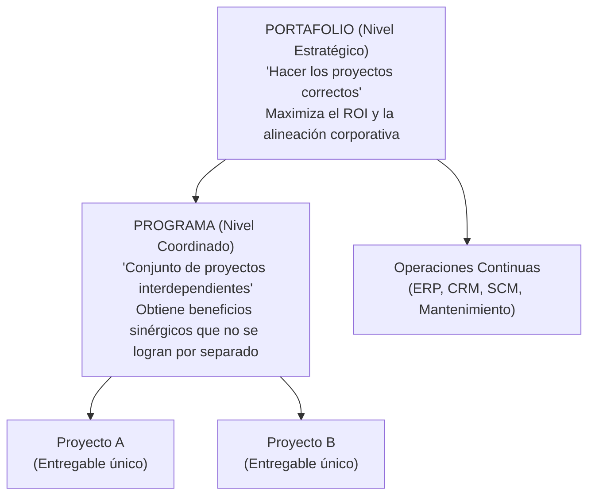
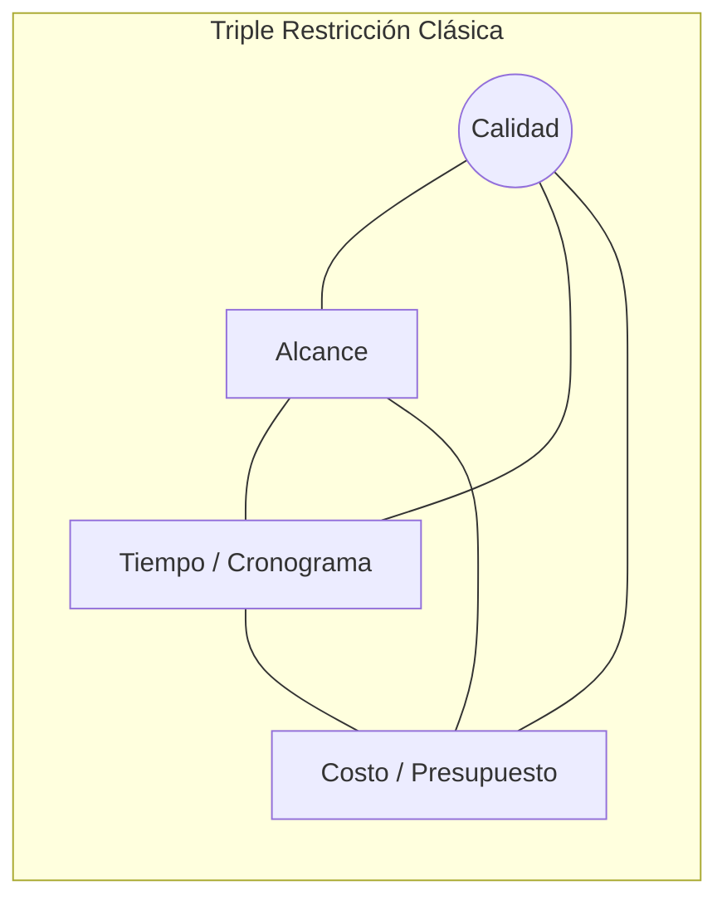
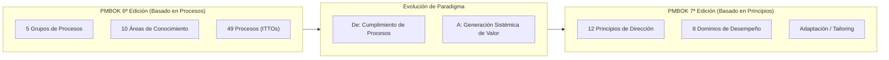
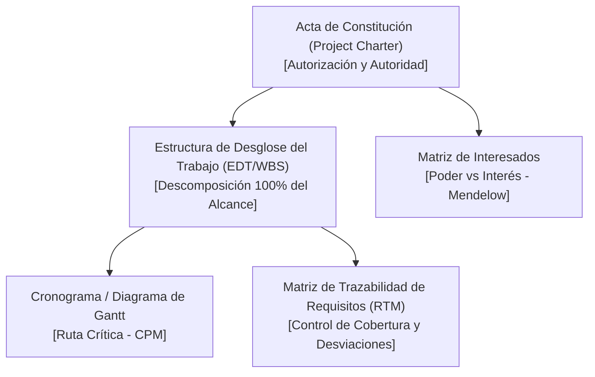
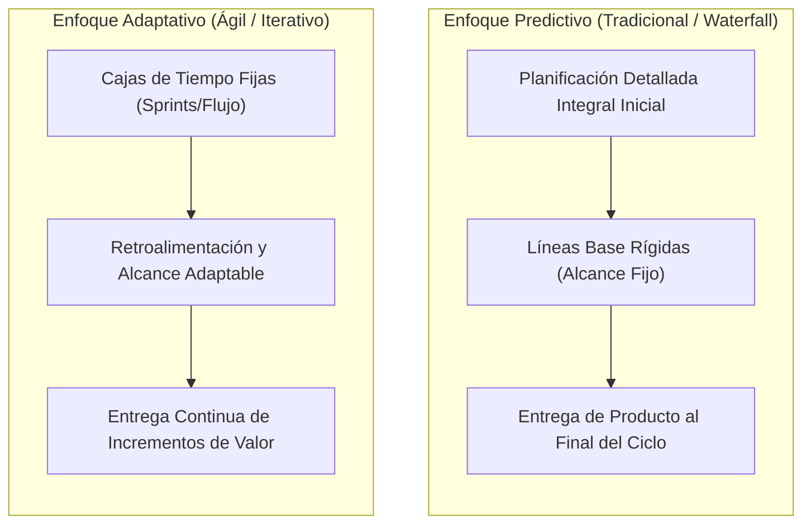

# Gestión y Dirección de Proyectos: Marco PMI y PMBOK

La **Gestión y Dirección de Proyectos** (*Project Management*) es la disciplina de aplicar conocimientos, habilidades, herramientas y técnicas a las actividades del proyecto para cumplir con los requisitos del mismo y generar valor sostenible para la organización. El estándar internacional de referencia es establecido por el **Project Management Institute (PMI)** a través de la guía del **PMBOK** (*Project Management Body of Knowledge*).

---

## 1. Definición Formal y Fundamentos de un Proyecto

Según el PMI (PMBOK), un **Proyecto** se define formalmente como:
> *"Un esfuerzo temporal que se lleva a cabo para crear un producto, servicio o resultado único."*

### 1.1. Características Distintivas
- **Temporalidad:** Todo proyecto posee un inicio claramente definido y una fecha de finalización determinada (cuando se logran los objetivos, se agota el financiamiento o se cancela). No es un proceso continuo ni una operación rutinaria.
- **Unicidad:** El entregable o resultado final es singular; no se ha ejecutado de forma idéntica con anterioridad en las mismas condiciones y contexto.
- **Elaboración Progresiva:** Los detalles del alcance y los planes se refinan incrementalmente a medida que se obtiene mayor información y se disipa la incertidumbre técnica o de mercado.
- **Generación de Valor:** Impulsa el cambio de un estado actual insatisfactorio a un estado futuro deseado, generando beneficios tangibles (financieros, infraestructura) o intangibles (marca, propiedad intelectual).

### 1.2. Jerarquía Organizacional: Portafolio, Programa y Proyecto
La gobernanza corporativa estructura las iniciativas de inversión en tres niveles estratégicos:

- **Portafolio:** Colección de proyectos, programas, operaciones y carteras subsidiarias agrupados para facilitar la dirección eficaz de ese trabajo en pos de alcanzar los **objetivos estratégicos** del negocio. Su mandato es: *"Ejecutar los proyectos correctos"*.
- **Programa:** Grupo de proyectos relacionados y coordinados de manera armónica para obtener beneficios y sinergias que no se obtendrían si se gestionaran de forma individual. Si un proyecto pierde su condición de temporalidad y opera indefinidamente sin fin acotado, transiciona a convertirse en un programa u operación continua.
- **Proyecto:** Unidad operativa y táctica orientada al desarrollo del producto o servicio específico. Su mandato es: *"Ejecutar los proyectos correctamente"*.
- **Sistemas de Información Empresarial:** En la operativa y soporte de proyectos convergen plataformas transversales de gestión como **ERP** (*Enterprise Resource Planning*), **CRM** (*Customer Relationship Management*), **SCM** (*Supply Chain Management*) y **PMIS** (*Project Management Information System*).

---

## 2. Las Restricciones del Proyecto: Del Triángulo de Hierro a la Restricción Séxtuple

Todo proyecto opera bajo fronteras y presiones interdependientes. Modificar cualquiera de estas variables desestabiliza forzosamente a las demás:

### 2.1. La Triple Restricción Clásica (Triángulo de Hierro)
Históricamente descrita como el equilibrio entre:
1. **Alcance (*Scope*):** El trabajo requerido para entregar el producto con las características solicitadas.
2. **Tiempo / Cronograma (*Time*):** El plazo calendario total para la consecución de los hitos y cierre.
3. **Costo / Presupuesto (*Cost*):** Los recursos económicos y financieros asignados.
- *Calidad:* Operaba habitualmente en el centro como la resultante innegociable de este equilibrio.

### 2.2. La Restricción Séxtuple Moderna (PMBOK)
La gestión contemporánea de proyectos complejos expande este modelo a seis vectores interconectados:
1. **Alcance:** Requisitos funcionales y técnicos aprobados.
2. **Cronograma:** Secuencia temporal de actividades y ruta crítica.
3. **Presupuesto:** Flujo de caja, costos directos e indirectos.
4. **Calidad:** Estándares de excelencia, conformidad y adecuación al uso.
5. **Recursos:** Capacidad humana, equipos, licencias e infraestructura técnica.
6. **Riesgos:** Amenazas de desviación e incertidumbres externas e internas.

---

## 3. Marcos de Dirección: PMBOK 6ª vs. PMBOK 7ª Edición

El PMI evolucionó significativamente su marco conceptual entre la 6ª y la 7ª edición, transitando desde un enfoque prescriptivo basado en procesos hacia un modelo holístico fundamentado en principios y entrega de valor.

### 3.1. PMBOK 6ª Edición: Enfoque de Procesos
Estructura el ciclo de vida en **5 Grupos de Procesos**:
1. **Inicio (*Initiating*):** Definición formal de un nuevo proyecto o fase, autorización oficial y asignación del director mediante el Acta de Constitución (*Project Charter*).
2. **Planificación (*Planning*):** Determinación del alcance total, definición de objetivos y diseño de las líneas base (alcance, cronograma, costo).
3. **Ejecución (*Executing*):** Coordinación de personas y recursos para implementar el plan de gestión del proyecto.
4. **Monitoreo y Control (*Monitoring & Controlling*):** Medición periódica del desempeño, detección de variaciones y aplicación de acciones correctivas o preventivas.
5. **Cierre (*Closing*):** Aceptación formal de los entregables, transferencia del producto al cliente u operaciones, liberación de recursos y registro de lecciones aprendidas.

#### Puntos de Decisión: Phase Gates y Killing Points
En cada transición de fase se ejecutan compuertas de decisión (**Phase Gates**, *Stage Gates* o **Killing Points**):
- Instancias formales donde el comité directivo evalúa si el proyecto continúa cumpliendo su justificación de negocio (*Business Case*).
- Si las condiciones cambiaron drásticamente, los sobrecostos son insostenibles o el objetivo estratégico quedó obsoleto, se procede a la **cancelación controlada del proyecto** (*killing point*), evitando dilapidar capital en costos hundidos.
- **Análisis Post-Mortem y Evaluación Posterior (6 a 18 meses):** Tras el cierre y despliegue operativo, se audita el proyecto para medir la materialización real del Retorno de Inversión (ROI) y garantizar los **Planes de Continuidad del Negocio (BCP)**.

### 3.2. PMBOK 7ª Edición: Los 8 Dominios de Desempeño
La 7ª edición define el desempeño a través de ocho dominios interactivos:
1. **Interesados (*Stakeholders*):** Relacionamiento constructivo y alineación de expectativas con todas las partes afectadas.
2. **Equipo (*Team*):** Fomento del liderazgo colaborativo, clima de confianza y desarrollo de competencias.
3. **Enfoque de Desarrollo y Ciclo de Vida (*Development Approach & Lifecycle*):** Selección adecuada del modelo (predictivo, iterativo, incremental, ágil o híbrido).
4. **Planificación (*Planning*):** Coordinación proactiva y adaptación continua del plan de trabajo.
5. **Trabajo del Proyecto (*Project Work*):** Gestión del flujo operativo, adquisición de suministros y mitigación de cuellos de botella.
6. **Entrega (*Delivery*):** Foco estricto en la materialización de valor y calidad de los entregables tangibles.
7. **Medición (*Measurement*):** Evaluación del desempeño mediante métricas cuantitativas e indicadores clave (KPIs, Valor Ganado / EVM).
8. **Incertidumbre (*Uncertainty*):** Identificación, evaluación y respuesta ante la volatilidad, ambigüedad y riesgos.

---

## 4. Artefactos y Documentos Esenciales de Gestión

### 4.1. Acta de Constitución del Proyecto (*Project Charter*)
Documento formal emitido por el patrocinador (*sponsor*) que autoriza oficialmente la existencia del proyecto. Otorga al Director de Proyecto (*Project Manager*) la autoridad para asignar recursos de la organización.
- **Contenido obligatorio:** Propósito y justificación de negocio, objetivos medibles, requisitos de alto nivel, presupuesto inicial preasignado, principales hitos (*milestones*), supuestos, restricciones y lista inicial de interesados clave.

### 4.2. Estructura de Desglose del Trabajo (EDT / WBS - Work Breakdown Structure)
Descomposición jerárquica y orientada a entregables del trabajo total que debe ejecutar el equipo del proyecto.
- **Regla del 100%:** La EDT debe incluir el 100% del trabajo definido en el alcance y nada que esté por fuera de él (*Out-of-Scope*).
- **Paquetes de Trabajo (*Work Packages*):** Nivel inferior de la jerarquía; unidades de trabajo asignables a un responsable con estimación precisa de costo y duración.
- **Diccionario de la EDT:** Documento de respaldo que describe detalladamente el contenido de cada paquete de trabajo, sus criterios de aceptación y entregables vinculados.

### 4.3. Cronograma, Diagrama de Gantt y Método de la Ruta Crítica (CPM)
- **Diagrama de Gantt:** Representación gráfica en barras horizontales que vincula actividades a lo largo de una línea temporal con sus dependencias.
- **Método de la Ruta Crítica (CPM - *Critical Path Method*):** Secuencia de actividades dependientes que determina la **duración mínima total del proyecto**. Las actividades sobre la ruta crítica tienen **holgura cero** ($\text{Holgura} = 0$); cualquier retraso en una de ellas retrasa la fecha de entrega final del proyecto.

### 4.4. Matriz de Interesados (*Stakeholder Analysis* - Matriz de Mendelow)
Clasifica a los actores en función de su nivel de **Poder** (capacidad de influir o alterar el proyecto) e **Interés** (nivel de preocupación o impacto percibido):

| Nivel de Interés \ Nivel de Poder | Bajo Poder | Alto Poder |
| :--- | :--- | :--- |
| **Alto Interés** | **Mantener Informado** (Comunicación fluida y transparente para mantener su apoyo). | **Gestionar de Cerca** (Máxima prioridad; involucrar en decisiones clave y co-diseño). |
| **Bajo Interés** | **Monitorear** (Mínimo esfuerzo de supervisión periódica). | **Mantener Satisfecho** (Atender inquietudes sin saturar de detalles operativos). |

### 4.5. Matriz de Trazabilidad de Requisitos (RTM - *Requirements Traceability Matrix*)
Tabla formal que mapea cada requerimiento individual de usuario/cliente desde su origen comercial hasta su diseño técnico, paquete de trabajo de la EDT, código fuente y casos de prueba de aceptación.
- **Objetivo técnico:** Garantizar que ningún requerimiento quede huérfano (sin implementar) ni se agregue funcionalidad no requerida (*Gold Plating* o *Scope Creep*).

---

## 5. Comparación de Enfoques: Predictivo (Cascada) vs. Adaptativo (Ágil)

| Dimensión | Enfoque Predictivo / Tradicional (Cascada) | Enfoque Adaptativo / Ágil (Scrum / Kanban) |
| :--- | :--- | :--- |
| **Premisa Fundamental** | El futuro es planificable; el alcance puede especificarse con certeza al inicio. | Alta incertidumbre; el producto se descubre iterativamente con el cliente. |
| **Triángulo Invertido** | **Alcance fijo**; Tiempo y Costo estimados / variables. | **Tiempo y Costo fijos**; Alcance variable priorizado por valor. |
| **Gestión del Cambio** | El cambio es costoso y se resiste mediante un Comité de Control de Cambios (CCB). | El cambio es bienvenido como ventaja competitiva para el cliente. |
| **Entregable** | Despliegue único al final de la fase de cierre. | Entregables parciales funcionales al final de cada iteración ([[producto minimo viable|MVP]]). |
| **Adecuación Técnica** | Requerimientos estables y tecnología conocida (ej. infraestructura, construcción). | Software innovador, startups, entornos de rápido cambio de mercado. |

---

## Notas relacionadas
- [[Metodo de la Ruta Critica (CPM) y Tecnica PERT]]
- [[Software 2/Estimación de software|Estimación de software]]
- [[producto minimo viable]]
- [[tdr terminos de refencia]]
- [[software 2]]
- [[kanban]]
- [[scrum]]
- [[Interes]]
- [[pruebas de usabilidad]]
- [[linea base]]
