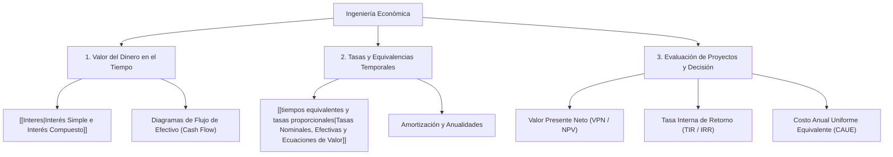

# Ingeniería Económica (Fundamentos y Evaluación Financiera)

> [!info] 💡 ¿Qué es la Ingeniería Económica y su rol en la Computación?
> La **Ingeniería Económica** es el conjunto de conceptos y técnicas matemáticas y financieras aplicadas para evaluar la viabilidad económica de proyectos de ingeniería, comparar alternativas tecnológicas y optimizar la asignación de capital. En la industria del software y sistemas computacionales, es indispensable para la formulación del caso de negocio (*Business Case*), análisis costo-beneficio de migraciones a la nube (CapEx vs OpEx), y cálculo del retorno sobre la inversión (ROI).

---

## 🗺️ Mapa de Contenidos de la Materia (MOC)

---

## 📚 Estructura Temática de las Notas

### 1. Valor del Dinero en el Tiempo e Interés
- **[[Interes]]:** Principio fundamental del costo de oportunidad del capital, deducción matemática del Interés Simple ($I = P \cdot i \cdot n$) e Interés Compuesto ($F = P(1+i)^n$), capitalización discreta y valor presente descontado.

### 2. Equivalencias Financieras y Tasas
- **[[tiempos equivalentes y tasas proporcionales]]:** Conversión rigurosa entre tasas de interés nominales ($j$) y tasas efectivas ($i$), cálculo de periodos fraccionarios, fecha focal y resolución de ecuaciones de valor para reestructuración de deudas y flujos de caja diferidos.

---

## 🔗 Conexión con la Gestión y el Desarrollo Tecnológico
- **[[Gestion de TICs/Capitulo 1 - Fundamentos de la Empresa, Organizacion y TICs|Fundamentos de la Empresa y TICs]]:** Recursos financieros, ROI tecnológico y modelos de costes IT.
- **[[Software 2/Estimación de software|Estimación de Software y Costes]]:** Modelos COCOMO, Puntos de Función y presupuestación financiera de proyectos.
- **[[Cloud Computing AWS]]:** Análisis financiero TCO (*Total Cost of Ownership*) y transición de gastos de capital (CapEx) a gastos operativos elásticos (OpEx / FinOps).
