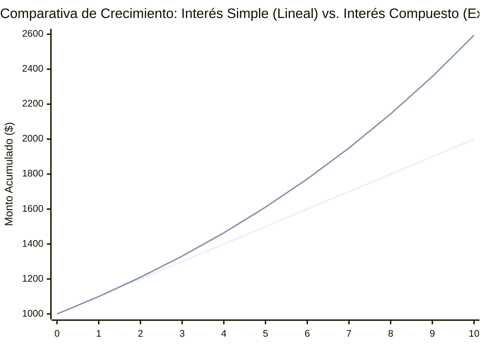
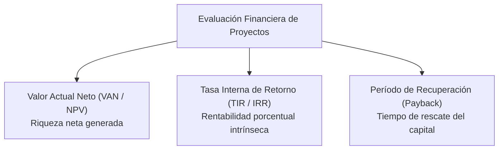
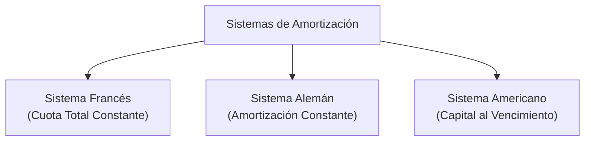

# Fundamentos de Ingeniería Económica: Interés Simple, Compuesto y Evaluación Financiera

La **Ingeniería Económica** y las **Matemáticas Financieras** proporcionan los modelos cuantitativos para la toma de decisiones sobre la asignación de recursos de capital en proyectos de ingeniería y tecnología. Su postulado axiomático es el **Valor del Dinero en el Tiempo (TVM - *Time Value of Money*)**:
> *Una unidad monetaria disponible hoy posee mayor valor económico real que la misma unidad monetaria recibida en el futuro*, debido a tres factores fundamentales:
> 1. **Costo de Oportunidad:** La capacidad del dinero disponible de ser invertido y generar rendimientos o intereses.
> 2. **Pérdida de Poder Adquisitivo:** El efecto erosivo de la **inflación** sobre los precios de la economía.
> 3. **Riesgo e Incertidumbre:** La posibilidad de que el flujo de efectivo futuro no llegue a materializarse.

El **Interés ($I$)** representa la compensación económica (o alquiler) que paga un prestatario por el uso del dinero prestado durante un plazo determinado, o la rentabilidad que percibe un inversionista por arriesgar su liquidez.

---

## 1. Interés Simple

### 1.1. Definición y Principio Operativo
En el **Interés Simple**, los intereses devengados en cada período temporal se calculan **exclusivamente sobre el capital principal inicial ($P$ o $C$)** concedido en préstamo.
- **Consecuencia intrínseca:** Los intereses devengados en períodos anteriores **no se acumulan al capital** (no se capitalizan). Por tanto, la cuota de interés devengada es idéntica y constante en todos y cada uno de los períodos.

### 1.2. Deducción Matemática Rigurosa
Sea:
- $P$ (o $C$): Capital inicial o Valor Presente.
- $i$: Tasa de interés periódica (expresada en tanto por uno, compatible con la unidad de tiempo de $n$).
- $n$: Número total de períodos de tiempo.
- $I_t$: Interés devengado en el período $t$.

Dado que el interés en cada período depende únicamente del capital original:
$$I_1 = I_2 = I_3 = \dots = I_n = P \cdot i \quad (1)$$

El interés total acumulado al cabo de $n$ períodos ($I$) es la suma de los intereses periódicos:
$$I = \sum_{t=1}^n I_t = I_1 + I_2 + \dots + I_n \quad (2)$$

Sustituyendo $(1)$ en $(2)$:
$$I = n \cdot I_1 = n \cdot (P \cdot i)$$

$$\mathbf{I = P \cdot i \cdot n}$$

### 1.3. Deducción del Valor Futuro (Monto) en Interés Simple
Por definición, el **Valor Futuro ($VF$ o $F$)** es la suma del capital inicial prestado más la totalidad de los intereses generados:
$$VF = P + I$$

Sustituyendo la fórmula de $I$:
$$VF = P + P \cdot i \cdot n$$

Factorizando el capital principal $P$:
$$\mathbf{VF = P(1 + i \cdot n)}$$

El término $(1 + i \cdot n)$ se denomina **factor lineal de acumulación simple**.

#### Despeje del Valor Presente ($VP$):
$$\mathbf{VP = \frac{VF}{1 + i \cdot n} = VF(1 + i \cdot n)^{-1}}$$

---

## 2. Interés Compuesto

### 2.1. Definición y Principio Operativo
En el **Interés Compuesto**, el interés devengado al final de cada período de capitalización **se suma automáticamente al capital anterior para formar un nuevo capital base** sobre el cual se calcularán los intereses del período subsiguiente.
- **Consecuencia intrínseca:** Los intereses **se capitalizan** (generan más intereses). La masa monetaria crece a un ritmo **exponencial o geométrico** a lo largo del tiempo.

### 2.2. Deducción Matemática Paso a Paso
Consideremos un capital inicial $P$ invertido a una tasa periódica $i$:

- **Al finalizar el período 1:**
  - Interés generado: $I_1 = P \cdot i$
  - Monto acumulado: $VF_1 = P + I_1 = P + P \cdot i = P(1 + i)$

- **Al finalizar el período 2:**
  - El nuevo capital base es $VF_1$.
  - Interés generado: $I_2 = VF_1 \cdot i = [P(1 + i)] \cdot i$
  - Monto acumulado: $VF_2 = VF_1 + I_2 = VF_1(1 + i) = [P(1 + i)](1 + i) = P(1 + i)^2$

- **Al finalizar el período 3:**
  - $VF_3 = VF_2(1 + i) = [P(1 + i)^2](1 + i) = P(1 + i)^3$

- **Por inducción matemática para el enésimo período ($n$):**
$$\mathbf{VF = VP(1 + i)^n}$$

Donde $(1 + i)^n$ es el **factor de acumulación compuesto (Factor F/P)**.

#### Despeje del Valor Presente ($VP$ o Factor P/F):
$$\mathbf{VP = \frac{VF}{(1 + i)^n} = VF(1 + i)^{-n}}$$

### 2.3. Tasa Nominal vs. Tasa Efectiva
- **Tasa Nominal Anual ($j$ o $r$):** Tasa de referencia convencional pactada formalmente que se capitaliza $m$ veces al año.
  $$\text{Tasa Periódica: } i = \frac{j}{m}$$
  *(ej. si $j = 12\%$ anual convertible mensualmente, $m = 12 \implies i = 1\%$ mensual).*
- **Tasa Efectiva Anual (EA o TEA):** Es la tasa que mide el rendimiento real generado en un año completo producto de las sucesivas capitalizaciones intermedias:
  $$\mathbf{EA = \left(1 + \frac{j}{m}\right)^m - 1 = (1 + i)^m - 1}$$

---

## 3. Criterios de Evaluación Financiera de Proyectos de Software e Inversión

En la formulación y evaluación económica de proyectos de ingeniería, los flujos de caja proyectados en el horizonte temporal deben descontarse para comparar alternativas de inversión con rigor:

### 3.1. Valor Actual Neto (VAN / NPV - Net Present Value)
El VAN traslada todos los flujos netos de caja futuros ($FC_t$) al instante presente ($t=0$) utilizando una tasa de descuento $k$ (Costo de Oportunidad del Capital o WACC) y resta la inversión inicial ($I_0$):

$$\mathbf{VAN = \sum_{t=1}^n \frac{FC_t}{(1 + k)^t} - I_0}$$

#### Criterios de Decisión:
- **$\text{VAN} > 0$:** **Aceptar el proyecto.** El proyecto genera rendimientos por encima del costo de oportunidad del capital, creando riqueza neta adicional para la organización.
- **$\text{VAN} = 0$:** **Indiferente.** El proyecto recupera exactamente el capital invertido y rinde la tasa de corte requerida $k$.
- **$\text{VAN} < 0$:** **Rechazar el proyecto.** Destruye valor económico frente a la mejor alternativa de inversión disponible.

### 3.2. Tasa Interna de Retorno (TIR / IRR - Internal Rate of Return)
Es aquella tasa de descuento específica $r^*$ que hace que el Valor Actual Neto del proyecto sea exactamente igual a cero:

$$\mathbf{\sum_{t=1}^n \frac{FC_t}{(1 + \text{TIR})^t} - I_0 = 0}$$

#### Criterio de Decisión:
- Si $\mathbf{\text{TIR} > k}$ (siendo $k$ la tasa de corte o costo de oportunidad): **Aceptar el proyecto.**
- Si $\mathbf{\text{TIR} < k}$: **Rechazar el proyecto.**

### 3.3. Período de Recuperación de la Inversión (Payback / PRI)
Determina el número de períodos ($t$) requeridos para que los flujos de caja netos acumulados igualen la inversión inicial desembolsada:
- **Payback Simple:** Suma algebraica directa de los flujos nominales (no considera el valor del dinero en el tiempo).
- **Payback Descontado:** Suma de los flujos de caja descontados a la tasa $k$; criterio técnicamente superior y conservador.

---

## 4. Sistemas Clásicos de Amortización de Préstamos

Cuando un proyecto de ingeniería se financia mediante deuda estructurada, el reembolso del capital ($P$) y el servicio de los intereses ($I$) se programa bajo tres esquemas matemáticos estandarizados:

### 4.1. Sistema Francés (Cuota Fija o Constante)
Es el sistema predominante en el crédito bancario comercial, vehicular e hipotecario.
- **Regla:** La cuota total periódica ($A$) es estrictamente constante durante todos los períodos.
- **Composición:** Los intereses ($I_t = \text{Saldo}_{t-1} \cdot i$) son decrecientes a medida que disminuye la deuda viva, mientras que la porción de amortización de capital ($Ab_t = A - I_t$) es progresivamente creciente.
- **Fórmula de la Cuota Fija ($A$):**
  $$\mathbf{A = P \cdot \left[ \frac{i(1 + i)^n}{(1 + i)^n - 1} \right]}$$

### 4.2. Sistema Alemán (Amortización de Capital Constante)
- **Regla:** La amortización real que reduce el capital adeudado es exactamente constante en cada período:
  $$Ab = \frac{P}{n}$$
- **Composición:** La cuota de intereses disminuye rápidamente en cada período ($I_t = \text{Saldo}_{t-1} \cdot i$), por lo que la **cuota total pagada ($Cuota_t = Ab + I_t$) es decreciente** a lo largo del tiempo. Las cuotas iniciales son más elevadas que en el sistema francés, pero el costo total financiero acumulado en intereses es menor.

### 4.3. Sistema Americano (Intereses Periódicos y Devolución Final)
- **Regla:** Durante la vida del préstamo (períodos $1$ a $n-1$), el prestatario abona **únicamente la cuota de intereses generada** ($P \cdot i$) sin amortizar capital.
- **Vencimiento ($n$):** En el último período se desembolsa el valor total del capital inicial prestado ($P$) más los intereses del último período: $Cuota_n = P + P \cdot i$.
- Frecuentemente se asocia a un fondo de amortización paralelo (*Sinking Fund*) donde la empresa deposita cuotas periódicas en una cuenta que devenga interés compuesto para acumular el principal $P$ al vencimiento.

### 4.4. Cuadro Comparativo Estructural

| Parámetro | Sistema Francés | Sistema Alemán | Sistema Americano |
| :--- | :--- | :--- | :--- |
| **Cuota Total Periódica** | Constante ($A_1 = A_2 = \dots = A_n$) | Decreciente ($Cuota_1 > Cuota_2 > \dots$) | Constante mínima ($1$ a $n-1$), cuota final máxima ($n$) |
| **Amortización de Capital** | Creciente en cada período | Constante ($Ab = P/n$) | Cero durante el plazo; 100% al vencimiento |
| **Intereses Pagados** | Decrecientes | Decrecientes rápidamente | Constantes en cada período |
| **Interés Total Acumulado** | Intermedio | El más bajo de los tres | El más alto de los tres |

---

## 5. Observaciones Normativas y Aplicación Real

1. **Homogeneidad de Unidades:** En toda ecuación financiera, el plazo ($n$) y la tasa de interés ($i$) deben estar expresados obligatoriamente en la **misma unidad temporal**:
   - Si $n$ está en años $\implies i = i_{\text{anual}}$.
   - Si $n$ está en meses $\implies i = i_{\text{mensual}}$.
   - Si $n$ está en trimestres $\implies i = i_{\text{trimestral}}$.
2. **Marco Regulatorio y Legislación Ecuatoriana:**
   - La normativa del Código Monetario y Financiero de la República del Ecuador y las regulaciones de la Junta de Política y Regulación Financiera establecen que para todo el sistema financiero regulado (bancos públicos, privados y cooperativas de ahorro y crédito), **se aplica estrictamente el régimen de Interés Compuesto** con tasas efectivas anuales debidamente publicadas y topes máximos de usura regulados por el Banco Central del Ecuador (BCE).
   - El **Interés Simple** queda prácticamente confinado a contratos civiles entre particulares, pagarés de muy corto plazo o transacciones informales.
   - En el crédito de almacenes o casas comerciales (crédito directo para bienes de consumo y tecnología), las cuotas ofertadas incorporan tasas equivalentes compuestas con cargos operativos que deben declararse bajo la Tasa de Interés Efectiva (TIE).

---

## Notas relacionadas
- [[tiempos equivalentes y tasas proporcionales]]
- [[proyectos]]
- [[producto minimo viable]]
- [[tdr terminos de refencia]]
